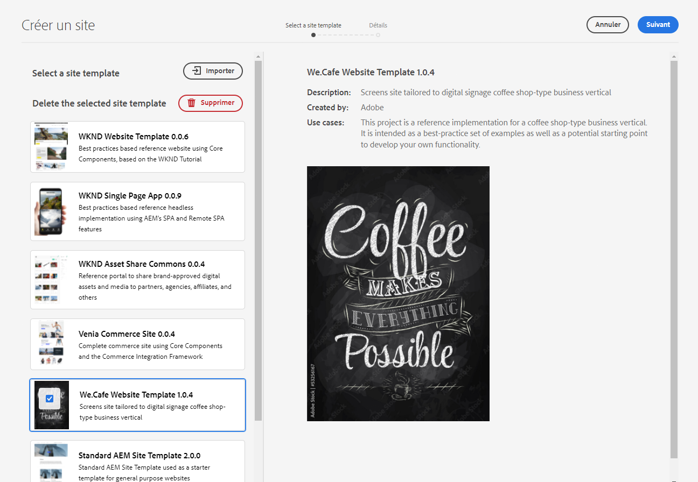
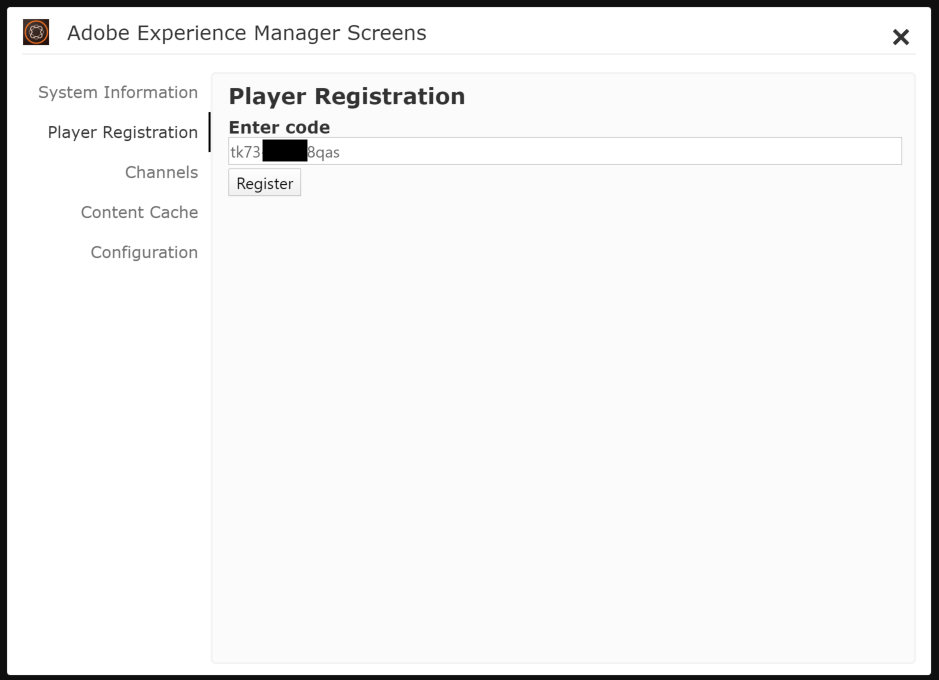
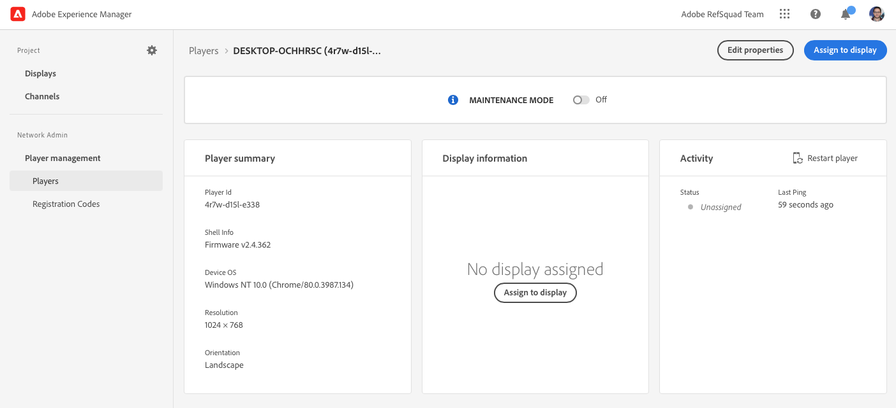

# Activer AEM Screens pour votre site de démonstration {#enable-screens}

Découvrez les étapes pour activer l’expérience complète AEM Screens as a Cloud Service sur votre site de démonstration.

>[!NOTE]
>
>La démonstration AEM Screens nécessite l’ajout du module complémentaire Screens au programme Cloud Manager. Découvrez comment ajouter [Screens as a Add-on à un nouveau programme dans Cloud Manager](/help/screens-cloud/onboarding-screens-cloud/add-on-new-program-screens-cloud.md).

## Un peu d’histoire… {#story-so-far}

Dans le document précédent du parcours du module complémentaire des démonstrations de référence d’AEM, [Créer un site de démonstration,](create-site.md) vous avez créé un site de démonstration basé sur les modèles du module complémentaire de démonstration de référence. Vous devez maintenant :

* Découvrir comment accéder à l’environnement de création AEM.
* Savoir comment créer un site à partir d’un modèle.
* Découvrir les principes de base de la navigation dans la structure du site et de la modification d’une page.

Maintenant que vous disposez de votre propre site de démonstration pour explorer et comprendre les outils qui vous aideront à gérer vos sites de démonstration, vous pouvez activer l’expérience AEM Screens as a Cloud Service complète pour vos sites de démonstration.

## Objectif {#objective}

Le module complémentaire de démonstration de référence d’AEM contient du contenu AEM Screens pour We.Cafe, une entreprise de café à intégration verticale. Ce document permet de comprendre comment exécuter la configuration de démonstration We.Cafe dans le contexte d’AEM Screens. Après avoir lu ce document, vous devriez :

* Connaître les principes de base d’AEM Screens.
* Comprendre le contenu de la démonstration de We.Cafe.
* Découvrir comment configurer AEM Screens pour We.Cafe.
   * Découvrir comment créer un projet Screens pour We.Cafe.
   * Pouvoir configurer un service météorologique simulé à l’aide des feuilles de calcul Google Sheets et des API.
   * Simuler le contenu Screens qui change de manière dynamique en fonction de votre « service météorologique ».
   * Installer et utiliser le lecteur Screens.

## Comprendre Screens {#understand-screens}

AEM Screens as a Cloud Service est une solution de signalétique numérique qui permet aux spécialistes marketing de créer et de gérer des expériences numériques dynamiques à grande échelle. Avec AEM Screens as a Cloud Service, vous pouvez créer des expériences de signalétique numérique attrayantes et dynamiques destinées aux espaces publics. 

>[!TIP]
>
>Pour des détails complets sur AEM Screens as a Cloud Service, consultez la section [Ressources supplémentaires](#additional-resources) à la fin de ce document.

En installant le module complémentaire de démonstration de référence d’AEM, vous disposez automatiquement du contenu We.Cafe pour AEM Screens dans votre environnement de création de démonstration. Les étapes décrites dans [Déployer un projet Screens de démonstration](#deploy-project) vous permettent d’activer l’expérience AEM Screens complète en publiant ce contenu et en le déployant sur les lecteurs multimédia, etc.

## Comprendre le contenu de démonstration {#demo-content}

Le café We.Cafe se compose de trois boutiques situées à trois endroits aux États-Unis. Les trois magasins ont trois expériences similaires :

* Un panneau de menus au-dessus du comptoir avec deux ou trois panneaux verticaux
* Un affichage à l’entrée face à la rue avec un panneau horizontal ou vertical invitant les clients à entrer dans la boutique
* Un kiosque de commande rapide en libre-service avec une tablette verticale pour contourner la file d’attente

>[!NOTE]
>
>Seul l’affichage à l’entrée peut être testé dans la version actuelle de la démonstration. D’autres affichages suivront dans une version ultérieure.
>
>Le kiosque n’est pas inclus dans la version actuelle de la démonstration. Il sera inclus dans une version ultérieure.

L’emplacement à New York est supposé se trouver dans un magasin plus petit avec peu d’espace, et donc :

* Le panneau de menus n’a que deux panneaux verticaux au lieu de trois pour les boutiques de San Francisco et San Jose.
* L’affichage à l’entrée est positionné à la verticale et non à l’horizontale

>[!NOTE]
>
>Si vous décidez de vous connecter à Cloud Service Screens dans la section [Connexion à Screens as a Cloud Service](#connect-screens), créez les emplacements sous forme de dossiers sous les affichages. Consultez la section [Ressources supplémentaires](#additional-resources) à la fin de ce document pour plus d’informations sur les affichages.

### Disposition de Cafe {#care-layouts}

Les emplacements We.Cafe ont les dispositions suivantes.


>[!NOTE]
>
>Les mesures pour les écrans sont en pouces.

### Entrée {#entrance}

L’affichage à l’entrée est fractionné par jour et seule la première image change entre le matin et l’après-midi. À chaque passage de la séquence, l’affichage fait également la publicité d’une préparation au café différente, en utilisant une séquence incorporée limitée pour lire un article différent à chaque fois.

La dernière image des canaux d’entrée est également ciblée (c’est-à-dire modifiée de manière dynamique) en fonction de la température extérieure, qui peut être simulée comme décrit dans la section [Créer une source de données simulée](#data-source).

## Déployer un projet Screens de démonstration {#deploy-project}

Pour utiliser le contenu de démonstration dans le sandbox que vous avez créé à l’étape [Créer un programme](create-program.md), un site doit être créé à partir d’un modèle.

Si vous n’avez pas encore créé de site de démonstration We.Cafe, procédez simplement comme indiqué dans la section [Créer un site de démonstration](create-site.md). Au moment de sélectionner le modèle, il vous suffit de choisir le **Modèle de site web We.Cafe**.



Une fois l’assistant terminé, le contenu est déployé sous Sites et vous pouvez le parcourir et l’explorer comme vous le feriez pour tout autre contenu.


Maintenant que vous disposez du contenu de démonstration We.Cafe, vous pouvez choisir comment tester AEM Screens :

* Si vous souhaitez uniquement explorer le contenu dans la console AEM Sites, commencez simplement par en découvrir plus dans la section [Ressources supplémentaires](#additional-resources). aucune autre action n’est requise.
* Si vous souhaitez découvrir toutes les fonctionnalités dynamiques d’AEM Screens, passez à la section suivante, [Modifier de manière dynamique du contenu Screens.](#dynamically-change)

## Modifier de manière dynamique du contenu Screens {#dynamically-change}

Tout comme AEM Sites, AEM Screens peut modifier le contenu de manière dynamique en fonction du contexte. La démonstration We.Cafe comporte des canaux configurés pour afficher un contenu différent en fonction de la température actuelle. Pour simuler cette expérience, vous devez créer votre propre service météorologique simple.

### Créer une source de données simulée {#data-source}

Comme il est difficile de modifier la météo pendant une démonstration ou pendant les tests, les changements de température doivent être simulés. Un service météorologique est simulé en stockant une valeur de température dans une feuille de calcul Google Sheets, que ContextHub pour AEM appelle pour récupérer la température.

#### Créer la clé API Google {#create-api-key}

Tout d’abord, vous devez créer une clé d’API Google pour faciliter l’échange de données.

1. Connectez-vous à un compte Google.
1. Ouvrez la console Cloud à l’aide de ce lien `https://console.cloud.google.com`.
1. Créez un projet en cliquant sur le nom du projet actuel dans le coin supérieur gauche de la barre d’outils, après le libellé **Google Cloud Platform**.

   

1. Dans la boîte de dialogue du sélecteur de projet, cliquez sur **NOUVEAU PROJET**.

   

1. Attribuez un nom au projet et cliquez sur **CRÉER**.

   

1. Vérifiez que votre nouveau projet est sélectionné, puis, à l’aide du menu latéral du tableau de bord de la console cloud, sélectionnez **API et services**.

   

1. Dans le volet de gauche de la fenêtre API et services, cliquez sur **Informations d’identification** dans la partie supérieure de la fenêtre, puis cliquez sur **CRÉER DES INFORMATIONS D’IDENTIFICATION** et **Clé API**.

   

1. Dans la boîte de dialogue, copiez votre nouvelle clé d’API et enregistrez-la pour une utilisation ultérieure. Cliquez sur **FERMER** et quittez la boîte de dialogue.

#### Activer l’API Google Sheets {#enable-sheets}

Pour permettre l’échange de données de Google Sheets à l’aide de votre clé d’API, vous devez activer l’API Google Sheets.

1. Revenez sur la console Google Cloud à l’adresse `https://console.cloud.google.com` pour votre projet, puis utilisez le menu Hamburger pour sélectionner **API et services > Bibliothèque**.

   

1. Dans l’écran Bibliothèque d’API, faites défiler l’écran jusqu’à **API Google Sheets**, puis cliquez dessus.

   

1. Dans la fenêtre **API Google Sheets** cliquez sur **ACTIVER**.

   

#### Création d’une feuille de calcul Google Sheets {#create-spreadsheet}

Vous pouvez maintenant créer une feuille de calcul Google Sheets pour stocker vos données météorologiques.

1. Accédez à `https://docs.google.com` et créez une feuille de calcul Google Sheets.
1. Définissez la température en saisissant `32` dans la cellule A2.
1. Partagez le document en cliquant sur **Partager** en haut à droite de la fenêtre. Sous **Obtenir le lien**, cliquez ensuite sur **Modifier**.

   

1. Copiez le lien pour l’étape suivante.

   

1. Recherchez l’ID de la feuille.

   * L’ID de la feuille correspond à la chaîne de caractères aléatoire dans le lien de la feuille que vous avez copié après `d/` et avant `/edit`.
   * Par exemple :
      * Si votre URL est `https://docs.google.com/spreadsheets/d/1cNM7j1B52HgMdsjf8frCQrXpnypIb8NkJ98YcxqaEP30/edit#gid=0`
      * L’ID de la feuille est `1cNM7j1B52HgMdsjf8frCQrXpnypIb8NkJ98YcxqaEP30`.

1. Copiez l’ID de la feuille pour une utilisation ultérieure.

#### Test de votre service météorologique {#test-weather-service}

Maintenant que vous avez créé votre source de données en tant que feuille de calcul Google Sheets et que vous avez activé l’accès via l’API, testez-la pour vous assurer que votre « service météorologique » est accessible.

1. Ouvrez un navigateur web.

1. Saisissez la requête suivante, en remplaçant les valeurs d’ID de feuille et de clé API que vous avez enregistrées précédemment.

   ```
   https://sheets.googleapis.com/v4/spreadsheets/<yourSheetID>/values/Sheet1?key=<yourAPIKey>
   ```

1. Si vous recevez des données JSON similaires à ce qui suit, vous pouvez les configurer correctement.

   ```json
   {
     "range": "Sheet1!A1:Z1000",
     "majorDimension": "ROWS",
     "values": [
       [],
       [
         "32"
       ]
     ]
   }
   ```

AEM Screens peut utiliser ce même service pour accéder aux données météorologiques simulées configurées à l’étape suivante.

### Configuration de ContextHub {#configure-contexthub}

AEM Screens peut modifier le contenu de manière dynamique en fonction du contexte. La démonstration We.Cafe comporte des canaux configurés pour afficher un contenu différent en fonction de la température actuelle en utilisant ContextHub d’AEM.

>[!TIP]
>
>Pour des détails complets sur ContextHub, consultez la section [Ressources supplémentaires](#additional-resources) à la fin de ce document.

Lorsque le contenu de l’écran s’affiche, ContextHub appelle votre service météorologique pour trouver la température actuelle et déterminer ainsi le contenu à afficher.

À des fins de démonstration, les valeurs de la feuille peuvent être modifiées. ContextHub reconnaît cette information et le contenu s’ajuste dans le canal en fonction de la température mise à jour.

1. Sur l’instance de création AEMaaCS, accédez à **Navigation globale > Outils > ContextHub**.
1. Sélectionnez le conteneur de configuration qui porte le même nom que celui que vous avez donné au projet lorsque vous avez créé le projet Screens à partir du **modèle de site web We.Cafe**.
1. Sélectionnez **Configuration > Configuration de ContextHub > Google Sheets** puis cliquez sur **Suivant** en haut à droite.
1. La configuration doit déjà comporter des données JSON préconfigurées. Deux valeurs doivent être modifiées :
   1. Remplacez `[your Google Sheets id]` avec l’ID de feuille que [vous avez enregistré précédemment](#create-spreadsheet).
   1. Remplacez `[your Google API Key]` avec la clé d’API que [vous avez enregistrée précédemment](#create-api-key).
1. Cliquez sur **Enregistrer**.

Vous pouvez désormais modifier la valeur de la température dans votre feuille de calcul Google Sheet. ContextHub met à jour Screens de manière dynamique lorsqu’il « voit le changement de température ».

### Tester les données dynamiques {#test-dynamic}

Maintenant qu’AEM Screens et ContextHub sont connectés à votre service météorologique, vous pouvez tester ce dernier pour voir la façon dont les écrans peuvent mettre à jour le contenu de manière dynamique.

1. Accédez à votre instance de création de sandbox.
1. Accédez à la console Sites via **Navigation globale > Sites** et sélectionnez la page suivante : **Screens > &lt;project-name> > Canaux > Entrée du matin (Portrait)**.

   

1. Cliquez sur **Modifier** dans la barre d’outils ou tapez sur la touche de raccourci `e` pour modifier la page.

1. Dans l’éditeur, vous pouvez voir le contenu. Une image est mise en surbrillance en bleu avec une icône de ciblage dans le coin.

   

1. Modifiez la température que vous avez saisie dans votre feuille de calcul de 32 °F (0 °C) à 70 °F (21 °C) et observez le changement de contenu.

   

Lorsque la température passe d’un glacial 32 °F (0 °C) à un confortable 70 °F (21 °C), l’image en vedette passe d’une tasse de thé chaude à un café glacé.

>[!IMPORTANT]
>
>Utilisez uniquement la solution Google Sheets décrite à des fins de démonstration. Adobe ne prend pas en charge l’utilisation de Google Sheets dans des environnements de production.

## Connexion à Screens as a Cloud Service {#connect-screens}

Si vous souhaitez également configurer une véritable expérience de signalétique numérique, y compris sur un lecteur qui s’exécute sur un appareil de signalétique numérique ou sur votre ordinateur, procédez comme suit.

Vous pouvez également prévisualiser la démonstration simplement dans l’éditeur de canal sur AEMaaCS.

>[!TIP]
>
>Pour des détails complets sur l’éditeur de canal, consultez la section [Ressources supplémentaires](#additional-resources) à la fin de ce document.

### Configuration d’AEM Screens as a Cloud Service {#configure-screens}

Tout d’abord, vous devez publier votre contenu de démonstration Screens sur AEM Screens as a Cloud Service et configurer le service.

1. Publiez le contenu de votre projet Screens de démonstration.
1. Accédez à Screens as a Cloud Service à l’adresse `https://experience.adobe.com/screens` et connectez-vous.
1. Dans le coin supérieur droit de l’écran, vérifiez que vous vous trouvez dans la bonne organisation.

   

1. Dans le coin supérieur gauche, cliquez sur l’icône **Modifier les paramètres** en forme d’engrenage.

   

1. Indiquez les URL des instances de création et de publication AEMaaCS dans lesquelles vous avez créé votre site de démonstration, puis cliquez sur **Enregistrer**.

   

1. Une fois connecté à vos instances de démonstration, Screens extrait le contenu de votre canal. Cliquez sur **Canaux** dans le panneau de gauche pour afficher les canaux publiés. Il faudra peut-être un moment pour que l’information soit renseignée. Vous pouvez cliquer sur le bouton bleu **Synchronisation** en haut à droite de l’écran pour mettre à jour les informations.

   

1. Cliquez sur **Affichages** dans le panneau de gauche. Vous n’en avez pas encore créé pour votre démonstration. Vous pouvez simuler les emplacements de We.Cafe en créant des dossiers pour chacun d’eux. Cliquez sur **Créer** dans le coin supérieur droit de l’écran, puis sélectionnez **Dossier**.

   

1. Dans la boîte de dialogue, indiquez un nom de dossier tel que **San Jose** et cliquez sur **Créer**.

1. Ouvrez le dossier en cliquant dessus, puis cliquez sur **Créer** en haut à droite et sélectionnez **Affichage**.

1. Indiquez un nom d’affichage et cliquez sur **Créer**.

   

1. Une fois l’affichage créé, cliquez sur son nom pour ouvrir l’écran des détails de l’affichage. Un canal synchronisé à partir de votre site de démonstration doit être attribué à l’affichage. Cliquez sur **Attribuer un canal** en haut à droite de l’écran.

   

1. Dans la boîte de dialogue, sélectionnez le canal et cliquez sur **Attribuer**.

   

Vous pouvez répéter ces étapes pour vos autres emplacements et affichages. Une fois terminé, vous avez associé votre site de démonstration à AEM Screens et vous avez terminé la configuration nécessaire.

Vous pouvez prévisualiser la démonstration simplement dans l’éditeur de canal sur AEMaaCS.

### Utilisation du lecteur Screens {#screens-player}

Pour afficher le contenu tel qu’il apparaît sur un écran réel, vous pouvez télécharger le lecteur et le configurer localement. AEM Screens as a Cloud Service diffuse alors le contenu sur votre lecteur

#### Générer un code d’enregistrement {#registration-code}

Vous devrez d’abord créer un code d’enregistrement pour connecter un lecteur à AEM Screens as a Cloud Service en toute sécurité.

1. Accédez à Screens as a Cloud Service à l’adresse `https://experience.adobe.com/screens` et connectez-vous.
1. Dans le coin supérieur droit de l’écran, vérifiez que vous vous trouvez dans la bonne organisation.

   

1. Dans le panneau de gauche, cliquez sur **Gestion du lecteur > Codes d’enregistrement** puis cliquez sur **Créer un code** en haut à droite de l’écran.


1. Saisissez un nom pour le code puis cliquez sur **Créer**.

   

1. Une fois le code créé, il apparaît dans la liste. Cliquez sur le code pour le copier.

   

#### Installez et configurez le lecteur {#install-player}

1. Téléchargez le lecteur correspondant à votre plateforme depuis `https://download.macromedia.com/screens/` et installez-le.
1. Exécutez le lecteur, puis passez à l’onglet **Configuration**.
1. Faites défiler l’écran vers le bas, puis cliquez sur les options **Réinitialiser les valeurs d’usine** et **Passage en mode cloud** et confirmez-les.

   

1. Le lecteur passe automatiquement à l’onglet **Enregistrement du lecteur**. Saisissez le code que vous avez généré précédemment et cliquez sur **Enregistrer**.

   

1. Passez à l’onglet **Informations système** pour confirmer que le lecteur a été enregistré.

   

#### Attribuez un lecteur à un affichage {#assign-player}

1. Accédez à Screens as a Cloud Service à l’adresse `https://experience.adobe.com/screens` et connectez-vous.
1. Dans le coin supérieur droit de l’écran, vérifiez que vous vous trouvez dans la bonne organisation.

   

1. Dans le panneau de gauche, cliquez sur **Gestion du lecteur > Lecteurs** et vous verrez le lecteur que vous avez installé et enregistré précédemment.

   

1. Cliquez sur le nom du lecteur pour en ouvrir les détails. Cliquez sur **Attribuer à l’affichage** dans le coin supérieur droit de l’écran.

   

1. Dans la boîte de dialogue, sélectionnez l’affichage que vous avez créé précédemment, puis cliquez sur **Sélectionner**.

   

#### Lecture! {#playback}

Une fois que vous avez attribué un affichage à un lecteur, AEM Screens as a Cloud Service diffuse le contenu sur votre lecteur là où il est visible.


## Prochaines étapes {#what-is-next}

Maintenant que vous avez terminé cette partie du parcours de module complémentaire de démonstration de référence d’AEM, vous devez :

* Connaître les principes de base d’AEM Screens.
* Comprendre le contenu de la démonstration de We.Cafe.
* Découvrir comment configurer AEM Screens pour We.Cafe.

Vous êtes maintenant prêt à explorer les fonctionnalités d’AEM Screens à l’aide de vos propres sites de démonstration. Passez à la section suivante du parcours, [Gérer vos sites de démonstration,](manage.md) où vous découvrirez les outils disponibles pour vous aider à gérer vos sites de démonstration et comment les supprimer.

Vous pouvez également consulter certaines des ressources supplémentaires disponibles dans la [Section Ressources supplémentaires](#additional-resources) pour en savoir plus sur les fonctionnalités rencontrées dans ce parcours.

## Ressources supplémentaires {#additional-resources}

* [Documentation ContextHub](/help/sites-cloud/authoring/personalization/contexthub.md) - Découvrez comment ContextHub peut être utilisé pour personnaliser le contenu en fonction du contexte utilisateur au-delà des conditions météorologiques.
* [Utilisation des clés API - Documentation Google](https://developers.google.com/maps/documentation/javascript/get-api-key) - Référence pratique pour plus d’informations sur l’utilisation des clés API Google.
* [Affichages](/help/screens-cloud/creating-content/creating-displays-screens-cloud.md) - En savoir plus sur l’affichage dans AEM Screens et sur ce qu’il peut faire.
* [Téléchargement du lecteur](/help/screens-cloud/managing-players-registration/installing-screens-cloud-player.md) - Découvrez comment accéder au lecteur Screens et comment l’installer.
* [Enregistrement du lecteur](/help/screens-cloud/managing-players-registration/registering-players-screens-cloud.md) - Découvrez comment configurer et enregistrer un lecteur avec votre projet AEM Screens.
* [Attribution d’un lecteur à un affichage](/help/screens-cloud/managing-players-registration/assigning-player-display.md) - Configurez un lecteur pour afficher votre contenu.
