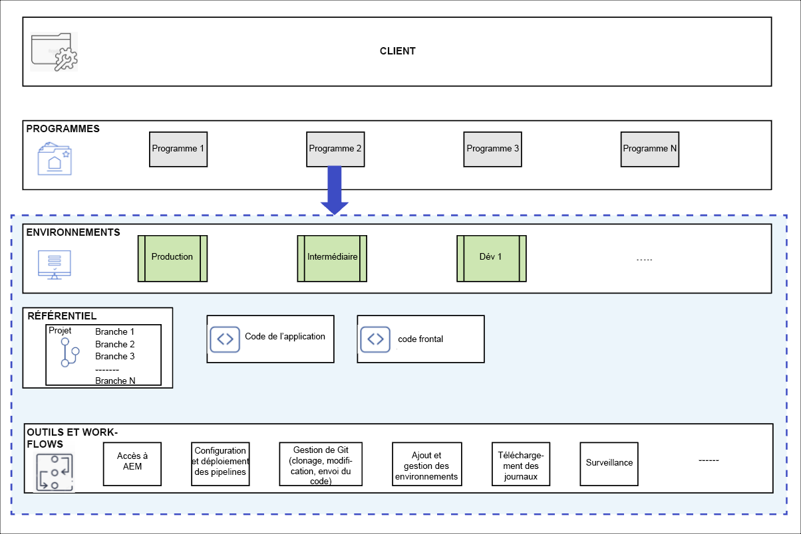
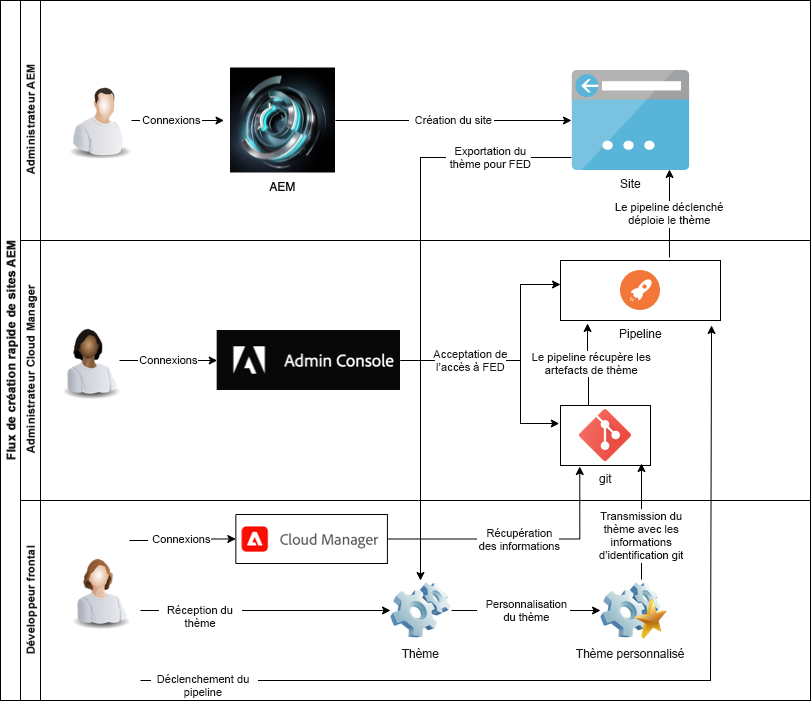

# Présentation de Cloud Manager et du workflow de création rapide de site {#understand-cloud-manager}

{{traditional-aem}}

Découvrez Cloud Manager et comment il relie le nouveau processus de création rapide de site.

>[!TIP]
>
>Si votre rôle est exclusivement le développement front-end, vous pouvez passer à l’article [Récupération des informations d’accès au référentiel Git](retrieve-access.md) dans ce parcours.
>
>Si vous êtes un administrateur AEM, un administrateur de Cloud Manager, responsable des tâches de développement front-end et d’administration, ou que vous souhaitez simplement comprendre le processus de bout en bout dans AEM pour le développement front-end, continuez à lire le document actuel et poursuivez ce parcours.

## Objectif {#objective}

Ce document vous aide à comprendre le fonctionnement de l’outil de création rapide de site d’AEM et vous donne un aperçu du flux de bout en bout. Après avoir lu ce document, vous devriez :

* Découvrez comment AEM Sites et le Cloud Manager travaillent ensemble pour faciliter le développement front-end.
* Découvrez comment l’étape de personnalisation front-end est entièrement découplée de l’AEM et ne nécessite aucune connaissance AEM.

Ce document se concentre sur la compréhension de ces éléments fondamentaux de la solution de création rapide de site avant de passer à l’étape suivante du parcours où vous commencez la configuration.

Bien qu’il soit recommandé de suivre ce parcours étape par étape, si vous comprenez déjà le fonctionnement conjoint d’AEM Sites et de Cloud Manager et que vous souhaitez commencer directement par la configuration, vous pouvez [passer à l’étape suivante du parcours](create-site.md).

## Rôle responsable {#responsible-role}

Cette partie du parcours s’applique à la fois à l’administrateur AEM et à l’administrateur de Cloud Manager.

## Exigences et conditions préalables {#requirements-prerequisites}

Avant de commencer à créer et personnaliser des sites à l’aide de l’outil de création rapide de site, plusieurs conditions sont requises.

Ce parcours étant destiné à la fois aux développeurs front-end, aux administrateurs et aux combinaisons de tous les rôles, les exigences pour les deux sont répertoriées ici.

Il est important de comprendre que, pour le développeur front-end, aucun accès AEM ou connaissance n’est nécessaire.

### Connaissances {#knowledge}

| Connaissances | Rôle |
|---|---|
| Présentation des outils et processus standard du développement front-end | Développeur front-end |
| Connaissances de base sur la création et la gestion de sites dans AEM | Administrateur AEM |
| Connaissances de base de Cloud Manager | Administrateur Cloud Manager |

Pour le développeur front-end, aucune connaissance AEM n’est nécessaire.

### Outils {#tools}

| Outil | Rôle |
|---|---|
| Environnement de développement front-end préféré | Développeur front-end |
| npm  | Développeur front-end |
| webpack | Développeur front-end |
| Accès à Cloud Manager | Administrateur Cloud Manager |
| Être membre du rôle de **Propriétaire de l’entreprise** dans Cloud Manager | Administrateur Cloud Manager |
| Être Sdministrateur Sys dans Cloud Manager | Administrateur Cloud Manager |
| Accès au Admin Console | Administrateur Cloud Manager |
| Être membre du rôle de **Gestionnaire de déploiement** dans Cloud Manager | Administrateur Cloud Manager |
| Être membre du rôle de **Gestionnaire de déploiement** dans Cloud Manager | Développeur front-end |

Pour le développeur front-end, aucune utilisation d’AEM n’est nécessaire.

>[!TIP]
>
>Si vous ne connaissez pas les rôles et la gestion des rôles de Cloud Manager, reportez-vous au document Autorisations basées sur les rôles dans la section [Ressources supplémentaires](#additional-resources).

## Cloud Manager {#cloud-manager}

Cloud Manager est un composant essentiel d’AEM as a Cloud Service et sert de point d’entrée unique pour la plateforme.

Pour prendre en charge les clients avec les configurations de développement d’entreprise, AEM as a Cloud Service s’intègre entièrement à Cloud Manager et à ses pipelines CI/CD conçus spécifiquement pour les besoins. L’outil de création rapide de site étend ces fonctionnalités pour prendre en charge les pipelines de développement front-end dédiés.

Pour les besoins de ce parcours, une compréhension complète de Cloud Manager n’est pas nécessaire. À un niveau élevé, Cloud Manager se compose de plusieurs niveaux de structure.

* **CLIENT** - Chaque client est configuré avec un client.
* **PROGRAMMES** - Chaque client dispose d’un ou de plusieurs programmes, qui reflètent souvent les solutions sous licence du client.
* **ENVIRONNEMENTS** - Chaque programme comporte plusieurs environnements, un de production pour le contenu en direct, un d’évaluation pour le test et un à des fins de développement.
* **RÉFÉRENTIEL** - Les environnements disposent de référentiels Git où l’application et le code front-end sont conservés.
* **OUTILS ET WORKFLOWS** - Les pipelines gèrent le déploiement du code des référentiels vers les environnements.

Un exemple est souvent utile pour contextualiser cette hiérarchie.

* Disons que WKND Travel and Adventure Enterprises est un **client** qui se concentre sur les médias liés aux voyages.
* Disons que le client WKND Travel and Adventure Enterprises peut avoir deux **programmes** : un programme Sites pour WKND Magazine et un programme Assets pour WKND Media.
* Les programmes de WKND Magazine et de WKND Media auraient chacun des **environnements** de développement, d’évaluation et de production.

## Le flux de développement front-end de création rapide de site {#flow}

Le flux global est simple et intuitif, même si vous ne disposez pas encore d’une grande expérience de Cloud Manager.

1. L’administrateur AEM se connecte à un environnement AEM et crée un site à l’aide d’un modèle de site.
1. L’administrateur de Cloud Manager crée un pipeline front-end dans Cloud Manager. Le pipeline orchestre le déploiement du code d’un référentiel Git vers un environnement AEM.
1. L’administrateur AEM exporte le thème du site à partir de l’instance AEM du programme et le fournit au développeur front-end.
1. L’administrateur de Cloud Manager accorde aux développeurs front-end un accès au référentiel Git d’AEM où les personnalisations peuvent être validées.
1. Le développeur front-end récupère les informations d’identification d’accès pour accéder à Git et au pipeline.
1. Le développeur front-end personnalise le thème, le teste à l’aide du contenu réel du site à l’aide d’un proxy, puis valide les modifications dans le référentiel Git.
1. Le développeur front-end exécute le pipeline pour déployer les personnalisations des thèmes dans l’environnement de production du programme.

L’avantage principal de l’utilisation de l’outil de création rapide de site est que le développeur front-end pur n’est responsable que de la personnalisation réelle. Le développeur front-end n’a aucune interaction avec AEM et n’a besoin d’aucune connaissance d’AEM.

{{add-cm-allowlist-frontend-pipeline}}

## Prochaines étapes {#what-is-next}

Maintenant que vous avez terminé cette partie du parcours de création rapide de site AEM vous devriez :

* Découvrez comment AEM Sites et le Cloud Manager travaillent ensemble pour faciliter le développement front-end.
* Découvrez comment l’étape de personnalisation front-end est entièrement découplée de l’AEM et ne nécessite aucune connaissance AEM.

Tirez parti de ces connaissances et poursuivez votre parcours de création rapide de site AEM en consultant le document [Créer un site à partir d’un modèle](create-site.md), où vous apprendrez à créer rapidement un site AEM à l’aide d’un modèle.

## Ressources supplémentaires {#additional-resources}

Bien qu’il soit recommandé de passer à la partie suivante du parcours de création rapide de site en consultant le document [Créer un site à partir d’un modèle](create-site.md), vous trouverez ci-après quelques ressources facultatives supplémentaires pour approfondir un certain nombre de concepts mentionnés dans ce document, mais non obligatoires pour poursuivre le parcours.

* [Documentation de Cloud Manager](https://experienceleague.adobe.com/docs/experience-manager-cloud-service/content/onboarding/onboarding-concepts/cloud-manager-introduction.html?lang=fr) - Pour obtenir plus de détails sur les fonctionnalités de Cloud Manager, vous pouvez consulter directement la documentation technique détaillée.
* [Autorisations basées sur les rôles](https://experienceleague.adobe.com/docs/experience-manager-cloud-manager/using/requirements/role-based-permissions.html?lang=fr) - Cloud Manager dispose de rôles préconfigurés avec les autorisations appropriées. Reportez-vous à ce document pour plus de détails sur ces rôles et sur la manière de les administrer.
* [npm](https://www.npmjs.com) - Les thèmes AEM utilisés pour construire rapidement des sites sont basés sur npm.
* [webpack](https://webpack.js.org) - Les thèmes AEM utilisés pour construire rapidement des sites reposent sur webpack.
