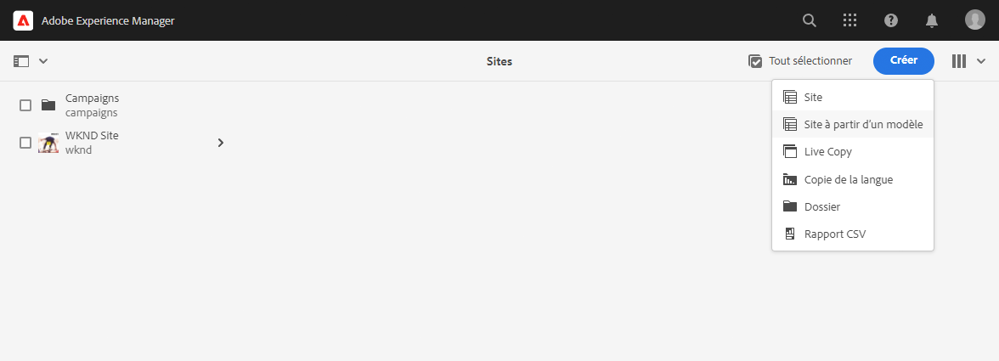

# Créer un site à partir d’un modèle {#create-site-from-template}

{{traditional-aem}}

Découvrez comment créer rapidement un site AEM à l’aide d’un modèle de site.

## Un peu d’histoire... {#story-so-far}

Dans le document précédent du parcours de création rapide de site AEM, [Présentation de Cloud Manager et du workflow de création rapide de site](cloud-manager.md), vous avez découvert Cloud Manager et la façon dont il relie le nouveau processus de création rapide de site. Vous devriez maintenant disposer des compétences suivantes :

* Découvrez comment AEM Sites et le Cloud Manager travaillent ensemble pour faciliter le développement front-end.
* Découvrez comment l’étape de personnalisation front-end est entièrement découplée de l’AEM et ne nécessite aucune connaissance AEM.

Cet article s’appuie sur ces principes de base afin que vous puissiez effectuer la première étape de configuration et créer un site à partir d’un modèle que vous pourrez ensuite personnaliser à l’aide d’outils front-end.

## Objectif {#objective}

Ce document vous aide à comprendre comment créer rapidement un site AEM à l’aide d’un modèle de site. Après avoir lu ce document, vous devriez :

* Comprendre comment obtenir des modèles de site AEM.
* Apprendre à créer un nouveau site à l’aide d’un modèle.
* Découvrez comment télécharger le modèle de votre nouveau site pour le fournir au développement front-end.

## Rôle responsable {#responsible-role}

Cette partie du parcours s’applique à l’administrateur AEM.

## Modèles de site {#site-templates}

Les modèles de site permettent de combiner du contenu de site de base dans un package pratique et réutilisable. Les modèles de site contiennent généralement le contenu et la structure du site de base, ainsi que des informations de style pour démarrer rapidement un nouveau site. La structure réelle est la suivante :

* `files` : dossier contenant le kit d’interface utilisateur, le fichier XD et éventuellement d’autres fichiers.
* `previews` : dossier contenant des captures d’écran du modèle de site.
* `site` : module du contenu copié pour chaque site créé à partir de ce modèle, tel que des modèles de page, des pages, etc.
* `theme` : sources du thème du modèle pour modifier l’aspect du site, y compris CSS, JavaScript, etc.

Les modèles sont efficaces car ils sont réutilisables afin que vos auteurs de contenu puissent créer rapidement un site. De plus, comme vous pouvez avoir plusieurs modèles disponibles dans votre installation AEM, vous avez la possibilité de répondre à divers besoins professionnels.

>[!NOTE]
>
>Le modèle de site ne doit pas être confondu avec les modèles de page. Les modèles de site décrits ici définissent la structure globale d’un site. Un modèle de page définit la structure et le contenu initial d’une page individuelle.

## Obtention d’un modèle de site {#obtaining-template}

La manière la plus simple de commencer est de [télécharger la dernière version du modèle de site standard d’AEM à partir de son référentiel GitHub](https://github.com/adobe/aem-site-template-standard/releases).

Une fois le téléchargement effectué, vous pouvez le charger dans votre environnement AEM comme vous le feriez pour tout autre package. Pour plus d’informations, consultez la [section Ressources supplémentaires](#additional-resources) pour savoir comment utiliser les packages.

>[!TIP]
>
>Le modèle de site standard d’AEM peut être personnalisé en fonction des besoins de votre projet et peut éviter d’avoir à effectuer d’autres personnalisations. Cette rubrique dépasse toutefois le cadre de ce parcours. Pour plus d’informations, consultez la documentation GitHub du modèle de site standard.

>[!TIP]
>
>Vous pouvez également choisir de créer le modèle à partir de la source dans le cadre du workflow de votre projet. Cette rubrique dépasse toutefois le cadre de ce parcours. Pour plus d’informations, consultez la documentation GitHub du modèle de site standard.

## Installer un modèle de site {#installing-template}

L’utilisation d’un modèle pour créer un site est simple.

1. Connectez-vous à votre environnement de création AEM et accédez à la console Sites.

   * `https://<your-author-environment>.adobeaemcloud.com/sites.html/content`

1. Appuyez ou cliquez sur **Créer** en haut à droite de l’écran et, dans le menu déroulant, sélectionnez **Site à partir d’un modèle**.

   

1. Dans l’assistant Créer un site, appuyez ou cliquez sur **Importer** en haut de la colonne de gauche.

   

1. Dans l’explorateur de fichiers, recherchez le modèle [que vous avez téléchargé précédemment](#obtaining-template) et appuyez ou cliquez sur **Charger**.

1. Une fois chargé, il s’affiche dans la liste des modèles disponibles. Sélectionnez-la pour la sélectionner (qui affiche également des informations sur le modèle dans la colonne de droite), puis sélectionnez **Suivant**.

   

1. Indiquez un titre pour votre site. Un nom de site peut être fourni ou généré à partir du titre s’il est omis.

   * Le titre du site s’affiche dans la barre de titre des navigateurs.
   * Le nom du site fait alors partie de l’URL.

1. Appuyez ou cliquez sur **Créer** pour créer le nouveau site à partir du modèle de site.

   

1. Dans la boîte de dialogue de confirmation qui s’affiche, sélectionnez **Terminé**.

   

1. Dans la console Sites, les nouveaux sites sont visibles et vous pouvez y accéder pour explorer leur structure de base telle que définie par le modèle.

   

Les auteurs de contenu peuvent désormais commencer la création.

## Une personnalisation plus poussée est-elle requise ? {#customization-required}

Les modèles de site sont très efficaces et flexibles, et tout nombre peut être créé pour un projet, ce qui facilite la création de variations de site. Selon le niveau de personnalisation déjà effectué sur le modèle de site que vous utilisez, il se peut que vous n’ayez pas besoin d’une personnalisation front-end supplémentaire.

* Si votre site ne nécessite pas de personnalisation supplémentaire, félicitations ! Votre parcours s’arrête ici !
* Si vous avez toujours besoin d’une personnalisation front-end supplémentaire, ou si vous souhaitez simplement comprendre le processus complet si vous avez besoin d’une personnalisation ultérieure, continuez la lecture.

## Exemple de page {#example-page}

Si vous avez besoin d’une personnalisation front-end supplémentaire, gardez à l’esprit que le développeur front-end ne connaît peut-être pas les détails de votre contenu. Par conséquent, il est préférable de fournir au développeur un chemin d’accès au contenu type qui peut être utilisé comme base de référence lorsque le thème est personnalisé. La page d’accueil de la langue principale du site en est un exemple type.

1. Dans l’explorateur de sites, accédez à la page d’accueil de la langue principale du site, appuyez ou cliquez sur la page pour la sélectionner, puis appuyez ou cliquez sur **Modifier** dans la barre de menus.

   

1. Dans l’éditeur, sélectionnez le bouton **Informations sur la page** dans la barre d’outils, puis **Afficher comme publié(e)**.

   

1. Dans l’onglet qui s’ouvre, copiez le chemin d’accès du contenu depuis la barre d’adresse. Il ressemble à ce qui suit : `/content/<your-site>/en/home.html?wcmmode=disabled`.

   

1. Enregistrez le chemin d’accès pour le fournir ultérieurement au développeur front-end.

## Téléchargement du thème {#download-theme}

Maintenant que le site a été créé, le thème du site tel qu’il a été généré par le modèle peut être téléchargé et fourni au développeur front-end pour personnalisation.

1. Sur la console Sites, affichez le rail du **site**.

   

1. Sélectionnez la racine du nouveau site, puis sélectionnez **Télécharger des sources de thème** dans le rail du site.

   

Vous disposez désormais d’une copie des fichiers sources du thème dans vos fichiers de téléchargement.

## Configuration d’un utilisateur proxy {#proxy-user}

Pour que le développeur front-end puisse prévisualiser les personnalisations à l’aide du contenu d’AEM réel de votre site, vous devez configurer un utilisateur proxy.

1. Dans AEM, à partir de la barre de navigation principale, accédez à **Outils** > **Sécurité** > **Utilisateurs**.
1. Dans la console de gestion des utilisateurs, sélectionnez **Créer**.

   
1. Dans la fenêtre **Créer un nouvel utilisateur**, vous devez au minimum fournir :
   * **ID** - Prenez note de cette valeur, car vous devez la fournir au développeur front-end.
   * **Mot de passe** - Enregistrez cette valeur en toute sécurité dans un coffre de mot de passe, car vous devez la fournir au développeur front-end.

   

1. Dans l’onglet **Groupes**, ajoutez l’utilisateur proxy au groupe `contributors`.
   * La saisie du terme `contributors` déclenche la fonctionnalité de saisie semi-automatique d’AEM pour faciliter la sélection du groupe.

   

1. Sélectionnez **Enregistrer et fermer**.

Vous avez maintenant terminé la configuration. Les auteurs de contenu peuvent maintenant commencer à créer du contenu sur le site. La préparation commence pour la personnalisation front-end à l’étape suivante du parcours.

## Prochaines étapes {#what-is-next}

Maintenant que vous avez terminé cette partie du parcours de création rapide de site AEM vous devriez :

* Comprendre comment obtenir des modèles de site AEM.
* Apprendre à créer un nouveau site à l’aide d’un modèle.
* Découvrez comment télécharger le modèle de votre nouveau site pour le fournir au développement front-end.

Tirez parti de ces connaissances et poursuivez votre parcours de création rapide de site AEM en consultant le document [Configurer le pipeline](pipeline-setup.md), où vous allez créer un pipeline front-end pour gérer la personnalisation du thème de votre site.

## Ressources supplémentaires {#additional-resources}

Bien qu’il soit recommandé de passer à la partie suivante du parcours de création rapide de site en consultant le document [Configurer le pipeline](pipeline-setup.md), vous trouverez ci-après quelques ressources facultatives supplémentaires pour approfondir un certain nombre de concepts mentionnés dans ce document, mais non obligatoires pour poursuivre le parcours.

* [Modèle de site standard AEM](https://github.com/adobe/aem-site-template-standard) : il s’agit du référentiel GitHub du modèle de site standard d’AEM.
* [Organisation des pages](/help/sites-cloud/authoring/sites-console/organizing-pages.md) - Ce guide explique comment organiser les pages de votre site AEM.
* [Création de pages](/help/sites-cloud/authoring/sites-console/creating-pages.md) - Ce guide explique comment ajouter de nouvelles pages à votre site.
* [Gestion des pages](/help/sites-cloud/authoring/sites-console/managing-pages.md) - Ce guide explique comment gérer les pages de votre site, y compris le déplacement, la copie et la suppression.
* [Utilisation d’un package](/help/implementing/developing/tools/package-manager.md) - Les packages permettent l’importation et l’exportation de contenu de référentiel. Ce document explique comment utiliser les packages dans AEM 6.5, qui s’applique également à AEMaaCS.
* [Documentation relative à l’administration du site](/help/sites-cloud/administering/site-creation/create-site.md) - Consultez la documentation technique sur la création de site pour plus d’informations sur les fonctionnalités de l’outil de création rapide de site.
* [Création ou ajout de formulaires à une page AEM Sites](/help/forms/create-or-add-an-adaptive-form-to-aem-sites-page.md) - Découvrez les techniques et les bonnes pratiques étape par étape pour intégrer des formulaires à votre site web, en optimisant vos expériences numériques pour un impact maximal.
