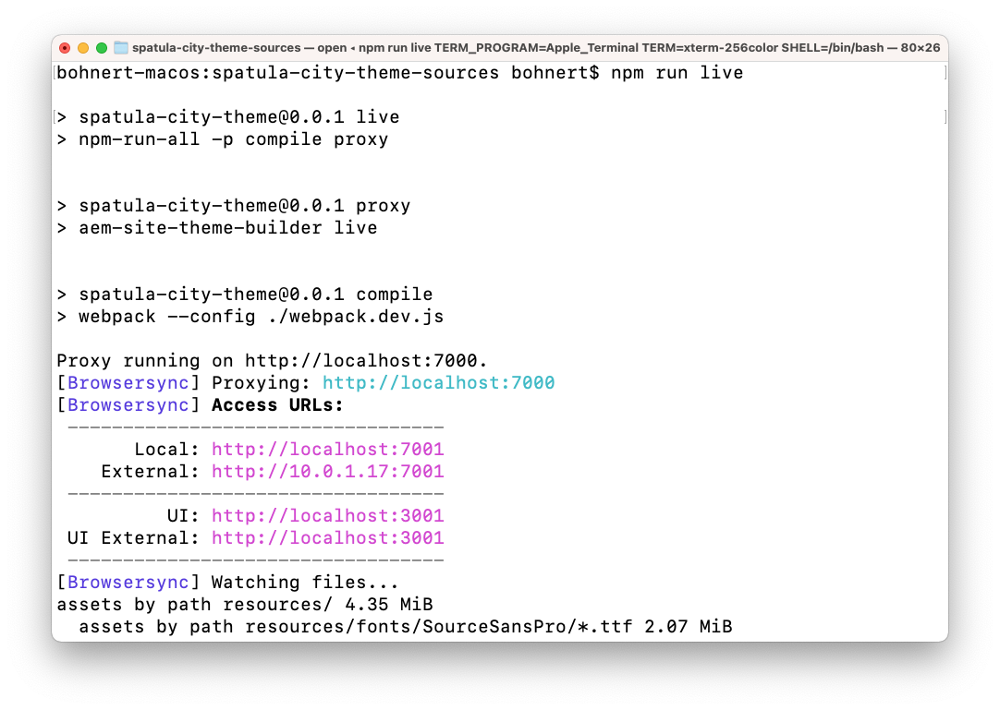

# Personnaliser le thème du site {#customize-the-site-theme}

{{traditional-aem}}

Découvrez comment le thème du site est créé, comment le personnaliser et comment le tester à l’aide du contenu réel d’AEM.

## Un peu d’histoire... {#story-so-far}

Dans le document précédent du parcours de création rapide de site AEM, [Récupération des informations d’accès au référentiel Git](retrieve-access.md), vous avez appris comment les développeurs et développeuses front-end utilisent Cloud Manager pour accéder aux informations du référentiel Git. Vous devriez désormais disposer des compétences suivantes :

* Découvrez Cloud Manager à un haut niveau.
* Avoir récupéré vos identifiants pour accéder au Git d’AEM afin de valider vos personnalisations.

Cette partie du parcours franchit l’étape suivante et examine le thème du site. Elle vous montre également comment le personnaliser, puis valider ces personnalisations à l’aide des informations d’identification d’accès que vous avez récupérées.

## Objectif {#objective}

Ce document décrit comment le thème du site AEM est créé, comment le personnaliser et comment le tester à l’aide de contenu réel d’AEM. Après avoir lu ce document, vous devriez :

* Comprendre la structure de base du thème du site et comment le modifier.
* Voir comment tester vos personnalisations de thème à l’aide de contenu d’AEM réel via un proxy local.
* Savoir comment valider vos modifications dans le référentiel Git d’AEM.

## Rôle responsable {#responsible-role}

Cette partie du parcours s’applique au développeur front-end.

## Comprendre la structure du thème {#understand-theme}

Extrayez le thème fourni par l’administrateur AEM à l’emplacement où vous souhaitez le modifier et ouvrez-le dans l’éditeur de votre choix.


Vous voyez que le thème est un projet front-end type. Les parties les plus importantes de la structure sont les suivantes :

* `src/main.ts` : point d’entrée principal de votre thème JS et CSS.
* `src/site` : fichiers JS et CSS qui s’appliquent à l’ensemble du site.
* `src/components` : fichiers JS et CSS spécifiques aux composants AEM.
* `src/resources` : fichiers statiques (par exemple icônes, logos et polices).

>[!TIP]
>
>Si vous souhaitez en savoir plus sur le thème de site AEM standard, consultez le lien GitHub dans la section [Ressources supplémentaires](#additional-resources) à la fin de ce document.

Lorsque la structure du projet de thème vous convient, démarrez le proxy local afin de visualiser toutes les personnalisations de thème en temps réel en fonction du contenu AEM réel.

## Démarrage du proxy local {#starting-proxy}

1. Dans la ligne de commande, accédez à la racine du thème sur votre ordinateur local.
1. Exécutez `npm install` pour que npm récupère les dépendances et installe le projet.

   

1. Exécutez `npm run live` et le serveur proxy démarre.

   

1. Lorsque le serveur proxy démarre, il ouvre automatiquement un navigateur sur `http://localhost:7001/`. Appuyez ou cliquez sur **CONNEXION LOCALE (TÂCHES D’ADMINISTRATION UNIQUEMENT)** et connectez-vous avec les identifiants de l’utilisateur proxy fournies par l’administrateur AEM.

   

   >[!TIP]
   >
   >Si vous ne disposez pas de ces informations d’identification, contactez votre administration en référençant la section [Configuration de l’utilisateur ou utilisatrice proxy de l’article Créer un site à partir d’un modèle](/help/journey-sites/quick-site/create-site.md#proxy-user) dans ce parcours.

1. Une fois connecté, modifiez l’URL dans le navigateur afin qu’elle pointe vers le chemin d’accès de l’exemple de contenu que l’administrateur AEM vous a fourni.

   * Par exemple, si le chemin fourni était `/content/<your-site>/en/home.html?wcmmode=disabled`,
   * Vous pouvez modifier l’URL en `http://localhost:7001/content/<your-site>/en/home.html?wcmmode=disabled`.

   

Vous pouvez parcourir le site pour explorer le contenu. Le site est extrait directement de l’instance AEM active afin que vous puissiez effectuer vos personnalisations de thème par rapport au contenu réel.

## Personnalisation du thème {#customize-theme}

Vous pouvez maintenant commencer à personnaliser le thème. Voici un exemple simple pour illustrer la manière dont vous pouvez voir vos modifications en direct via le proxy.

1. Dans l’éditeur, ouvrez le fichier `<your-theme-sources>/src/site/_variables.scss`.

   

1. Modifiez la variable `$color-background` et définissez-la sur une valeur autre que blanche. Dans cet exemple, `orange` est utilisée.

   

1. Lorsque vous enregistrez le fichier, vous constatez que le serveur proxy reconnaît la modification via la ligne `[Browsersync] File event [change]`.

   

1. En revenant à votre navigateur de serveur proxy, la modification est immédiatement visible.

   

Vous pouvez continuer à personnaliser le thème en fonction des exigences que vous a fournies l’administrateur AEM.

## Validation des modifications {#committing-changes}

Une fois vos personnalisations terminées, vous pouvez les valider dans le référentiel Git d’AEM. Vous devez d’abord cloner le référentiel sur votre ordinateur local.

1. Sur la ligne de commande, accédez à l’emplacement où vous souhaitez cloner le référentiel.
1. Exécutez la commande [récupérée précédemment à partir de Cloud Manager](retrieve-access.md). Elle doit être similaire à `git clone https://git.cloudmanager.adobe.com/<my-org>/<my-program>/`. Utilisez le nom d’utilisateur ou d’utilisatrice et le mot de passe Git que [vous avez récupérés dans la partie précédente de ce parcours](retrieve-access.md).

   

1. Déplacez le projet de thème que vous étiez en train de modifier dans le référentiel cloné avec une commande similaire à `mv <site-theme-sources> <cloned-repo>`.
1. Dans le répertoire du référentiel cloné, validez les fichiers de thème dans lesquels a eu lieu le déplacement à l’aide des commandes suivantes.

   ```text
   git add .
   git commit -m "Adding theme sources"
   git push
   ```

1. Les personnalisations sont transmises au référentiel Git d’AEM.

   

Vos personnalisations sont désormais stockées en toute sécurité dans le référentiel Git d’AEM.

## Prochaines étapes {#what-is-next}

Maintenant que vous avez terminé cette partie du parcours de création rapide de site AEM vous devriez :

* Comprendre la structure de base du thème du site et comment le modifier.
* Voir comment tester vos personnalisations de thème à l’aide de contenu d’AEM réel via un proxy local.
* Savoir comment valider vos modifications dans le référentiel Git d’AEM.

Tirez parti de ces connaissances et poursuivez votre parcours de création rapide de site AEM en consultant le document [Déployer votre thème personnalisé](deploy-theme.md), qui vous apprendra à déployer le thème à l’aide du pipeline front-end.

## Ressources supplémentaires {#additional-resources}

Bien qu’il soit recommandé de passer à la partie suivante du parcours de création rapide de site en consultant le document [Déployer votre thème personnalisé](deploy-theme.md), vous trouverez ci-après quelques ressources facultatives supplémentaires pour approfondir un certain nombre de concepts mentionnés dans ce document, mais non obligatoires pour poursuivre le parcours.

* [Thème du site AEM](https://github.com/adobe/aem-site-template-standard-theme-e2e) : il s’agit du référentiel GitHub du thème de site AEM.
* [npm](https://www.npmjs.com) : les thèmes AEM utilisés pour créer rapidement des sites sont basés sur npm.
* [webpack](https://webpack.js.org) - Les thèmes AEM utilisés pour construire rapidement des sites reposent sur webpack.
