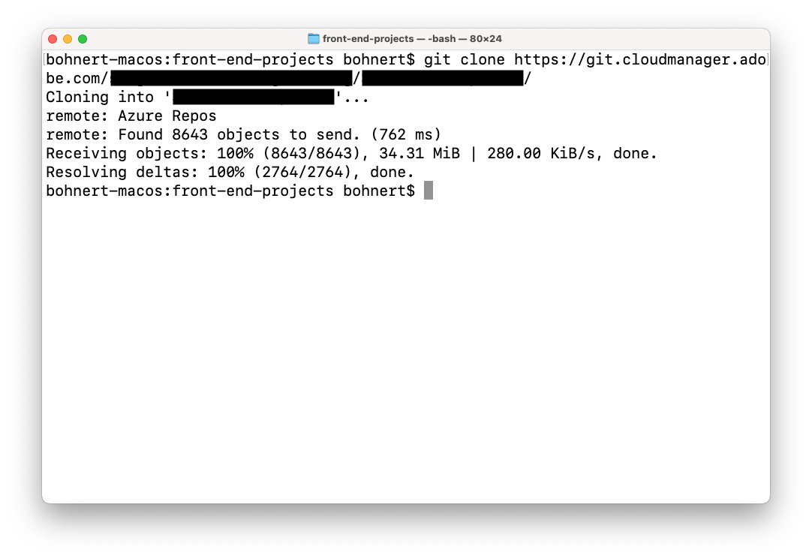

# Personnalisation du thème du site {#customize-the-site-theme}

Découvrez comment le thème du site est créé, comment personnaliser et comment tester à l’aide du contenu d’AEM en direct.

## Un peu d’histoire...  {#story-so-far}

Dans le document précédent du parcours de création rapide de site AEM, [Récupérer les informations d’accès au référentiel Git,](retrieve-access.md) vous avez appris comment les développeurs front-end utilisent Cloud Manager pour accéder aux informations du référentiel git. vous devez maintenant :

* Découvrez Cloud Manager à un haut niveau.
* Vous avez récupéré vos informations d’identification pour accéder au git d’AEM afin que vous puissiez valider vos personnalisations.

Cette partie du parcours effectue l’étape suivante et examine le thème du site et vous montre comment le personnaliser, puis valider ces personnalisations à l’aide des informations d’identification d’accès que vous avez récupérées.

## Objectif {#objective}

Ce document explique comment le thème de site AEM est créé, comment le personnaliser et comment le tester à l’aide de contenu AEM en direct. Après l’avoir lu, vous devriez :

* Comprendre la structure de base du thème du site et comment le modifier.
* Découvrez comment tester vos personnalisations de thème à l’aide de contenu d’AEM réel via un proxy local.
* Découvrez comment valider vos modifications dans le référentiel git d’AEM.

## Rôle responsable {#responsible-role}

Cette partie du parcours s’applique au développeur front-end.

## Présentation de la structure du thème {#understand-theme}

Extrayez le thème fourni par l’administrateur AEM à l’emplacement où vous souhaitez le modifier et ouvrez-le dans l’éditeur de votre choix.


Vous voyez que le thème est un projet front-end type. Les parties les plus importantes de la structure sont les suivantes :

* `src/main.ts`: Point d’entrée principal de votre thème JS et CSS
* `src/site`: Fichiers JS et CSS qui s’appliquent à l’ensemble du site
* `src/components`: Fichiers JS et CSS spécifiques aux composants AEM
* `src/resources`: Fichiers statiques (icônes, logos et polices)

>[!TIP]
>
>Si vous souhaitez en savoir plus sur le thème de site d’AEM standard, voir le lien GitHub dans la section [Ressources supplémentaires](#additional-resources) à la fin de ce document.

Une fois que vous êtes à l’aise avec la structure du projet de thème, démarrez le proxy local afin que vous puissiez voir toutes les personnalisations de thème en temps réel en fonction du contenu AEM réel.

## Démarrage du proxy local {#starting-proxy}

1. Dans la ligne de commande, accédez à la racine du thème sur votre ordinateur local.
1. Exécuter `npm install` et npm récupère les dépendances et installe le projet.

   

1. Exécuter `npm run live` et le serveur proxy démarre.

   

1. Lorsque le serveur proxy démarre, il ouvre automatiquement un navigateur sur `http://localhost:7001/`. Appuyez ou cliquez sur **CONNEXION LOCALE (TÂCHES D’ADMINISTRATION UNIQUEMENT)** et connectez-vous avec les informations d’identification de l’utilisateur proxy fournies par l’administrateur AEM.

   

1. Une fois connecté, modifiez l’URL dans le navigateur afin qu’elle pointe vers l’exemple de contenu que l’administrateur d’AEM vous a fourni.

   * Par exemple, si le chemin fourni était `/content/<your-site>/en/home.html?wcmmode=disabled`
   * Vous pouvez modifier l’URL en `http://localhost:7001/content/<your-site>/en/home.html?wcmmode=disabled`

   

Vous pouvez parcourir le site pour explorer le contenu. Le site est extrait en direct de l’instance AEM active afin que vous puissiez effectuer vos personnalisations de thème par rapport au contenu réel.

## Personnalisation du thème {#customize-theme}

Vous pouvez maintenant commencer à personnaliser le thème. Voici un exemple simple pour illustrer la manière dont vous pouvez voir vos modifications en direct via le proxy.

1. Dans l’éditeur, ouvrez le fichier . `<your-theme-sources>/src/site/_variables.scss`

   

1. Modification de la variable `$color-background` et définissez-la sur une autre valeur que blanche. Dans cet exemple, `orange` est utilisée.

   

1. Lorsque vous enregistrez le fichier, vous constatez que le serveur proxy reconnaît la modification via la ligne `[Browsersync] File event [change]`.

   

1. En revenant à votre navigateur du serveur proxy, la modification est immédiatement visible.

   

Vous pouvez continuer à personnaliser le thème en fonction des exigences que vous a fournies l’administrateur AEM.

## Validation des modifications {#committing-changes}

Une fois vos personnalisations terminées, vous pouvez les valider dans le référentiel git d’AEM. Vous devez d’abord cloner le référentiel sur votre ordinateur local.

1. Sur la ligne de commande, accédez à l’emplacement où vous souhaitez cloner le référentiel.
1. Exécutez la commande [récupéré précédemment à partir de Cloud Manager.](retrieve-access.md) Elle doit être similaire à `git clone https://git.cloudmanager.adobe.com/<my-org>/<my-program>/`. Utilisez le nom d’utilisateur et le mot de passe Git qui [vous avez récupéré dans la partie précédente de ce parcours.](retrieve-access.md)

   

1. Déplacez le projet de thème que vous étiez en train de modifier dans le référentiel cloné avec une commande similaire à `mv <site-theme-sources> <cloned-repo>`
1. Dans le répertoire du référentiel cloné, validez les fichiers de thème dans lesquels vous venez de déplacer avec les commandes suivantes.

   ```text
   git add .
   git commit -m "Adding theme sources"
   git push
   ```

1. Les personnalisations sont transmises au référentiel git d’AEM.

   

Vos personnalisations sont désormais stockées en toute sécurité dans le référentiel git d’AEM.

## Et après ? {#what-is-next}

Maintenant que vous avez terminé cette partie du parcours de création rapide de site AEM, vous devez :

* Comprendre la structure de base du thème du site et comment le modifier.
* Découvrez comment tester vos personnalisations de thème à l’aide de contenu d’AEM réel via un proxy local.
* Découvrez comment valider vos modifications dans le référentiel git d’AEM.

Tirez parti de ces connaissances et poursuivez votre parcours de création rapide de site AEM en consultant le document. [Déployer Votre Thème Personnalisé,](deploy-theme.md) où vous apprendrez à déployer le thème à l’aide du pipeline front-end.

## Ressources supplémentaires {#additional-resources}

Bien qu’il soit recommandé de passer à la partie suivante du parcours de création de site rapide en consultant le document [Déployer Votre Thème Personnalisé,](deploy-theme.md) vous trouverez ci-dessous des ressources facultatives supplémentaires qui approfondissent certains concepts mentionnés dans ce document, mais qui ne sont pas nécessaires pour continuer sur le parcours.

* [AEM Thème du site](https://github.com/adobe/aem-site-template-standard-theme-e2e) - Il s’agit du référentiel GitHub du thème de site AEM.
* [npm](https://www.npmjs.com) - AEM thèmes utilisés pour créer rapidement des sites sont basés sur npm.
* [webpack](https://webpack.js.org) - AEM thèmes utilisés pour créer rapidement des sites reposent sur webpack.