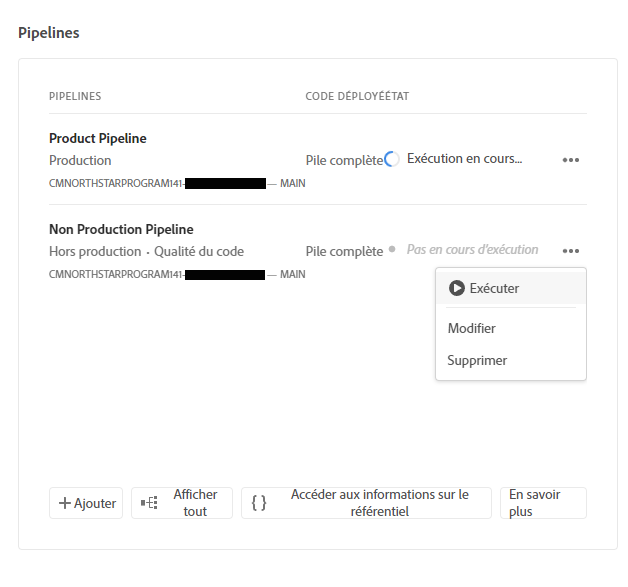
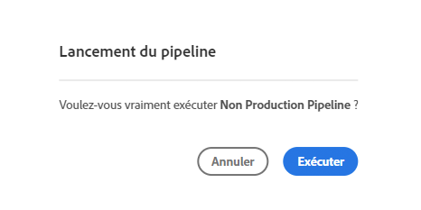
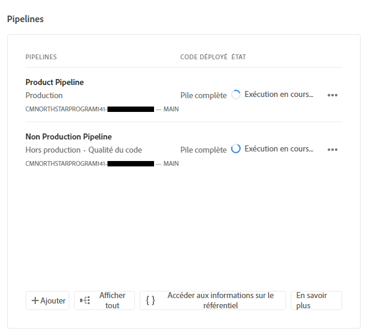
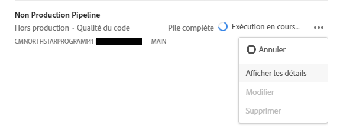
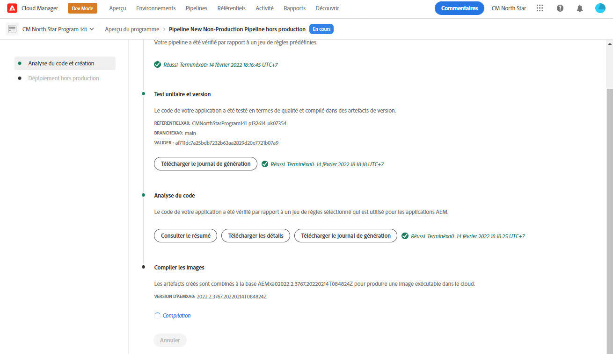
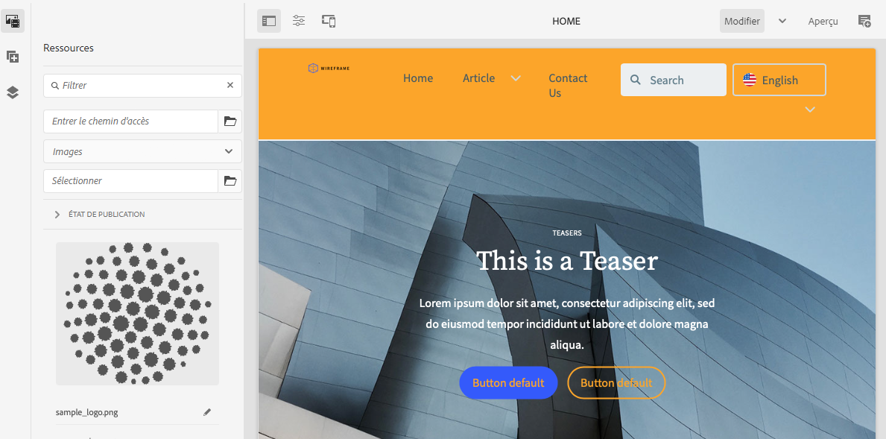

# Déploiement de votre thème personnalisé {#deploy-your-customized-theme}

{{traditional-aem}}

Découvrez comment déployer le thème du site à l’aide du pipeline.

## Un peu d’histoire... {#story-so-far}

Dans le document précédent du parcours de création rapide de site AEM, [Personnaliser le thème du site](customize-theme.md), vous avez appris comment le thème est créé, comment le personnaliser et comment le tester à l’aide du contenu actif AEM. Vous devriez maintenant disposer des compétences suivantes :

* Comprendre la structure de base du thème du site et comment le modifier.
* Voir comment tester vos personnalisations de thème à l’aide de contenu d’AEM réel via un proxy local.
* Savoir comment valider vos modifications dans le référentiel Git d’AEM.

Vous pouvez maintenant passer à l’étape finale et utiliser le pipeline pour les déployer.

## Objectif {#objective}

Ce document explique comment déployer le thème à l’aide du pipeline. Après avoir lu ce document, vous devriez :

* Savoir comment déclencher un déploiement de pipeline.
* Découvrez comment vérifier le statut du déploiement.

## Rôle responsable {#responsible-role}

Cette partie du parcours s’applique au développeur front-end.

## Démarrer le pipeline {#start-pipeline}

Une fois que vous avez validé les modifications de personnalisation du thème dans le référentiel Git d’AEM, vous pouvez exécuter [le pipeline créé par l’administrateur](pipeline-setup.md) pour déployer les modifications.

1. Connectez-vous à Cloud Manager [comme vous l’avez fait pour récupérer vos informations d’accès Git](retrieve-access.md) et accédez à votre programme. Sur l’onglet **Aperçu** vous verrez une vignette pour **Pipelines**.

   

1. Appuyez ou cliquez sur les points de suspension en regard du pipeline que vous devez démarrer. Dans le menu déroulant, sélectionnez **Exécuter**.

   

1. Dans le **Exécution du pipeline** boîte de dialogue de confirmation, sélectionnez **Oui**.

   

1. Dans la liste des pipelines, la colonne de statut indique que votre pipeline est en cours d’exécution.

   

## Vérification du statut du pipeline {#pipeline-status}

Vous pouvez vérifier le statut du pipeline pour afficher le détail de sa progression à tout moment.

1. Sélectionnez les points de suspension en regard de votre pipeline.

   

1. La fenêtre Détails du pipeline affiche la répartition de la progression du pipeline.

   

>[!TIP]
>
>Dans la fenêtre Détails du pipeline, vous pouvez appuyer ou cliquer sur **Télécharger le journal** à n’importe quelle étape du pipeline à des fins de débogage si une étape venait à échouer. Le débogage du pipeline dépasse la portée de ce parcours. Consultez la documentation technique de Cloud Manager dans la section [Ressources supplémentaires](#additional-resources) de cette page.

## Validation des personnalisations déployées {#view-customizations}

Une fois le pipeline terminé, vous pouvez informer l’administrateur de valider les modifications. L’administrateur devra alors :

1. Ouvrir l’environnement de création AEM.
1. Accédez au [site précédemment créé par l’administrateur ou l’administratrice](create-site.md).
1. Modifiez l’une des pages de contenu.
1. Voir les modifications appliquées.

## Fin du parcours ? {#end-of-journey}

Félicitations. Vous avez terminé le parcours de création rapide de site AEM ! Vous devriez maintenant :

* Découvrez comment Cloud Manager et le pipeline front-end fonctionnent pour gérer et déployer les personnalisations front-end.
* Savoir comment créer un site AEM basé sur un modèle et comment télécharger le thème du site.
* Comment intégrer un développeur front-end afin qu’il puisse accéder au référentiel Git d’AEM.
* Comment personnaliser et tester un thème à l’aide du contenu AEM proxy et valider ces modifications dans le Git d’AEM.
* Comment déployer la personnalisation front-end à l’aide du pipeline.

Vous êtes maintenant prêt à personnaliser les thèmes de votre propre site AEM. Toutefois, avant de commencer à créer différents flux de travail à l’aide de plusieurs pipelines front-end, consultez le document [Développement de sites avec le pipeline front-end](/help/implementing/developing/introduction/developing-with-front-end-pipelines.md). Cela vous aidera à tirer le meilleur parti de votre développement front-end en :

* Maintenant une source unique de vérité.
* Maintenant une séparation des préoccupations.

AEM est un outil puissant et de nombreuses autres options sont disponibles. Consultez certaines des ressources supplémentaires disponibles dans la [Section Ressources supplémentaires](#additional-resources) pour en savoir plus sur les fonctionnalités rencontrées dans ce parcours.

## Ressources supplémentaires {#additional-resources}

Vous trouverez ci-dessous quelques ressources supplémentaires qui approfondissent certains concepts mentionnés dans ce document.

* [Utilisation du rail Site pour gérer le thème de votre site](/help/sites-cloud/administering/site-creation/site-rail.md) - Découvrez les puissantes fonctionnalités du rail Site pour vous aider à personnaliser et gérer facilement votre thème de site, y compris le téléchargement des sources de thèmes et la gestion des versions de thèmes.
* [Documentation technique d’AEM as a Cloud Service](https://experienceleague.adobe.com/docs/experience-manager-cloud-service.html?lang=fr) - Si vous avez déjà une bonne compréhension d’AEM, vous pouvez consulter directement notre documentation technique détaillée.
* [Documentation de Cloud Manager](https://experienceleague.adobe.com/docs/experience-manager-cloud-service/content/onboarding/onboarding-concepts/cloud-manager-introduction.html?lang=fr) - Pour obtenir plus de détails sur les fonctionnalités de Cloud Manager, vous pouvez consulter directement la documentation technique détaillée.
* [Autorisations basées sur les rôles](https://experienceleague.adobe.com/docs/experience-manager-cloud-manager/using/requirements/role-based-permissions.html?lang=fr) - Cloud Manager dispose de rôles préconfigurés avec les autorisations appropriées. Reportez-vous à ce document pour plus de détails sur ces rôles et sur la manière de les administrer.
* [Référentiels Cloud Manager](/help/implementing/cloud-manager/managing-code/managing-repositories.md) - Si vous avez besoin d’informations supplémentaires sur la configuration et la gestion des référentiels Git pour votre projet AEMaaCS, reportez-vous à ce document.
* [Configurer le pipeline CI/CD - Cloud Services](/help/implementing/cloud-manager/configuring-pipelines/introduction-ci-cd-pipelines.md) : pour plus d’informations sur la configuration des pipelines full stack et front-end, consultez ce document.
* [Modèle de site standard d’AEM](https://github.com/adobe/aem-site-template-standard) - Il s’agit du référentiel GitHub du modèle de site standard d’AEM.
* [Thème de site AEM](https://github.com/adobe/aem-site-template-standard-theme-e2e) - Il s’agit du référentiel GitHub du thème de site AEM.
* [npm](https://www.npmjs.com) : les thèmes AEM utilisés pour créer rapidement des sites sont basés sur npm.
* [webpack](https://webpack.js.org) - Les thèmes AEM utilisés pour construire rapidement des sites reposent sur webpack.
* [Organisation des pages](/help/sites-cloud/authoring/sites-console/organizing-pages.md) - Ce guide explique comment organiser les pages de votre site AEM.
* [Création de pages](/help/sites-cloud/authoring/sites-console/creating-pages.md) - Ce guide explique comment ajouter de nouvelles pages à votre site.
* [Gestion des pages](/help/sites-cloud/authoring/sites-console/managing-pages.md) - Ce guide explique comment gérer les pages de votre site, y compris le déplacement, la copie et la suppression.
* [Utilisation d’un package](/help/implementing/developing/tools/package-manager.md) - Les packages permettent l’importation et l’exportation de contenu de référentiel. Ce document explique comment utiliser les packages dans AEM 6.5, qui s’applique également à AEMaaCS.
* [Parcours d’intégration](/help/journey-onboarding/overview.md) - Ce guide constitue votre point de départ pour vous assurer que vos équipes sont configurées et ont accès à AEM as a Cloud Service.
* [Documentation d’Adobe Experience Manager Cloud Manager](https://experienceleague.adobe.com/docs/experience-manager-cloud-manager/using/introduction-to-cloud-manager.html?lang=fr) - Consultez la documentation de Cloud Manager pour en savoir plus sur ses fonctionnalités.
* [Documentation relative à l’administration du site](/help/sites-cloud/administering/site-creation/create-site.md) - Consultez la documentation technique sur la création de site pour plus d’informations sur les fonctionnalités de l’outil de création rapide de site.
* [Développement de sites avec le pipeline front-end](/help/implementing/developing/introduction/developing-with-front-end-pipelines.md) - Ce document décrit certaines considérations à prendre en compte pour tirer pleinement parti du processus de développement front-end à l’aide du pipeline front-end.
