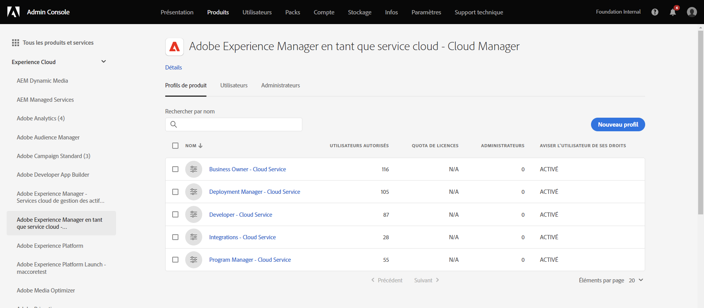

# Accorder l’accès au développeur front-end {#grant-fed-access}

Intégrez les développeurs front-end à Cloud Manager afin qu’ils aient accès au référentiel Git et au pipeline de votre site AEM.

## Un peu d’histoire… {#story-so-far}

Dans le document précédent du parcours de création rapide de site AEM, [Configuration de votre pipeline](pipeline-setup.md), vous avez appris à créer un pipeline front-end pour gérer la personnalisation du thème de votre site. Vous devriez maintenant :

* Comprendre ce qu’est un pipeline front-end.
* Savoir comment configurer un pipeline front-end dans Cloud Manager.

Vous devez maintenant octroyer l’accès à Cloud Manager à votre développeur front-end par le biais du processus d’intégration afin que ce dernier puisse accéder au référentiel Git d’AEM et au pipeline que vous avez créé.

## Objectif {#objective}

Le processus d’octroi de l’accès à Cloud Manager et d’affectation de rôles utilisateur à vos utilisateurs est appelé intégration. Ce document présente les étapes les plus importantes pour l’intégration d’un développeur front-end. Après avoir lu ce document, vous saurez :

* Ajouter un développeur front-end en tant qu’utilisateur.
* Octroyer les rôles requis au développeur front-end.

>[!TIP]
>
>Il existe un parcours de documentation complet dédié à l’intégration de votre équipe à AEM as a Cloud Service, dont le lien figure dans la [section Ressources supplémentaires](#additional-resources) de ce document, si vous avez besoin de détails supplémentaires sur le processus.

## Rôle responsable {#responsible-role}

Cette partie du parcours s’applique à l’administrateur de Cloud Manager.

## Conditions requises {#requirements}

* Vous devez appartenir au rôle **Propriétaire de l’entreprise** dans Cloud Manager.
* Vous devez être **Administrateur système** dans Cloud Manager.
* Vous devez avoir accès à Admin Console.

## Ajout du développeur front-end en tant qu’utilisateur {#add-fed-user}

Vous devez d’abord ajouter le développeur front-end en tant qu’utilisateur à l’aide d’Admin Console.

1. Connectez-vous à Admin Console à l’adresse [https://adminconsole.adobe.com/](https://adminconsole.adobe.com/).

1. Une fois connecté, une page de présentation similaire à l’image suivante s’affiche.

   

1. Vérifiez que vous vous trouvez dans l’organisation appropriée en cochant le nom de l’organisation dans le coin supérieur droit de l’écran.

   

1. Sélectionnez **Adobe Experience Manager en tant que service cloud** dans la vignette **Produits et services**.

   

1. La liste des profils de produits Cloud Manager préconfigurés s’affiche. Si ces profils ne s’affichent pas, contactez votre administrateur Cloud Manager, car vous ne disposez peut-être pas des autorisations appropriées dans votre organisation.

   

1. Pour affecter le développeur front-end aux profils corrects, sélectionnez l’option **Utilisateurs** puis l’onglet **Ajouter un utilisateur** bouton .

   

1. Dans la boîte de dialogue **Ajouter des utilisateurs à votre équipe**, saisissez l’ID e-mail de l’utilisateur que vous souhaitez ajouter. Pour le type d’identifiant, sélectionnez Adobe ID si le Federated ID des membres de votre équipe n’a pas encore été configuré.

   

1. Dans le **Produit** sélectionnez le signe plus, puis sélectionnez **Adobe Experience Manager as a Cloud Service** et affectez la variable **Responsable de déploiement** et **Développeur** profils de produit pour l’utilisateur.

   

1. Sélectionner **Enregistrer** et un e-mail de bienvenue est envoyé au développeur front-end que vous avez ajouté en tant qu’utilisateur.

Le développeur front-end invité peut accéder à Cloud Manager en cliquant sur le lien contenu dans l’e-mail de bienvenue et en se connectant à l’aide de son Adobe ID.

## Transfert vers le développeur front-end {#handover}

Avec une invitation par e-mail à Cloud Manager en route vers le développeur front-end, vous et l’administrateur AEM pouvez désormais fournir au développeur front-end les informations nécessaires restantes pour commencer la personnalisation.

* Un [chemin d’accès au contenu type](#example-page).
* La source du thème que [vous avez téléchargé](#download-theme).
* Les [informations d’identification de l’utilisateur proxy](#proxy-user).
* Le nom du programme ou l’URL qui lui correspond [copié à partir de Cloud Manager](pipeline-setup.md#login).
* Les exigences de conception front-end.

## Prochaines étapes {#what-is-next}

Maintenant que vous avez terminé cette partie du parcours de création rapide de site AEM, vous devriez être capable d’effectuer les opérations suivantes :

* Ajouter un développeur front-end en tant qu’utilisateur.
* Octroyer les rôles requis au développeur front-end.

Tirez parti de ces connaissances et poursuivez votre parcours de création rapide de site AEM en consultant le document [Récupérer des informations d’accès au référentiel Git](retrieve-access.md), dont le contenu sʼadresse cette fois exclusivement au développeur front-end. Découvrez comment ce dernier peut accéder aux informations du référentiel Git à lʼaide de Cloud Manager.

## Ressources supplémentaires {#additional-resources}

Bien qu’il soit recommandé de passer à la partie suivante du parcours de création rapide de site en consultant le document [Récupérer des informations dʼidentification du développeur front-end](retrieve-access.md), vous trouverez ci-après quelques ressources facultatives supplémentaires pour approfondir un certain nombre de concepts mentionnés dans ce document, bien qu’ils ne soient pas obligatoires pour poursuivre le parcours.

* [Parcours d’intégration](/help/journey-onboarding/overview.md) : ce guide sert de point de départ pour vous assurer que vos équipes sont configurées et disposent dʼun accès à AEM as a Cloud Service.
