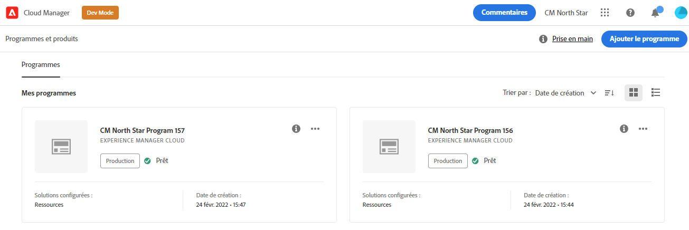
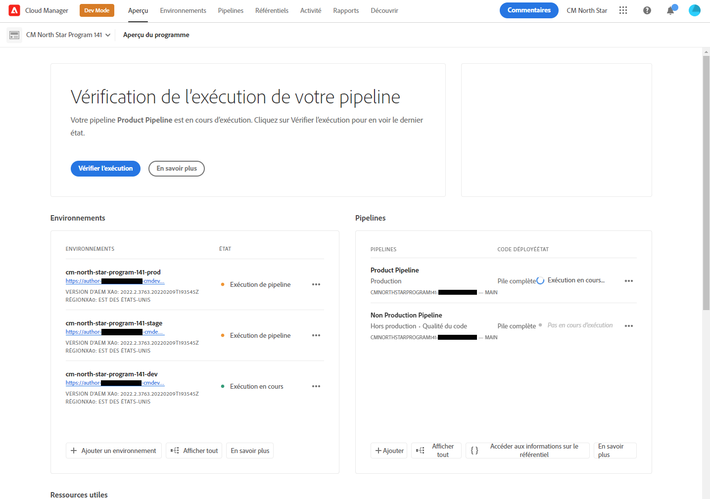
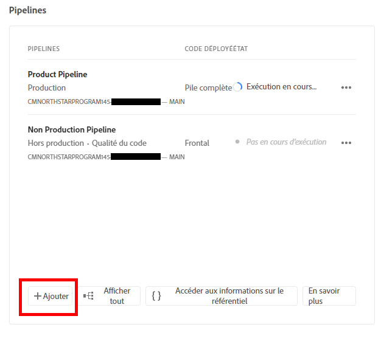
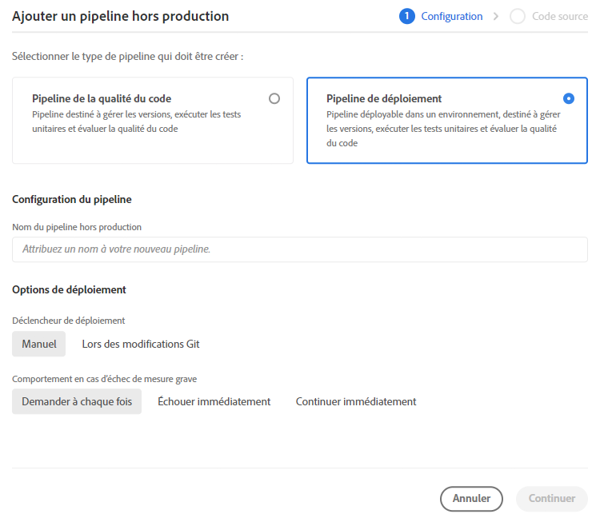
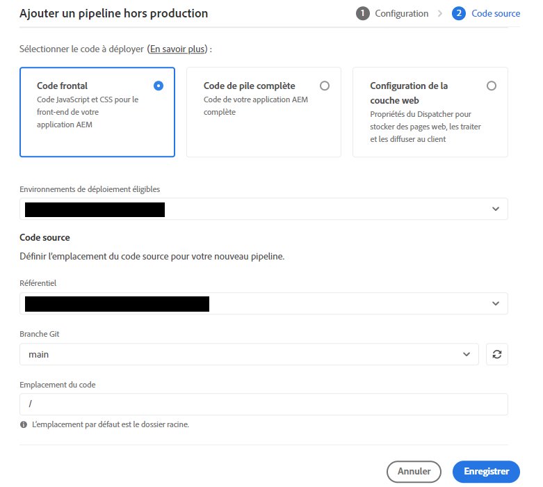
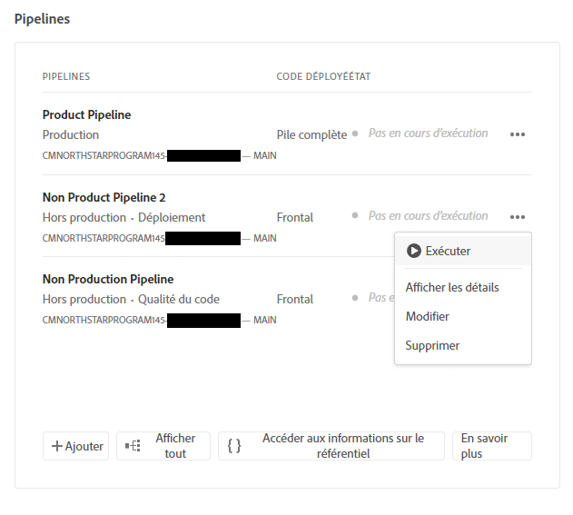

# Configurer le pipeline {#set-up-your-pipeline}

{{traditional-aem}}

Créez un pipeline front-end pour gérer la personnalisation du thème de votre site.

## Un peu d’histoire... {#story-so-far}

Dans le document précédent du parcours de création rapide de site AEM, [Créer un site à partir d’un modèle](create-site.md), vous avez appris à utiliser un modèle de site pour créer rapidement un site AEM qui peut être davantage personnalisé à l’aide d’outils front-end. Vous devriez maintenant disposer des compétences suivantes :

* Comprendre comment obtenir des modèles de site AEM.
* Apprendre à créer un nouveau site à l’aide d’un modèle.
* Découvrez comment télécharger le modèle de votre nouveau site pour le fournir au développement front-end.

Cet article s’appuie sur ces principes de base afin que vous puissiez configurer un pipeline frontal, que le développeur front-end utilisera ultérieurement dans le parcours pour déployer les personnalisations frontales.

## Objectif {#objective}

Ce document vous aide à comprendre les pipelines front-end et comment en créer un pour gérer le déploiement du thème personnalisé de votre site. Après avoir lu ce document, vous devriez :

* Comprendre ce qu’est un pipeline front-end.
* Savoir comment configurer un pipeline front-end dans Cloud Manager.

## Rôle responsable {#responsible-role}

Cette partie du parcours s’applique à l’administrateur de Cloud Manager.

## Conditions requises {#requirements}

* Vous devez avoir accès à Cloud Manager.
* Vous devez être membre du rôle **Responsable de déploiement** dans Cloud Manager.
* Un référentiel git pour l’environnement AEM doit être configuré dans Cloud Manager.
   * C&#39;est généralement déjà le cas pour tout projet principal. Toutefois, si ce n’est pas le cas, reportez-vous à la documentation des référentiels Cloud Manager disponible dans la section [Ressources supplémentaires](#additional-resources).

## Qu’est-ce qu’un pipeline front-end ? {#front-end-pipeline}

Le développement front-end implique la personnalisation de ressources JavaScript, CSS et statiques qui définissent le style de votre site AEM. Le développeur front-end travaille dans son propre environnements local pour effectuer ces personnalisations. Une fois qu’elles sont prêtes, les modifications sont validées dans le référentiel git d’AEM. Mais elles ne sont engagées que dans le code source. Elles ne sont pas encore en ligne.

Le pipeline front-end prend ces personnalisations validées et les déploie dans un environnement AEM, généralement des environnements de production ou hors production.

Ainsi, le développement front-end peut fonctionner séparément et parallèlement à tout développement back-end complet sur AEM, qui possède ses propres pipelines de déploiement.

>[!NOTE]
>
>Les pipelines front-end peuvent uniquement déployer des ressources JavaScript, CSS et statiques pour appliquer un style à votre site AEM. Le contenu du site, tel que les pages ou les ressources, ne peuvent pas être déployé dans un pipeline.

## Accès à Cloud Manager {#login}

1. Connectez-vous à Adobe Cloud Manager à l’adresse [my.cloudmanager.adobe.com](https://my.cloudmanager.adobe.com/).

1. Cloud Manager répertorie les différents programmes disponibles. Sélectionnez celui que vous souhaitez gérer. Si vous commencez avec AEM as a Cloud Service, il est probable qu’un seul programme soit disponible.

   

Vous voyez maintenant un aperçu de votre programme. Votre page sera différente, mais similaire à cet exemple.

Notez le nom du programme auquel vous avez accédé ou copiez l’URL. Vous devrez fournir cette information au développeur front-end ultérieurement.

## Création d’un pipeline front-end {#create-front-end-pipeline}

Maintenant que vous avez accédé à Cloud Manager, vous pouvez créer un pipeline pour le déploiement front-end.

1. Dans la section **Pipelines** de la page Cloud Manager, appuyez ou cliquez sur le bouton **Ajouter**.

   

1. Dans le menu pop-up qui s’affiche sous le bouton **Ajouter**, sélectionnez **Ajouter un pipeline hors production** aux fins du présent parcours.

1. Dans l’onglet **Configuration** de la boîte de dialogue **Ajouter un pipeline hors production** qui s’ouvre :
   * Sélectionnez **Pipeline de déploiement**.
   * Attribuez un nom au pipeline dans le champ **Nom du pipeline de non-production**.

   

1. Sélectionnez **Continuer**.

1. Dans l’onglet **Code source** :
   * Sélectionnez **Code frontal** comme type de code à déployer.
   * Sélectionnez l’environnement approprié sous **Environnements de déploiement éligibles**.
   * Sélectionnez le **Référentiel** adéquat.
   * Définissez la **Branche Git** à laquelle le pipeline doit être associé.
   * Définissez l’**Emplacement du code** si le développement front-end se trouve sous un chemin d’accès particulier dans le référentiel sélectionné. La valeur par défaut est la racine du référentiel, mais le développement front-end et back-end se fait souvent sous différents chemins d’accès.

   

1. Sélectionnez **Enregistrer**.

Le nouveau pipeline est créé et visible dans la section **Pipelines** de la fenêtre Cloud Manager. Lorsque vous cliquez ou appuyez sur les points de suspension après le nom du pipeline, les options s’affichent pour modifier ou afficher les détails, si nécessaire.

>[!TIP]
>
>Si vous connaissez déjà les pipelines dans AEMaaCS et souhaitez en savoir plus sur les différences entre les divers types de pipelines, y compris sur le pipeline front-end, consultez Configurer le pipeline CI/CD - Cloud Services dans la section [Ressources supplémentaires](#additional-resources) ci-dessous.

## Prochaines étapes {#what-is-next}

Maintenant que vous avez terminé cette partie du parcours de création rapide de site AEM vous devriez :

* Comprendre ce qu’est un pipeline front-end.
* Savoir comment configurer un pipeline front-end dans Cloud Manager.

Tirez parti de ces connaissances et poursuivez votre parcours de création rapide de site AEM en consultant le document [Accorder l’accès aux personnes chargées du développement front-end](grant-access.md) pour intégrer celles-ci dans Cloud Manager afin qu’elles aient accès à votre référentiel Git et à votre pipeline de sites AEM.

## Ressources supplémentaires {#additional-resources}

Bien qu’il soit recommandé de passer à la partie suivante du parcours de création rapide de site en consultant le document [Personnaliser le thème du site](customize-theme.md), vous trouverez ci-après quelques ressources facultatives supplémentaires pour approfondir un certain nombre de concepts mentionnés dans ce document, mais non obligatoires pour poursuivre le parcours.

* [Documentation de Cloud Manager](https://experienceleague.adobe.com/docs/experience-manager-cloud-service/content/onboarding/onboarding-concepts/cloud-manager-introduction.html?lang=fr) - Pour obtenir plus de détails sur les fonctionnalités de Cloud Manager, vous pouvez consulter directement la documentation technique détaillée.
* [Référentiels Cloud Manager](/help/implementing/cloud-manager/managing-code/managing-repositories.md) : si vous avez besoin d’informations supplémentaires sur la configuration et la gestion des référentiels Git pour votre projet AEMaaCS, reportez-vous à ce document.
* [Configurer le pipeline CI/CD - Cloud Services](/help/implementing/cloud-manager/configuring-pipelines/introduction-ci-cd-pipelines.md) : pour plus d’informations sur la configuration des pipelines full stack et front-end, consultez ce document.
