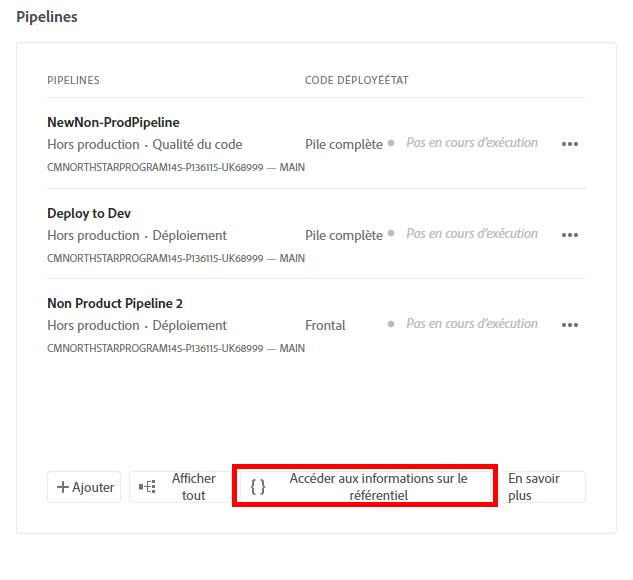
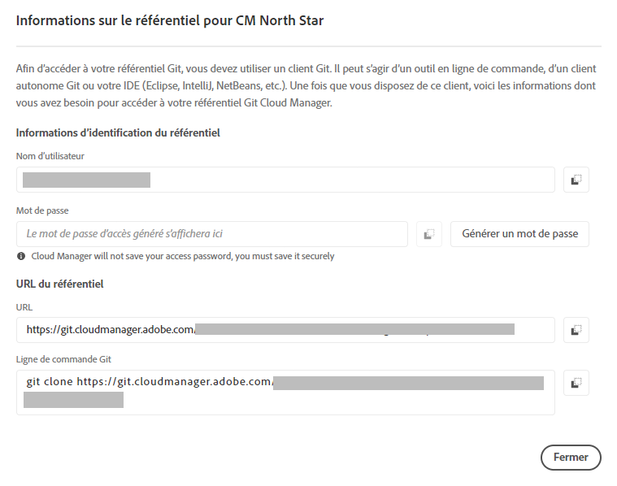

# Récupérer des informations d’accès au référentiel Git {#retrieve-access}

{{traditional-aem}}

Découvrez comment le développeur front-end utilise Cloud Manager pour accéder aux informations du référentiel Git.

## Un peu d’histoire... {#story-so-far}

Si vous êtes un développeur front-end uniquement responsable de la personnalisation du thème du site, il nʼest pas nécessaire de savoir comment AEM a été configuré et vous pouvez passer à la section [Objectif](#objective) de ce document.

Si vous détenez également le rôle d’administration Cloud Manager ou AEM et de développement front-end, vous avez appris dans le document précédent du parcours de création rapide de site AEM, [Octroi dʼaccès au développeur ou à la développeuse front-end](grant-access.md), comment intégrer la personne chargée du développement front-end afin quʼelle ait accès au référentiel Git. À présent, vous devriez disposer des connaissances suivantes :

* Ajouter un développeur front-end en tant qu’utilisateur.
* Octroyer les rôles requis au développeur front-end.

Dans cet article, nous allons passer à lʼétape suivante et découvrir comment le développeur front-end utilise l’accès à Cloud Manager pour récupérer les informations d’identification lui permettant d’accéder au référentiel Git d’AEM.

Les étapes suivantes ont été vues : création dʼun site sur la base dʼun modèle, configuration dʼun pipeline et intégration du développeur, qui dispose de toutes les informations nécessaires. A présent, cet article ne va plus traiter du rôle des administrateurs mais du rôle du développeur front-end.

## Objectif {#objective}

Ce document explique comment, en tant que développeur front-end, vous pouvez accéder à Cloud Manager et récupérer les informations d’accès au référentiel Git d’AEM. Après lʼavoir lu, vous devriez :

* Découvrez Cloud Manager à un haut niveau.
* Avoir récupéré vos identifiants pour accéder au Git d’AEM afin de valider vos personnalisations.

## Rôle responsable {#responsible-role}

Cette partie du parcours s’applique au développeur front-end.

## Conditions requises {#requirements}

L’outil de création rapide de site permet aux développeurs front-end de travailler de manière autonome, sans connaissance dʼAEM ou de sa configuration. Cependant, l’administrateur Cloud Manager doit intégrer le développeur front-end à l’équipe de projet et l’administrateur AEM doit vous communiquer certaines informations requises. Assurez-vous de disposer des informations suivantes avant de continuer.

* De l’administrateur AEM :
   * Fichiers sources du thème à personnaliser
   * Chemin d’accès à une page d’exemple à utiliser comme base de référence
   * Informations d’identification d’utilisateur du proxy pour tester vos personnalisations sur du contenu actif dʼAEM
   * Exigences en matière de conception front-end
* De l’administrateur Cloud Manager :
   * Un e-mail de bienvenue de Cloud Manager vous informant de l’accès
   * Le nom du programme ou son adresse URL dans Cloud Manager

Si lʼun de ces éléments est manquant, contactez lʼadministration AEM ou Cloud Manager.

Il est présumé que le développeur ou la développeuse front-end possède une solide expérience des workflows de développement front-end et des outils courants installés, notamment :

* Git
* npm 
* webpack
* Un éditeur préféré

## Présentation de Cloud Manager {#understanding-cloud-manager}

Cloud Manager permet aux entreprises de gérer elles-mêmes AEM dans le cloud. Il comprend une structure d’intégration et de diffusion continues (CI/CD) qui permet aux équipes informatiques et aux partenaires d’implémentation d’accélérer la diffusion des personnalisations ou des mises à jour sans compromettre les performances ou la sécurité.

Pour le développeur front-end, il s’agit dʼune passerelle permettant de :

* Accéder aux informations du référentiel Git d’AEM afin de pouvoir valider vos personnalisations front-end.
* Démarrer le pipeline de déploiement afin de déployer vos personnalisations.

L’administrateur Cloud Manager vous a à présent intégré en tant qu’utilisateur de Cloud Manager. Vous devriez avoir reçu un e-mail de bienvenue semblable à celui ci-dessous.

Si vous n’avez pas reçu cet e-mail, contactez l’administration Cloud Manager.

## Accéder à Cloud Manager {#access-cloud-manager}

1. Connectez-vous à Adobe Experience Cloud à l’adresse [my.cloudmanager.adobe.com](https://my.cloudmanager.adobe.com/) ou cliquez sur le lien fourni dans lʼe-mail de bienvenue.

1. Cloud Manager répertorie les différents programmes disponibles. Appuyez ou cliquez sur celui auquel vous devez accéder, comme indiqué par l’administrateur Cloud Manager. S’il s’agit de votre premier projet front-end pour AEMaaCS, vous nʼavez probablement quʼun seul programme disponible.

   

Vous voyez maintenant un aperçu de votre programme. Votre page sera différente, mais similaire à cet exemple.

## Récupération des informations d’accès au référentiel {#repo-access}

1. Dans la section **Pipelines** de la page Cloud Manager, appuyez ou cliquez sur le bouton **Accéder aux informations sur le référentiel**.

   

1. La boîte de dialogue **Informations du référentiel** s’affiche.

   

1. Appuyez ou cliquez sur le bouton **Générer un mot de passe** pour créer un mot de passe.

1. Enregistrez le mot de passe généré dans un gestionnaire de mots de passe sécurisé. Le mot de passe ne sera plus jamais affiché.

1. Copiez également les champs **Nom d’utilisateur** et **Ligne de commande Git**. Utilisez ces informations plus tard pour accéder au référentiel.

1. Sélectionner **Fermer**.

## Prochaines étapes {#what-is-next}

Maintenant que vous avez terminé cette partie du parcours de création rapide de site AEM vous devriez :

* Découvrez Cloud Manager à un haut niveau.
* Avoir récupéré vos identifiants pour accéder au Git d’AEM afin de valider vos personnalisations.

Tirez parti de ces connaissances et poursuivez votre parcours de création rapide de site AEM en consultant le document [Personnaliser le thème du site](customize-theme.md), où vous apprendrez à créer le thème du site, à le personnaliser et à le tester à l’aide de contenu actif d’AEM.

## Ressources supplémentaires {#additional-resources}

Bien qu’il soit recommandé de passer à la partie suivante du parcours de création rapide de site en consultant le document [Personnaliser le thème du site](customize-theme.md), vous trouverez ci-après quelques ressources facultatives supplémentaires pour approfondir un certain nombre de concepts mentionnés dans ce document, mais non obligatoires pour poursuivre le parcours.

* [Documentation d’Adobe Experience Manager Cloud Manager](https://experienceleague.adobe.com/docs/experience-manager-cloud-manager/using/introduction-to-cloud-manager.html?lang=fr) : consultez la documentation de Cloud Manager pour en savoir plus sur ses fonctionnalités.
