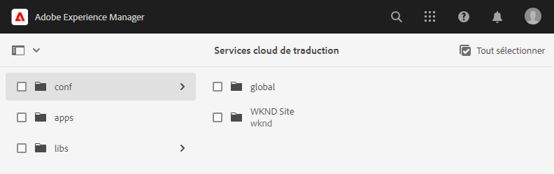
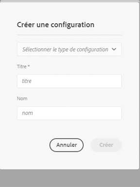
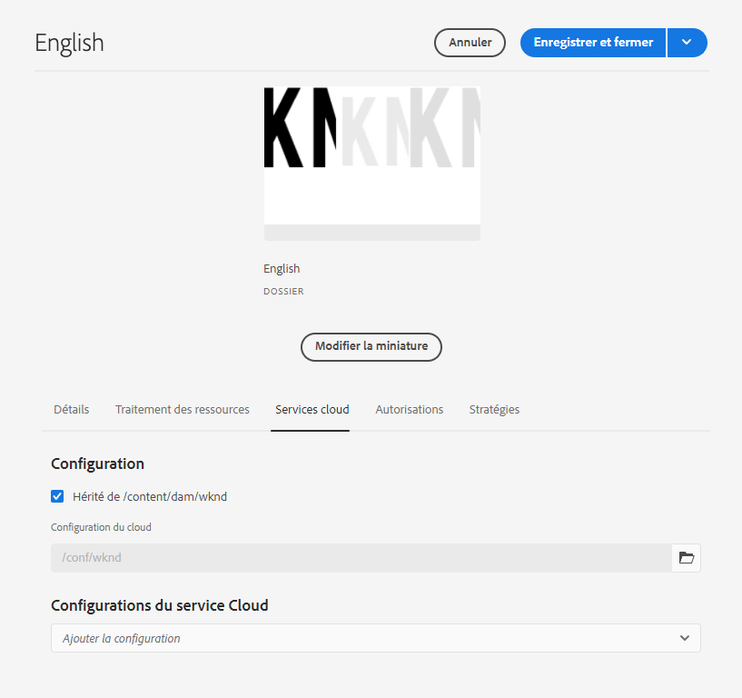

# Configuration du connecteur de traduction {#configure-connector}

Découvrez comment connecter AEM à un service de traduction.

## Un peu d’histoire... {#story-so-far}

Dans le document précédent du parcours de traduction AEM Sites, intitulé [Prise en main de la traduction AEM Sites](learn-about.md), vous avez appris à organiser votre contenu et la manière dont fonctionnent les outils de traduction AEM, et vous devriez maintenant :

* comprendre l’importance de la structure de contenu pour la traduction ;
* comprendre comment AEM stocke le contenu ;
* vous être familiarisé avec les outils de traduction AEM.

Cet article s’appuie sur ces principes de base afin que vous puissiez effectuer la première étape de configuration et configurer un service de traduction, que vous utiliserez ultérieurement dans le parcours pour traduire votre contenu.

## Objectif {#objective}

Ce document vous aide à comprendre comment configurer un connecteur AEM pour le service de traduction de votre choix. Après avoir lu ce document, vous devriez :

* comprendre les paramètres importants de la structure d’intégration de traduction dans AEM ;
* savoir configurer votre propre connexion à votre service de traduction.

## Framework d’intégration de la traduction {#tif}

Le framework d’intégration de la traduction dans AEM s’intègre à des services de traduction tiers pour orchestrer la traduction du contenu d’AEM. Elle implique trois étapes de base.

1. Connectez-vous à un fournisseur de services de traduction.
1. Créez une configuration de framework d’intégration de traduction.
1. Associez la configuration à votre contenu.

Les sections suivantes décrivent ces étapes de manière plus détaillée.

## Connexion à un fournisseur de services de traduction {#connect-translation-provider}

La première étape consiste à choisir le service de traduction que vous souhaitez utiliser. Il existe de nombreux choix pour les services de traduction humaine et automatique, disponibles pour AEM. La plupart des fournisseurs proposent un package de traducteur à installer. Consultez la section [Ressources supplémentaires](#additional-resources) pour découvrir une sélection d’options disponibles.

>[!NOTE]
>
>Le spécialiste de traduction est généralement chargé de choisir le service de traduction à utiliser, mais l’administrateur est généralement chargé d’installer le package de connecteur de traduction requis.

Pour les besoins de ce parcours, nous utilisons Microsoft Translator à qui AEM fournit une licence d’évaluation prête à l’emploi. Consultez la section [Ressources supplémentaires](#additional-resources) pour plus d’informations sur ce fournisseur.

Si vous choisissez un autre fournisseur, votre administrateur doit installer le package de connecteur conformément aux instructions fournies par le service de traduction.

>[!NOTE]
>
>L’utilisation de Microsoft Translator prêt à l’emploi dans AEM ne nécessite pas de configuration supplémentaire et fonctionne en l’état sans configuration de connecteur supplémentaire.
>
>Si vous choisissez d’utiliser le connecteur Microsoft Translator à des fins de test, il n’est pas nécessaire d’effectuer les étapes des deux sections suivantes : [Création d’une configuration d’intégration de traduction](#create-config) et [Association de la configuration à votre contenu](#associate). Il est toutefois conseillé de lire ces sections afin de vous familiariser avec les étapes de configuration de votre connecteur préféré.
>
>La licence d’évaluation du connecteur Microsoft Translator n’est pas destinée à la production. Si vous décidez de vous procurer une licence, l’administrateur ou l’administratrice système doit suivre les étapes présentées dans la section [Ressources supplémentaires](#additional-resources) à la fin de ce document pour configurer la licence.

## Création d’une configuration d’intégration de traduction {#create-config}

Une fois installé le package de connecteur correspondant au service de traduction choisi, vous devez créer une configuration de structure d’intégration de traduction pour ce service. La configuration contient les informations suivantes :

* Le fournisseur de service de traduction à utiliser
* Si une traduction humaine ou automatique doit être réalisée
* Si le contenu supplémentaire associé aux pages (comme les balises) doit être traduit

Pour créer une configuration de traduction :

1. Dans le menu de navigation global, sélectionnez **Outils** > **Services cloud** > **Services cloud de traduction**.
1. Accédez à l’emplacement où vous souhaitez créer la configuration dans votre structure de contenu. Cet emplacement est souvent basé sur un projet en particulier, mais peut également être global.
   * Par exemple, dans ce cas, une configuration peut être effectuée globalement pour s’appliquer à tout le contenu, ou uniquement au projet WKND.

   

1. Sélectionnez **Créer** dans la barre d’outils pour créer la configuration.
1. Fournissez les informations suivantes dans les champs requis, puis sélectionnez **Créer**.
   1. Sélectionnez **Type de configuration** dans la liste déroulante. Sélectionnez **Intégration de traduction** dans la liste.
   1. Indiquez un **Titre** pour votre configuration. Le **Titre** identifie la configuration dans la console **Services cloud**, ainsi que dans les listes déroulantes de propriétés de la page.
   1. Éventuellement, saisissez un **Nom** à utiliser pour le nœud du référentiel qui stocke la configuration.

   

1. Sélectionnez **Créer** et la fenêtre **Modifier la configuration**, dans laquelle vous pouvez configurer les propriétés de configuration, apparaît.

1. Étant donné que votre contenu est géré comme des sites, sélectionnez l’onglet **Sites**.


1. Fournissez les informations suivantes.

   1. **Méthode de traduction** : sélectionnez **Traduction automatique** ou **Traduction humaine** selon votre fournisseur de traduction. Pour les besoins de ce parcours, nous supposons la traduction sera automatique.
   1. **Fournisseurs de traduction** : sélectionnez dans la liste le connecteur que vous avez installé pour votre service de traduction.
   1. **Catégorie de contenu** – Sélectionnez la catégorie la plus appropriée pour mieux cibler la traduction (uniquement pour la traduction automatique).
   1. **Traduire les ressources de page** – Sélectionnez **Utilisation du workflow de traduction de sites** pour traduire les ressources associées aux pages des sites.
   1. **Traduire les chaînes de composants** – Cochez cette case pour traduire les informations du composant.
   1. **Traduire des balises** – Cochez cette case pour traduire les balises associées à la page.
   1. **Exécution automatique de la traduction** – Cochez cette propriété si vous souhaitez que les traductions soient automatiquement envoyées à votre service de traduction.

1. Sélectionnez **Enregistrer et fermer**.

Vous avez maintenant configuré le connecteur pour votre service de traduction.

## Association de la configuration à votre contenu {#associate}

AEM est un outil flexible et puissant qui prend en charge plusieurs services de traduction simultanés via plusieurs connecteurs et plusieurs configurations. Le paramétrage d’une telle configuration dépasse le cadre de ce parcours. Toutefois, cette flexibilité signifie que vous devez spécifier les connecteurs et la configuration à utiliser pour traduire votre contenu en associant cette configuration à votre contenu.

Pour ce faire, accédez à la racine de langue de votre contenu. Dans notre exemple, elle correspond à

```text
/content/<your-project>/en
```

1. Accédez à la navigation globale, puis à **Navigation** > **Ressources** > **Fichiers**.
1. Dans la console Ressources, sélectionnez la racine de langue à configurer et sélectionnez **Propriétés**.
1. Sélectionnez l’onglet **Services cloud**.
1. Sous **Configurations des services cloud** dans la liste déroulante **Ajouter une configuration**, sélectionnez votre connecteur. Il doit s’afficher dans la liste déroulante lorsque vous avez installé son package comme [décrit précédemment](#connect-translation-provider).
1. Sous **Configurations des services cloud** dans la liste déroulante **Ajouter une configuration**, sélectionnez également votre configuration.
1. Sélectionnez **Enregistrer et fermer**.



## Prochaines étapes {#what-is-next}

Maintenant que vous avez terminé cette partie du parcours de traduction découplée AEM Sites vous devriez :

* connaître les paramètres importants de la structure d’intégration de traduction dans AEM ;
* savoir configurer votre propre connexion à votre service de traduction.

Tirez parti de ces connaissances et poursuivez votre parcours de traduction AEM Sites en consultant le document intitulé [Configurer les règles de traduction](translation-rules.md), dans lequel vous apprendrez à définir le contenu à traduire.

## Ressources supplémentaires {#additional-resources}

Bien qu’il soit recommandé de passer à la partie suivante du parcours de développement en consultant le document intitulé [Accès à votre première expérience à l’aide d’AEM découplé](translation-rules.md), vous trouverez ci-après quelques ressources facultatives supplémentaires pour approfondir un certain nombre de concepts mentionnés dans ce document, mais non obligatoires pour poursuivre le parcours.

* [Configuration de la structure d’intégration de traduction](/help/sites-cloud/administering/translation/integration-framework.md) – Consultez la liste des connecteurs de traduction sélectionnés et apprenez à configurer la structure d’intégration de traduction pour l’intégration à des services de traduction tiers.
* [Connexion à Microsoft Translator](/help/sites-cloud/administering/translation/connect-ms-translator.md) : AEM fournit un compte d’évaluation de traduction Microsoft à des fins de test.
