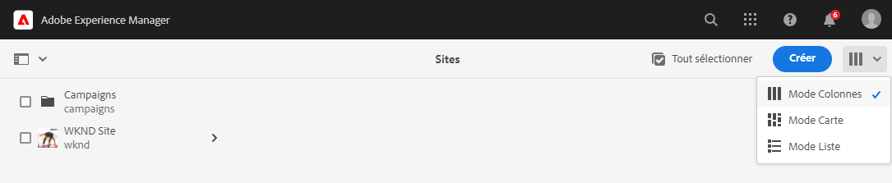
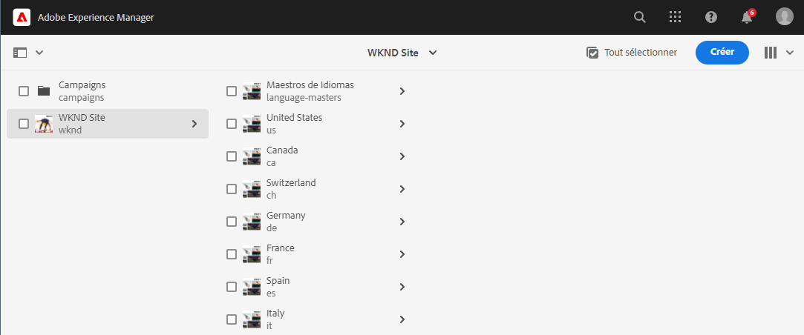
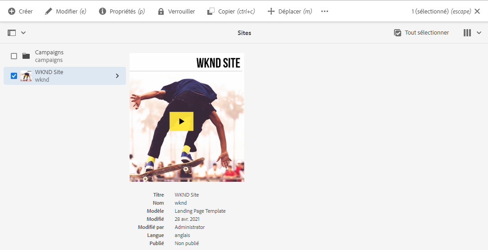
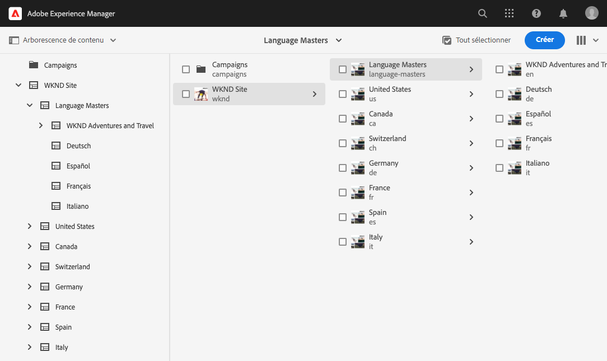
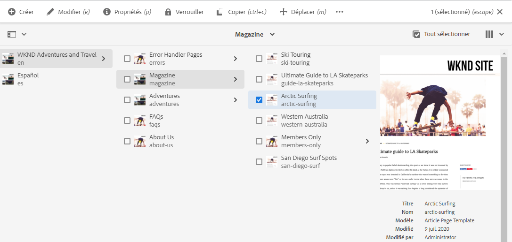
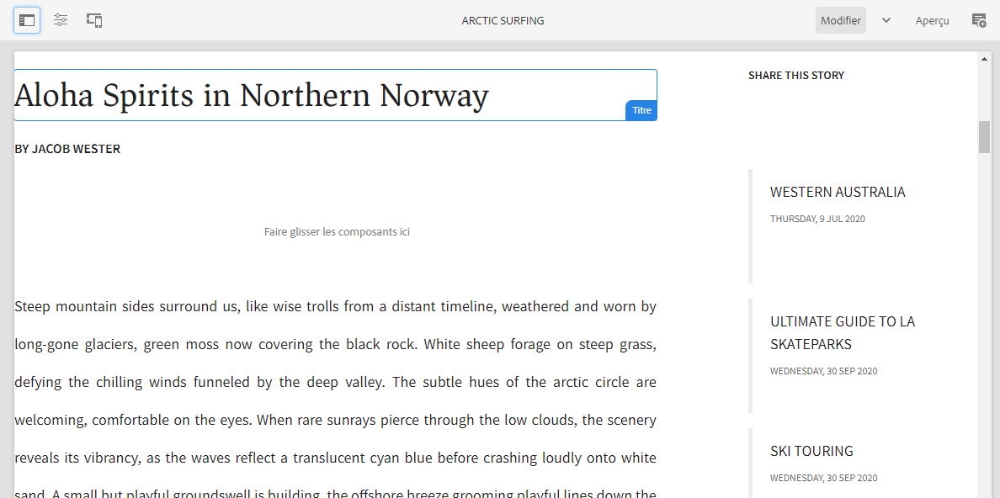

# Prise en main de la traduction dans AEM Sites {#getting-started}

Découvrez comment organiser votre contenu AEM Sites et comment fonctionnent les outils de traduction AEM.

## Un peu d’histoire... {#story-so-far}

Dans le document précédent du parcours de traduction AEM Sites, [Découvrir le contenu AEM Sites et comment traduire dans AEM](learn-about.md), vous avez appris les bases de la théorie d’AEM Sites et vous devriez maintenant :

* comprendre les concepts de base de la création de contenu AEM Sites ;
* être familiarisé avec la façon dont AEM prend en charge la traduction.

Cet article s’appuie sur ces principes de base afin que vous compreniez comment AEM stocke et gère le contenu et comment vous pouvez utiliser les outils de traduction AEM pour traduire ce contenu.

## Objectif {#objective}

Ce document vous aide à comprendre comment commencer à traduire le contenu d’un site dans AEM. Après l’avoir lu, vous devriez :

* comprendre l’importance de la structure de contenu pour la traduction ;
* comprendre comment AEM stocke le contenu ;
* être familiarisé avec les outils de traduction AEM.

## Exigences et conditions préalables {#requirements-prerequisites}

Un certain nombre d’exigences s’imposent avant de vous lancer dans la traduction de votre contenu AEM.

### Connaissances {#knowledge}

* Expérience de la traduction de contenu dans un CMS
* Expérience d’utilisation des fonctionnalités de base d’un CMS à grande échelle
* Connaissance pratique de la manipulation de base d’AEM
* Compréhension du service de traduction que vous utilisez
* Compréhension de base du contenu que vous traduisez

>[!TIP]
>
>Si vous n’êtes pas familier avec l’utilisation d’un CMS à grande échelle tel qu’AEM, pensez à consulter la documentation intitulée [Manipulation de base](/help/sites-cloud/authoring/basic-handling.md) avant de continuer. La documentation Manipulation de base ne fait pas partie du parcours. Par conséquent, revenez à cette page une fois l’opération terminée.

### Outils {#tools}

* Accès aux sandbox pour tester la traduction de votre contenu
* Informations d’identification pour vous connecter à votre service de traduction préféré
* Accréditation en tant que membre du groupe `project-administrators` dans AEM

## Stockage du contenu par AEM {#content-in-aem}

En tant que spécialiste de la traduction, il n’est pas nécessaire de comprendre en profondeur la manière dont AEM gère le contenu. Toutefois, il vous sera utile de connaître les concepts de base et la terminologie lorsque vous utiliserez les outils de traduction AEM. Plus important encore, vous devez comprendre votre propre contenu et sa structure pour pouvoir le traduire efficacement.

### La console Sites {#sites-console}

La console Sites fournit un aperçu de la structure de votre contenu, ce qui facilite la navigation dans votre contenu ainsi que sa gestion, en créant des pages, en déplaçant et en copiant des pages, ou encore en publiant du contenu.

Pour accéder à la console Sites, procédez comme suit :

1. Dans le menu de navigation globale, sélectionnez **Navigation** > **Sites**.
1. La console Sites s’ouvre au niveau supérieur de votre contenu.
1. Assurez-vous que le **Mode Colonnes** est sélectionné à l’aide du sélecteur d’affichage situé en haut à droite de la fenêtre.

   

1. Lorsque vous appuyez ou cliquez sur un élément d’une colonne, le contenu s’affiche en dessous dans la hiérarchie de la colonne située à droite.

   

1. Lorsque vous appuyez ou cliquez sur la case à cocher d’un élément dans une colonne, vous sélectionnez cet élément et affichez les détails de l’élément sélectionné dans la colonne de droite, ainsi que le nombre d’actions disponibles pour l’élément sélectionné dans la barre d’outils ci-dessus.

   

1. En appuyant ou en cliquant sur le sélecteur de rail en haut à gauche, vous pouvez également afficher l’**Arborescence de contenu** pour une présentation arborescente de votre contenu.

   

À l’aide de ces simples outils, vous pouvez parcourir intuitivement votre structure de contenu.

>[!NOTE]
>
>L’architecte de contenu définit normalement la structure de contenu tandis que les auteurs de contenu créent le contenu dans cette structure.
>
>En tant que spécialiste de la traduction, il est important de simplement comprendre comment naviguer dans cette structure et où se trouve le contenu.

### Éditeur de page {#page-editor}

La console Sites vous permet de parcourir votre contenu et offre un aperçu de sa structure. Pour afficher les détails d’une page, vous devez utiliser l’éditeur Sites.

Pour modifier votre page :

1. Utilisez la console Sites pour localiser et sélectionner une page. N’oubliez pas que vous devez appuyer ou cliquer sur la case à cocher d’une page pour la sélectionner.

   

1. Sélectionnez le bouton **Modifier** dans la barre d’outils.
1. L’éditeur Sites s’ouvre avec la page sélectionnée pour modification dans un nouvel onglet du navigateur.
1. Lorsque vous pointez ou appuyez sur le contenu, les sélecteurs s’affichent pour chaque composant. Les composants sont les blocs de création à glisser-déposer qui constituent la page.

   

Vous pouvez revenir à la console Sites en revenant à cet onglet dans votre navigateur à tout moment. L’éditeur Sites vous permet d’afficher rapidement le contenu de la page de la même manière que les auteurs de contenu et votre audience la verront.

>[!NOTE]
>
>Les auteurs de contenu créent le contenu de votre site à l’aide de l’éditeur Sites.
>
>En tant que spécialiste de la traduction, il est important de simplement comprendre comment visualiser le détail de ce contenu à l’aide de l’éditeur Sites.

## La structure est la clé {#content-structure}

Le contenu AEM est piloté par sa structure. AEM impose peu d’exigences à la structure de contenu, mais une prise en compte attentive de votre hiérarchie de contenu dans le cadre de la planification du projet peut rendre la traduction beaucoup plus simple.

>[!TIP]
>
>Prévoyez la traduction dès le début de votre projet AEM. Collaborez rapidement avec le chef de projet et les architectes de contenu.
>
>Il peut s’avérer nécessaire d’impliquer un gestionnaire de projets d’internationalisation en tant que personne distincte. Sa responsabilité consiste à définir les contenus à traduire et ceux qui ne doivent pas l’être, et les contenus traduits qui peuvent être modifiés par les producteurs de contenus régionaux ou locaux.

## Structure de contenu recommandée {#recommended-structure}

Comme recommandé précédemment, travaillez avec votre architecte de contenu pour déterminer la structure de contenu appropriée pour votre projet. Cependant, vous trouverez ci-dessous une structure éprouvée, simple et intuitive, tout en étant assez efficace.

Définissez un dossier de base pour votre projet, sous `/content`.

```text
/content/<your-project>
```

La langue dans laquelle votre contenu est créé est appelée racine de langue. Dans notre exemple, il s’agit de l’anglais, et il doit se trouver sous ce chemin.

```text
/content/<your-project>/en
```

Tout le contenu de projet qui pourrait être localisé doit être placé sous la racine de langue.

```text
/content/<your-project>/en/<your-project-content>
```

Les traductions doivent être créées dans des dossiers frères à côté de la racine de langue avec leur nom de dossier représentant le code de langue ISO-2 de la langue. Par exemple, l’allemand correspondrait au chemin suivant.

```text
/content/<your-project>/de
```

>[!NOTE]
>
>L’architecte de contenu est généralement chargé de créer ces dossiers de langue. Sans ces dossiers, AEM ne pourra pas créer ultérieurement de tâches de traduction.

La structure finale peut ressembler à ce qui suit.

```text
/content
    |- your-project
        |- en
            |- some
            |- exciting
            |- sites
            |- content
        |- de
        |- fr
        |- it
        |- ...
    |- another-project
    |- ...
```

Vous devez prendre note du chemin spécifique de votre contenu, car il sera ensuite nécessaire pour configurer votre traduction.

>[!NOTE]
>
>Il incombe généralement à l’architecte de contenu de définir la structure du contenu, souvent en collaboration avec le spécialiste de traduction.
>
>Cette structure est présentée ici pour plus de clarté.

## Outils de traduction AEM {#translation-tools}

Maintenant que vous comprenez comment fonctionnent la console et l’éditeur Sites et l’importance de la structure du contenu, nous pouvons examiner comment traduire le contenu. Les outils de traduction AEM sont puissants, mais faciles à comprendre dans l’ensemble.

* **Connecteur de traduction** : le connecteur représente le lien entre AEM et le service de traduction que vous utilisez.
* **Règles de traduction** : les règles définissent quel contenu doit être traduit en fonction de chemins spécifiques.
* **Projets de traduction** : les projets de traduction rassemblent le contenu qui doit être traité comme une tâche de traduction unique et consignent l’avancement de la traduction, interagissent avec le connecteur pour transmettre le contenu à traduire et le recevoir du service de traduction.

En règle générale, vous ne configurez votre connecteur qu’une seule fois pour votre instance, et les règles pour chaque projet. Ensuite, vous utilisez des projets de traduction pour traduire votre contenu et conserver ses traductions à jour en permanence.

## Et après ? {#what-is-next}

Maintenant que vous avez terminé cette partie du parcours de traduction découplée AEM Sites vous devriez :

* comprendre l’importance de la structure de contenu pour la traduction ;
* comprendre comment AEM stocke le contenu ;
* vous être familiarisé avec les outils de traduction AEM.

Tirez parti de ces connaissances et poursuivez votre parcours de traduction AEM Sites en consultant le document [Configuration du connecteur de traduction](configure-connector.md) où vous apprendrez à connecter AEM à un service de traduction.

## Ressources supplémentaires {#additional-resources}

Bien qu’il soit recommandé de passer à la partie suivante du parcours de traduction en examinant le document [Configuration du connecteur de traduction](configure-connector.md), vous trouverez ci-après quelques ressources facultatives supplémentaires pour approfondir un certain nombre de concepts mentionnés dans ce document, mais non obligatoires pour poursuivre le parcours.

* [Manipulation de base d’AEM](/help/sites-cloud/authoring/basic-handling.md) : découvrez les principes de base de l’interface utilisateur d’AEM pour pouvoir naviguer facilement et effectuer les tâches essentielles, comme celles vous permettant de trouver votre contenu.
* [Identification du contenu à traduire](/help/sites-cloud/administering/translation/rules.md) : découvrez comment les règles de traduction identifient le contenu à traduire.
* [Configuration du framework d’intégration de la traduction](/help/sites-cloud/administering/translation/integration-framework.md) : découvrez comment configurer le framework d’intégration de la traduction pour l’intégrer à des services de traduction tiers.
* [Gestion de projets de traduction](/help/sites-cloud/administering/translation/managing-projects.md) : découvrez comment créer et gérer des projets de traduction automatique et humaine dans AEM.
