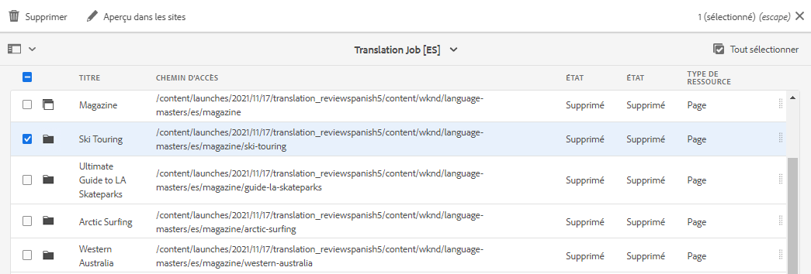
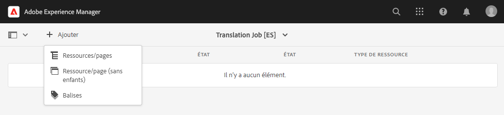

# Traduction du contenu {#translate-content}

Utilisez le connecteur et les règles de traduction pour traduire votre contenu.

## Un peu d’histoire... {#story-so-far}

Dans le document précédent du parcours de traduction AEM Sites, [Configuration des règles de traduction](translation-rules.md), vous avez appris à utiliser les règles de traduction AEM pour identifier votre contenu de traduction. Vous devriez maintenant comprendre les éléments suivants :

* comprendre ce que font les règles de traduction ;
* Comment définir vos propres règles de traduction

Maintenant que votre connecteur et vos règles de traduction sont configurés, cet article vous guide tout au long de l’étape suivante de la traduction de votre contenu AEM Sites.

## Objectif {#objective}

Ce document vous aide à comprendre comment utiliser les projets de traduction AEM ainsi que le connecteur et vos règles de traduction pour traduire le contenu. Après avoir lu ce document, vous devriez :

* comprendre ce qu’est un projet de traduction ;
* être capable de créer des projets de traduction ;
* savoir comment utiliser des projets de traduction pour traduire votre contenu AEM Sites.

## Création d’un projet de traduction {#creating-translation-project}

Les projets de traduction permettent de gérer la traduction du contenu d’AEM. Un projet de traduction rassemble le contenu à traduire dans un emplacement pour offrir une vue globale de la tâche de traduction.

Lorsque un contenu est ajouté à un projet de traduction, une tâche de traduction est alors créée. Les tâches comportent les commandes et les informations sur le statut utilisées pour gérer les processus de traduction humaine et automatique exécutés sur les ressources.

Les projets de traduction peuvent être créés de deux manières :

1. Sélectionnez la racine de la langue du contenu et configurez AEM afin qu’il crée automatiquement le projet de traduction en fonction du chemin du contenu.
1. Créez un projet vierge et sélectionnez manuellement le contenu à ajouter au projet de traduction.

Ces deux approches sont acceptables, le choix tiendra à l’identité de la personne responsable de la traduction :

* Le gestionnaire de projet de traduction a souvent besoin de plus de flexibilité et de sélectionner manuellement le contenu du projet de traduction.
* Si le propriétaire du contenu est également le responsable de la traduction, il est souvent plus facile de laisser AEM créer automatiquement le projet en fonction du chemin de contenu sélectionné.

Les deux approches sont explorées dans les sections suivantes.

### Création automatique d’un projet de traduction basé sur le chemin d’accès au contenu {#automatically-creating}

Pour les propriétaires de contenu qui sont également responsables de la traduction, il est souvent plus facile de laisser AEM créer automatiquement le projet de traduction. Pour permettre à AEM de créer automatiquement un projet de traduction en fonction de votre chemin d’accès au contenu :

1. Accédez à **Navigation** > **Sites** et sélectionnez votre projet.
1. Recherchez la racine de langue de votre projet. Par exemple, si la racine de langue est l’anglais, `/content/<your-project>/en`.
   * Avant la première traduction, les autres dossiers de langue sont des espaces réservés vides. Elles ont normalement été créées par l’architecte de contenu.
1. Recherchez la racine de langue de votre projet.
1. Sélectionnez le sélecteur de rail et affichez le **Références** du panneau.
1. **Sélectionner des copies de langue**.
1. Cochez l’option **Copies de langue**.
1. Développez la section **Mise à jour des copies de langue** en bas du panneau des références.
1. Dans le menu déroulant **Projet**, sélectionnez **Créer un ou plusieurs projets de traduction**.
1. Attribuez un titre approprié à votre projet de traduction.
1. Sélectionner **Mettre à jour**.


Vous recevez un message indiquant que le projet a été créé.

>[!NOTE]
>
>Nous partons du principe que la structure linguistique nécessaire pour les langues de traduction a déjà été créée dans le cadre de la [définition de votre structure de contenu](getting-started.md#content-structure). Cette définition doit être réalisée en collaboration avec l’architecte de contenu.
>
>Si les dossiers de langue ne sont pas créés à l’avance, vous ne pourrez pas créer de copies de langue comme décrit dans les étapes précédentes.

### Création manuelle d’un projet de traduction en sélectionnant votre contenu {#manually-creating}

Pour les gestionnaires de projets de traduction, il est souvent nécessaire de sélectionner manuellement un contenu spécifique à inclure dans un projet de traduction. Pour créer un projet de traduction manuel, vous devez commencer par créer un projet vierge, puis sélectionner le contenu à y ajouter.

1. Accédez à **Navigation** -> **Projets**.
1. Appuyez ou cliquez sur **Créer** -> **Dossier** pour créer un dossier pour vos projets.
   * Cette étape est facultative, mais elle est utile pour organiser vos efforts de traduction.
1. Dans la fenêtre **Créer un projet**, ajoutez un **Titre** pour le dossier, puis appuyez ou cliquez sur **Créer**.

   

1. Sélectionnez le dossier à ouvrir.
1. Dans le dossier du nouveau projet, sélectionnez **Créer** > **Projet**.
1. Les projets sont basés sur des modèles. Sélectionnez la variable **Projet de traduction** modèle pour le sélectionner, puis sélectionnez **Suivant**.

   

1. Dans l’onglet **De base**, saisissez un nom pour votre nouveau projet.

   

1. Dans l’onglet **Avancé**, utilisez le menu déroulant **Langue cible** pour sélectionner la ou les langues dans lesquelles votre contenu doit être traduit. Sélectionnez **Créer**.

   

1. Sélectionner **Ouvrir** dans la boîte de dialogue de confirmation.

   

Le projet a été créé, mais ne contient aucun contenu à traduire. La section suivante décrit la structure du projet et comment ajouter du contenu.

## Utilisation d’un projet de traduction {#using-translation-project}

Les projets de traduction sont conçus pour collecter en un seul endroit l’ensemble du contenu et des tâches liés à un effort de traduction afin de rendre votre traduction simple et facile à gérer.

Pour afficher le projet de traduction :

1. Accédez à **Navigation** -> **Projets**.
1. Appuyez ou cliquez sur le projet qui a été créé dans la section précédente (soit [Création automatique d’un projet de traduction basé sur le chemin d’accès au contenu](#automatically-creating), soit [Création manuelle d’un projet de traduction en sélectionnant votre contenu](#manually-creating), selon votre situation).


Le projet est divisé en plusieurs cartes.

* **Résumé** : cette carte affiche les informations d’en-tête de base du projet, parmi lesquelles le propriétaire, la langue et le fournisseur de traduction.
* **Tâche de traduction** : cette ou ces cartes présentent un aperçu de la tâche de traduction proprement dite, notamment son état, le nombre de ressources, etc. En règle générale, il existe un traitement par langue, avec le code de langue ISO-2 ajouté au nom du traitement.
   * Lors de la [création automatique de tâches de traduction](#automatically-creating), AEM crée les tâches de manière asynchrone et elles peuvent ne pas apparaître immédiatement dans le projet.
* **Équipe** : cette carte montre les utilisateurs qui collaborent à ce projet de traduction. Ce parcours ne couvre pas cette rubrique.
* **Tâches** : les tâches supplémentaires associées à la traduction du contenu, telles que les éléments à réaliser ou les éléments de workflow. Ce parcours ne couvre pas cette rubrique.

Pour mieux comprendre le flux de traduction dans AEM, il peut être utile d’opérer une modification des paramètres du projet. Cette étape n’est pas nécessaire pour les traductions de production, mais elle permet de comprendre le processus.

1. Dans la carte **Résumé**, appuyez ou cliquez sur le bouton représentant des points de suspension en bas de la carte.
1. Dans l’onglet **Avancé**, désélectionnez l’option **Supprimer le lancement après la promotion**.

   

1. Sélectionnez **Enregistrer et fermer**.

Vous êtes maintenant à utiliser votre projet de traduction. La manière dont vous utilisez un projet de traduction dépend de la manière dont il a été créé : soit automatiquement avec AEM, soit manuellement.

### Utilisation d’un projet de traduction créé automatiquement {#using-automatic-project}

Lors de la création automatique du projet de traduction, AEM évalue le contenu localisé selon le chemin que vous avez sélectionné, en fonction des règles de traduction que vous avez définies précédemment. Sur la base de cette évaluation, il extrait le contenu qui nécessite une traduction dans un nouveau projet de traduction.

Pour afficher le détail du contenu inclus dans ce projet :

1. Sélectionnez le bouton représentant des points de suspension en bas de la page **Tâche de traduction** carte.
1. La fenêtre **Tâche de traduction** répertorie tous les éléments de la tâche.

   

1. Appuyez ou cliquez sur une ligne pour afficher le détail de cette ligne, en gardant à l’esprit qu’une ligne peut représenter plusieurs éléments de contenu à traduire.
1. Appuyez ou cliquez sur la case à cocher de sélection d’un élément de ligne pour afficher d’autres options, telles que la possibilité de le supprimer de la tâche ou de l’afficher dans la console Sites.

   

En règle générale, le contenu de la tâche de traduction commence en statut **Version préliminaire** comme indiqué par la colonne **Statut** dans la fenêtre **Tâche de traduction**.

Pour démarrer la tâche de traduction, revenez à la présentation du projet de traduction et appuyez ou cliquez sur le bouton chevron en haut de la carte **Tâche de traduction** et sélectionnez **Démarrer**.


AEM communique maintenant avec votre configuration de traduction et votre connecteur pour envoyer le contenu au service de traduction. Vous pouvez afficher la progression de la traduction en revenant à la fenêtre **Tâche de traduction** et en affichant la colonne **Statut** des entrées.


Les traductions automatiques sont renvoyées automatiquement avec un statut **Approuvé**. La traduction humaine permet plus d’interaction, mais n’est pas comprise dans ce parcours.

>[!TIP]
>
>Le traitement d’une tâche de traduction peut prendre du temps et vous pouvez voir vos éléments de traduction passer par les statuts **Version préliminaire**, **Traduction en cours**, **Prêt pour la révision** avant d’arriver au statut **Approuvé**. Ce cheminement est à prévoir.

>[!NOTE]
>
>Si vous n’avez pas désactivé l’option de projet **Supprimer le lancement après la promotion** comme [décrit dans la section précédente](#using-translation-project), les éléments traduits ont le statut **Supprimé**. Il s’agit d’un comportement normal, car AEM ignore automatiquement les enregistrements de traduction une fois les éléments traduits arrivés. Les éléments traduits ont été importés en tant que copies de langue, seuls les enregistrements de traduction ont été supprimés, car ils ne sont plus nécessaires.
>
>Ne vous inquiétez pas si ce n’est pas clair. Ces informations détaillées sur le fonctionnement d’AEM n’affecteront pas votre compréhension globale du parcours. Si vous souhaitez approfondir la façon dont AEM traite les traductions, reportez-vous à la section [ressources supplémentaires](#additional-resources) à la fin de cet article.

### Utilisation d’un projet de traduction créé manuellement {#using-manual-project}

Lors de la création manuelle d’un projet de traduction, AEM crée les tâches nécessaires, mais ne sélectionne pas automatiquement le contenu à inclure dans ces tâches. Cela permet au chef de projet de traduction de choisir le contenu à traduire.

Pour ajouter du contenu à une tâche de traduction :

1. Appuyez ou cliquez sur le bouton représentant des points de suspension en bas de l’une des cartes **Tâche de traduction**.
1. Vérifiez que la tâche ne contient aucun contenu. Appuyez ou cliquez sur le bouton **Ajouter** en haut de la fenêtre, puis sur **Ressources/Pages** dans la liste déroulante.

   

1. Un navigateur de chemins d’accès s’ouvre, vous permettant de sélectionner spécifiquement le contenu à ajouter. Recherchez votre contenu et sélectionnez-le.

   

1. Appuyez ou cliquez sur **Sélectionner** pour ajouter le contenu sélectionné à la tâche.
1. Dans la boîte de dialogue **Traduire**, indiquez que vous souhaitez **Créer une copie de langue**.

   

1. Le contenu est désormais inclus dans la tâche.

   

1. Appuyez ou cliquez sur la case à cocher de sélection d’un élément de ligne pour afficher d’autres options, telles que la possibilité de le supprimer de la tâche ou de l’afficher dans la console Sites.

   

1. Répétez ces étapes pour inclure tout le contenu requis dans la tâche.

>[!TIP]
>
>L’explorateur de chemins d’accès est un outil puissant qui vous permet de rechercher, de filtrer et de parcourir votre contenu. Appuyez ou cliquez sur le bouton **Contenu uniquement/Filtres** pour activer ou désactiver le panneau latéral et afficher les filtres avancés tels que la **Date de modification** ou le **Statut de la traduction**.
>
>Pour en savoir plus sur l’explorateur de chemins d’accès, consultez la [section des ressources supplémentaires](#additional-resources).

Vous pouvez utiliser les étapes précédentes pour ajouter le contenu nécessaire à toutes les langues (tâches) du projet. Une fois que vous avez sélectionné tout le contenu, vous pouvez commencer la traduction.

En règle générale, le contenu de la tâche de traduction commence en statut **Version préliminaire** comme indiqué par la colonne **Statut** dans la fenêtre **Tâche de traduction**.

Pour démarrer la tâche de traduction, revenez à la présentation du projet de traduction et appuyez ou cliquez sur le bouton chevron en haut de la carte **Tâche de traduction** et sélectionnez **Démarrer**.


AEM communique maintenant avec votre configuration de traduction et votre connecteur pour envoyer le contenu au service de traduction. Vous pouvez afficher la progression de la traduction en revenant à la fenêtre **Tâche de traduction** et en affichant la colonne **Statut** des entrées.


Les traductions automatiques sont renvoyées automatiquement avec un statut **Approuvé**. La traduction humaine permet plus d’interaction, mais n’est pas comprise dans ce parcours.

>[!TIP]
>
>Le traitement d’une tâche de traduction peut prendre du temps et vous pouvez voir vos éléments de traduction passer par les statuts **Version préliminaire**, **Traduction en cours**, **Prêt pour la révision** avant d’arriver au statut **Approuvé**. Ce cheminement est à prévoir.

>[!NOTE]
>
>Si vous n’avez pas désactivé l’option de projet **Supprimer le lancement après la promotion** comme [décrit dans la section précédente](#using-translation-project), les éléments traduits ont le statut **Supprimé**. Il s’agit d’un comportement normal, car AEM ignore automatiquement les enregistrements de traduction une fois les éléments traduits arrivés. Les éléments traduits ont été importés en tant que copies de langue, seuls les enregistrements de traduction ont été supprimés, car ils ne sont plus nécessaires.
>
>Ne vous inquiétez pas si ce n’est pas clair. Ces informations détaillées sur le fonctionnement d’AEM n’affecteront pas votre compréhension globale du parcours. Si vous souhaitez approfondir la façon dont AEM traite les traductions, reportez-vous à la section [ressources supplémentaires](#additional-resources) à la fin de cet article.

## Vérification du contenu traduit {#reviewing}

[Comme nous l’avons vu précédemment](#using-translation-project), le contenu traduit automatiquement revient dans AEM avec le statut **Approuvé**, en partant de l’hypothèse que la traduction automatique étant utilisée, aucune intervention humaine n’est nécessaire. Cependant, il est bien sûr toujours possible de consulter le contenu traduit.

Il vous suffit d’accéder à la tâche de traduction terminée et de sélectionner un élément de ligne en appuyant ou en cliquant sur la case à cocher. L’icône **Aperçu dans les sites** s’affiche dans la barre d’outils.


Appuyez ou cliquez sur cette icône pour ouvrir le contenu traduit dans sa console afin d’afficher les détails du contenu traduit.


Vous pouvez continuer à modifier le contenu traduit si nécessaire, sous réserve que vous disposiez des autorisations appropriées, mais la modification du contenu ne relève pas de ce parcours. Consultez la section [Ressources supplémentaires](#additional-resources) à la fin de ce document pour plus d’informations sur cette rubrique.

Le but du projet est de collecter toutes les ressources liées à une traduction en un seul endroit pour un accès facile et un aperçu clair. Cependant, comme vous pouvez le voir en affichant les détails d’un élément traduit, les traductions sont elles-mêmes renvoyées dans le dossier des sites de la langue de traduction. Dans cet exemple, le dossier est

```text
/content/<your-project>/es
```

Si vous accédez à ce dossier via **Navigation** -> **Sites**, le contenu traduit s’affiche.


La structure de traduction d’AEM reçoit les traductions du connecteur de traduction, puis crée automatiquement la structure de contenu en fonction de la racine de langue et à l’aide des traductions fournies par le connecteur.

Il est important de comprendre que ce contenu n’est pas publié et n’est donc pas prêt à être utilisé. Nous découvrirons cette structure de création et de publication et découvrirons comment publier notre contenu traduit à l’étape suivante du parcours de traduction.

## Traduction humaine {#human-translation}

Si votre service de traduction fournit une traduction humaine, le processus de révision offre d’autres options. Par exemple, les traductions reviennent dans le projet en statut **Version préliminaire** et doivent être examinés et approuvés ou rejetés manuellement.

La traduction humaine dépasse le cadre de ce parcours de localisation. Consultez la section [Ressources supplémentaires](#additional-resources) à la fin de ce document pour plus d’informations sur cette rubrique. Au-delà des autres options de validation, le workflow de la traduction humaine est le même que celui des traductions automatiques, comme décrit dans ce parcours.

## Prochaines étapes {#what-is-next}

Maintenant que vous avez terminé cette partie du parcours de traduction découplée AEM Sites vous devriez :

* comprendre ce qu’est un projet de traduction ;
* être capable de créer des projets de traduction ;
* savoir comment utiliser des projets de traduction pour traduire votre contenu.

Appuyez-vous sur ces connaissances pour poursuivre votre parcours de traduction AEM Sites en consultant le document [Publication du contenu traduit](publish-content.md), dans lequel vous apprendrez à publier votre contenu traduit et à mettre à jour ces traductions à mesure que votre contenu racine de langue change.

## Ressources supplémentaires {#additional-resources}

Bien qu’il soit recommandé de passer à la partie suivante du parcours de traduction en consultant le document [Publication du contenu traduit](publish-content.md), vous trouverez ci-après quelques ressources facultatives supplémentaires pour approfondir un certain nombre de concepts mentionnés dans ce document, bien qu’ils ne soient pas obligatoires pour poursuivre le parcours.

* [Gestion des projets de traduction](/help/sites-cloud/administering/translation/managing-projects.md) – Découvrez les détails des projets de traduction et des fonctionnalités supplémentaires telles que les processus de traduction humaine et les projets multilingues.
* [Environnements et outils de création](/help/sites-cloud/authoring/path-selection.md#path-selection) – AEM fournit divers mécanismes d’organisation et de modification de votre contenu, notamment un puissant navigateur de chemins d’accès.
