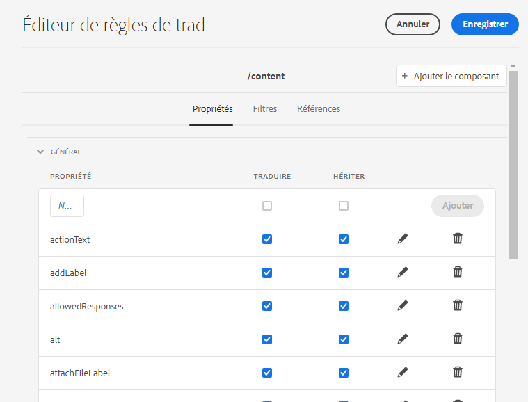

# Configuration des règles de traduction {#configure-translation-rules}

Découvrez comment définir des règles de traduction pour identifier le contenu à traduire.

## Un peu d’histoire...  {#story-so-far}

Dans le document précédent du parcours de traduction AEM Sites, intitulé [Configuration du connecteur de traduction](configure-connector.md), vous avez appris à installer et à configurer votre connecteur de traduction et vous devez maintenant :

* connaître les paramètres importants de la structure d’intégration de traduction dans AEM ;
* savoir configurer votre propre connexion à votre service de traduction.

Maintenant que votre connecteur est configuré, cet article vous guide tout au long de l’étape suivante pour identifier le contenu à traduire.

## Objectif {#objective}

Ce document vous aide à comprendre comment utiliser les règles de traduction d’AEM pour identifier votre contenu de traduction. Après avoir lu ce document, vous devriez :

* comprendre ce que font les règles de traduction ;
* être capable de définir vos propres règles de traduction.

## Règles de traduction {#translation-rules}

Les pages AEM Sites peuvent contenir de nombreuses informations. Selon les besoins de votre projet, il est probable que toutes les informations d’une page n’aient pas besoin d’être traduits.

Les règles de traduction identifient le contenu à inclure dans les projets de traduction ou à exclure. Lorsque le contenu est traduit, AEM extrait ou récupère le contenu en fonction de ces règles. Ainsi, seul le contenu à traduire est envoyé au service de traduction.

Les règles de traduction comprennent les informations suivantes :

* Le chemin d’accès au contenu auquel la règle s’applique
   * La règle s’applique également aux descendants du contenu
* Les noms des propriétés contenant le contenu à traduire
   * Cette propriété peut être spécifique à un type de ressource en particulier ou à tous les types de ressource

AEM crée automatiquement des règles de traduction pour les pages de sites. Toutefois, comme les exigences de chaque projet sont différentes, il est important de savoir comment réviser et adapter ces règles en fonction des besoins de votre projet.

## Création de règles de traduction {#creating-rules}

Plusieurs règles peuvent être créées pour prendre en charge des exigences de traduction complexes. Par exemple, un projet sur lequel vous travaillez peut nécessiter la traduction de toutes les informations de page, tandis que pour un autre, seuls les champs de description doivent être traduits, tandis que les titres ne sont pas traduits.

Les règles de traduction sont conçues pour gérer ces scénarios. Cependant, dans cet exemple, nous illustrons comment créer des règles en se concentrant sur une configuration simple et unique.

Il existe une console **Configuration de traduction** disponible pour la configuration des règles de traduction.

Pour y accéder :

1. Accédez à **Outils** -> **Général**.
1. Sélectionnez **Configuration de traduction**.

AEM crée automatiquement des règles de traduction pour tout le contenu. Pour afficher ces règles :

1. Sélectionnez la variable `/content` contexte.
1. Dans la barre d’outils, sélectionnez **Modifier**.
1. L’éditeur de règles de traduction s’ouvre avec les règles créées automatiquement par AEM pour le chemin d’accès `/content`.

   

1. Les propriétés de page qui sont traduites se trouvent dans la section **Général** de la liste. Vous pouvez ajouter ou mettre à jour des noms de propriété existants que vous souhaitez inclure explicitement dans la traduction.
   1. Dans le **Nouvelle propriété** , saisissez le nom de la propriété. Les options **Traduire** et **Hériter** sont cochées automatiquement.
   1. Sélectionnez **Ajouter**.
   1. Répétez ces étapes pour tous les champs que vous devez traduire.
   1. Sélectionnez **Enregistrer**.

Vous avez maintenant configuré vos règles de traduction.

>[!NOTE]
>
>AEM crée automatiquement des règles de traduction. Pour une simple configuration de traduction ou pour tester un workflow de traduction, il n’est pas nécessaire de créer de nouvelles règles, ni même de modifier les règles existantes créées automatiquement. Les détails de ces étapes sont présentés pour expliquer le fonctionnement des règles et donner un contexte à la manière dont AEM traite les traductions.

>[!TIP]
>
>Il est également possible de créer des règles uniquement pour votre chemin ou votre projet spécifique en appuyant ou en cliquant sur le bouton **Ajouter un contexte** dans la console de Configuration de traduction. Cette possibilité dépasse le cadre de ce parcours.

## Utilisation avancée {#advanced-usage}

Plusieurs propriétés supplémentaires peuvent être configurées dans le cadre de vos règles de traduction. En outre, vous pouvez spécifier vos règles manuellement au format XML, ce qui vous permet d’obtenir plus de précision et de flexibilité.

Ces fonctionnalités ne sont généralement pas nécessaires pour commencer à localiser votre contenu mais vous pouvez en apprendre plus à ce sujet dans la section [Ressources supplémentaires](#additional-resources), si vous êtes intéressé.

## Et après ? {#what-is-next}

Maintenant que vous avez terminé cette partie du parcours de traduction découplée AEM Sites vous devriez :

* comprendre ce que font les règles de traduction ;
* être capable de définir vos propres règles de traduction.

Tirez parti de ces connaissances et continuez à progresser sur votre parcours de traduction AEM Sites en consultant le document [Traduire le contenu](translate-content.md), dans lequel vous découvrirez comment votre connecteur et vos règles s’associent pour traduire du contenu.

## Ressources supplémentaires {#additional-resources}

Bien qu’il soit recommandé de passer à la partie suivante du parcours de traduction en examinant le document [Traduire le contenu](translate-content.md), vous trouverez ci-après quelques ressources facultatives supplémentaires pour approfondir un certain nombre de concepts mentionnés dans ce document, mais non obligatoires pour poursuivre sur le parcours.

* [Identification du contenu à traduire](/help/sites-cloud/administering/translation/rules.md) – Découvrez comment les règles de traduction identifient le contenu à traduire.
