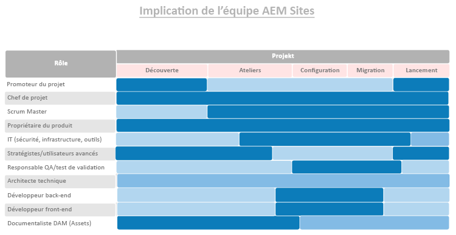

# **Tout d&#39;abord, il faut que les bonnes personnes jouent les bons rôles.**

>[!CONTEXTUALHELP]
>id="aemcloud_chooseteam"
>title="Choisir la bonne équipe"
>abstract="Placer les bonnes personnes dans les bons emplois pour aider à la réussite de votre déploiement Adobe Experience Manager."
>additional-url="https://experienceleague.adobe.com/docs/experience-manager-cloud-service/onboarding/best-practices/aligning-kpis.html?lang=en" text="Alignement des indicateurs de performance clés"
>additional-url="https://experienceleague.adobe.com/docs/experience-manager-cloud-service/onboarding/best-practices/assessing-kpis.html?lang=en" text="Évaluation des IPC"

Il y a des chances que dans votre organisation, plusieurs départements possèdent différents aspects de l&#39;expérience numérique. Sans gouvernance, le moment est propice à un débat sans fin, à des querelles intestines et à la confusion.

Débuts de gouvernance numérique pour déterminer qui est responsable de quoi et qui fait quel travail centré sur le numérique. Vous devrez peut-être embaucher de façon stratégique pour ajouter les compétences nécessaires. Un autre défi encore plus important est d&#39;opérer un changement de culture — en construisant un large soutien pour la nouvelle technologie et en aidant les gens à s&#39;habituer à de nouvelles façons de faire les choses. Un élément clé de cet effort est la création d&#39;une communauté numérique, qui permet aux gens d&#39;apprendre les uns des autres et de s&#39;entraider.

Pour l&#39;instant, nous nous concentrerons sur la mise à disposition des personnes appropriées dans les emplois appropriés pour vous aider à piloter votre déploiement Adobe Experience Manager. Pour chaque produit de base — sites Experience Manager et ressources Experience Manager — nous avons fourni une liste de rôles que vous devrez remplir, ainsi que les compétences, les niveaux d&#39;expertise et les attributs qui rendent les gens efficaces dans les divers rôles.

Votre tâche cette semaine consiste à examiner les deux listes avec votre équipe de mise en oeuvre et à vous assurer que vous disposez de personnes possédant les qualifications appropriées dans chaque rôle.

## **Rôles clés des sites Experience Manager AEM**

Une équipe gagnante a besoin de neuf personnes sur les bons sièges — tout comme votre équipe de déploiement. Votre réussite avec Adobe Experience Manager Sites dépend de la force des membres de votre équipe et de leur capacité à travailler ensemble. Assurez-vous que ces neuf rôles sont attribués.
aux personnes ayant les qualifications suggérées.

| Rôle | Compétences | Niveau de capacité | Qualités |
|--- |--- |--- |--- |
| Chef de projet | Certification PMP, certification Agile, expérience de gestion des risques | Expert | Juste, cohérent, responsable, organisé, positif, approchable, prêt à accepter le changement |
| Principal de défilement | Certification ScrumMaster, certification Agile, expérience de facilitation | Expert | Cohérent, créatifs |
| Propriétaire du produit | Certification Agile, compréhension approfondie des besoins commerciaux | Expert | Équilibré, confiant |
| Les technologies de l&#39;information mènent à la sécurité, à l&#39;infrastructure, aux outils | Certification CISM, certification Adobe Experience Manager Component Developer | Expert | Orienté vers les détails |
| Stratégies/Utilisateurs puissants | Compétence en Adobe Experience Manager Sites | Novice to Expert | Tenace, curieuse, minutieuse, ouverte d&#39;esprit, prête à accepter le changement, la collaboration |
| Directeur QA/UAT | Certification Agile, compréhension du SDLC | Novice à Intermédiaire | Orienté vers les détails, lecteur de processus, cohérent |
| Architecte technique | Expérience en infrastructure informatique | Expert | Axé sur les détails, axé sur les processus, cohérent |
| Développeur principal | Certification Agile, expérience en programmation informatique et en informatique | Novice à Intermédiaire | Axé sur les détails, axé sur les processus, cohérent |
| Développeur principal | Certification pratique, compréhension du langage HTML, CSS et JavaScript | Novice à Intermédiaire | Axé sur les détails, axé sur les processus, cohérent |

Maintenant que vous savez quels rôles sont requis, consultez le graphique ci-dessous pour savoir quand chaque rôle entre en jeu dans le processus de mise en oeuvre.

 

**Examinez cette liste avec votre** équipe de mise en oeuvre et assurez-vous que chaque rôle comporte des personnes possédant les qualifications requises. Les membres de l&#39;équipe qui connaissent moins bien Adobe Experience Cloud peuvent utiliser [Experience League](https://experienceleague.adobe.com/#recommended/solutions/experience-manager) ressources d&#39;apprentissage pour obtenir leur certification par le biais de [Adobe Digital Learning](https://learning.adobe.com/certification.html).

## **Rôles clés des ressources Experience Manager AEM**

De Architecte à ScrumMaster, chaque rôle dans cette équipe est indispensable — y compris le bibliothécaire de la gestion des actifs numériques.

Vous disposez peut-être déjà de la plupart des personnes dont vous avez besoin pour exécuter une mise en oeuvre Adobe Experience Manager Assets réussie. Cette liste est similaire à celle de Adobe Experience Manager Sites, avec un ajout important : vous aurez besoin d’un bibliothécaire pour vous assurer que vos ressources numériques sont organisées et étiquetées de façon à les rendre faciles à trouver.

| Rôle | Compétences | Niveau de capacité | Qualités |
|--- |--- |--- |--- |
| Chef de projet | Certification PMP, certification Agile, expérience de gestion des risques | Expert | Juste, cohérent, responsable, organisé, positif, approchable, prêt à accepter le changement |
| Principal de défilement | Certification ScrumMaster, certification Agile, expérience de facilitation | Expert | Cohérent, créatifs |
| Propriétaire du produit | Certification Agile, compréhension approfondie des besoins commerciaux | Expert | Équilibré, confiant |
| Les technologies de l&#39;information mènent à la sécurité, à l&#39;infrastructure, aux outils | Certification CISM, certification Adobe Experience Manager Component Developer | Expert | Orienté vers les détails |
| Stratégies/Utilisateurs puissants | Compétence en Adobe Experience Manager Sites | Novice to Expert | Tenace, curieuse, minutieuse, ouverte d&#39;esprit, prête à accepter le changement, la collaboration |
| Directeur QA/UAT | Certification Agile, compréhension du SDLC | Novice à Intermédiaire | Orienté vers les détails, lecteur de processus, cohérent |
| Architecte technique | Expérience en infrastructure informatique | Expert | Axé sur les détails, axé sur les processus, cohérent |
| Développeur principal | Certification Agile, expérience en programmation informatique et en informatique | Novice à Intermédiaire | Axé sur les détails, axé sur les processus, cohérent |
| Développeur principal | Certification pratique, compréhension du langage HTML, CSS et JavaScript | Novice à Intermédiaire | Axé sur les détails, axé sur les processus, cohérent |
| Bibliothèque DAM | Formation et diplôme en sciences de la bibliothèque | Expert | Orienté vers le détail, piloté par les processus, organisé |

Maintenant que vous savez quels rôles sont requis, consultez le graphique ci-dessous pour savoir quand chaque rôle entre en jeu dans le processus de mise en oeuvre.

 

>[!TIP]
>
> En savoir plus sur Adobe Experience Cloud et exploiter les ressources sur [Experience League](https://experienceleague.adobe.com/#recommended/solutions/experience-manager) et obtenir une certification par [Adobe Digital Learning](https://learning.adobe.com/certification.html).