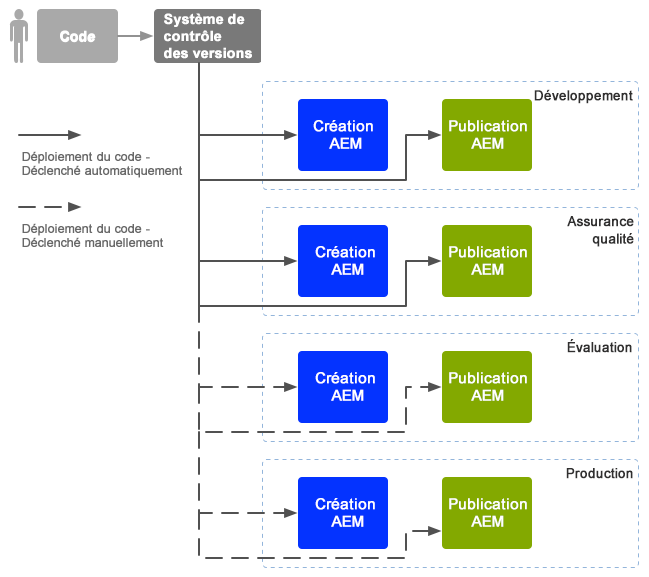
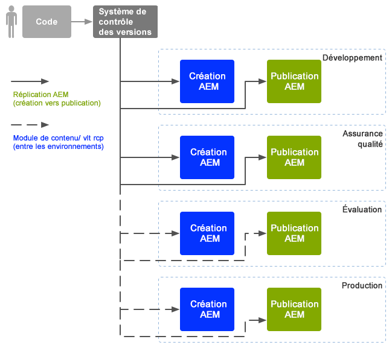

# Opérations de développement d’entreprise{#enterprise-devops}

Les opérations de développement couvrent les processus, les méthodes et les communications requis pour :

* simplifier le déploiement de votre logiciel sur les différents environnements ;
* simplifier la collaboration entre les équipes de développement, de test et de déploiement.

Les opérations de développement visent à éviter les problèmes tels que :

* les erreurs manuelles ;
* les éléments oubliés, par exemple, des fichiers ou des détails de configuration ;
* les incohérences, par exemple, entre l’environnement local d’un développeur et d’autres environnements.

## Environnements {#environments}

Adobe Experience Manager (AEM) en tant que service Cloud se compose généralement de plusieurs environnements, utilisés à des fins différentes à différents niveaux :

* [Développement](#development)
* [Assurance qualité](#quality-assurance)
* [Intermédiaire](#staging)
* [Production](#production-author-and-publish)

>[!NOTE]
>
>L’environnement de production doit avoir au moins un environnement de création et un environnement de publication.
>
>Il est recommandé que tous les autres environnements se composent également d’un environnement de création et de publication afin de refléter l’environnement de production et de permettre des tests à des phases précoces du projet.

### Développement {#development}

Les développeurs sont chargés de développer et de personnaliser le projet proposé (qu’il s’agisse d’un site web, d’applications mobiles, d’une mise en œuvre de gestion des actifs numériques, etc.) avec toutes les fonctionnalités nécessaires. Ils :

* développent et personnalisent les éléments nécessaires, par exemple, les modèles, les composants, les workflows et les applications ;
* réaliser la conception
* développer les services et les scripts nécessaires à la mise en oeuvre des fonctionnalités requises ;

La configuration de l’environnement de [développement](/help/implementing/developing/introduction/development-guidelines.md) peut dépendre de nombreux facteurs, bien qu’elle soit généralement composée des éléments suivants :

* Un système de développement intégré avec contrôle de version pour fournir une base de code intégrée. Il est utilisé pour fusionner et consolider le code des différents environnements de développement utilisés par chaque développeur.
* Un environnement personnel pour chaque développeur, résidant habituellement sur son ordinateur local. À des intervalles appropriés, le code est synchronisé avec le système de contrôle de version.

Selon l’échelle de votre système, l’environnement de développement peut comprendre une instance de création et une instance de publication.

### Assurance qualité {#quality-assurance}

Cet environnement est utilisé par l&#39;équipe d&#39;assurance de la qualité pour tester votre nouveau système de manière approfondie ; conception et fonction. Il devrait comprendre des environnements de création et de publication, avec le contenu approprié, et fournir tous les services nécessaires pour réaliser une suite complète de tests.

### Intermédiaire {#staging}

L’environnement intermédiaire doit être un miroir de l’environnement de production, en matière de configuration, de code et de contenu :

* Il permet de tester les scripts utilisés pour mettre en œuvre le déploiement.
* Il peut servir pour les tests finaux (de conception, des fonctionnalités et des interfaces) avant le déploiement sur les environnements de production.
* L’environnement intermédiaire ne peut pas toujours être identique à l’environnement de production ; toutefois, il doit s’en rapprocher le plus possible afin de permettre les tests de performance et de charge.

### Production : création et publication {#production-author-and-publish}

The production environment consists of the environments needed to actually [author and publish](/help/sites-cloud/authoring/getting-started/concepts.md) your implementation.

Un environnement de production comprend au moins une instance d’auteur et une instance de publication :

* Une instance de [création](#author) pour la saisie du contenu.
* A [publish](#publish) instance for content made available to your visitors/users.

En fonction de l’échelle du projet, il se compose bien souvent de plusieurs instances de création et/ou de publication. À un niveau inférieur, le référentiel peut également être mis en grappe sur plusieurs instances.

#### Création {#author}

Les instances de création sont généralement situées derrière le pare-feu interne. Il s’agit de l’environnement dans lequel vos collègues et vous-même effectuez les tâches de création, telles que :

* Administration du système
* Saisie du contenu
* Configuration de la mise en page et conception du contenu
* Activation du contenu dans l’environnement de publication

Le contenu qui a été activé est regroupé en module et placé dans la file d’attente de réplication de l’environnement de création. Le processus de réplication transporte alors ce contenu vers l’environnement de publication.

De façon à répliquer à l’inverse les données dans un environnement de publication vers l’environnement de création, un écouteur de réplication dans l’environnement de création interroge l’environnement de publication et récupère le contenu dans la boîte d’envoi de la réplication inverse de l’environnement de publication.

#### Publication {#publish}

L’environnement de publication est généralement situé dans la zone démilitarisée (DMZ). Il s’agit de l’environnement dans lequel les visiteurs accèdent à votre contenu (par exemple, par le biais d’un site web ou sous forme d’application mobile) et interagissent avec lui, qu’il soit public ou se trouve sur votre réseau intranet. Un environnement de publication :

* présente du contenu répliqué à partir de l’environnement de création ;
* met ce contenu à la disposition des visiteurs ;
* stocke les données utilisateur générées par vos visiteurs, telles que les commentaires ou les autres soumissions de formulaires ;
* peut être configuré pour ajouter ces données utilisateur à une boîte d’envoi pour la réplication inverse vers l’environnement de création.

L’environnement de publication génère du contenu de manière dynamique et en temps réel, et le contenu peut être personnalisé pour chaque utilisateur.

## Mouvement de code {#code-movement}

Le code doit toujours être propagé du bas vers le haut :

* Le code est développé initialement dans l’environnement de développement local puis dans les environnements de développement intégrés.
* Par la suite, il fait l’objet d’un test complet dans le ou les environnements d’assurance qualité.
* Il est ensuite testé dans les environnements intermédiaires.
* alors seulement, le code doit être déployé sur les environnements de production

Le code (par exemple, les fonctionnalités d’applications web et les modèles de conception personnalisés) est généralement transféré en exportant et en important des modules entre les différents référentiels de contenu. Le cas échéant, cette réplication peut être configurée en tant que processus automatique.

Les projets AEM as a Cloud Service déclenchent souvent le déploiement du code :

* Automatiquement : pour le transfert vers les environnements de développement et d’assurance qualité.
* Manuellement : les déploiements sur les environnements intermédiaires et de production sont effectués de manière plus contrôlée, souvent manuelle ; l’automatisation reste toutefois possible si nécessaire.

## Déplacement de contenu {#content-movement}

Le contenu conçu pour la production doit **toujours** être créé sur l’instance de création de production.

Le contenu ne doit pas suivre le déplacement du code des environnements inférieurs vers les plus élevés. Il n’est en effet pas recommandé de créer du contenu sur des ordinateurs locaux ou des environnements inférieurs, puis de le déplacer vers l’environnement de production, car cela peut introduire des erreurs et des incohérences.

Le contenu de production doit être déplacé à partir de l’environnement de production vers l’environnement intermédiaire pour assurer que l’environnement intermédiaire fournit un environnement de test efficace et précis.

>[!NOTE]
>
>Cela ne signifie pas que le contenu intermédiaire doit être continuellement synchronisé avec la production, les mises à jour régulières étant suffisantes, sauf avant de tester une nouvelle itération de code. Il n’est pas nécessaire de mettre à jour le contenu des environnements d’assurance qualité et de développement aussi fréquemment ; il doit simplement bien représenter le contenu de production.

Le contenu peut être transféré :

* entre les différents environnements, en exportant et en important des modules ;
* Entre différentes instances - en répliquant directement (AEM en tant que réplication du service Cloud) le contenu (en utilisant une connexion HTTP ou HTTPS).

