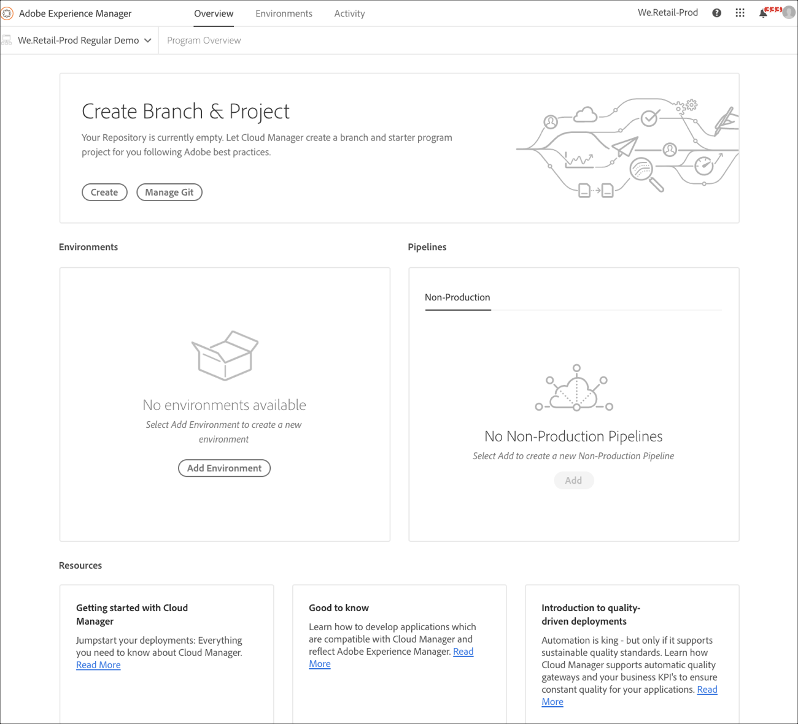

# Création d’un programme {#create-a-program}

La solution native de cloud fournit à l’utilisateur les autorisations requises et la capacité de créer un sur un modèle en libre-service.

Un assistant de création de  demande à l’utilisateur d’envoyer des détails, en fonction de l’objectif de l’utilisateur lors de la création du  dans les limites de ce qui est disponible pour le client ou l’organisation spécifique.

Dans le d’accès initial à Cloud Manager ou s’il n’existe aucun  de dans le client, l’utilisateur verra **Créer votre premier écran de** . Si l’utilisateur sélectionne *Echap* ou clique en dehors de la boîte de dialogue, l’écran suivant s’affiche :

## Utilisation de l’assistant de création de {#using-create-program-wizard}

En fonction de l’objectif de l’utilisateur lors de la création du  de dans les limites de ce qui est disponible pour le client/l’organisation spécifique, un assistant de création de demandera à l’utilisateur d’envoyer un ou plusieurs détails.

>[!NOTE]
>If a program already exists, then you will see **Add Program** on the top right of the landing page, as shown in the figure below.

## Création d’un de démonstration {#create-demo-program}

>[!NOTE]
>Un  de démonstration est analogue à un de sandbox  dans l’interface utilisateur de Cloud Manager.

Pour créer un de sandbox, procédez comme suit :

1. Dans l’assistant de création de  de, sélectionnez **Configurer une démonstration**. L’utilisateur envoie  nom du avant de sélectionner **Créer**.

   

1. L’utilisateur verra la nouvelle carte de sandbox sur l’ et peut la survoler pour sélectionner l’icône Cloud Manager et accéder à la page d’aperçu de Cloud Manager. La carte informera l’utilisateur de l’état de la configuration automatique du nouveau de sandbox. L’utilisateur verra la progression.

   

1. Une fois le  configuré et l’étape de création du projet terminée, l’utilisateur peut accéder au lien **Gérer Git** , comme illustré dans la figure ci-dessous :

   

   >[!NOTE]
   >
   >Pour en savoir plus sur l’accès et la gestion de votre référentiel Git à l’aide de la gestion de compte Git en libre-service à partir de l’interface utilisateur de Cloud Manager, voir [Accès à Git](/help/implementing/cloud-manager/accessing-git.md).

1. Une fois le  de développement  créé, l’utilisateur peut **accéder au lien AEM** , comme illustré dans la figure ci-dessous :

   

1. Une fois le déploiement du canal de non-production vers le développement terminé, l’assistant guide l’utilisateur à accéder à AEM (en cours de développement) ou à déployer du code  développement  les :

   

   >[!NOTE]
   >Vous pouvez également modifier, changer ou ajouter un  à partir de la page Présentation de Cloud Manager, comme illustré ci-dessous :

   

## Création d’un  de régulier {#create-regular-program}

Un  de *régulier* est destiné à un utilisateur familiarisé avec AEM et Cloud Manager et prêt à  l’écriture, la création et le test du code dans le but de le déployer vers Production.

Suivez les étapes ci-dessous pour créer un  de régulier :

1. Sélectionnez **Configurer pour la production** dans l’assistant de création de  de pour créer un  de normal. L’utilisateur peut accepter le nom de  de par défaut ou le modifier avant de sélectionner **Continuer**.

   

1. L&#39;utilisateur sélectionne les solutions à inclure dans le  du dans l&#39;écran qui sera présenté après l&#39;écran ci-dessus.

   >[!NOTE]
   >
   >L’écran ci-dessous s’affiche uniquement pour le segment des clients qui ont acheté plusieurs solutions. Pour les clients qui n’ont acheté qu’une seule solution, l’écran de sélection de la solution ci-dessous ne s’affiche pas.

   

1. Once you have selected the solutions, click **Create**.

   

1. Une fois que vous avez vu votre carte de  sur l’, passez la souris dessus pour sélectionner l’icône Cloud Manager et accéder à la page **Présentation** de Cloud Manager.

   

1. La carte d&#39;appel à l&#39;action principale guidera l&#39;utilisateur à créer un  , à créer un canal de non-production et enfin un canal de production.
   

   >[!NOTE]
   >
   >A regular program does not have **Auto-setup** feature.

