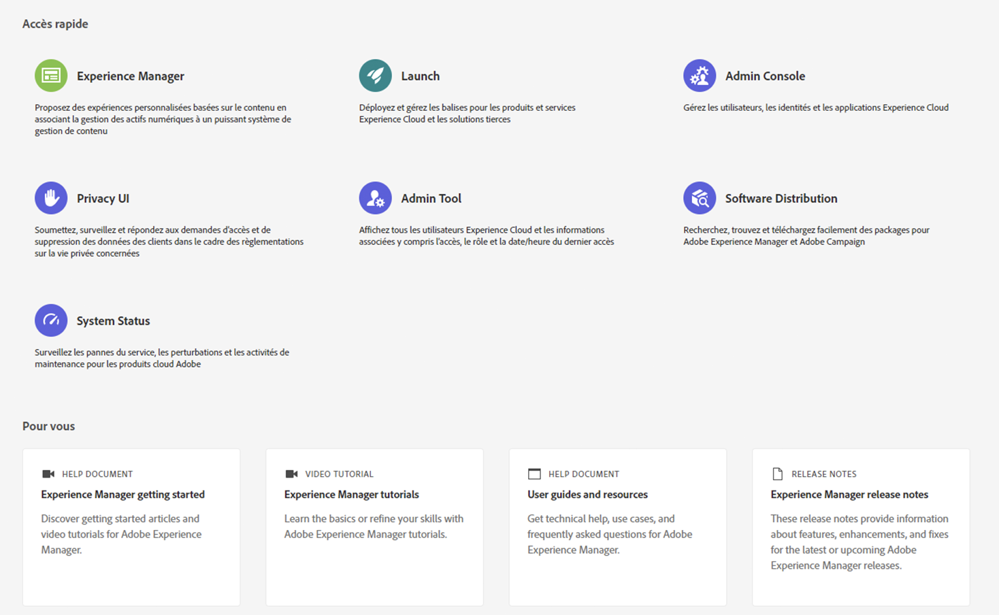
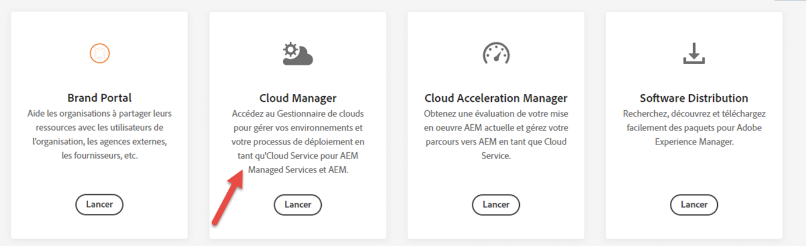

# Page de destination de Cloud Manager {#first-time-login}

Une fois que votre administrateur système vous a accordé l’accès à Cloud Manager, vous recevrez un courrier électronique vous conduisant à la page de connexion de Cloud Manager.

Pour accéder à Cloud Manager, procédez comme suit :

1. Accédez à [Experience Cloud](https://experience.adobe.com/) à l’aide de votre Adobe ID.
1. Sélectionnez **Experience Manager**.
   

1. Cliquez sur **Lancer** à partir de la carte Cloud Manager.
Une fois que vous êtes connecté à [!UICONTROL Cloud Manager], vous êtes prêt à utiliser l’interface utilisateur.
   

   >[!NOTE]
   >
   >Selon les rôles affectés dans [!UICONTROL Cloud Manager] et l’état de l’application, vous verrez plusieurs écrans lors de l’utilisation de l’interface utilisateur de [!UICONTROL Cloud Manager].

## Programmes dans Cloud Manager {#cloud-manager-landing-page}

Une fois que vous vous êtes connecté à [!UICONTROL Cloud Manager], le landing page affiche la carte de tout programme existant de votre organisation.

>[!NOTE]
>
>Les programmes qui se trouvent sur le Cloud Service sont indiqués par le sous-titre **Experience Manager Cloud** (par opposition à **Experience Manager** pour les programmes AMS), comme illustré ci-dessous.

Selon les circonstances, vous verrez l’une des deux options suivantes :

* **Il n’existe aucun programme dans Cloud Manager**

* **Des programmes existent déjà dans Cloud Manager**

S’il n’existe aucun programme dans votre organisation, votre landing page vous demande de créer votre premier programme, comme le montre la figure ci-dessous.

Si des programmes existent déjà dans votre organisation, votre landing page vous demande d’ajouter un autre programme et d’afficher tous vos programmes existants, comme le montre la figure ci-dessous.

>[!NOTE]
>Les programmes qui se trouvent sur le Cloud Service sont indiqués par le sous-titre **Experience Manager Cloud** (par opposition à **Experience Manager** pour les programmes AMS).
>Par exemple, sur la figure ci-dessous, **We.Retail Global** est un programme AMS et **We.Retail-Prod Program - Prod** est un programme disponible via Cloud Service.

Pour savoir comment ajouter un programme dans Cloud Manager, consultez :

* [Création d’un Programme de production](/help/onboarding/getting-access-to-aem-in-cloud/creating-production-program.md)
* [Création d’un programme Sandbox](/help/onboarding/getting-access-to-aem-in-cloud/creating-sandbox-program.md)

