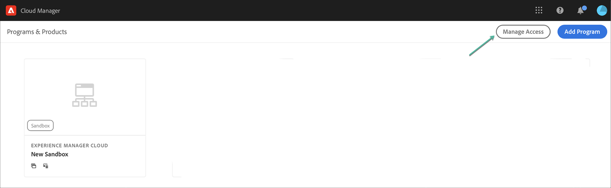

# Accès à Experience Manager as a Cloud Service {#navigation}

Une fois que votre administrateur système vous a accordé l’accès à Cloud Manager, vous recevrez un courrier électronique vous conduisant à la page de connexion de Cloud Manager, qui est également accessible via [Adobe Experience Cloud](https://my.cloudmanager.adobe.com/).

Une fois votre connexion établie, vous serez dirigé vers le landing page de Cloud Manager, comme indiqué ci-dessous.

## Tâches SysAdmin {#sysadmin-tasks}

Un utilisateur du rôle Administrateur système peut désormais accéder directement à la console d’administration pour gérer les rôles et autorisations et accéder aux instances AEM.

### Gestion des rôles {#manage-roles}

En tant qu’utilisateur du rôle Administrateur système, vous disposez d’un accès en un clic à l’emplacement dans la console **d’** administration à partir duquel les rôles utilisateur ou les autorisations de Cloud Manager sont gérés.

Consultez [Accès à Cloud Manager](https://docs.adobe.com/content/help/en/experience-manager-cloud-service/security/ims-support.html#accessing-cloud-manager) pour en savoir plus sur la manière d’ajouter des utilisateurs à un profil.

>[!NOTE]
>Pour certaines organisations qui ont eu accès à AEM en tant que service Cloud avant janvier 2020, celles-ci seront transférées vers la console d’administration Adobe et le Profil Produit et Environnement devra être sélectionné.

1. Accédez au landing page de Cloud Manager et cliquez sur **Gérer l’accès**.

   

1. Une fois que vous avez cliqué sur **Gérer l’accès**, vous accédez à la console **d’** administration à partir de laquelle vous pouvez gérer les rôles utilisateur ou les autorisations de Cloud Manager.

   

### Gestion de l’accès à l’instance d’auteur {#manage-access-aem}

En tant qu&#39;utilisateur du rôle Administrateur système, vous disposez d&#39;un accès en un clic à la console **d&#39;** administration à partir de laquelle vous pouvez accéder directement à l&#39;instance d&#39;auteur et gérer l&#39;accès.

>[!NOTE]
>Pour certaines organisations qui ont eu accès à AEM en tant que service Cloud avant janvier 2020, celles-ci seront transférées vers la console d’administration Adobe et le Profil Produit et Environnement devra être sélectionné.

Pour plus d’informations, voir [Accès à une instance dans AEM en tant que service](https://docs.adobe.com/content/help/en/experience-manager-cloud-service/security/ims-support.html#accessing-instance-cloud-service) Cloud.

1. Accédez à la carte **Environnements** à partir de la page Aperçu **du** Programme et cliquez sur **Gérer l’accès**.

   

   Ou,

   **Gérer l’accès** est également disponible à partir du bouton **Gérer** , si vous cliquez sur **Détails** à partir de la carte **Environnements** .

   

1. Une fois que vous avez cliqué sur **Gérer l’accès**, vous accédez à la console **** d’administration à partir de laquelle vous avez accès à l’instance d’auteur de l’environnement.

## Pour les clients AMS existants {#existing-aem}

Si vous êtes déjà client AMS (Adobe Managed Services) et que vous avez accès au service Cloud, vous verrez vos programmes existants et le bouton de Programme **** Ajouter situé dans le coin supérieur droit du landing page s’afficher.

Si vous ne voyez pas le bouton **Ajouter le Programme** et si vous avez des questions sur l’accès au service Cloud, contactez votre représentant Adobe.

Pour plus d’informations, consultez [Ajouter un nouveau Programme dans le service Cloud avec des Programmes](/help/onboarding/getting-access-to-aem-in-cloud/first-time-login.md#existing-program) existants.

## Pour les nouveaux clients du service Cloud {#new-cloud-services}

Si vous êtes un nouveau client du service Cloud, le bouton **Ajouter le Programme** s’affiche dans le coin supérieur droit d’un landing page vide. Vous souhaiterez ajouter un nouveau programme à votre service Cloud.

Pour plus d’informations, consultez [Ajouter un nouveau Programme dans le service Cloud sans Programme](/help/onboarding/getting-access-to-aem-in-cloud/first-time-login.md#no-program) existant.

