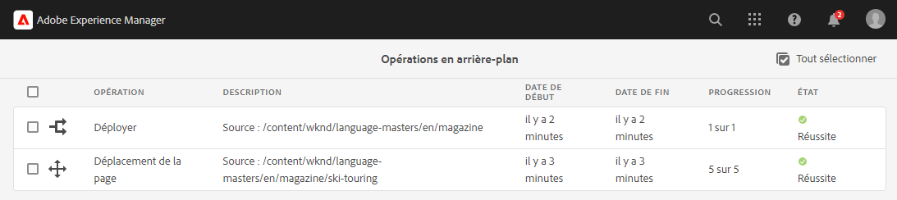

# Opérations asynchrones {#asynchronous-operations}

Pour réduire l’impact négatif sur les performances, Adobe Experience Manager traite de manière asynchrone certaines opérations de longue durée et gourmandes en ressources en tant qu’opérations en arrière-plan. Le traitement asynchrone implique de mettre plusieurs tâches en file d’attente et de les exécuter en série selon la disponibilité des ressources système.

Ces opérations comprennent :

* La suppression de nombreuses ressources
* Déplacement de nombreuses ressources ou de ressources avec de nombreuses références
* Exportation/importation de métadonnées de ressources en masse
* Récupération des ressources dépassant la limite de seuil définie à partir d’un déploiement Experience Manager distant
* Déploiement de Live Copies

Vous pouvez afficher le statut des tâches asynchrones dans le tableau de bord **[!UICONTROL Opérations en arrière-plan]** à l’adresse **Navigation globale** > **Outils** > **Général** > **Tâches**.

>[!NOTE]
>
>Par défaut, les tâches asynchrones s’exécutent en parallèle. Si *`n`* est le nombre de cœurs d’unité centrale, *`n/2`* tâches peuvent s’exécuter en parallèle, par défaut. Pour utiliser des paramètres personnalisés pour la file d’attente des tâches, modifiez la **[!UICONTROL configuration de la file d’attente par défaut des opérations asynchrones]** et la **configuration de déploiement et de déplacement de page des opérations asynchrones** à partir de la console web.
>
>Pour plus d’informations, voir [Configurations de files d’attente](https://sling.apache.org/documentation/bundles/apache-sling-eventing-and-job-handling.html#queue-configurations).

## Surveillance du statut des opérations asynchrones {#monitor-the-status-of-asynchronous-operations}

Chaque fois qu’AEM traite une opération de manière asynchrone, vous recevez une notification dans votre [boîte de réception](/help/sites-cloud/authoring/inbox.md) et par e-mail (si activé).

Pour afficher le statut des opérations asynchrones en détail, accédez à la page **[!UICONTROL Opérations en arrière-plan]**.

1. Dans l’interface de l’Experience Manager, sélectionnez **Navigation globale** > **Outils** > **Général** > **Tâches**.

1. Sur la page **[!UICONTROL Opérations en arrière-plan]**, passez en revue les détails des opérations.

   

   Pour déterminer la progression d’une opération particulière, reportez-vous à la valeur dans la colonne **[!UICONTROL État]**. Selon la progression, l’un des statuts suivants s’affiche :

   * **[!UICONTROL Active]** : l’opération est en cours de traitement.

   * **[!UICONTROL Succès]** : l’opération est terminée.

   * **[!UICONTROL Échec]** ou **[!UICONTROL Erreur]** : l’opération n’a pas pu être traitée.

   * **[!UICONTROL Planifié]** : l’opération est planifiée à une date ultérieure.

1. Pour arrêter une opération active, sélectionnez-la dans la liste, puis cliquez sur l’icône **[!UICONTROL Arrêter]** de la barre d’outils.

   

1. Pour afficher des détails supplémentaires, par exemple, la description et les journaux, sélectionnez l’opération, puis cliquez sur **[!UICONTROL Ouvrir]** dans la barre d’outils.

   

   La page des détails de la tâche s’affiche.

   

1. Pour supprimer l’opération de la liste, sélectionnez **[!UICONTROL Supprimer]** dans la barre d’outils. Pour télécharger les détails dans un fichier CSV, cliquez sur **[!UICONTROL Télécharger]**.

   >[!NOTE]
   >
   >Vous ne pouvez pas supprimer une tâche si son état est **Actif** ou **En file d’attente**.

## Configuration des options de traitement des tâches asynchrones {#configure}

Plusieurs options relatives aux tâches asynchrones peuvent être configurées. Les exemples suivants montrent comment y parvenir à l’aide de Configuration Manager sur un système de développement local.

>[!NOTE]
>
>Les [configurations OSGi](/help/implementing/deploying/configuring-osgi.md#creating-osgi-configurations) sont considérées comme du contenu modifiable et toute configuration de ce type doit être déployée en tant que package de contenu pour un environnement de production.

### Purger les tâches terminées {#purging-completed-jobs}

AEM exécute une tâche de purge quotidienne à 1 h du matin afin de supprimer les tâches asynchrones terminées depuis plus d’un jour.

Vous pouvez modifier la planification de la tâche de purge et la durée pendant laquelle les détails des tâches terminées sont conservés avant d’être supprimées. Vous pouvez également configurer le nombre maximal de tâches terminées pour lesquelles des détails sont conservés à tout moment.

1. Connectez-vous en tant qu’administrateur ou administratrice à la console Web de Quickstart Jar du SDK AEM à l’adresse `https://<host>:<port>/system/console`.
1. Accédez à **OSGi** > **Configuration**.
1. Ouvrez la **[!UICONTROL Tâche planifiée de purge des tâches asynchrones Adobe Granite]**.
1. Précisez les paramètres suivants :
   * Le nombre seuil de jours après lequel les tâches terminées sont supprimées.
   * Le nombre maximal de tâches pour lesquelles des détails sont conservés dans l’historique.
   * L’expression cron pour le moment où la purge doit s’exécuter.

   

1. Enregistrez les modifications.

### Configuration des opérations de suppression de ressources asynchrones {#configuring-synchronous-delete-operations}

Si le nombre de ressources ou de dossiers à supprimer dépasse le nombre seuil, l’opération de suppression est effectuée de façon asynchrone.

1. Connectez-vous en tant qu’administrateur ou administratrice à la console Web de Quickstart Jar du SDK AEM à l’adresse `https://<host>:<port>/system/console`.
1. Accédez à **OSGi** > **Configuration**.
1. Dans la console web, ouvrez la **[!UICONTROL Configuration par défaut de la file d’attente des processus asynchrones]**.
1. Dans le champ **[!UICONTROL Nombre seuil de ressources]**, spécifiez le nombre seuil de ressources/dossiers pour le traitement asynchrone des opérations de suppression.

   

1. Cochez l’option **Activer les notifications électroniques** pour recevoir des notifications par email concernant l’état de cette tâche, par exemple, succès ou échec.
1. Enregistrez les modifications.

### Configuration des opérations de déplacement de ressources asynchrones {#configuring-asynchronous-move-operations}

Si le nombre de ressources/dossiers ou de références à déplacer dépasse le nombre seuil, l’opération de déplacement est effectuée de façon asynchrone.

1. Connectez-vous en tant qu’administrateur ou administratrice à la console Web de Quickstart Jar du SDK AEM à l’adresse `https://<host>:<port>/system/console`.
1. Accédez à **OSGi** > **Configuration**.
1. Dans la console web, ouvrez la **[!UICONTROL Configuration du traitement des tâches de l’opération de déplacement asynchrone]**.
1. Dans le champ **[!UICONTROL Nombre seuil de ressources/références]**, spécifiez le nombre seuil de ressources/dossiers ou références pour le traitement asynchrone des opérations de déplacement.

   

1. Cochez l’option **Activer les notifications électroniques** pour recevoir des notifications par email concernant l’état de cette tâche, Par exemple, succès ou échec.
1. Enregistrez les modifications.

### Configuration des opérations de MSM asynchrones {#configuring-asynchronous-msm-operations}

1. Connectez-vous en tant qu’administrateur ou administratrice à la console Web de Quickstart Jar du SDK AEM à l’adresse `https://<host>:<port>/system/console`.
1. Accédez à **OSGi** > **Configuration**.
1. Dans la console web, ouvrez la **[!UICONTROL Configuration du traitement des tâches de l’opération de déplacement de page asynchrone]**.
1. Cochez l’option **Activer les notifications électroniques** pour recevoir des notifications par email concernant l’état de cette tâche, Par exemple, succès ou échec.

   

1. Enregistrez les modifications.

>[!MORELIKETHIS]
>
>* [Gestion des pages](/help/sites-cloud/authoring/sites-console/managing-pages.md)
>* [Importation et exportation des métadonnées de ressources par lot](/help/assets/metadata-import-export.md).
>* [Utilisez les ressources connectées pour partager des ressources DAM issues de déploiements distants](/help/assets/use-assets-across-connected-assets-instances.md).
