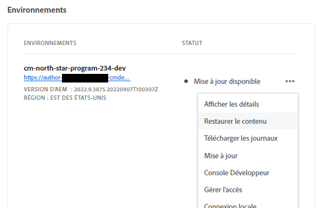
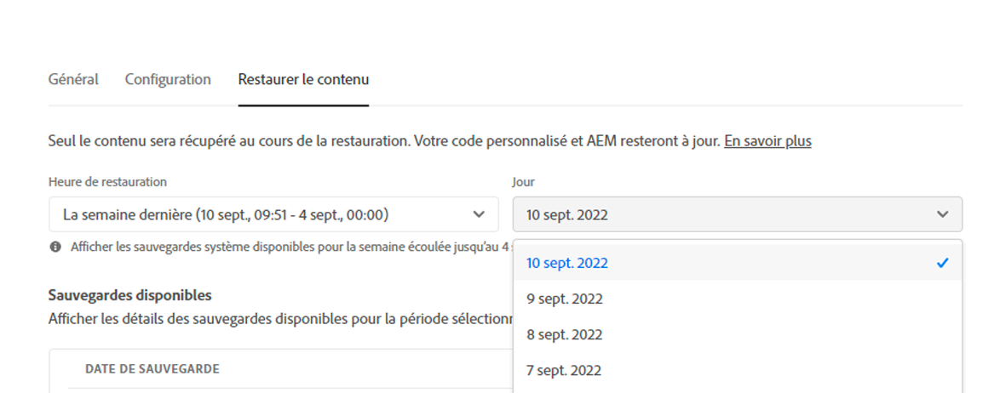

# Restauration du contenu dans AEM as a Cloud Service {#content-restore}

>[!CONTEXTUALHELP]
>id="aemcloud_golive_backuprestore"
>title="Sauvegarde et restauration"
>abstract="Découvrez comment restaurer votre contenu as a Cloud Service AEM à partir de la sauvegarde à l’aide de Cloud Manager."

Découvrez comment restaurer votre contenu as a Cloud Service AEM à partir de la sauvegarde à l’aide de Cloud Manager.

## Présentation {#overview}

Le processus de restauration en libre-service de Cloud Manager copie les données des sauvegardes système d’Adobe et les restaure dans son environnement d’origine. Une restauration est effectuée pour renvoyer à son état d’origine les données qui ont été perdues, endommagées ou supprimées accidentellement.

Le processus de restauration affecte uniquement le contenu, laissant votre code et votre version d’AEM inchangés. Vous pouvez lancer une opération de restauration de différents environnements à tout moment.

Cloud Manager fournit deux types de sauvegardes à partir desquelles vous pouvez restaurer du contenu.

* **Point dans le temps (PIT) :** Ce type récupère à partir de sauvegardes système continues des dernières 24 heures à partir de l’heure actuelle.
* **Semaine dernière :** Ce type effectue une restauration à partir des sauvegardes système au cours des sept derniers jours, à l’exception des 24 heures précédentes.

Dans les deux cas, la version de votre code personnalisé et la version AEM restent inchangées.

Les mesures de performances de restauration du contenu dans AEM as a ContentService se rapportent aux références normalisées :

* **Objectif de temps de récupération (RTO) :** L’objectif de temps de récupération varie en fonction de la taille du référentiel, mais en règle générale, une fois que la séquence de récupération commence, elle doit prendre environ 30 minutes.
* **L’objectif du point de récupération (RPO) :** L’objectif du point de récupération est de 24 heures au maximum

>[!TIP]
>
>Il est également possible de restaurer des sauvegardes [à l’aide de l’API publique.](https://developer.adobe.com/experience-cloud/cloud-manager/reference/api/)

## Limites {#limitations}

L’utilisation du mécanisme de restauration en libre-service est soumise aux restrictions suivantes.

* Les opérations de restauration sont limitées à sept jours, ce qui signifie qu’il n’est pas possible de restaurer un instantané antérieur à sept jours.
* Au maximum dix restaurations réussies sont autorisées dans tous les environnements au cours d’un programme par mois calendaire.
* Après la création de l’environnement, il faut six heures pour que le premier instantané de sauvegarde soit créé. Tant que cet instantané n’a pas été créé, aucune restauration ne peut être effectuée sur l’environnement.
* Une opération de restauration ne se déclenche pas si un pipeline de configuration de niveau web ou de pile complet est en cours d’exécution pour l’environnement.
* Une restauration ne peut pas être lancée si une autre restauration est déjà en cours d’exécution sur le même environnement.
* Dans de rares cas, en raison de la limite de 24 heures/7 jours des sauvegardes, la sauvegarde sélectionnée peut ne plus être disponible en raison d’un délai entre le moment où elle a été sélectionnée et le moment où la restauration est lancée.
* Les données des environnements supprimés sont définitivement perdues et ne peuvent pas être récupérées.

## Restauration du contenu {#restoring-content}

Déterminez tout d’abord la période du contenu que vous souhaitez restaurer. Ensuite, pour restaurer le contenu de votre environnement à partir d’une sauvegarde, procédez comme suit.

>[!NOTE]
>
>Un utilisateur avec la variable **Propriétaire de l’entreprise** ou **Responsable de déploiement** doit être connecté pour lancer une opération de restauration.

1. Connectez-vous à Cloud Manager à l’adresse [my.cloudmanager.adobe.com](https://my.cloudmanager.adobe.com/) et sélectionnez l’organisation appropriée.

1. Cliquez sur le programme pour lequel vous souhaitez lancer une restauration.

1. Dans la **Aperçu du programme** , dans la **Environnements** , cliquez sur le bouton représentant des points de suspension en regard de l’environnement pour lequel vous souhaitez lancer une restauration et sélectionnez **Restaurer le contenu**.

   

   * Vous pouvez également accéder directement au **Restaurer le contenu** de la page des détails de l’environnement d’un environnement spécifique.

1. Sur le **Restaurer le contenu** de la page détails de l’environnement, sélectionnez d’abord la période de restauration sous l’onglet **Temps de restauration** menu déroulant.

   1. Si vous sélectionnez **24 dernières heures** le voisin **Heure** vous permet de spécifier l’heure exacte des dernières 24 heures à restaurer.

      

   1. Si vous sélectionnez **Semaine dernière** le voisin **Jour** vous permet de sélectionner une date au cours des sept derniers jours, à l’exception des 24 heures précédentes.

      

1. Une fois que vous avez sélectionné une date ou défini une heure, la variable **Sauvegardes disponibles** la section ci-dessous présente une liste des sauvegardes disponibles qui peuvent être restaurées.

   

1. Recherchez la sauvegarde que vous souhaitez restaurer à l’aide de l’icône d’information pour afficher les informations concernant la version du code et la version d’AEM incluse dans cette sauvegarde et tenir compte des implications d’une restauration lors de la [choix de la sauvegarde.](#choosing-the-right-backup)

   

   * Notez que l’horodatage affiché pour les options de restauration sont tous basés sur le fuseau horaire de l’ordinateur de l’utilisateur.

1. Cliquez sur le bouton **Restaurer** à l’extrémité droite de la ligne représentant la sauvegarde que vous souhaitez restaurer pour démarrer le processus de restauration.

1. Consultez les détails de la variable **Restaurer le contenu** avant de confirmer votre requête en cliquant sur **Restaurer**.

   

Le processus de sauvegarde est lancé et vous pouvez afficher son état dans le **[Restaurer l’activité](#restore-activity)** table. Le temps nécessaire à la fin d’une opération de restauration dépend de la taille et du profil du contenu restauré.

Une fois la restauration terminée, l’environnement :

* Exécutez le même code et AEM version qu’au lancement de l’opération de restauration.
* disposer du même contenu que celui qui était disponible à l’horodatage de l’instantané choisi, avec les index reconstruits pour correspondre au code actuel ;

## Choix de la sauvegarde appropriée {#choosing-backup}

Restaure uniquement le contenu à AEM. Pour cette raison, vous devez soigneusement tenir compte des modifications de code effectuées entre le point de restauration souhaité et l’heure actuelle en examinant l’historique de validation entre votre ID de validation actuel et celui en cours de restauration.

Il existe plusieurs scénarios.

* Le code personnalisé sur l’environnement et la restauration se trouvent sur le même référentiel et la même branche.
* Le code personnalisé sur l’environnement et la restauration se trouvent sur le même référentiel, mais sur une branche différente avec une validation commune.
* Le code personnalisé sur l’environnement et la restauration se trouvent dans différents référentiels.
   * Dans ce cas, un identifiant de validation ne s’affiche pas.
   * Il est vivement recommandé de cloner les deux référentiels et d’utiliser un outil de comparaison des branches.

En outre, gardez à l’esprit qu’une restauration peut entraîner une désynchronisation de vos environnements de production et d’évaluation. Vous êtes responsable des conséquences de la restauration du contenu.

## Restaurer l’activité {#restore-activity}

Le **Restaurer l’activité** le tableau indique l’état des dix demandes de restauration les plus récentes, y compris les opérations de restauration principales.

En cliquant sur l’icône d’informations d’une sauvegarde, vous pouvez télécharger les journaux de cette sauvegarde et examiner les détails du code, y compris les différences entre l’instantané et les données au moment où la restauration a été lancée.

## Sauvegarde hors site {#offsite-backup}

Des sauvegardes régulières couvrent le risque de suppressions accidentelles ou de défaillances techniques dans AEM Cloud Services, mais des risques supplémentaires peuvent survenir en cas d’échec d’une région. En plus de la disponibilité, le risque le plus important dans de telles pannes est la perte de données.

AEM as a Cloud Service limite ce risque pour tous les environnements de production AEM en copiant en permanence tout le contenu d’une région distante et en le rendant disponible pour une récupération sur une période de trois mois. Cette fonctionnalité est appelée sauvegarde hors site.

La restauration d’AEM Cloud Services pour les environnements d’évaluation et de production à partir de la sauvegarde hors site est effectuée par AEM Ingénierie de la fiabilité des services en cas de panne de la région de données.
