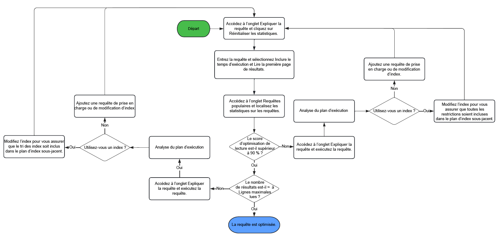
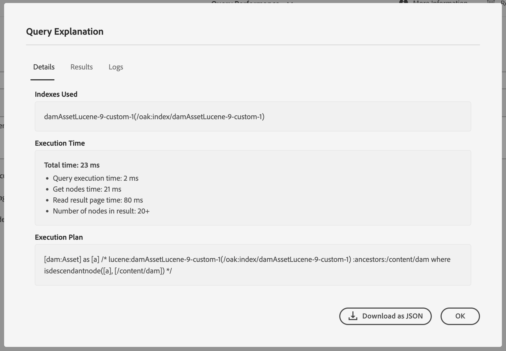

# Bonnes pratiques en matière de requête et d’indexation {#query-and-indexing-best-practices}

Dans AEM as a Cloud Service, tous les aspects opérationnels concernant l’indexation sont automatisés. Cela permet aux développeurs de se concentrer sur la création de requêtes efficaces et leurs définitions d’index correspondantes.

## Quand utiliser des requêtes {#when-to-use-queries}

Les requêtes sont un moyen d’accéder au contenu, mais elles ne sont pas la seule possibilité. Dans de nombreuses situations, l’accès au contenu du référentiel est plus efficace par d’autres moyens. Vous devez déterminer si les requêtes sont la meilleure manière, et la plus efficace, d’accéder au contenu pour votre cas d’utilisation.

### Référentiel et conception de taxonomie {#repository-and-taxonomy-design}

Lors de la conception de la taxonomie d’un référentiel, plusieurs facteurs doivent être pris en compte. Il s’agit entre autres des contrôles d’accès, de la localisation et de l’héritage des propriétés de composant et de page, et bien plus encore.

Lors de la conception d’une taxonomie qui tient compte de ces facteurs, il est également important de penser à la « traversabilité » de la conception de l’indexation. Dans ce contexte, la traversabilité est la capacité d’une taxonomie à permettre un accès prévisible au contenu en fonction de son chemin d’accès. Cela permet d’obtenir un système plus efficace, plus facile à gérer qu’un système nécessitant l’exécution de plusieurs requêtes.

De plus, lors de la conception d’une taxonomie, il est important de se demander si l’ordre importe. Dans les cas où un ordre explicite n’est pas nécessaire et qu’un grand nombre de nœuds frères est attendu, il est préférable d’utiliser un type de nœud non ordonné tel que `sling:Folder` ou `oak:Unstructured`. Dans les cas où un ordre est obligatoire, `nt:unstructured` et `sling:OrderedFolder` serait plus approprié.

### Requêtes dans les composants {#queries-in-components}

Comme les requêtes peuvent être l’une des opérations les plus contraignantes effectuées sur un système AEM, il est préférable de les éviter dans vos composants. L’exécution de plusieurs requêtes à chaque rendu de page peut souvent dégrader les performances du système. Deux stratégies sont conseillées pour éviter l’exécution de requêtes lors du rendu de composants : le **[parcours transversal des nœuds](#traversing-nodes)** et la **[pré-récupération des résultats](#prefetching-results)**.

### Parcours transversal des nœuds {#traversing-nodes}

Si le référentiel est conçu de manière à permettre une connaissance préalable de l’emplacement des données requises, le code qui récupère ces données dans les chemins nécessaires peut être déployé sans avoir à exécuter de requêtes pour le trouver.

Par exemple, le rendu de contenu correspondant à une certaine catégorie. Une méthode consiste à organiser le contenu avec une propriété de catégorie qui peut être interrogée pour renseigner un composant qui affiche des éléments dans une catégorie.

Une meilleure approche serait de structurer ce contenu dans une taxonomie par catégorie afin qu’il puisse être récupéré manuellement.

Par exemple, si le contenu est stocké dans une taxonomie similaire à :

```xml
/content/myUnstructuredContent/parentCategory/childCategory/contentPiece
```

Le nœud `/content/myUnstructuredContent/parentCategory/childCategory` peut simplement être récupéré ; ses tâches enfants peuvent être analysées et utilisées pour le rendu du composant.

En outre, lorsque vous traitez un ensemble de résultats petit ou homogène, il peut être plus rapide de parcourir le référentiel et de rassembler les nœuds requis, plutôt que de concevoir une requête pour renvoyer le même ensemble de résultats. En règle générale, les requêtes doivent être évitées lorsque cela est possible.

### Prérécupération des résultats {#prefetching-results}

Parfois, le contenu ou les exigences liées à un composant ne permettent pas d’utiliser le parcours transversal des nœuds comme méthode de récupération des données requises. Dans ce cas, les requêtes requises doivent être exécutées avant le rendu du composant afin que des performances optimales soient garanties.

Si les résultats requis pour le composant peuvent être calculés au moment de sa création et qu’aucun changement de contenu n’est attendu, la requête peut être exécutée après que des modifications soient effectuées.

Si les données ou le contenu changent régulièrement, la requête peut être exécutée selon un planning ou via un listener pour la mise à jour des données sous-jacentes. Ensuite, les résultats peuvent être écrits à un emplacement partagé dans le référentiel. Tous les composants qui ont besoin de ces données peuvent ensuite extraire les valeurs de ce nœud unique sans avoir à exécuter une requête lors de l’exécution.

Une stratégie similaire peut être utilisée pour conserver le résultat dans un cache en mémoire, qui est renseigné au démarrage et mis à jour chaque fois que des modifications sont effectuées (à l’aide d’un JCR `ObservationListener`ou d’un Sling`ResourceChangeListener`).

## Optimiser les requêtes {#optimizing-queries}

La documentation d’Oak fournit une [&#x200B; présentation générale de l’exécution des requêtes](https://jackrabbit.apache.org/oak/docs/query/query-engine.html#query-processing). C’est la base de toutes les activités d’optimisation décrites dans ce document.

AEM as a Cloud Service fournit l’outil [Query Performance Tool](#query-performance-tool), conçu pour prendre en charge l’implémentation de requêtes efficaces.

* Il affiche les requêtes déjà exécutées avec leurs caractéristiques de performance appropriées et leur plan de requête.
* Il permet d’exécuter des requêtes ad hoc à différents niveaux, en commençant par afficher le plan de requête jusqu’à l’exécution de la requête complète.

L’outil de performance de requête est accessible via [Developer Console dans Cloud Manager](https://experienceleague.adobe.com/docs/experience-manager-learn/cloud-service/debugging/debugging-aem-as-a-cloud-service/developer-console.html?lang=fr#queries). L’outil de performance de requête d’AEM as a Cloud Service fournit plus d’informations sur les détails de l’exécution de la requête à partir de la version AEM 6.x.

Ce graphique illustre le flux général d’utilisation de l’outil de performance des requêtes pour optimiser les requêtes.



### Utiliser un index {#use-an-index}

Chaque requête doit utiliser un index pour fournir des performances optimales. Dans la plupart des cas, les index prêts à l’emploi existants doivent être suffisants pour gérer les requêtes.

Il arrive que des propriétés personnalisées doivent être ajoutées à un index existant, de sorte que des contraintes supplémentaires puissent être interrogées à l’aide de l’index. Consultez le document [Recherche et indexation de contenu](/help/operations/indexing.md#changing-an-index) pour en savoir plus. La section [Aide-mémoire pour les requêtes JCR](#jcr-query-cheatsheet) de ce document décrit l’aspect que doit prendre une définition de propriété sur un index pour prendre en charge un type de requête spécifique.

### Utiliser les critères appropriés {#use-the-right-criteria}

La contrainte principale sur toute requête doit être une correspondance de propriété, car il s’agit du type le plus efficace. L’ajout d’autres contraintes de propriété limite davantage le résultat.

Le moteur de requête ne prend en compte qu’un seul index. Cela signifie qu’un index existant peut et doit être personnalisé en y ajoutant d’autres propriétés d’index personnalisées.

La section [&#x200B; Aide-mémoire pour les requêtes JCR &#x200B;](#jcr-query-cheatsheet) de ce document répertorie les contraintes disponibles et décrit également à quoi doit ressembler une définition d’index pour être récupérée. Utilisez l’[outil Performances des requêtes](#query-performance-tool) pour tester la requête et vous assurer que l’index approprié est utilisé et que le moteur de requête n’a pas besoin d’évaluer les contraintes en dehors de l’index.

### Commande {#ordering}

Si une commande spécifique du résultat est demandée, le moteur de requête peut effectuer deux opérations :

1. L’index peut fournir le résultat complet et dans l’ordre appropriée.
   * Cela fonctionne si les propriétés utilisées pour la mise en ordre sont annotées avec `ordered=true` dans la définition d’index.
1. Le moteur de requête effectue le processus de commande.
   * Cela peut se produire lorsque le moteur de requête effectue un filtrage en dehors de l’index ou que la propriété de commande n’est pas annotée avec la propriété `ordered=true`.
   * Cela nécessite que le jeu de résultats complet soit lu en mémoire pour le tri, ce qui est beaucoup plus lent que la première option.

### Limiter la taille du résultat {#restrict-result-size}

La taille récupérée du résultat de la requête est un facteur important dans les performances de la requête. Comme la récupération du résultat est différée, il y a une différence dans la simple récupération des 20 premiers résultats par rapport à la récupération de 10 000 résultats, tant dans l’exécution que dans l’utilisation de la mémoire.

Cela signifie également que la taille du jeu de résultats ne peut être déterminée correctement que si tous les résultats sont récupérés. Pour cette raison, l’ensemble des résultats récupérés doit toujours être limité, soit en augmentant la requête (voir la section [Aide-mémoire pour les requêtes JCR](#jcr-query-cheatsheet) pour plus de détails) ou en limitant la lecture des résultats.

Une telle limite empêche également le moteur de requête de consulter la **limite de traversée** de 100 000 nœuds, ce qui entraîne un arrêt forcé de la requête.

Reportez-vous à la section [Requêtes avec des jeux de résultats volumineux](#queries-with-large-result-sets) de ce document si un jeu de résultats potentiellement volumineux doit être complètement traité.

## Outil de performance de requête {#query-performance-tool}

L’outil de performance de requête (situé à l’adresse `/libs/granite/operations/content/diagnosistools/queryPerformance.html` et disponible via le [Developer Console dans Cloud Manager](https://experienceleague.adobe.com/docs/experience-manager-learn/cloud-service/debugging/debugging-aem-as-a-cloud-service/developer-console.html?lang=fr#queries)) fournit :
* Liste de toutes les « requêtes lentes » ; actuellement définies comme étant celles qui lisent/analysent plus de 5 000 lignes.
* Une liste de « Requêtes populaires »
* L’outil « Expliquer la requête » permet de comprendre comment une requête spécifique sera exécutée par Oak.


Les tableaux « Requêtes lentes » et « Requêtes populaires » incluent -
* L’instruction de requête elle-même.
* Détails du dernier thread qui a exécuté la requête, permettant d’identifier la page ou la fonctionnalité d’application qui exécute la requête.
* Score « Optimisation de la lecture » pour la requête.
   * Il s’agit du rapport entre le nombre de lignes/nœuds analysés pour exécuter la requête et le nombre de résultats correspondants lus.
   * Une requête pour laquelle chaque restriction (et tout ordre) peut être traitée au niveau de l’index obtient généralement un score de 90 % ou plus.
* Détails du nombre maximal de lignes -
   * Lecture : indique qu’une ligne a été incluse dans un jeu de résultats.
   * Analysé : indique qu’une ligne a été incluse dans les résultats de la requête d’index sous-jacente (dans le cas d’une requête indexée) ou lue à partir du magasin de nœuds (dans le cas d’une traversée du référentiel).

Ces tables permettent d’identifier les requêtes qui ne sont pas entièrement indexées (voir [Utilisation d’un index](#use-an-index) ou qui lisent trop de nœuds (voir également [Traversée de référentiel](#repository-traversal) et [Traversée d’index](#index-traversal)). Ces requêtes seront mises en évidence, avec les zones de préoccupation appropriées marquées en rouge.

L’option `Reset Statistics` est fournie pour supprimer toutes les statistiques existantes collectées dans les tableaux. Cela permet l’exécution d’une requête particulière (soit via l’application elle-même, soit via l’outil Expliquer la requête ) et l’analyse des statistiques d’exécution.

### Expliquer la requête

L’outil Expliquer la requête permet aux développeurs et aux développeuses de comprendre le plan d’exécution de la requête (voir [Lecture du plan d’exécution de la requête](#reading-query-execution-plan)), y compris les détails de tout index utilisé lors de l’exécution de la requête. Vous pouvez l’utiliser pour comprendre l’efficacité de l’indexation d’une requête pour prédire ou analyser rétrospectivement ses performances.

#### Expliquer une requête

Pour expliquer une requête, procédez comme suit :

* Sélectionnez la langue de requête appropriée à l’aide de la liste déroulante `Language` .
* Saisissez l’instruction de la requête dans le champ `Query` .
* Si nécessaire, sélectionnez le mode d’exécution de la requête à l’aide des cases à cocher fournies.
   * Par défaut, les requêtes JCR n’ont pas besoin d’être exécutées pour identifier le plan d’exécution des requêtes (ce n’est pas le cas pour les requêtes QueryBuilder).
   * Trois options sont fournies pour exécuter la requête :
      * `Include Execution Time` - exécutez la requête mais n’essayez pas de lire les résultats.
      * `Read first page of results` - exécutez la requête et lisez la première « page » de 20 résultats (en reproduisant les bonnes pratiques pour l’exécution des requêtes).
      * `Include Node Count` - Exécutez la requête et lisez l’ensemble du jeu de résultats (cela n’est généralement pas conseillé, voir [Traversée d’index](#index-traversal)).

#### Fenêtre contextuelle d’explication de la requête {#query-explanation-popup}



Après avoir sélectionné `Explain`, l’utilisateur voit s’afficher un pop-up décrivant le résultat de l’explication de la requête (et son exécution, si elle est sélectionnée).
Ce pop-up contient des détails sur -
* Index utilisés lors de l’exécution de la requête (ou aucun index si la requête doit être exécutée à l’aide de [Repository Traversal](#repository-traversal)).
* Le temps d&#39;exécution (si `Include Execution Time` case a été cochée) et le nombre de résultats lus (si les cases `Read first page of results` ou `Include Node Count` ont été cochées).
* Le plan d’exécution, qui permet une analyse détaillée de l’exécution de la requête. Pour savoir comment l’interpréter, consultez la section [Lecture du plan d’exécution de la requête](#reading-query-execution-plan) .
* Chemins d’accès aux 20 premiers résultats de la requête (si `Read first page of results` case a été cochée)
* Les logs complets de la planification de la requête, indiquant les coûts relatifs des index qui ont été pris en compte pour l&#39;exécution de cette requête (l&#39;index au coût le plus bas sera celui choisi).

#### Lecture du plan d&#39;exécution des requêtes {#reading-query-execution-plan}

Le plan d’exécution de requête contient tout ce qui est nécessaire pour prédire (ou expliquer) les performances d’une requête particulière. Comprenez l’efficacité de l’exécution de la requête en comparant les restrictions et l’ordre dans la requête JCR (ou Query Builder) d’origine à la requête exécutée dans l’index sous-jacent (Lucene, Elastic ou Property).

Considérez la requête suivante -

```
/jcr:root/content/dam//element(*, dam:Asset) [jcr:content/metadata/dc:title = "My Title"] order by jcr:created
```

...qui contient -
* 3 restrictions
   * Type de nœud (`dam:Asset`)
   * Chemin (descendants de `/content/dam`)
   * Propriété (`jcr:content/metadata/dc:title = "My Title"`)
* Classement par la propriété `jcr:created`

L’explication de cette requête génère le plan suivant : -

```
[dam:Asset] as [a] /* lucene:damAssetLucene-9(/oak:index/damAssetLucene-9) +:ancestors:/content/dam +jcr:content/metadata/dc:title:My Title ordering:[{ propertyName : jcr:created, propertyType : UNDEFINED, order : ASCENDING }] where ([a].[jcr:content/metadata/dc:title] = 'My Title') and (isdescendantnode([a], [/content/dam])) */
```

Dans ce plan, la section décrivant la requête exécutée dans l’index sous-jacent est -

```
lucene:damAssetLucene-9(/oak:index/damAssetLucene-9) +:ancestors:/content/dam +jcr:content/metadata/dc:title:My Title ordering:[{ propertyName : jcr:created, propertyType : UNDEFINED, order : ASCENDING }]
```

Cette section du plan stipule que :
* Un index est utilisé pour exécuter cette requête -
   * Dans ce cas, l’index Lucene `/oak:index/damAssetLucene-9` sera utilisé. Par conséquent, les informations restantes se trouvent dans la syntaxe de requête Lucene.
* Les 3 restrictions sont gérées par l’index .
   * Restriction de type de nœud
      * implicite, car `damAssetLucene-9` indexe uniquement les nœuds de type dam:Asset.
   * La restriction de chemin
      * car `+:ancestors:/content/dam` apparaît dans la requête Lucene.
   * La restriction de propriété
      * car `+jcr:content/metadata/dc:title:My Title` apparaît dans la requête Lucene.
* L’ordre est géré par l’index
   * car `ordering:[{ propertyName : jcr:created, propertyType : UNDEFINED, order : ASCENDING }]` apparaît dans la requête Lucene.

Une telle requête est susceptible de fonctionner correctement, car les résultats renvoyés par la requête d’index ne seront pas filtrés davantage dans le moteur de requête (à l’exception du filtrage par contrôle d’accès). Cependant, il est toujours possible qu’une telle requête s’exécute lentement si les bonnes pratiques ne sont pas suivies (voir la section [&#x200B; Traversée d’index](#index-traversal) ci-dessous).

En envisageant une autre requête -

```
/jcr:root/content/dam//element(*, dam:Asset) [jcr:content/metadata/myProperty = "My Property Value"] order by jcr:created
```

...qui contient -
* 3 restrictions
   * Type de nœud (`dam:Asset`)
   * Chemin (descendants de `/content/dam`)
   * Propriété (`jcr:content/metadata/myProperty = "My Property Value"`)
* Classement par la propriété `jcr:created` **

L’explication de cette requête génère le plan suivant : -

```
[dam:Asset] as [a] /* lucene:damAssetLucene-9-custom-1(/oak:index/damAssetLucene-9-custom-1) :ancestors:/content/dam ordering:[{ propertyName : jcr:created, propertyType : UNDEFINED, order : ASCENDING }] where ([a].[jcr:content/metadata/myProperty] = 'My Property Value') and (isdescendantnode([a], [/content/dam])) */
```

Dans ce plan, la section décrivant la requête exécutée dans l’index sous-jacent est -

```
lucene:damAssetLucene-9(/oak:index/damAssetLucene-9) :ancestors:/content/dam ordering:[{ propertyName : jcr:created, propertyType : UNDEFINED, order : ASCENDING }]
```

Cette section du plan stipule que :
* Seules 2 restrictions (sur les 3) sont gérées par l’index -
   * Restriction de type de nœud
      * implicite, car `damAssetLucene-9` indexe uniquement les nœuds de type dam:Asset.
   * La restriction de chemin
      * car `+:ancestors:/content/dam` apparaît dans la requête Lucene.
* La `jcr:content/metadata/myProperty = "My Property Value"` de restriction de propriété n’est pas exécutée à l’index ; elle est appliquée en tant que filtrage du moteur de requête sur les résultats de la requête Lucene sous-jacente.
   * Cela est dû au fait que `+jcr:content/metadata/myProperty:My Property Value` n’apparaît pas dans la requête Lucene, car cette propriété n’est pas indexée dans l’index `damAssetLucene-9` utilisé pour cette requête.

Ce plan d’exécution de requête entraîne la lecture de chaque ressource sous `/content/dam` à partir de l’index, puis son filtrage par le moteur de requête (qui inclut uniquement celles correspondant à la restriction de propriété non indexée dans le jeu de résultats).

Même si seul un petit pourcentage de ressources correspond au `jcr:content/metadata/myProperty = "My Property Value"` de restriction, la requête doit lire un grand nombre de nœuds pour (tenter de) remplir la « page » de résultats demandée. Cela peut se traduire par une requête peu performante, qui s’affichera comme ayant un score de `Read Optimization` faible dans l’outil Performance des requêtes) et peut entraîner des messages WARN indiquant qu’un grand nombre de nœuds est en cours de traversée (voir [Traversée d’index](#index-traversal)).

Pour optimiser les performances de cette seconde requête, créez une version personnalisée de l’index `damAssetLucene-9` (`damAssetLucene-9-custom-1`) et ajoutez la définition de propriété suivante :

```
"myProperty": {
  "jcr:primaryType": "nt:unstructured",
  "propertyIndex": true,
  "name": "jcr:content/metadata/myProperty"
}
```

## Aide-mémoire sur les requêtes JCR {#jcr-query-cheatsheet}

Pour prendre en charge la création de requêtes JCR et de définitions d’index efficaces, la section [Aide-mémoire pour les requêtes JCR](https://experienceleague.adobe.com/docs/experience-manager-65/deploying/practices/best-practices-for-queries-and-indexing.html?lang=fr#jcrquerycheatsheet) peut être téléchargée et utilisée comme référence pendant le développement.

Il contient des exemples de requêtes pour QueryBuilder, XPath et SQL-2, couvrant plusieurs scénarios qui se comportent différemment en termes de performances des requêtes. Il fournit également des recommandations sur la version ou la personnalisation d’index Oak. Le contenu de cet aide-mémoire s’applique à AEM as a Cloud Service ainsi qu’à la version 6.5 d’AEM.

## Bonnes Pratiques Relatives À La Définition D’Index {#index-definition-best-practices}

Vous trouverez ci-dessous quelques bonnes pratiques à prendre en compte lors de la définition ou de l’extension d’index.

* Pour les types de nœuds qui possèdent des index existants (tels que `dam:Asset` ou `cq:Page`), préférez l’extension d’index prêts à l’emploi à l’ajout de nouveaux index.
   * Il est vivement déconseillé d’ajouter de nouveaux index, en particulier des index de texte intégral, sur le type de nœud `dam:Asset` (voir [cette note](/help/operations/indexing.md##index-names-index-names)).
* Lors de l’ajout de nouveaux index
   * Définissez toujours des index de type « Lucene ».
   * Utilisez une balise d’index dans la définition d’index (et la requête associée) et `selectionPolicy = tag` pour vous assurer que l’index n’est utilisé que pour les requêtes prévues.
   * Assurez-vous que `queryPaths` et `includedPaths` sont tous deux fournis (généralement avec les mêmes valeurs).
   * Utilisez des `excludedPaths` pour exclure les chemins qui ne contiendront pas de résultats utiles.
   * Utilisez les propriétés `analyzed` uniquement lorsque cela est nécessaire, par exemple lorsque vous devez utiliser une restriction de requête de texte intégral uniquement sur cette propriété.
   * Spécifiez toujours `async = [ async, nrt ] `, `compatVersion = 2` et `evaluatePathRestrictions = true`.
   * Spécifiez `nodeScopeIndex = true` uniquement si vous avez besoin d’un index de texte intégral Nodescope.

>[!NOTE]
>
>Pour plus d’informations, voir la documentation sur l’index Oak Lucene [&#128279;](https://jackrabbit.apache.org/oak/docs/query/lucene.html).

Les vérifications automatisées du pipeline Cloud Manager appliqueront certaines des bonnes pratiques décrites ci-dessus.

## Requêtes avec jeux de résultats volumineux {#queries-with-large-result-sets}

Bien qu’il soit recommandé d’éviter les requêtes avec des jeux de résultats volumineux, il existe des cas valides où des jeux de résultats volumineux doivent être traités. Souvent la taille du résultat n’est pas connue à l’avance, certaines précautions doivent donc être prises pour rendre le traitement fiable.

* La requête ne doit pas être exécutée dans une demande. Au lieu de cela, la requête doit être exécutée dans le cadre d’une tâche Sling ou d’un workflow AEM. Ces derniers ne comportent aucune limite dans leur exécution totale et sont redémarrés au cas où l’instance tomberait en panne pendant le traitement de la requête et de ses résultats.
* Pour dépasser la limite de requête de 100 000 nœuds, vous devez utiliser [Pagination de jeu de clés](https://jackrabbit.apache.org/oak/docs/query/query-engine.html#Keyset_Pagination) et diviser la requête en plusieurs sous-requêtes.

## Traversée de référentiel {#repository-traversal}

Les requêtes qui traversent le référentiel n’utilisent pas d’index et se connectent avec un message similaire à ce qui suit.

```text
28.06.2022 13:32:52.804 *WARN* [127.0.0.1 [1656415972414] POST /libs/settings/granite/operations/diagnosis/granite_queryperformance.explain.json HTTP/1.1] org.apache.jackrabbit.oak.plugins.index.Cursors$TraversingCursor Traversed 98000 nodes with filter Filter(query=select [jcr:path], [jcr:score], * from [nt:base] as a /* xpath: //* */, path=*) called by com.adobe.granite.queries.impl.explain.query.ExplainQueryServlet.getHeuristics; consider creating an index or changing the query
```

Grâce à ce fragment de code de journal, vous pouvez déterminer :

* La requête elle-même : `//*`
* Le code Java qui a exécuté cette requête : `com.adobe.granite.queries.impl.explain.query.ExplainQueryServlet::getHeuristics` pour aider à identifier le créateur de la requête.

Grâce à ces informations, il est possible d’optimiser cette requête à l’aide des méthodes décrites dans la section [Optimisation des requêtes](#optimizing-queries) de ce document.

### Traversée d&#39;index {#index-traversal}

Les requêtes qui utilisent un index, mais qui lisent toujours un grand nombre de nœuds, sont consignées avec un message similaire au suivant (notez le terme `Index-Traversed` plutôt que `Traversed`).

```text
05.10.2023 10:56:10.498 *WARN* [127.0.0.1 [1696502982443] POST /libs/settings/granite/operations/diagnosis/granite_queryperformance.explain.json HTTP/1.1] org.apache.jackrabbit.oak.plugins.index.search.spi.query.FulltextIndex$FulltextPathCursor Index-Traversed 60000 nodes with filter Filter(query=select [jcr:path], [jcr:score], * from [dam:Asset] as a where isdescendantnode(a, '/content/dam') order by [jcr:content/metadata/unindexedProperty] /* xpath: /jcr:root/content/dam//element(*, dam:Asset) order by jcr:content/metadata/unindexedProperty */, path=/content/dam//*)
```

Cela peut se produire pour plusieurs raisons :

1. Toutes les restrictions de la requête ne peuvent pas être gérées au niveau de l’index.
   * Dans ce cas, un sur-ensemble du jeu de résultats final est lu à partir de l’index et ensuite filtré dans le moteur de requête.
   * Cette opération est beaucoup plus lente que l’application de restrictions dans la requête d’index sous-jacente.
1. La requête est triée selon une propriété qui n’est pas marquée comme « ordonnée » dans l’index.
   * Dans ce cas, tous les résultats renvoyés par l’index doivent être lus par le moteur de requête et triés en mémoire.
   * Cette opération est beaucoup plus lente que l’application du tri dans la requête d’index sous-jacente.
1. L&#39;exécuteur de la requête tente d&#39;itérer un jeu de résultats volumineux.
   * Cette situation peut se produire pour plusieurs raisons, comme indiqué ci-dessous :

| Cause | Atténuation |
|----------|--------------|
| L’omission de `p.guessTotal` (ou l’utilisation d’un guessTotal très volumineux) entraîne l’itération par QueryBuilder d’un grand nombre de résultats lors du comptage | Fournissez aux `p.guessTotal` une valeur appropriée. |
| L’utilisation d’une limite élevée ou illimitée dans Query Builder (c’est-à-dire `p.limit=-1`) | Utilisez une valeur appropriée pour `p.limit` (idéalement 1 000 ou moins). |
| Utilisation d’un prédicat de filtrage dans Query Builder qui filtre un grand nombre de résultats de la requête JCR sous-jacente | Remplacez les prédicats de filtrage par des restrictions pouvant être appliquées dans la requête JCR sous-jacente. |
| Utilisation d’un tri basé sur un comparateur dans QueryBuilder | Remplacez par l’ordre basé sur les propriétés dans la requête JCR sous-jacente (à l’aide des propriétés indexées comme ordonnées). |
| Filtrage d’un grand nombre de résultats en raison du contrôle d’accès | Appliquez une propriété indexée ou une restriction de chemin d’accès supplémentaire à la requête pour refléter le contrôle d’accès |
| Utilisation de la « pagination offset » avec un offset important | Envisagez d’utiliser la [pagination de jeu de clés](https://jackrabbit.apache.org/oak/docs/query/query-engine.html#Keyset_Pagination) |
| Itération d&#39;un nombre important ou illimité de résultats | Envisagez d’utiliser la [pagination de jeu de clés](https://jackrabbit.apache.org/oak/docs/query/query-engine.html#Keyset_Pagination) |
| Index sélectionné incorrect | Utilisez les balises dans la requête et la définition d’index pour vous assurer que l’index attendu est utilisé |
