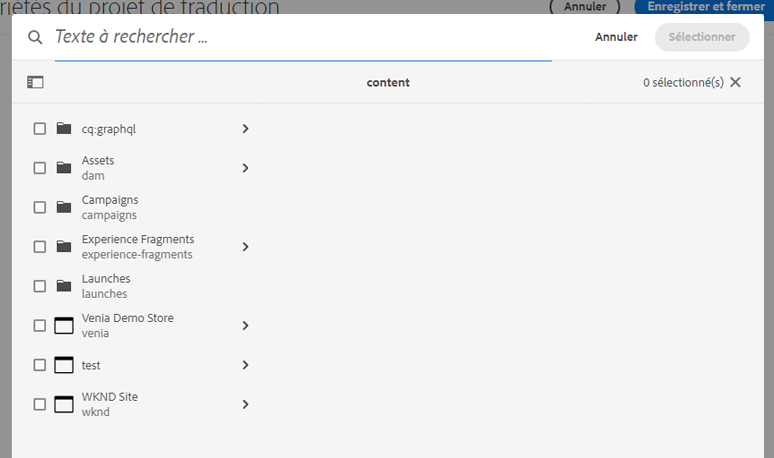
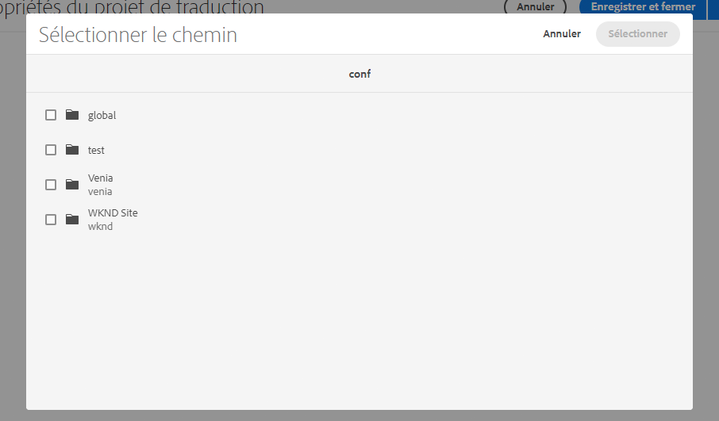

# Suppression des index Lucene génériques {#generic-lucene-index-removal}

Adobe prévoit de supprimer l’index « Lucene générique » (`/oak:index/lucene-*`) dʼAdobe Experience Manager as a Cloud Service. Cet index est obsolète depuis AEM 6.5. Cet document décrit l’impact de cette décision et fournit des descriptions détaillées sur la manière de déterminer si une instance AEM est affectée. Elle contient également des moyens de modifier les requêtes afin qu’elles continuent à fonctionner sans l’index Lucene générique.

## Contexte {#background}

Dans AEM, les requêtes en texte intégral sont celles qui utilisent les fonctions suivantes :

* `jcr:contains()` dans JCR XPATH
* `CONTAINS` dans JCR-SQL2

Ces requêtes ne peuvent pas renvoyer de résultats sans utiliser dʼindex. Contrairement à une requête ne contenant que des restrictions de chemin ou de propriété, une requête contenant une restriction de texte intégral pour laquelle aucun index ne peut être trouvé (et donc une traversée est effectuée) ne retournera jamais aucun résultat.

L’index Lucene générique (`/oak:index/lucene-*`) existe depuis AEM 6.0/Oak 1.0 afin de fournir une recherche de texte intégral dans la plus grande partie de la hiérarchie du référentiel, bien que certains chemins, tels que `/jcr:system` et `/var`, aient toujours été exclus. Cependant, cet index a été largement remplacé par des index sur des types de noeuds plus spécifiques (par exemple, `damAssetLucene-*` pour le `dam:Asset` type de noeud), qui prend en charge les recherches de texte intégral et de propriétés.

Dans AEM 6.5, l’index Lucene générique a été marqué comme obsolète, indiquant qu’il serait supprimé dans les versions ultérieures. Depuis, un avertissement est consigné lorsque l’index est utilisé, comme illustré par le fragment de code de journal suivant :

```text
org.apache.jackrabbit.oak.plugins.index.lucene.LucenePropertyIndex This index is deprecated: /oak:index/lucene-2; it is used for query Filter(query=select [jcr:path], [jcr:score], * from [nt:base] as a where contains(*, 'search term') and isdescendantnode(a, '/content/mysite') /* xpath: /jcr:root/content/mysite//*[jcr:contains(.,"search term")] */ fullText="search" "term", path=/content/mysite//*). Change the query or the index definitions.
```

Dans les versions récentes dʼAEM, lʼemploi de lʼindex Lucene générique sʼest limité à un nombre très restreint de fonctionnalités. Ces dernières subissent actuellement des refontes afin dʼutiliser d’autres index ou sont modifiées afin de supprimer leur dépendance à cet index.

Par exemple, les requêtes de recherche de référence, comme dans l’exemple suivant, doivent maintenant utiliser l’index à l’adresse `/oak:index/pathreference`, qui indexe uniquement les valeurs de propriété `String` correspondant à une expression régulière qui recherche des chemins JCR.

```text
//*[jcr:contains(., '"/content/dam/mysite"')]
```

Afin de prendre en charge des volumes de données client plus importants, Adobe ne crée plus l’index Lucene générique sur de nouveaux environnements AEM as a Cloud Service. En outre, Adobe supprime l’index des référentiels existants. [Consultez la chronologie](#timeline) à la fin de ce document pour plus de détails.

Adobe a déjà ajusté les coûts de lʼindex via les propriétés « `costPerEntry` » et « `costPerExecution` » afin de garantir que dʼautres index tels que `/oak:index/pathreference` soient utilisés de préférence, dans la mesure du possible.

Les applications client qui utilisent des requêtes qui dépendent toujours de cet index doivent être mises à jour immédiatement afin d’utiliser d’autres index existants, qui peuvent être personnalisés si nécessaire. Vous pouvez également ajouter de nouveaux index personnalisés à l’application cliente. Pour obtenir des instructions complètes sur la gestion des index dans AEM as a Cloud Service, consultez la [documentation sur lʼindexation](/help/operations/indexing.md).

## Êtes-vous affecté ? {#are-you-affected}

L’index Lucene générique est actuellement utilisé comme index de « secours » si aucun autre index de recherche en texte intégral ne peut traiter une requête. Lorsque cet index obsolète est utilisé, un message similaire au suivant est consigné au niveau Avertissement :

```text
org.apache.jackrabbit.oak.plugins.index.lucene.LucenePropertyIndex This index is deprecated: /oak:index/lucene-2; it is used for query Filter(query=select [jcr:path], [jcr:score], * from [nt:base] as a where contains(*, 'test') /* xpath: //*[jcr:contains(.,"test")] */ fullText="test", path=*). Change the query or the index definitions.
```

Dans certaines circonstances, Oak peut essayer d’utiliser un autre index de recherche en texte intégral (comme `/oak:index/pathreference`) pour prendre en charge la requête en texte intégral, mais si la chaîne de requête ne correspond pas à l’expression régulière de la définition de l’index, un message est enregistré au niveau Avertissement et la requête ne retournera probablement pas de résultats.

```text
org.apache.jackrabbit.oak.query.QueryImpl Potentially improper use of index /oak:index/pathReference with queryFilterRegex (["']|^)/ to search for value "test"
```

Une fois lʼindex Lucene générique supprimé, un message comme indiqué ci-dessous est enregistré au niveau Avertissement si une requête en texte intégral nʼest pas capable de localiser une définition dʼindex appropriée :

```text
org.apache.jackrabbit.oak.query.QueryImpl Fulltext query without index for filter Filter(query=select [jcr:path], [jcr:score], * from [nt:base] as a where contains(*, 'test') /* xpath: //*[jcr:contains(.,"test")] */ fullText="test", path=*); no results are returned
```

>[!IMPORTANT]
>
>**Action du client requise**
>
> Si lʼun des messages d’alerte mentionnés précédemment est enregistré, il se peut que vous deviez retravailler la requête pour utiliser un index de recherche en texte intégral différent, ou fournir un nouvel index pour prendre en charge la requête.
>
>Vous trouverez ci-dessous des informations détaillées sur les types de dépendances que vous pourriez rencontrer et sur la manière de les traiter.

## Dépendances potentielles de l’index Lucene générique {#potential-dependencies}

Il existe plusieurs domaines dans lesquels vos applications et installations d’AEM peuvent dépendre d’index Lucene génériques, à la fois sur les instances de création et de publication.

### Instance de publication {#publish-instance}

#### Requêtes d’applications personnalisées {#custom-application-queries}

Sur une instance de publication, lʼindex Lucene générique est le plus souvent utilisé par les requêtes dʼapplications personnalisées.

Dans les cas les plus simples, il peut sʼagir de requêtes pour lesquelles aucun type de nœud nʼest spécifié ce qui implique que ni `nt:base` ni `nt:base` n’est spécifié explicitement, comme par exemple :

```text
/jcr:root/content/mysite//*[jcr:contains(., 'search term')]
/jcr:root/content/mysite//element(*, nt:base)[jcr:contains(., 'search term')]
```

>[!IMPORTANT]
>
>**Action du client requise**
>
>Les requêtes mentionnées ci-dessus doivent être modifiées afin d’utiliser un type de nœud approprié, comme décrit dans la section suivante.

Par exemple, les requêtes peuvent être modifiées pour renvoyer les résultats correspondant aux pages ou à l’un des agrégats situés sous la propriété `cq:Page node`. La requête pourrait ainsi devenir :

```text
/jcr:root/content/mysite//element(*, cq:Page)[jcr:contains(., 'search term')]
```

Dans dʼautres cas, une requête peut spécifier un type de nœud, mais contenir une restriction de texte intégral qui ne peut pas être traitée par un autre index de recherche en texte intégral, comme par exemple :

```text
/jcr:root/content/dam//element(*, dam:Asset)[jcr:contains(jcr:content/metadata/@cq:tags, 'NewsTopics:cateogries/domestic'))]
```

Dans ce cas, la requête a le type de nœud `dam:Asset`, mais contient une restriction de texte intégral sur la propriété connexe `jcr:content/metadata/@cq:tags`.

Cette propriété n’est pas marquée comme analysée dans l’index `damAssetLucene`, qui est l’index de texte intégral le plus souvent utilisé pour les requêtes sur le type de nœud `dam:Asset`. Par conséquent, cet index ne peut pas être utilisé pour cette requête.

Ainsi, la requête se rabat sur lʼindex de recherche en texte intégral générique où toutes les propriétés incluses sont marquées comme analysées par la correspondance de caractère générique à `/oak:index/lucene-2/indexRules/nt:base/properties/prop`.

>[!IMPORTANT]
>
>**Action du client requise**
>
>Le marquage de la propriété `jcr:content/metadata/@cq:tags` comme ayant été analysée dans une version personnalisée de lʼindex `damAssetLucene` fait en sorte que cette requête est traitée par cet index. Aucune mention Avertissement n’est enregistrée.

### Instance d’auteur {#author-instance}

Outre les requêtes dans les servlets d’application client, les composants OSGi et les scripts de rendu, il peut y avoir plusieurs utilisations spécifiques à l’auteur de l’index Lucene générique.

#### Recherche par référence {#reference-search}

Traditionnellement, lʼindex Lucene générique est utilisé pour prendre en charge la recherche par référence ou la recherche de contenu avec des références à un autre chemin dʼaccès de contenu. Ces requêtes devraient déjà avoir été migrées afin dʼutiliser le nouvel index `/oak:index/pathreference`.

#### Recherche du sélecteur de champ de chemin {#picker-search}

AEM comprend un composant de boîte de dialogue personnalisé avec le type de ressource Sling `granite/ui/components/coral/foundation/form/pathfield` qui fournit un navigateur (sélecteur) permettant de sélectionner un autre chemin dʼaccès AEM. Sélecteur de champ de chemin par défaut, utilisé lorsqu’il n’est pas personnalisé `pickerSrc` est définie dans la structure de contenu et affiche une barre de recherche dans la boîte de dialogue contextuelle.

Les types de nœud sur lesquels porter la recherche peuvent être spécifiés à l’aide de la propriété `nodeTypes`.

À l’heure actuelle, si aucune propriété `nodeTypes` est présente, la requête de recherche sous-jacente utilisera le type de nœud `nt:base` et est donc susceptible d’utiliser l’index Lucene générique, qui consigne généralement des messages WARN similaires à ce qui suit.

```text
20.01.2022 18:56:06.412 *WARN* [127.0.0.1 [1642704966377] POST /mnt/overlay/granite/ui/content/coral/foundation/form/pathfield/picker.result.single.html HTTP/1.1] org.apache.jackrabbit.oak.plugins.index.lucene.LucenePropertyIndex This index is deprecated: /oak:index/lucene-2; it is used for query Filter(query=select [jcr:path], [jcr:score], * from [nt:base] as a where contains(*, 'test') and isdescendantnode(a, '/content') /* xpath: /jcr:root/content//element(*, nt:base)[(jcr:contains(., 'test'))] order by @jcr:score descending */ fullText="test", path=/content//*). Change the query or the index definitions.
```

Avant la suppression de lʼindex Lucene générique, le composant `pathfield` sera mis à jour afin que la zone de recherche soit masquée pour les composants utilisant le sélecteur par défaut et qui ne fournissent pas de propriété `nodeTypes`.

| Sélecteur de champ de chemin avec recherche | Sélecteur de champ de chemin sans recherche |
|---|---|
|  |  |

>[!IMPORTANT]
>
>**Action du client requise**
>
>Si le client souhaite conserver la fonctionnalité de recherche dans le sélecteur de champ de chemin, il doit fournir une propriété `nodeTypes` énumérant les types de nœuds sur lesquels il souhaite effectuer des requêtes. Ceux-ci peuvent être spécifiés sous la forme d’une liste de types de nœuds, séparés par des virgules, dans une propriété `String`. Si aucune recherche n’est requise, aucune action nʼest requise de la part du client.

>[!NOTE]
>
>L’éditeur de modèle de fragment de contenu utilise des champs de chemin spécialisés avec le type de ressource Sling `dam/cfm/models/editor/components/contentreference`. 
>
> * Actuellement, ils effectuent des requêtes sans spécifier de type de nœuds spécifié, ce qui entraîne l’enregistrement d’un WARN en raison de l’utilisation de l’index Lucene générique.
> * Les instances de ces composants utiliseront bientôt automatiquement les types de nœuds `cq:Page` et `dam:Asset` par défaut, sans autre intervention du client.
> * La propriété `nodeTypes` peut être ajoutée pour remplacer ces types de nœuds par défaut.

## Chronologie du retrait de l’index Lucene générique {#timeline}

Adobe adoptera une approche en deux phases pour supprimer l’index générique Lucene.

* **Phase 1** (début prévu au 31 janvier 2022) : lʼindex `/oak:index/lucene-*` nʼest plus créé sur les nouveaux environnements AEM as a Cloud Service.
* **Phase 2** (début prévu au 31 mars 2022) : suppression de l’index `/oak:index/lucene-*` des environnements AEM as a Cloud Service existants.

Adobe surveillera les messages de journal mentionnés ci-dessus et tentera de contacter les clients qui dépendent toujours de lʼindex Lucene générique.

Pour limiter les risques à court terme, Adobe ajoute directement des définitions d’index personnalisées aux systèmes clients afin d’éviter des problèmes de performance ou de fonctionnement suite à la suppression de l’index Lucene générique si nécessaire.

Dans ce cas, le client reçoit la définition d’index mise à jour et est informé qu’il l’inclut dans les prochaines versions de son application via Cloud Manager.
