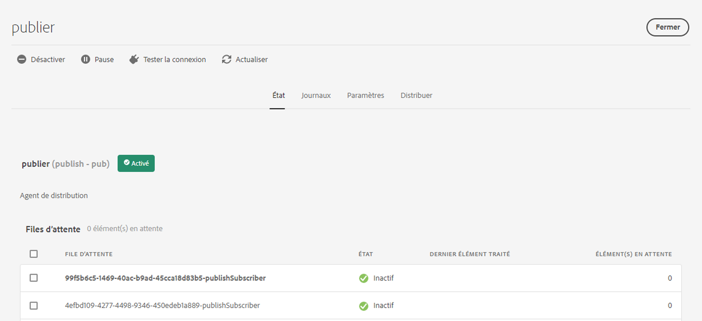
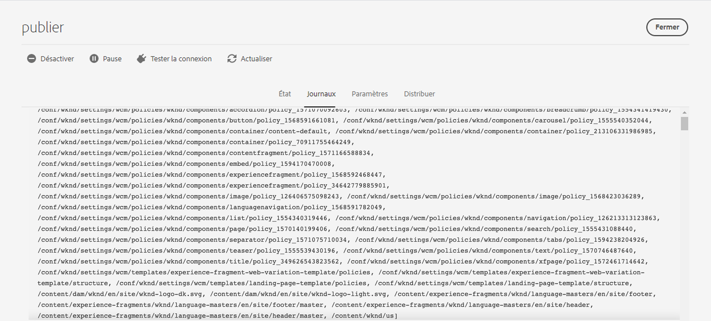

# Réplication {#replication}

Adobe Experience Manager as a Cloud Service utilise la fonctionnalité de [distribution de contenu Sling](https://sling.apache.org/documentation/bundles/content-distribution.html) pour déplacer le contenu à répliquer vers un service de pipeline s’exécutant sur Adobe Developer, en dehors d’AEM.

>[!NOTE]
>
>Pour en savoir plus, consultez [Distribution](/help/overview/architecture.md#content-distribution).

## Méthodes de publication de contenu {#methods-of-publishing-content}

>[!NOTE]
>
>Si vous souhaitez publier du contenu en masse, créez un workflow à l’aide de l’étape [ Workflow d’activation de l’arborescence ](#tree-activation), qui peut gérer efficacement des payloads volumineux.
>>Il n’est pas recommandé de créer votre propre code personnalisé de publication en masse.
>>Si, pour une raison quelconque, vous devez effectuer une personnalisation, vous pouvez déclencher un workflow avec cette étape à l’aide des API de workflow existantes.
>>Il est toujours recommandé de ne publier que le contenu qui doit être publié. Et soyez prudent en évitant de publier un grand nombre de contenus, si ce n’est pas nécessaire. Cependant, il n’existe aucune limite quant à la quantité de contenu que vous pouvez envoyer par le biais des workflows avec l’étape de workflow d’activation de l’arborescence.

### Publication/dépublication rapide – Publication/dépublication planifiée {#publish-unpublish}

Cette fonction permet de publier immédiatement la ou les pages sélectionnées, sans les options supplémentaires possibles, via l’approche Gérer la publication.

Pour plus d’informations, voir [Gestion de la publication](/help/sites-cloud/authoring/sites-console/publishing-pages.md#manage-publication).

### Heures d’activation et de désactivation – Configuration du déclenchement {#on-and-off-times-trigger-configuration}

Les autres possibilités d’**Heure d’activation** et d’**Heure de désactivation** sont disponibles dans l’[onglet De base des Propriétés de la page](/help/sites-cloud/authoring/sites-console/page-properties.md#basic).

Pour réaliser la réplication automatique de cette fonction, activez **Réplication automatique** dans la **Configuration d’activation et de désactivation du déclenchement** de la [configuration OSGi](/help/implementing/deploying/configuring-osgi.md) :


### Gérer la publication {#manage-publication}

La méthode Gérer la publication propose plus d’options que Publication rapide, dont la possibilité d’inclure des pages enfants, de personnaliser les références ou encore de lancer n’importe quel workflow applicable. Elle offre également la possibilité de publier la page à une date ultérieure.

L’inclusion des enfants d’un dossier pour l’option « Publier ultérieurement » appelle le workflow Publier l’arborescence de contenu, décrit dans cet article.

Vous trouverez des informations plus détaillées sur la gestion de la publication dans la [documentation sur les principes de publication](/help/sites-cloud/authoring/sites-console/publishing-pages.md#manage-publication).

### Étape du workflow d’activation de l’arborescence {#tree-activation}

L’étape de workflow Activation de l’arborescence est destinée à répliquer de manière performante une hiérarchie profonde de nœuds de contenu. Il se met automatiquement en pause lorsque la file d’attente devient trop volumineuse afin de permettre à d’autres réplications de se poursuivre en parallèle avec une latence minimale.

Créez un modèle de workflow qui utilise l’étape de processus `TreeActivation` :

1. Sur la page d’accueil d’AEM as a Cloud Service, accédez à **Outils – Workflow – Modèles**.
1. Sur la page Modèles de workflow, appuyez sur **Créer** dans l’angle supérieur droit de l’écran.
1. Ajoutez un titre et un nom à votre modèle. Pour plus d’informations, voir [Création de modèles de workflow](https://experienceleague.adobe.com/docs/experience-manager-65/developing/extending-aem/extending-workflows/workflows-models.html?lang=fr).
1. Sélectionnez le modèle créé dans la liste, puis appuyez sur **Modifier**
1. Dans la fenêtre suivante, supprimez l’étape qui s’affiche par défaut
1. Glissez-déposez l’étape de processus dans le flux de modèle actuel :

   

1. Sélectionnez l’étape du processus dans le flux et sélectionnez **Configurer** en appuyant sur l’icône en forme de clé à molette.
1. Sélectionnez l’onglet **Processus**, puis `Publish Content Tree` dans la liste déroulante, puis cochez la case **Avance du gestionnaire**

   

1. Définissez des paramètres supplémentaires dans le champ **Arguments**. Plusieurs arguments séparés par des virgules peuvent être assemblés. Par exemple :

   `enableVersion=false,agentId=publish,chunkSize=50,maxTreeSize=500000,dryRun=false,filters=onlyModified,maxQueueSize=10`

   >[!NOTE]
   >
   >Pour obtenir la liste des paramètres, reportez-vous à la section **Paramètres** ci-dessous.

1. Appuyez sur **Terminé** pour enregistrer le modèle de workflow.

**Paramètres**

| Nom | par défaut | Description |
| -------------- | ------- | --------------------------------------------------------------- |
| path |         | chemin racine à partir duquel commencer |
| agentId | Publication | Nom de l’agent de réplication à utiliser |
| chunkSize | 50 | Nombre de chemins à regrouper en une seule réplication |
| maxTreeSize | 500000 | Nombre maximal de nœuds pour qu’une arborescence soit considérée comme petite |
| maxQueueSize | 10 | Nombre maximal d’éléments dans la file d’attente de réplication |
| enableVersion | false | Activer le contrôle de version |
| dryRun | false | Lorsque la valeur est définie sur true, la réplication n’est pas appelée. |
| userId |         | uniquement pour le travail. Dans le workflow, l’utilisateur qui appelle le workflow est utilisé |
| filtres |         | Liste des noms de filtre de nœud. Voir le filtre pris en charge ci-dessous |

**Filtres de prise en charge**

| Nom | Description |
| ------------- | ------------------------------------------- |
| onlyModified | Nœuds : nouveaux et préexistants qui ont été modifiés depuis la dernière publication. |
| onlyActivated | Nœuds : qui ont été publiés avant la dernière publication |


**Prise en charge de la reprise**

Le workflow traite le contenu par blocs, chacun représentant un sous-ensemble du contenu complet à publier.  Si le workflow est arrêté par le système, il continue là où il s’est arrêté.

**Surveillance de la progression du workflow**

1. Sur la page d’accueil d’AEM as a Cloud Service, accédez à **Outils - Général - Tâches**.
1. Examinez la ligne correspondant à votre workflow. La colonne *progress* indique la progression de la réplication. Par exemple, il peut afficher 41/564 et, lors du rafraîchissement, il peut être mis à jour à 52/564.

   


1. La sélection de la ligne et son ouverture fournissent des détails supplémentaires sur le statut de l’exécution du workflow.

   


### Workflow de publication de l’arborescence de contenu {#publish-content-tree-workflow}

>[!NOTE]
>
>Cette fonctionnalité est abandonnée au profit de l’étape d’activation de l’arborescence plus performante, qui peut être incluse dans un workflow personnalisé.

+++ Cliquez ici pour en savoir plus sur cette fonctionnalité obsolète.

Vous pouvez déclencher une réplication d’arborescence en choisissant **Outils – Workflow – Modèles** et en copiant le modèle de workflow prêt à l’emploi **Publier l’arborescence de contenu**, comme illustré ci-dessous :


N’appelez pas le modèle d’origine. Veillez plutôt à copier le modèle et à appeler cette copie.

Comme tous les workflows, il peut également être appelé via l’API. Pour plus d’informations, voir [Interaction avec les workflows par programmation](https://experienceleague.adobe.com/docs/experience-manager-65/developing/extending-aem/extending-workflows/workflows-program-interaction.html#extending-aem).

Vous pouvez également créer un modèle de workflow qui utilise l’étape de processus `Publish Content Tree`.

1. Sur la page d’accueil d’AEM as a Cloud Service, accédez à **Outils – Workflow – Modèles**.
1. Sur la page Modèles de workflow, appuyez sur **Créer** dans l’angle supérieur droit de l’écran.
1. Ajoutez un titre et un nom à votre modèle. Pour plus d’informations, voir [Création de modèles de workflow](https://experienceleague.adobe.com/docs/experience-manager-65/developing/extending-aem/extending-workflows/workflows-models.html?lang=fr).
1. Sélectionnez le modèle créé dans la liste, puis appuyez sur **Modifier**
1. Dans la fenêtre suivante, faites un glisser-déposer de l’étape du processus dans le flux de modèle actuel :

   

1. Sélectionnez l’étape du processus dans le flux et sélectionnez **Configurer** en appuyant sur l’icône en forme de clé à molette.
1. Sélectionnez l’onglet **Processus**, puis `Publish Content Tree` dans la liste déroulante, puis cochez la case **Avance du gestionnaire**

   

1. Définissez des paramètres supplémentaires dans le champ **Arguments**. Plusieurs arguments séparés par des virgules peuvent être assemblés. Par exemple :

   `enableVersion=true,agentId=publish,includeChildren=true`


   >[!NOTE]
   >
   >Pour obtenir la liste des paramètres, reportez-vous à la section **Paramètres** ci-dessous.

1. Appuyez sur **Terminé** pour enregistrer le modèle de workflow.

**Paramètres**

* `includeChildren` (valeur booléenne, valeur par défaut : `false`). La valeur `false` signifie que seul le chemin est publié. `true` signifie que les enfants sont également publiés.
* `replicateAsParticipant` (valeur booléenne, valeur par défaut : `false`). S’il est configuré comme `true`, la réplication utilise la balise `userid` du principal qui a exécuté l’étape de participant.
* `enableVersion` (valeur booléenne, valeur par défaut : `false`). Ce paramètre détermine si une nouvelle version est créée lors de la réplication.
* `agentId` (valeur de chaîne, la valeur par défaut signifie que seuls les agents pour la publication sont utilisés). Il est recommandé d’être explicite concernant agentId ; par exemple, attribuez-lui la valeur : publier. L’application à l’agent de la valeur `preview` entraîne la publication sur le service d’aperçu.
* `filters` (valeur de chaîne, la valeur par défaut signifie que tous les chemins sont activés). Les valeurs disponibles sont les suivantes :
   * `onlyActivated` - activez uniquement les pages qui ont (déjà) été activées. Cette option agit, en quelque sorte, comme une réactivation.
   * `onlyModified` : activez uniquement les chemins déjà activés et dont la date de modification est postérieure à la date d’activation.
   * Vous pouvez utiliser la commande OU avec une barre verticale « | ». Par exemple, `onlyActivated|onlyModified`.

**Journalisation**

Lorsque l’étape du workflow d’activation de l’arborescence démarre, elle consigne ses paramètres de configuration sur le logLevel INFO. Lorsque les chemins sont activés, une instruction INFO est également consignée.

Une dernière instruction INFO est alors consignée une fois que l’étape du workflow aura répliqué tous les chemins.

De plus, vous pouvez augmenter le logLevel des enregistreurs sous `com.day.cq.wcm.workflow.process.impl` jusqu’à à DEBUG/TRACE pour obtenir encore plus d’informations sur le journal.

En cas d’erreur, l’étape du workflow s’arrête avec `WorkflowException` qui représente l’exception sous-jacente.

Vous trouverez ci-dessous des exemples de journaux générés lors d’un exemple de workflow de publication d’arborescence de contenu :

```
21.04.2021 19:14:55.566 [cm-p123-e456-aem-author-797aaaf-wkkqt] *INFO* [JobHandler: /var/workflow/instances/server60/2021-04-20/brian-tree-replication-test-2_1:/content/wknd/us/en/adventures] com.day.cq.wcm.workflow.process.impl.treeactivation.TreeActivationWorkflowProcess TreeActivation options: replicateAsParticipant=false(userid=workflow-process-service), agentId=publish, chunkSize=100, filter=, enableVersion=false
```

```
21.04.2021 19:14:58.541 [cm-p123-e456-aem-author-797aaaf-wkkqt] *INFO* [JobHandler: /var/workflow/instances/server60/2021-04-20/brian-tree-replication-test-2_1:/content/wknd/us/en/adventures] com.day.cq.wcm.workflow.process.impl.ChunkedReplicator closing chunkedReplication-VolatileWorkItem_node1_var_workflow_instances_server60_2021-04-20_brian-tree-replication-test-2_1, 17 paths replicated in 2971 ms
```

+++

### API de réplication {#replication-api}

Vous pouvez publier du contenu à l’aide de l’API de réplication présentée dans AEM as a Cloud Service.

Pour plus d’informations, voir [Documentation de l’API](https://javadoc.io/doc/com.adobe.aem/aem-sdk-api/latest/com/day/cq/replication/package-summary.html).

**Utilisation de base de l’API**

```
@Reference
Replicator replicator;
@Reference
ReplicationStatusProvider replicationStatusProvider;

....
Session session = ...
// Activate a single page to all agents, which are active by default
replicator.replicate(session,ReplicationActionType.ACTIVATE,"/content/we-retail/en");
// Activate multiple pages (but try to limit it to approx 100 at max)
replicator.replicate(session,ReplicationActionType.ACTIVATE, new String[]{"/content/we-retail/en","/content/we-retail/de"});

// ways to get the replication status
Resource enResource = resourceResolver.getResource("/content/we-retail/en");
Resource deResource = resourceResolver.getResource("/content/we-retail/de");
ReplicationStatus enStatus = enResource.adaptTo(ReplicationStatus.class);
// if you need to get the status for more more than 1 resource at once, this approach is more performant
Map<String,ReplicationStatus> allStatus = replicationStatusProvider.getBatchReplicationStatus(enResource,deResource);
```

**Réplication à l’aide d’agents spécifiques**

Lors de la réplication des ressources comme dans l’exemple ci-dessus, seuls les agents actifs par défaut seront utilisés. Dans AEM as a Cloud Service, il s’agit uniquement de l’agent nommé « publish », qui connecte l’auteur ou l’autrice au niveau de publication.

Pour prendre en charge la fonctionnalité d’aperçu, un nouvel agent appelé « preview » a été ajouté, qui n’est pas principal par défaut. Cet agent est utilisé pour connecter l’auteur au niveau aperçu. Si vous souhaitez répliquer uniquement par le biais de l’agent d’aperçu, vous devez sélectionner explicitement cet agent d’aperçu au moyen d’un `AgentFilter`.

Considérez l’exemple suivant :

```
private static final String PREVIEW_AGENT = "preview";

ReplicationStatus beforeStatus = enResource.adaptTo(ReplicationStatus.class); // beforeStatus.isActivated == false

ReplicationOptions options = new ReplicationOptions();
options.setFilter(new AgentFilter() {
  @Override
  public boolean isIncluded (Agent agent) {
    return agent.getId().equals(PREVIEW_AGENT);
  }
});
// will replicate only to preview
replicator.replicate(session,ReplicationActionType.ACTIVATE,"/content/we-retail/en", options);

ReplicationStatus afterStatus = enResource.adaptTo(ReplicationStatus.class); // afterStatus.isActivated == false
ReplicationStatus previewStatus = afterStatus.getStatusForAgent(PREVIEW_AGENT); // previewStatus.isActivated == true
```

Si vous ne fournissez pas un tel filtre et n’utilisez que l’agent « publish », l’agent « preview » n’est pas appliqué et l’action de réplication n’affecte pas le niveau d’aperçu.

L’ensemble `ReplicationStatus` d’une ressource n’est modifié que si l’action de réplication comprend au moins un agent principal par défaut. Dans l’exemple ci-dessus, ce n’était pas le cas pour ce flux. La réplication utilisait simplement l’agent « preview ». Vous devez donc utiliser la nouvelle méthode `getStatusForAgent()`, qui permet d’interroger le statut d’un agent spécifique. Cette méthode fonctionne également pour l’agent « publish ». Elle renvoie une valeur non nulle si une action de réplication a été effectuée à l’aide de l’agent fourni.

### Méthodes d’invalidation de contenu {#invalidating-content}

Vous pouvez directement invalider le contenu à l’aide de l’invalidation du contenu Sling (SCD) de l’auteur ou de l’autrice (méthode préférée) ou en utilisant l’API de réplication pour appeler l’agent de réplication de vidage du Dispatcher de publication. Reportez-vous à la page [Mise en cache](/help/implementing/dispatcher/caching.md) pour plus d’informations.

**Limites de capacité de l’API de réplication**

Répliquez moins de 100 chemins à la fois, 500 étant la limite. Au-dessus de la limite, une `ReplicationException` est générée.
Si la logique de votre application ne nécessite pas de réplication atomique, cette limite peut être dépassée en définissant `ReplicationOptions.setUseAtomicCalls` sur False. Ainsi, un nombre quelconque de chemins d’accès sera accepté, mais des compartiments seront créés en interne pour rester au-dessous de cette limite.

La taille du contenu transmis par appel de réplication ne doit pas dépasser `10 MB`. Cette règle inclut les nœuds et les propriétés, mais pas les fichiers binaires (les modules de workflow et les modules de contenu sont considérés comme des fichiers binaires).


## Résolution des problèmes {#troubleshooting}

Pour résoudre les problèmes de réplication, accédez aux files d’attente de réplication dans l’interface utilisateur web du service de création AEM :

1. Dans AEM [navigation globale](/help/sites-cloud/authoring/basic-handling.md#global-navigation), accédez à **Outils** > **Déploiement** > **Distribution**
1. Sélectionnez la carte **Publication**.

   

1. Vérifiez l’état de la file d’attente qui doit être de couleur verte.
1. Vous pouvez tester la connexion au service de réplication.
1. Sélectionnez l’onglet **Logs** (Journaux) qui affiche l’historique des publications de contenu.



Si la publication du contenu n’a pas pu être effectuée, l’intégralité de la publication est rétablie à partir du service de publication AEM.

Dans ce cas, la file d’attente principale modifiable affiche un statut rouge. Elle doit être examinée afin d’identifier le ou les éléments qui ont provoqué l’annulation de la publication. En cliquant sur cette file d’attente, les éléments en attente s’affichent, parmi lesquels il est possible d’effacer, si nécessaire, tous les éléments ou un seul.
