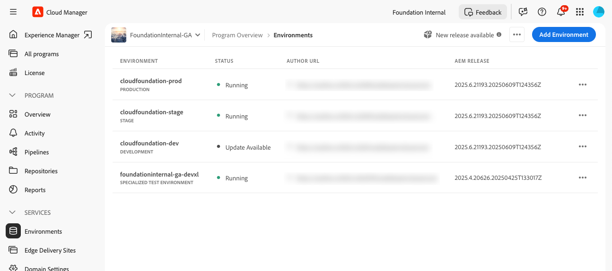

# Restaurer le code source précédent déployé dans AEM as a Cloud Service {#restore-previous-code-deployed}

>[!NOTE]
>
>La fonctionnalité décrite dans cet article n’est disponible que via le programme bêta. Pour vous inscrire à la version bêta, voir [Restauration en un clic pour les déploiements de pipeline](/help/implementing/cloud-manager/release-notes/current.md##one-click-rollback).

Utilisez **Restaurer le code précédemment déployé** pour restaurer instantanément un environnement à sa dernière version réussie, aucune exécution de pipeline n’étant requise.

Il vous suffit d’ouvrir le menu  de l’environnement sélectionné, puis de choisir **Restaurer** > **Code précédent déployé** pour restaurer le code source le plus récemment déployé en secondes.

>[!TIP]
>
>Vous pouvez afficher la version de code source active utilisée dans la vue des détails de l’environnement, sous l’onglet **Général**. Voir [Affichage des détails d’un environnement](/help/implementing/cloud-manager/manage-environments.md#viewing-environment).
>
>

**La restauration du code précédent déployé** n’est disponible que lorsque les conditions suivantes sont remplies :

* Une seule restauration est autorisée par exécution réussie du pipeline. Pour effectuer une nouvelle restauration, exécutez un autre pipeline avec succès.
* Vous détenez les autorisations **Environment Restore Create**. Pour plus d’informations sur la gestion des autorisations, voir [Autorisations personnalisées](/help/implementing/cloud-manager/custom-permissions.md).
* Votre entreprise est inscrite au programme bêta et l’indicateur de fonctionnalité est activé.
* Le programme s’exécute sur AEM as a Cloud Service.
* Le dernier pipeline pour cet environnement s’est terminé avec succès et s’est exécuté il y a **de 30 jours**.
* Le statut de l’environnement est *En cours d’exécution* et aucun pipeline n’est en cours.

**Restaurer le code précédemment déployé** fonctionne dans `Production` environnement, en plus de `Development` environnement, `Stage` environnement et `Specialized Testing Environment`. Une fois que vous avez confirmé, Cloud Manager démarre la restauration et envoie une notification push au début et à la fin de l’opération.

>[!IMPORTANT]
>
>Adobe recommande vivement de valider la procédure dans `Stage` *avant* de l’utiliser dans `Production` pour réduire les risques et assurer la stabilité.

Si une vérification échoue, Cloud Manager ouvre la boîte de dialogue suivante qui répertorie une ou plusieurs conditions non remplies et désactive **Confirmer**, empêchant la restauration.

.

Si vous souhaitez simplement restaurer les données perdues, endommagées ou supprimées accidentellement à leur état d’origine, vous pouvez utiliser [Restaurer le contenu dans AEM as a Cloud Service](/help/operations/restore.md). Ce processus de restauration affecte uniquement le contenu, laissant votre code source et votre version d’AEM inchangés.

**Pour restaurer le code précédemment déployé, procédez comme suit**

1. Connectez-vous à Cloud Manager à l’adresse [my.cloudmanager.adobe.com](https://my.cloudmanager.adobe.com/) et sélectionnez l’organisation appropriée.

1. Cliquez sur le programme pour lequel vous souhaitez lancer une restauration.

1. Répertoriez tous les environnements du programme en effectuant l’une des opérations suivantes :

   * Dans le menu de gauche, sous **Services**, cliquez sur  **Environnements**.

     

   * Dans le menu de gauche, sous **Programme**, cliquez sur **Aperçu**, puis, dans la vignette **Environnements**, cliquez sur  **Tout afficher**.

     

     >[!NOTE]
     >
     >La carte **Environnements** répertorie uniquement trois environnements. Cliquez sur **Tout afficher** dans la carte pour afficher *tous* les environnements du programme.

1. Dans le tableau Environnements , à droite d’un environnement dont vous souhaitez restaurer le code source, cliquez sur , puis cliquez sur **Restaurer** > **Code précédent déployé**.

   

1. Dans la boîte de dialogue **Restaurer le code déployé précédent**, passez en revue la version actuellement déployée et la version à restaurer, puis cliquez sur **Confirmer**.

   

1. Cloud Manager restaure l’environnement à sa version précédente, conserve le contenu et la configuration intacts, et marque l’environnement **Restauration** sur la page Environnements jusqu’à ce que le déploiement soit terminé.

   
