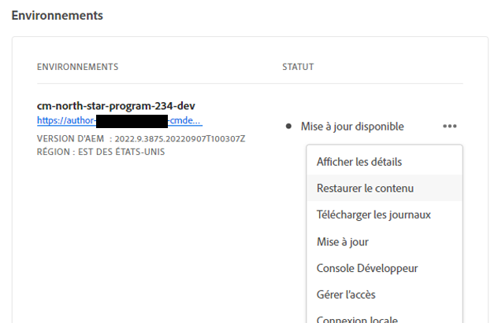
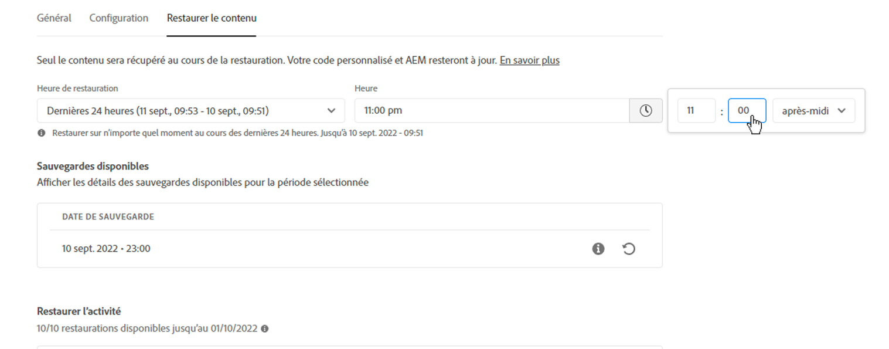
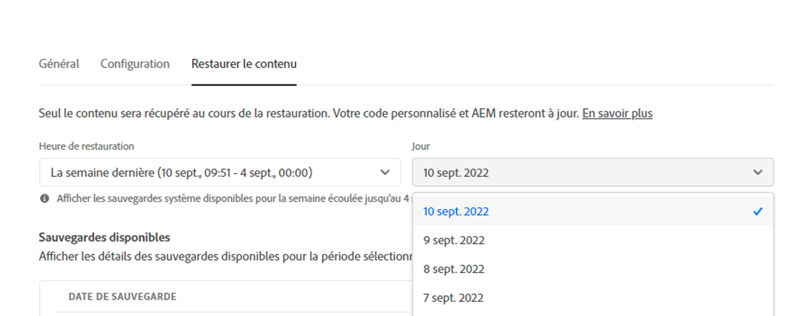
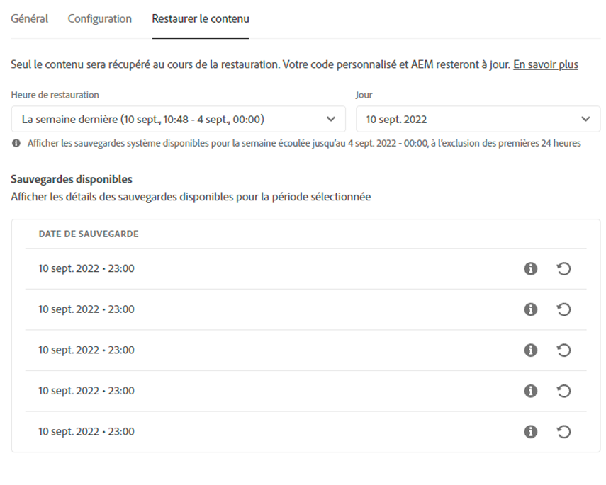
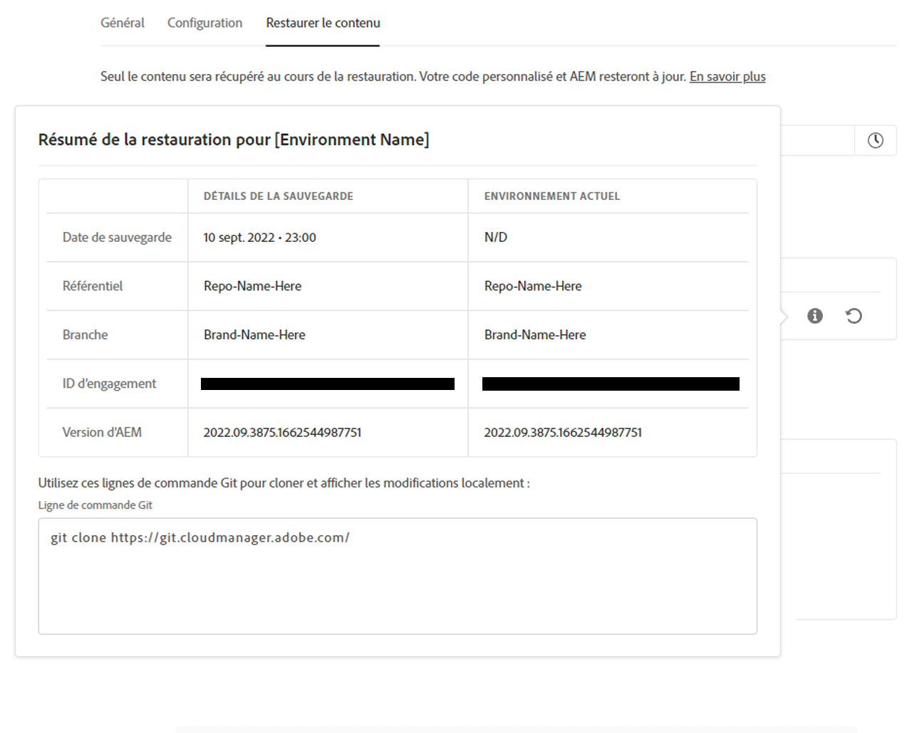
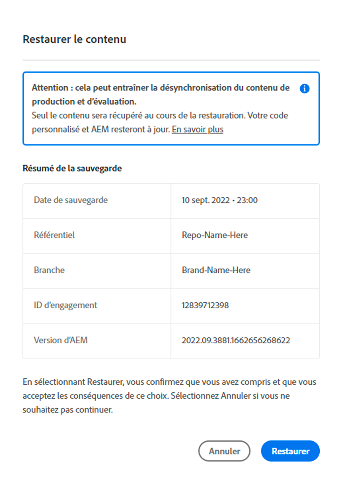
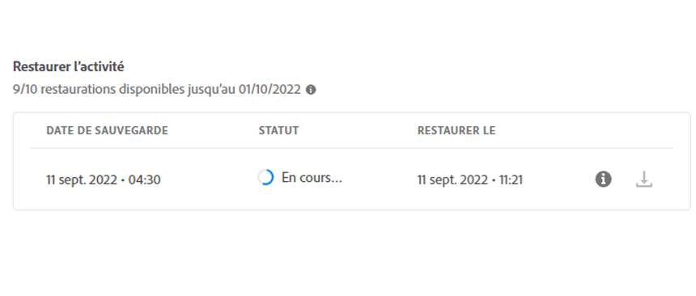

# Restauration de contenu dans AEM as a Cloud Service {#content-restore}

Découvrez comment restaurer votre contenu AEM as a Cloud Service à partir de la sauvegarde à l’aide de Cloud Manager.

## Présentation {#overview}

Le processus de restauration en libre-service de Cloud Manager copie les données des sauvegardes système d’Adobe et les restaure dans son environnement d’origine. Une restauration est effectuée pour renvoyer à leur état d’origine les données qui ont été perdues, endommagées ou supprimées accidentellement.

Le processus de restauration affecte uniquement le contenu, laissant votre code et votre version d’AEM inchangés. Vous pouvez lancer la restauration de différents environnements à tout moment.

Cloud Manager fournit deux types de sauvegardes à partir desquelles vous pouvez restaurer du contenu.

* **Point dans le temps (PIT) :** ce type effectue une restauration à partir de sauvegardes système continues des dernières 24 heures à partir de l’heure actuelle.
* **Semaine dernière :** ce type effectue une restauration à partir des sauvegardes système au cours des sept derniers jours, à l’exception des 24 heures précédentes.

Dans les deux cas, la version de votre code personnalisé et la version AEM restent inchangées.

>[!TIP]
>
>Il est également possible de restaurer des sauvegardes [à l’aide de l’API publique](https://developer.adobe.com/experience-cloud/cloud-manager/reference/api/).

>[!WARNING]
>
>* Cette fonctionnalité ne doit être utilisée que lorsqu’il existe de graves problèmes de code ou de contenu.
>* La restauration d’une sauvegarde entraîne la perte de données récentes entre l’exécution de la sauvegarde et aujourd’hui. L’évaluation est également restaurée vers l’ancienne version.
>* Avant de lancer une restauration de contenu, envisagez d’autres options de restauration de contenu sélective.

## Options de restauration de contenu sélectif {#selective-options}

Avant de procéder à la restauration complète du contenu, prenez en compte les options suivantes pour restaurer plus facilement votre contenu.

* Si un package est disponible pour le chemin supprimé, réinstallez-le à l’aide du [Gestionnaire de packages](/help/implementing/developing/tools/package-manager.md).
* Si le chemin supprimé était une page dans Sites, utilisez la fonction [ Restaurer l’arborescence ](/help/sites-cloud/authoring/sites-console/page-versions.md).
* Si le chemin supprimé était un dossier de ressources et que les fichiers d’origine sont disponibles, chargez-les à nouveau via [la console Assets](/help/assets/add-assets.md).
* Si le contenu supprimé était des ressources, pensez à restaurer [ versions précédentes des ressources](/help/assets/manage-digital-assets.md).

Si aucune des options ci-dessus ne fonctionne et que le contenu du chemin supprimé est significatif, effectuez une restauration de contenu comme décrit dans les sections suivantes.

## Créer un rôle d’utilisateur {#user-role}

Par défaut, aucun utilisateur n’est autorisé à exécuter des restaurations de contenu dans les environnements de développement, de production ou d’évaluation. Pour déléguer cette autorisation à des utilisateurs ou groupes spécifiques en suivant ces étapes générales.

1. Créez un profil de produit avec un nom expressif qui fait référence à la restauration de contenu.
1. Fournissez l’autorisation **Accès au programme** sur le programme requis.
1. Fournissez l’autorisation **Créer une restauration d’environnement** sur l’environnement requis ou sur tous les environnements du programme, selon votre cas d’utilisation.
1. Attribuez des utilisateurs à ce profil.

Pour plus d’informations sur la gestion des autorisations, consultez la documentation [Autorisations personnalisées](/help/implementing/cloud-manager/custom-permissions.md).

## Restaurer du contenu {#restoring-content}

Commencez par déterminer la période du contenu que vous souhaitez restaurer. Ensuite, pour restaurer le contenu de votre environnement à partir d’une sauvegarde, procédez comme suit.

>[!NOTE]
>
>Un utilisateur doit disposer des [autorisations appropriées](#user-role) pour lancer une opération de restauration.

1. Connectez-vous à Cloud Manager à l’adresse [my.cloudmanager.adobe.com](https://my.cloudmanager.adobe.com/) et sélectionnez l’organisation appropriée.

1. Cliquez sur le programme pour lequel vous souhaitez lancer une restauration.

1. Sur la page **Aperçu du programme**, dans la vignette **Environnements**, cliquez sur le bouton représentant des points de suspension en regard de l’environnement pour lequel vous souhaitez lancer une restauration et sélectionnez **Restaurer le contenu**.

   

   * Vous pouvez également accéder directement à l’onglet **Restaurer le contenu** de la page des détails de l’environnement d’un environnement spécifique.

1. Sous l’onglet **Restaurer le contenu** de la page Détails de l’environnement, sélectionnez d’abord la période de restauration sous la liste déroulante **Temps de restauration**.

   1. Si vous sélectionnez **Dernières 24 heures** le champ **Heure** voisin vous permet de spécifier l’heure exacte des dernières 24 heures à laquelle la restauration doit avoir lieu.

      

   1. Si vous sélectionnez **Semaine dernière** le champ **Jour** voisin vous permet de sélectionner une date au cours des sept derniers jours, à l’exclusion des 24 heures précédentes.

      

1. Une fois que vous avez sélectionné une date ou défini une heure, la section **Sauvegardes disponibles** ci-dessous présente une liste des sauvegardes disponibles qui peuvent être restaurées.

   

1. Recherchez la sauvegarde à restaurer à l’aide de l’icône d’information pour afficher les informations concernant la version du code et la version d’AEM incluse dans cette sauvegarde et tenez compte des implications d’une restauration lors du [choix de la sauvegarde](#choosing-the-right-backup).

   

   * L’horodatage affiché pour les options de restauration est basé sur le fuseau horaire de l’ordinateur de l’utilisateur.

1. Cliquez sur l’icône **Restaurer** à l’extrémité droite de la ligne représentant la sauvegarde que vous souhaitez restaurer pour démarrer le processus de restauration.

1. Consultez les détails de la boîte de dialogue **Restaurer le contenu** avant de confirmer votre requête en cliquant sur **Restaurer**.

   

Le processus de sauvegarde est lancé et vous pouvez afficher son statut dans la liste **[Restaurer l’activité](#restore-activity)**. Le temps nécessaire à l’achèvement d’une opération de restauration dépend de la taille et du profil du contenu restauré.

Une fois la restauration terminée, l’environnement :

* Exécute le même code et la même version d’AEM qu’au moment de lancer l’opération de restauration.
* Dispose du même contenu que celui qui était disponible à l’horodatage de l’instantané choisi, avec les index reconstruits pour correspondre au code actuel.

## Choisir la bonne sauvegarde {#choosing-backup}

Le processus de restauration en libre-service de Cloud Manager restaure uniquement le contenu vers AEM. Pour cette raison, vous devez soigneusement tenir compte des modifications de code effectuées entre le point de restauration souhaité et l’heure actuelle en examinant l’historique de validation entre l’ID de validation actuelle et celle en cours de restauration.

Il existe plusieurs scénarios.

* Le code personnalisé sur l’environnement et la restauration se trouvent sur le même référentiel et la même branche.
* Le code personnalisé sur l’environnement et la restauration se trouvent sur le même référentiel, mais sur une branche différente avec une validation commune.
* Le code personnalisé sur l’environnement et la restauration se trouvent dans des référentiels différents.
   * Dans ce cas, un identifiant de validation ne s’affiche pas.
   * Il est vivement recommandé de cloner les deux référentiels et d’utiliser un outil de comparaison des branches.

En outre, gardez à l’esprit qu’une restauration peut entraîner une désynchronisation de vos environnements de production et d’évaluation. Vous êtes responsable des conséquences de la restauration du contenu.

## Restaurer l’activité {#restore-activity}

La liste **Restaurer l’activité** indique le statut des dix demandes de restauration les plus récentes, y compris les opérations de restauration actives.

En cliquant sur l’icône d’informations d’une sauvegarde, vous pouvez télécharger les journaux de cette sauvegarde et inspecter les détails du code, y compris les différences entre l’instantané et les données au moment où la restauration a été lancée.

## Sauvegarde hors site {#offsite-backup}

Des sauvegardes régulières protègent contre les risques de suppression accidentelle ou de défaillances techniques dans AEM Cloud Services, mais d’autres risques peuvent survenir en cas d’échec d’une région. Outre la disponibilité, le risque le plus important dans ce type de panne est principalement la perte de données.

AEM as a Cloud Service réduit ce risque pour tous les environnements de production AEM en copiant de manière permanente l’ensemble du contenu AEM vers une zone géographique distante et en le rendant disponible pour la récupération pendant une période de trois mois. Cette fonctionnalité est appelée sauvegarde hors site.

La restauration d’AEM Cloud Services pour les environnements d’évaluation et de production à partir d’une sauvegarde hors site est effectuée par l’ingénierie en charge de la fiabilité des services AEM en cas de pannes liées aux données dans certaines zones géographiques.

## Limites {#limitations}

L’utilisation du mécanisme de restauration en libre-service est soumise aux restrictions suivantes.

* Les opérations de restauration sont limitées à sept jours, ce qui signifie qu’il n’est pas possible de restaurer un instantané antérieur à sept jours.
* Au maximum dix restaurations réussies sont autorisées dans tous les environnements au cours d’un programme par mois calendaire.
* Après la création de l’environnement, il faut six heures pour que le premier instantané de sauvegarde soit créé. Tant que cet instantané n’a pas été créé, aucune restauration ne peut être effectuée sur l’environnement.
* Une opération de restauration ne se déclenche pas si un pipeline de configuration de niveau Web ou de pile pleine est en cours d’exécution pour l’environnement.
* Une restauration ne peut pas être lancée si une autre est déjà en cours d’exécution sur le même environnement.
* Dans de rares cas, en raison de la limite de 24 heures/7 jours des sauvegardes, la sauvegarde sélectionnée peut ne plus être disponible en raison d’un délai entre le moment où elle a été sélectionnée et le moment où la restauration est lancée.
* Les données des environnements supprimés sont définitivement perdues et ne peuvent pas être récupérées.
