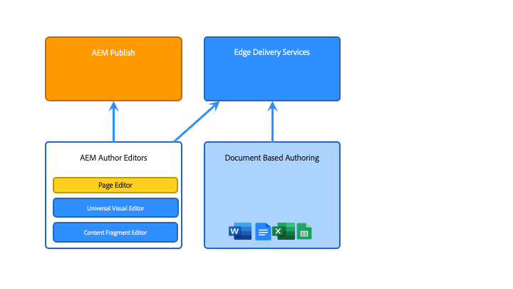

# Présentation de l’architecture d’Adobe Experience Manager as a Cloud Service {#an-introduction-to-the-architecture-adobe-experience-manager-as-a-cloud-service}

>[!CONTEXTUALHELP]
>id="intro_aem_cloudservice_architecture"
>title="Présentation de l’architecture d’AEM as a Cloud Service"
>abstract="Dans cet onglet, vous pouvez afficher la nouvelle architecture d’AEM as a Cloud Service et comprendre les modifications. AEM a généré une architecture dynamique avec un nombre variable d’images. Il est donc important de prendre le temps de comprendre l’architecture cloud."
>additional-url="https://video.tv.adobe.com/v/330542/" text="Aperçu de l’architecture"

Adobe Experience Manager (AEM) as a Cloud Service propose un ensemble de services composables pour la création et la gestion d’expériences à fort impact.

Cette page présente l’architecture logique, l’architecture de service, l’architecture système et l’architecture de développement pour AEM as a Cloud Service.

## Architecture logique {#logical-architecture}

AEM as a Cloud Service est constitué de solutions de haut niveau telles qu’AEM Sites, AEM Assets et AEM Forms. Ces services sont sous licence individuelle, mais peuvent être utilisés en collaboration. Chaque solution utilise une combinaison de services composables fournis par AEM as a Cloud Service, selon leurs cas d’utilisation respectifs.

### Programmes {#programs}

AEM les demandes sont matérialisées sous la forme d&#39;une [Programme](/help/implementing/cloud-manager/getting-access-to-aem-in-cloud/program-types.md) que vous créez dans l’application Cloud Manager, en fonction de vos droits de licence. Ces programmes vous permettent de contrôler pleinement la manière dont l’application d’AEM associée est nommée, configurée et dont les autorisations sont attribuées, dans le cadre d’un projet particulier.

En tant que client, vous êtes généralement identifié par Adobe comme **client**, également appelé *Organisation IMS* (Système Identity Management). Un client peut avoir autant de programmes que nécessaire et disposer d’une licence. Par exemple, il est assez habituel de voir un programme central pour AEM Assets, tandis qu’AEM Sites peut être utilisé dans plusieurs programmes correspondant à plusieurs expériences en ligne.

>[!NOTE]
>
>AEM Edge Delivery Services sont présentés comme une solution de niveau supérieur dans Cloud Manager, tout en faisant partie des autres solutions principales du point de vue de la licence. Par exemple, AEM Sites avec des Edge Delivery Services.

Un programme peut être configuré avec n’importe quelle combinaison de solutions de haut niveau, et chaque solution peut prendre en charge depuis des modules complémentaires de type &quot;un à plusieurs&quot;. Par exemple, Commerce ou Screens pour AEM Sites, Dynamic Media ou Brand Portal pour AEM Assets.

### Environnements {#environments}

Une fois un programme créé avec les solutions AEM Sites, AEM Assets ou AEM Forms, les instances d&#39;AEM associées seront représentées sous la forme d&#39;environnements AEM dans ce programme.

Il existe quatre types [environnement](/help/implementing/cloud-manager/manage-environments.md) disponible avec AEM as a Cloud Service :

* Environnement de production :

   * Un environnement de production héberge les applications destinées aux professionnels et exécute les expériences en direct.

* Environnement d’évaluation :

   * Un environnement intermédiaire est généralement associé à un environnement de production dans une relation 1:1.
   * L’environnement intermédiaire est principalement conçu pour les tests automatisés avant que les modifications apportées à l’application ne soient transmises à l’environnement de production.
      * Cela est indépendant des modifications initiées par Adobe dans le cadre d’une mise à jour de maintenance ou par vos déploiements de code.
      * Vous pouvez également effectuer des tests manuels dans le cas d’un déploiement de code.
   * Le contenu de l’environnement intermédiaire est généralement conservé synchronisé avec le contenu de production à l’aide de la fonction de copie de contenu en libre-service.
* Environnement de développement:
   * Un environnement de développement permet aux développeurs de mettre en oeuvre et de tester AEM applications dans les mêmes conditions d’exécution que les environnements d’évaluation et de production.
   * Les modifications passent par un pipeline de déploiement qui permet les mêmes points de contrôle de sécurité et de qualité de code que dans les pipelines de déploiement de production.
* Environnement de développement rapide (RDE) :
   * Un environnement RDE permet des itérations de développement rapides lors du déploiement de code nouveau ou existant dans les instances RDE, sans passer par un pipeline de déploiement officiel, comme dans les environnements de développement standard.

### Edge Delivery Services {#logical-architecture-edge-delivery-services}

Un programme AEM peut être configuré avec la variable [Services de diffusion Edge](/help/edge/overview.md) ainsi que .

Une fois configuré, AEM peut référencer des référentiels de code GitHub utilisés pour créer des expériences avec des Edge Delivery Services. Par conséquent, de nouvelles options de configuration deviennent disponibles pour les expériences associées. Il s’agit notamment de configurer le réseau de diffusion de contenu géré par l’Adobe et d’accéder aux mesures de licence ou aux rapports SLA.

## Architecture du service {#service-architecture}

La liste des services composables de haut niveau dans AEM as a Cloud Service peut être représentée par deux segments : Gestion de contenu et Diffusion d’expérience :

Pour la gestion de contenu, il existe deux ensembles principaux de services pour la création de contenu, tous deux représentés par *sources de contenu*:

* Niveau Auteur AEM : fournit une interface web (avec les API associées) pour la gestion du contenu web. Cela fonctionne pour les deux approches :
   * En-tête - via l’éditeur de page et l’éditeur universel
   * Sans affichage - via l’éditeur de fragment de contenu
* Niveau de création basé sur les documents : permet de créer du contenu à l’aide d’applications standard, telles que :
   * Microsoft Word et Excel - via SharePoint
   * Documents et feuilles Google - via Google Drive

Pour la diffusion d’expérience, lors de l’utilisation d’AEM Sites ou d’AEM Forms, il existe également deux ensembles principaux de services, non mutuellement exclusifs et fonctionnant sous un réseau de diffusion de contenu géré par l’Adobe partagé (Content Delivery Network) en tant qu’origines différentes :

* Niveau de publication AEM :
   * Exécute une ferme d’éditeurs et de dispatchers d’AEM standard, permettant le rendu dynamique des pages web et du contenu d’API (par exemple, GraphQL) assemblés avec du contenu publié.
   * repose principalement sur la logique d’application côté serveur.
* Niveau de publication de diffusion Edge :
   * Permet le rendu dynamique des pages web et du contenu de l’API provenant de diverses sources de contenu telles que le niveau Auteur AEM ou le niveau Création basée sur les documents.
   * est basé sur une logique d’application côté client et conçu pour des performances optimales ;

Il existe également des services connexes clés :

* Niveau de ressources de diffusion Edge :
   * Permet la diffusion d’éléments multimédias approuvés et publiés à partir d’AEM Assets. Images et vidéos, par exemple.
   * Les éléments multimédias sont généralement référencés à partir d’expériences s’exécutant sur le niveau de publication AEM, sur le niveau de publication Edge Delivery ou à partir de toute autre application Adobe Experience Cloud intégrée à AEM Assets.
* Le niveau Aperçu AEM et le niveau Aperçu Edge Delivery Services :
   * Sont également disponibles pour les expériences créées respectivement avec le niveau Publication AEM ou le niveau Publication de diffusion Edge.
   * Permet aux auteurs de contenu de prévisualiser le contenu en contexte avant les opérations de publication.

>[!NOTE]
>
>Par défaut, les programmes Assets uniquement n’ont pas de niveau de publication ni de niveau d’aperçu.

Il existe d’autres services adjacents :

* Le service de réplication :
   * Situé entre le niveau de gestion de contenu et le niveau de diffusion de l’expérience.
   * est responsable du traitement de la variable *publier* les opérations publiées par les auteurs de contenu, puis la fourniture du contenu publié aux niveaux de publication (AEM ou diffusion Edge).

  >[!NOTE]
  >Le service de réplication a fait l’objet d’une reconception complète par rapport aux versions 6.x d’AEM, car la structure de réplication des versions précédentes d’AEM n’est plus utilisée pour publier du contenu.
  >
  >La dernière architecture est basée sur une *publier et s’abonner* approche avec les files d’attente de contenu basées sur le cloud. Pour le niveau de publication AEM, il permet à un nombre variable d’éditeurs de s’abonner au contenu de publication et est essentiel pour réaliser une mise à l’échelle automatique réelle et rapide pour AEM as a Cloud Service

* Le service Content Repository :
   * Est utilisé par le niveau Auteur AEM.
   * est une instance cloud d’un référentiel de contenu compatible JCR, implémentée par la technologie Apache Oak ;
   * La persistance du contenu repose principalement sur l’espace de stockage dans le cloud basé sur l’objet Blob.
* Le service CI/CD :
   * Représente le sous-ensemble des fonctionnalités de Cloud Manager dédiées à la gestion des pipelines de déploiement dans les environnements AEM.
* Le service Testing :
   * Représente l’infrastructure sous-jacente utilisée pour exécuter :
      * tests fonctionnels,
      * Tests de l’interface utilisateur : par exemple, basés sur des scripts Selenium ou Cypress,
      * tests d’audit d’expérience : par exemple, scores Lighthouse,

     dans le cadre d’un pipeline de déploiement vers un environnement AEM ou dans le cadre d’une demande d’extraction GitHub vers un référentiel de code de diffusion Edge.
* Le service de données :
   * est chargé d’exposer les données client, telles que les mesures de licence (par exemple, les demandes de contenu, le stockage, les utilisateurs) ou les rapports d’utilisation (tels que le nombre de chargements, de téléchargements) ;
   * Les données client peuvent être exposées via des API et dans des interfaces utilisateur de produit (telles que Cloud Manager).
* Le service de mesure de l’utilisateur réel (RUM) :
   * est chargé de collecter les mesures clés d’une expérience client (telles que les pages vues, les éléments vitaux du web de base, les événements de conversion) et de répondre aux requêtes associées (par exemple, les principales pages vues d’un domaine donné au cours des 7 derniers jours) ;
* Le service Asset Compute :
   * est responsable du traitement des images, vidéos et documents téléchargés ; par exemple, des fichiers PDF et Adobe Photoshop. Le traitement peut utiliser Adobe Sensei pour extraire des métadonnées image et vidéo (telles que des balises descriptives ou des tons de couleur primaires), puis générer des rendus (tels que des tailles ou des formats différents), avec accès aux API telles que les API Adobe Photoshop et Adobe Lightroom.
* Le service Identity Management (IMS) :
   * est l’emplacement central responsable de la gestion et de l’authentification des utilisateurs et des groupes d’utilisateurs pour une application Adobe Experience Cloud donnée (par exemple, Cloud Manager ou le niveau Auteur AEM) ;
   * Est accessible via Adobe Admin Console.

## Architecture du système {#system-architecture}

### AEM des niveaux Auteur, Aperçu et Publication {#aem-author-preview-publish-tiers}

Les niveaux Auteur et Publication d’AEM sont mis en oeuvre sous la forme d’un ensemble de conteneurs Docker, gérés par un service Container Orchestration standard. L’architecture en conteneur qui en résulte signifie un système entièrement dynamique avec un nombre variable de capsules, en fonction de l’activité réelle (pour la gestion de contenu) et du trafic réel (pour la diffusion d’expérience). Cela permet à AEM as a Cloud Service de s’adapter à vos schémas de trafic au fur et à mesure qu’ils changent.

Le niveau Auteur AEM est utilisé comme un cluster d’AEM pods Auteur partageant un seul référentiel de contenu. Au moins deux capsules permettent une continuité d’activité pendant l’exécution des tâches de maintenance ou pendant un processus de déploiement.

Le niveau Publication d’AEM fonctionne comme une ferme d’instances de publication d’AEM, chacune disposant de son propre référentiel de contenu de contenu publié. Chaque éditeur est couplé à une instance Apache unique équipée du module Dispatcher AEM pour une vue matérialisée du contenu, servant d’origine au réseau de diffusion de contenu géré par l’Adobe. Deux capsules au minimum permettent également une continuité de l’activité, mais il n’est pas rare de voir ce nombre augmenter en périodes de trafic élevé.

Le niveau Aperçu de l’AEM comprend un noeud AEM unique. Il est utilisé pour l’assurance qualité du contenu avant la publication au niveau de publication. Des temps d’arrêt occasionnels, en particulier lors des déploiements, peuvent se produire sur le niveau d’aperçu.

### Edge Delivery Services {#system-architecture-edge-delivery-services}

Les Edge Delivery Services sont exploités sur un réseau de diffusion de contenu et une infrastructure sans serveur pour l’assemblage des pages de la manière la plus performante. Lorsqu’une ressource est demandée, l’infrastructure sans serveur est responsable de la conversion du contenu publié en HTML sémantique et sert d’origine au réseau de diffusion de contenu.

La conversion en HTML sémantique se produit à partir du contenu publié diffusé à partir du niveau AEM auteur ou de l’environnement de création basé sur les documents.

Le diagramme suivant illustre comment modifier le contenu des sites dans Microsoft Word (création basée sur des documents) et le publier sur Edge Delivery. Il présente également la méthode de publication traditionnelle AEM à l’aide de différents éditeurs.

Comme les Edge Delivery Services font partie de Adobe Experience Manager, Edge Delivery, AEM Sites et AEM Assets peuvent coexister sur le même domaine. Il s’agit d’un cas d’utilisation courant pour les sites web plus volumineux. Par exemple, un client peut souhaiter migrer une page particulière à trafic élevé vers des Edge Delivery Services, tandis que toutes les autres pages peuvent rester au niveau de publication AEM.

## Architecture de développement {#development-architecture}

### Référentiels de code {#code-repositories}

Le code et la configuration des projets AEM sont stockés dans un référentiel de code, à partir duquel des pipelines de déploiement sont émis lorsque des modifications sont apportées. Il existe différents types de référentiels de code :

* AEM pile complète :
   * Pour stocker du code Java côté serveur et des configurations OSGI pour les niveaux de création et de publication d’AEM.
* AEM front-end :
   * Pour stocker le code JS côté client, CSS et HTML pour les niveaux de création et de publication d’AEM.
Pour plus d’informations sur les bibliothèques clientes, voir [Utilisation des bibliothèques côté client sur AEM as a Cloud Service.](/help/implementing/developing/introduction/clientlibs.md)
* Niveau web AEM :
   * Stocke les fichiers de configuration du Dispatcher pour le niveau de publication AEM.
* Configuration AEM :
   * Permet de stocker diverses options de configuration (telles que les paramètres du réseau de diffusion de contenu ou les paramètres des tâches de maintenance) pour les niveaux de publication AEM et de publication Edge Delivery Services.
* Diffusion AEM Edge :
   * Pour stocker le code JS, CSS et HTML côté client pour les sites créés avec les Edge Delivery Services

### Pipelines de déploiement {#deployment-pipelines}

Les développeurs et les administrateurs gèrent l’application as a Cloud Service AEM à l’aide d’un service CI/CD (Continuous Integration/Continuous Delivery) disponible via Cloud Manager. Cloud Manager expose également tout ce qui a trait à la surveillance, à la maintenance, au dépannage (par exemple, l’accès aux fichiers journaux) et aux licences.

Cloud Manager gère toutes les mises à jour apportées à vos instances de l’AEM as a Cloud Service. Il est obligatoire, car il s’agit du seul moyen de créer, de tester et de déployer l’application cliente sur les niveaux Auteur, Aperçu et Publication. Ces mises à jour peuvent être déclenchées par Adobe, lorsqu’une nouvelle version d’AEM Cloud Service est prête, ou par vous-même, lorsqu’une nouvelle version de votre application est prête.

Ceci est mis en oeuvre par un pipeline de déploiement, couplé à chaque environnement au sein d’un programme. Lorsqu’un pipeline Cloud Manager est en cours d’exécution, il crée une version de l’application du client, tant pour le niveau Auteur que pour le niveau Publication. Pour ce faire, il combine les packages clients les plus récents à la dernière image de base Adobe.

Le pipeline de déploiement est déclenché lorsque les clients apportent des modifications au code ou lorsque Adobe déploie une nouvelle version de maintenance.

Dans les deux cas, le même ensemble de tests automatisés est exécuté. Il est constitué de tests :

* contribution d’Adobe pour garantir l’intégrité du produit
* tests fournis par le client
   * Tests fonctionnels : http
   * Tests de l’interface utilisateur : basés sur la technologie Selenium ou Cypress

Ces tests automatisés sont exécutés dans l’environnement d’évaluation. C’est pourquoi il est important de maintenir le contenu de l’environnement d’évaluation aussi près que possible du contenu sur l’instance de production.

Une fois tous les tests réussis, le nouveau code est déployé dans l’environnement de production.

### Mises à jour en continu {#rolling-updates}

Cloud Manager automatise entièrement la transition vers la dernière version de l’application AEM en mettant à jour tous les noeuds de service à l’aide d’un modèle de mise à jour continue. Cela signifie qu’il y a **aucun temps d’arrêt** pour le service de création ou de publication.

## Principales innovations depuis AEM 6.x {#major-innovations-since-aem-6x}

La dernière architecture d&#39;AEM as a Cloud Service introduit quelques modifications et innovations fondamentales par rapport aux générations précédentes (AEM 6.x et précédentes) :

* Tous les fichiers sont directement chargés et diffusés à partir d’un entrepôt de données cloud. Le flux de bits associé ne passe jamais par la JVM des services AEM Author et AEM Publish. Par conséquent, les noeuds des services de création et de publication d’AEM peuvent être plus petits et donc plus compatibles avec l’attente d’une mise à l’échelle automatique rapide. Pour les professionnels, cela se traduit par une expérience plus rapide lors du chargement et du téléchargement d’images, de vidéos et d’autres tâches.

* Toutes les opérations qui consistent à publier du contenu impliquent désormais un pipeline suivant un schéma d’abonnement. Le contenu publié est envoyé vers différentes files d’attente dans le pipeline, auxquelles s’abonnent tous les nœuds du service de publication. Par conséquent, le niveau Auteur ne doit pas connaître le nombre de nœuds présents dans le service de publication ; cela permet une mise à l’échelle automatique rapide du niveau Publication.

* L’architecture sépare complètement le contenu de l’application de son code et de sa configuration. L’ensemble du code et de la configuration est pratiquement immuable et intégré à l’image de base utilisée pour créer les différents nœuds des services d’auteur et de publication. Vous avez ainsi la garantie absolue que tous les nœuds sont identiques, et que les modifications apportées au code et à la configuration ne peuvent être effectuées de manière globale qu’en exécutant un pipeline Cloud Manager.

* L’architecture comprend plusieurs micro-services reposant sur la technologie sans serveur, en particulier avec l’exécution Adobe I/O.

## Informations supplémentaires {#further-information}

Voir également :

* Edge Delivery Services:

   * [AEM Aperçu as a Cloud Service - avec les Edge Delivery Services](/help/edge/overview.md)
   * [Utilisation d’Edge Delivery Services](/help/edge/using.md)
   * [Explorez l’architecture sous-jacente et les éléments importants d’AEM as a Cloud Service avec Edge Delivery Services](https://experienceleague.adobe.com/docs/experience-manager-learn/cloud-service/introduction/architecture.html?lang=fr)
