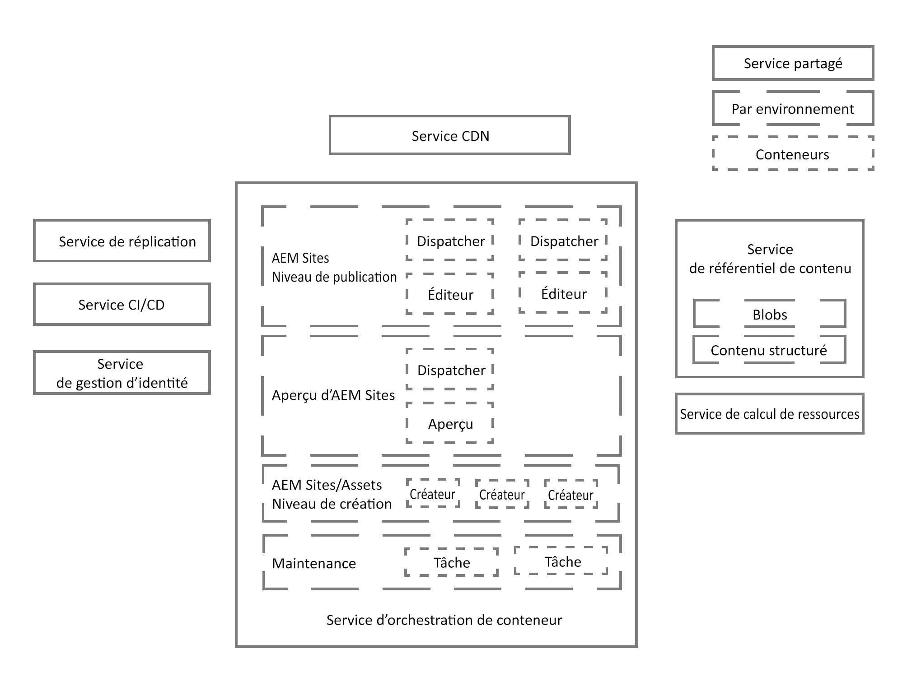
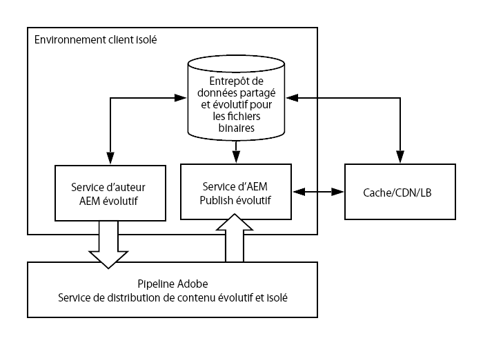

# Présentation de l’architecture d’Adobe Experience Manager as a Cloud Service {#an-introduction-to-the-architecture-adobe-experience-manager-as-a-cloud-service}

>[!CONTEXTUALHELP]
>id="intro_aem_cloudservice_architecture"
>title="Présentation de l’architecture d’AEM as a Cloud Service"
>abstract="Dans cet onglet, vous pouvez afficher la nouvelle architecture d’AEM as a Cloud Service et comprendre les modifications. AEM a généré une architecture dynamique avec un nombre variable d’images. Il est donc important de prendre le temps de comprendre l’architecture cloud."
>additional-url="https://video.tv.adobe.com/v/330542/" text="Aperçu de l’architecture"

Adobe Experience Manager (AEM) as a Cloud Service a entraîné des modifications au niveau de l’architecture.

## Mise à l’échelle {#scaling}

AEM as a Cloud Service présente désormais les caractéristiques suivantes :

* Une architecture dynamique avec un nombre variable d’images AEM.

Cette architecture :

* est mise à l’échelle en fonction du trafic *réel* et de l’activité *réelle* ;

* comporte des instances individuelles qui ne s’exécutent que lorsque cela s’avère nécessaire ;

* utilise des applications modulaires ;

* comprend un cluster d’auteur par défaut, ce qui permet d’éviter les temps d’arrêt pour les tâches de maintenance.

Cela permet une mise à l’échelle automatique pour divers schémas d’utilisation :

Pour ce faire, toutes les instances d’AEM as a Cloud Service sont créées de la même manière, chacune avec les mêmes caractéristiques de mise à l’échelle par défaut en termes de nombre de nœuds, de mémoire allouée et de capacité de calcul allouée.

AEM as a Cloud Service repose sur l’utilisation d’un moteur d’orchestration qui :

* contrôle constamment l’état du service ;

* met à l’échelle, de manière dynamique, chacune des instances de service en fonction des besoins réels ; vers le haut ou vers le bas, suivant le cas.

Cela :

* s’applique au nombre de nœuds, à la quantité de mémoire et à la capacité du processeur allouée sur chaque nœud ;

* permet à AEM as a Cloud Service de s’adapter aux variations de vos schémas de trafic.

La mise à l’échelle des instances par client du service s’applique aux deux axes :

* Horizontal : le nombre de noeuds pour un service donné est augmenté ou diminué automatiquement, tout en autorisant des configurations par défaut individuelles.

* Vertical : la mémoire allouée et la capacité du processeur peuvent être augmentées ou réduites par le biais de la configuration pour un nombre fixe de noeuds afin de répondre aux besoins individuels si nécessaire.

## Environnements {#environments}

>[!NOTE]
>Pour plus d’informations, voir [Déploiement - Modes d’exécution](/help/implementing/deploying/overview.md#runmodes)

AEM as a Cloud Service est mis à la disposition des utilisateurs sous forme d’instances individuelles, chaque instance représentant un environnement AEM complet.

Trois types d’environnements sont disponibles avec AEM as a Cloud Service :

* **Environnement de production** : héberge les applications destinées aux professionnels.

* **Environnement d’évaluation** : cet environnement est toujours couplé à un environnement de production unique dans une relation 1:1. L’environnement d’évaluation est utilisé pour divers tests de performances et de qualité avant que les modifications apportées à l’application ne soient transmises à l’environnement de production.

* **Environnement de développement** : permet aux développeurs d’implémenter des applications AEM dans les mêmes conditions d’exécution que les environnements d’évaluation et de production.

   Pour plus d’informations, consultez [Gestion des environnements](https://experienceleague.adobe.com/docs/experience-manager-cloud-service/implementing/using-cloud-manager/manage-environments.html?lang=fr#using-cloud-manager).

* **Environnement de développement rapide** : permet des itérations de développement rapide pour le débogage de code nouveau ou existant.

## Programmes {#programs}

Tout nouveau projet AEM est toujours lié à une seule base de code spécifique, où vous pouvez stocker le code de configuration et le code personnalisé de votre projet. Ces informations sont stockées dans un référentiel de code, accessibles par le biais des clients Git habituels et mises à votre disposition au moment de la création de programmes.

Un programme AEM est le conteneur qui comprend les éléments suivants :

|  Élément de programme |  Nombre |
|--- |--- |
| Référentiel de code (Git) |  1 |
| Image de base (Sites ou Assets) |  1 |
| Ensemble d’environnements d’évaluation et de production (1:1) | 0 ou 1 |
| Environnements hors production (RDE, développement ou démonstration). | 0 à N |
| Pipeline pour chaque environnement | 0 ou 1 |

Initialement, deux types de programmes sont disponibles pour AEM as a Cloud Service :

* AEM Cloud Sites Service

* AEM Cloud Assets Service

Ces deux programmes permettent d’accéder à un certain nombre de fonctionnalités. Le niveau de création comprend toutes les fonctionnalités Sites et Assets pour l’ensemble des programmes, mais les programmes Assets sont dépourvus, par défaut, du niveau de publication et du niveau de prévisualisation.

## Architecture d’exécution {#runtime-architecture}

Cette nouvelle architecture comporte différents éléments principaux :

<!--- needs reworking -->

* Pour AEM Sites as a Cloud Service :

   * Le concept de niveaux de création et de publication est toujours présent pour chaque environnement (à un niveau élevé).

   * Le niveau Auteur est constitué de plusieurs nœuds au sein d’un cluster Auteur unique. Il est mis à l’échelle automatiquement, en fonction de l’activité de création.

      * Les auteurs/créateurs de contenu se connectent au niveau AEM Author pour créer, modifier et gérer du contenu.

      * La connexion au niveau Auteur est gérée par Adobe Identity Management Services (IMS).

      * L’intégration et le traitement des ressources utilisent un service de calcul dédié d’Assets.
   * Le niveau de prévisualisation comprend un nœud d’aperçu unique. Celui-ci est utilisé pour l’assurance qualité du contenu avant publication au niveau de publication.

   * Le niveau Publication comprend deux noeuds ou plus au sein d’une seule ferme de publication.

      * Les noeuds peuvent fonctionner indépendamment les uns des autres.

      * Chaque nœud est constitué d’un éditeur AEM et d’un serveur web équipé du module AEM Dispatcher.

      * La mise à l’échelle s’effectue automatiquement en fonction des besoins en matière de trafic sur le site.

      * Par défaut, il existe une seule ferme de publication dans la région Principale, mais [zones de publication supplémentaires](/help/operations/additional-publish-regions.md) peut être sous licence.

      * Les utilisateurs finaux, ou les visiteurs du site, consultent le site web via le service AEM Publish.

* Pour AEM Assets as a Cloud Service :

   * L’architecture comprend uniquement un environnement de création.

* Les niveaux Auteur, Aperçu et Publication lisent et conservent le contenu depuis/vers un service de référentiel de contenu.

   * Les niveaux de publication et d’aperçu ne lisent que le contenu du calque de persistance.

   * Quant au niveau Auteur, il lit du contenu en provenance du calque de persistance et l’écrit sur ce calque.

   * L’espace de stockage Blobs est partagé sur l’ensemble des niveaux Auteur, Aperçu et Publication ; les fichiers ne sont pas *déplacés*.

   * Lorsque le contenu est approuvé à partir du niveau Auteur, cela indique qu’il peut être activé et donc envoyé au calque de persistance du niveau de publication, ou, facultativement, au niveau d’aperçu. Cela se produit au moyen du service de réplication, un pipeline de middleware. Ce pipeline reçoit le nouveau contenu ; les différents nœuds du service de publication individuels (ou du service d’aperçu) s’abonnent au contenu envoyé vers le pipeline.

      >[!NOTE]
      >
      >Pour plus d’informations, voir [Réplication](/help/operations/replication.md).

   * Pour gérer l’application AEM as a Cloud Service, les développeurs et administrateurs utilisent un service CI/CD (Continuous Integration/Continuous Delivery) disponible via [Cloud Manager](/help/overview/what-is-new-and-different.md#cloud-manager). Cela inclut les déploiements de code et de configuration à l’aide du CI/CD Pipeline de Cloud Manager. Tout ce qui a trait à la surveillance, à la maintenance et à la résolution des problèmes (les fichiers journaux, par exemple) est présenté aux clients dans Cloud Manager.

   * L’accès aux niveaux Auteur et Publication s’effectue toujours via la répartition de charge. La mise à jour est toujours garantie grâce aux nœuds actifs de chacun des niveaux.

   * Pour le niveau Publication et le niveau Aperçu, un service CDN (Continuous Delivery Network) est également disponible en tant que premier point d’entrée.

* Pour les instances de démonstration d’AEM as a Cloud Service, l’architecture est simplifiée sous la forme d’un nœud Auteur unique. Il ne présente donc pas toutes les caractéristiques de l’environnement de développement, d’évaluation ou de production standard. Cela signifie également qu’il peut y avoir des temps d’arrêt, et que les opérations de sauvegarde/restauration ne sont pas prises en charge.

## Architecture de déploiement {#deployment-architecture}

Cloud Manager gère toutes les mises à jour des instances d’AEM as a Cloud Service. Cela est obligatoire, dans la mesure où il s’agit du seul moyen de créer, de tester et de déployer l’application du client, tant sur le niveau Auteur que sur les niveaux Aperçu et Publication. Ces mises à jour peuvent être déclenchées soit par Adobe lorsqu’une nouvelle version du service cloud AEM est prête, soit par le client lorsqu’une nouvelle version de son application est prête.

Sur le plan technique, cela est mis en œuvre grâce au concept de pipeline de déploiement, couplé à chaque environnement à l’intérieur d’un programme. Lorsqu’un pipeline Cloud Manager est en cours d’exécution, il crée une version de l’application du client, tant pour le niveau Auteur que pour les niveaux Aperçu et Publication. Pour ce faire, il combine les packages clients les plus récents à la dernière image de base Adobe. Une fois les nouvelles images créées et testées, Cloud Manager automatise entièrement le basculement vers la dernière version de l’image en mettant à jour tous les nœuds de service à l’aide d’un schéma de mise à jour continue. Cela n’entraîne aucun temps d’arrêt pour le service d’auteur ni pour le service de publication.

<!--- needs reworking -->

## Distribution de contenu {#content-distribution}

Adobe Experience Manager as a Cloud Service modifie dont le contenu est publié. Avec AEM as a Cloud Service, la structure de réplication des versions précédentes d’AEM n’est plus utilisée pour publier des pages (les modifications sont déplacées de l’instance de création vers les instances de publication).

AEM as a Cloud Service utilise désormais la fonctionnalité [Sling Content Distribution](https://sling.apache.org/documentation/bundles/content-distribution.html) pour déplacer le contenu approprié. Celle-ci utilise un service de pipeline exécuté sur Adobe I/O, à l’extérieur de l’exécutable AEM.

L’installation est automatisée, ce qui inclut la configuration automatique lorsque des nœuds de publication sont ajoutés, supprimés ou recyclés au moment de l’exécution.

Une seule requête de publication ou de dépublication peut inclure plusieurs ressources, mais elle renvoie un état unique qui est appliqué à toutes ; la requête en question aboutit, ou échoue, pour toutes les ressources du service AEM Publish. De cette façon, les ressources du service AEM Publish ne se trouvent jamais dans un état incohérent.

**Diagramme de l’architecture de distribution de contenu de haut niveau**

## Principales évolutions {#key-evolutions}

La nouvelle architecture d’AEM as a Cloud Service s’accompagne de quelques modifications et innovations fondamentales par rapport aux générations précédentes :

* Tous les fichiers (blobs) sont directement chargés et diffusés à partir d’un magasin de données cloud. Le flux de bits associé ne passe jamais par la JVM des services AEM Author et AEM Publish. En conséquence, les nœuds des services AEM Author et AEM Publish peuvent être plus petits et plus en phase avec les attentes en matière de mise à l’échelle automatique rapide. Pour les professionnels, cela se traduit par un chargement et un téléchargement plus rapides des images, des vidéos, etc.

* Toutes les opérations qui consistent à publier du contenu impliquent désormais un pipeline suivant un schéma d’abonnement. Le contenu publié est envoyé vers différentes files d’attente dans le pipeline, auxquelles s’abonnent tous les nœuds du service de publication. Par conséquent, le niveau Auteur ne doit pas connaître le nombre de nœuds présents dans le service de publication ; cela permet une mise à l’échelle automatique rapide du niveau Publication.

* Le concept de « golden master » a été introduit afin d’automatiser le cycle de vie des nœuds de publication. Il s’agit d’un nœud de publication spécialisé, auquel aucun utilisateur final n’accède jamais, et à partir duquel sont créés tous les nœuds du service de publication. Les opérations de maintenance, telles que le compactage, sont effectuées sur le référentiel de contenu associé au « golden master ». Les nœuds de publication sont recyclés tous les jours et ne nécessitent aucune maintenance de routine ; auparavant, ce type de maintenance entraînait des temps d’arrêt, en particulier pour l’instance de création.

* L’architecture sépare complètement le contenu de l’application de son code et de sa configuration. L’ensemble du code et de la configuration est pratiquement immuable et intégré à l’image de base utilisée pour créer les différents nœuds des services d’auteur et de publication. Vous avez ainsi la garantie absolue que tous les nœuds sont identiques, et que les modifications apportées au code et à la configuration ne peuvent être effectuées de manière globale qu’en exécutant un pipeline Cloud Manager.
