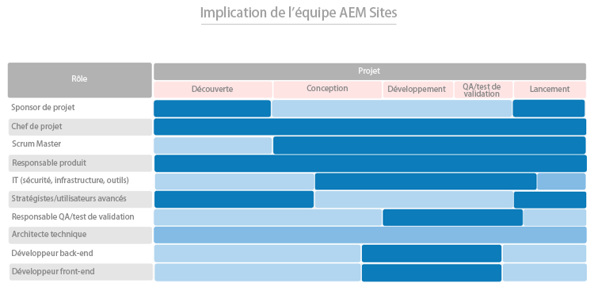

# Il faut, pour commencer, que les bonnes personnes exercent les bonnes fonctions. {#get-the-right-people-in-the-right-roles}

>[!CONTEXTUALHELP]
>id="aemcloud_chooseteam"
>title="Choisir la bonne équipe"
>abstract="Placer les bonnes personnes aux bons postes pour aider à la réussite de votre déploiement Adobe Experience Manager."
>additional-url="https://experienceleague.adobe.com/docs/experience-manager-cloud-service/onboarding/best-practices/aligning-kpis.html?lang=fr" text="Aligner des KPI"
>additional-url="https://experienceleague.adobe.com/docs/experience-manager-cloud-service/onboarding/best-practices/assessing-kpis.html?lang=fr" text="Évaluer les KPI"

Il est probable qu’au sein de votre organisation, plusieurs départements possèdent différents aspects de l’expérience digitale. Sans gouvernance, cette phase est propice à un débat sans fin, à des querelles intestines et à la confusion.

La phase initiale de la gouvernance numérique consiste à déterminer qui est responsable de quoi et qui effectue quelle tâche fondée sur le numérique. Vous devrez peut-être procéder à des embauches stratégiques pour incorporer les compétences nécessaires. Un autre défi encore plus important est d’opérer un changement de culture en construisant un large soutien à la nouvelle technologie et en aidant les personnes concernées à se familiariser avec de nouvelles façons de faire les choses. L’un des éléments clés de cet effort réside dans la création d’une communauté numérique qui permet aux gens d’apprendre mutuellement et de s’entraider.

Pour l’instant, nous nous concentrerons sur la mise en place des bonnes personnes aux bons postes pour aider à la réussite de votre déploiement Adobe Experience Manager. Pour chaque produit principal (Experience Manager Sites et Experience Manager Assets), Adobe a établi une liste de rôles que vous devrez remplir, ainsi que les compétences, les niveaux d’expertise et les attributs qui rendent les gens efficaces dans ces différents rôles.

Votre tâche cette semaine consiste à passer en revue ces deux listes avec votre équipe de mise en œuvre et de vous assurer de disposer de personnes possédant les qualifications adéquates à chaque rôle.

## **Fonctions clés pour AEM Experience Manager Sites**

Une équipe gagnante a besoin de neuf personnes aux bons postes – tout comme votre équipe chargée du déploiement. Votre réussite avec Adobe Experience Manager Sites dépend de la force des membres de votre équipe et de leur capacité à travailler ensemble. Assurez-vous que ces neuf fonctions sont attribuées
aux personnes ayant les qualifications suggérées.

| Rôle | Compétences | Niveau de capacité | Qualités |
|--- |--- |--- |--- |
| Chef de projet | Certification PMP, certification Agile, expérience de gestion des risques | Expert | Juste, cohérent, responsable, organisé, positif, accessible, prêt à accepter le changement |
| Scrum Master | Certification ScrumMaster, certification Agile, expérience de facilitation | Expert | Cohérent, créatif |
| Responsable du produit | Certification Agile, compréhension approfondie des besoins commerciaux | Expert | Équilibré, confiant |
| Responsables informatiques pour la sécurité, l’infrastructure, les outils | Certification CISM, certification Adobe Experience Manager Component Developer | Expert | Souci du détail |
| Stratèges/utilisateurs expérimentés | Compétence sur Adobe Experience Manager Sites | Novice à expert | Tenace, curieux, minutieux, ouverture d’esprit, prêt à accepter le changement, collaboratif |
| Responsable Assurance qualité/Tests de validation utilisateur | Certification Agile, compréhension du cycle de vie du développement logiciel (SDLC) | Novice à intermédiaire | Souci du détail, motivé par les processus, cohérence |
| Architecte technique | Expérience en infrastructure informatique | Expert | Souci du détail, motivé par les processus, cohérence |
| Développeur back-end | Certification Agile, expérience en programmation et en informatique | Novice à intermédiaire | Souci du détail, motivé par les processus, cohérence |
| Développeur front-end | Certification Agile, compréhension des langages HTML et JavaScript, des propriétés CSS | Novice à intermédiaire | Souci du détail, motivé par les processus, cohérence |

Maintenant que vous connaissez les fonctions requises, consultez le graphique ci-dessous pour savoir à quel moment chaque rôle entre en jeu dans le processus de mise en œuvre.

 

**Examinez les deux listes avec votre équipe chargée de la mise en œuvre** et assurez-vous que vous disposez de personnes possédant les qualifications appropriées dans chaque fonction. Les membres de l’équipe qui connaissent moins bien Adobe Experience Cloud peuvent utiliser les ressources de formation [Experience League](https://experienceleague.adobe.com/fr?lang=fr#recommended/solutions/experience-manager) pour obtenir leur certification par le biais d’[Adobe Digital Learning](https://learning.adobe.com/certification.html).

## **Fonctions clés d’AEM Experience Manager Assets**

De l’architecte au scrum master, chaque fonction au sein de cette équipe est indispensable – y compris le bibliothécaire de la gestion des actifs numériques (DAM).

Vous disposez peut-être déjà de la plupart des personnes nécessaires pour mettre en œuvre avec succès Adobe Experience Manager Assets. Cette liste est similaire à celle d’Adobe Experience Manager Sites, avec un élément additionnel important : vous aurez besoin d’un ou d’une bibliothécaire pour vous assurer que vos ressources numériques sont organisées et étiquetées de façon à les rendre faciles à trouver.

| Rôle | Compétences | Niveau de capacité | Qualités |
|--- |--- |--- |--- |
| Chef de projet | Certification PMP, certification Agile, expérience de gestion des risques | Expert | Juste, cohérent, responsable, organisé, positif, accessible, prêt à accepter le changement |
| Scrum Master | Certification ScrumMaster, certification Agile, expérience de facilitation | Expert | Cohérent, créatif |
| Responsable du produit | Certification Agile, compréhension approfondie des besoins commerciaux | Expert | Équilibré, confiant |
| Responsables informatiques pour la sécurité, l’infrastructure, les outils | Certification CISM, certification Adobe Experience Manager Component Developer | Expert | Souci du détail |
| Stratèges/utilisateurs expérimentés | Compétence sur Adobe Experience Manager Sites | Novice à expert | Tenace, curieux, minutieux, ouverture d’esprit, prêt à accepter le changement, collaboratif |
| Responsable Assurance qualité/Tests de validation utilisateur | Certification Agile, compréhension du cycle de vie du développement logiciel (SDLC) | Novice à intermédiaire | Souci du détail, motivé par les processus, cohérence |
| Architecte technique | Expérience en infrastructure informatique | Expert | Souci du détail, motivé par les processus, cohérence |
| Développeur back-end | Certification Agile, expérience en programmation et en informatique | Novice à intermédiaire | Souci du détail, motivé par les processus, cohérence |
| Développeur front-end | Certification Agile, compréhension des langages HTML et JavaScript, des propriétés CSS | Novice à intermédiaire | Souci du détail, motivé par les processus, cohérence |
| Bibliothécaire DAM | Expérience et diplôme en sciences des bibliothèques | Expert | Souci du détail, motivé par les processus, organisé |

Maintenant que vous connaissez les fonctions requises, consultez le graphique ci-dessous pour savoir à quel moment chaque rôle entre en jeu dans le processus de mise en œuvre.

 

.

>[!TIP]
>
> En savoir plus sur Adobe Experience Cloud, exploiter les ressources sur [Experience League](https://experienceleague.adobe.com/fr?lang=fr#recommended/solutions/experience-manager) et obtenir une certification par [Adobe Digital Learning](https://learning.adobe.com/certification.html).
