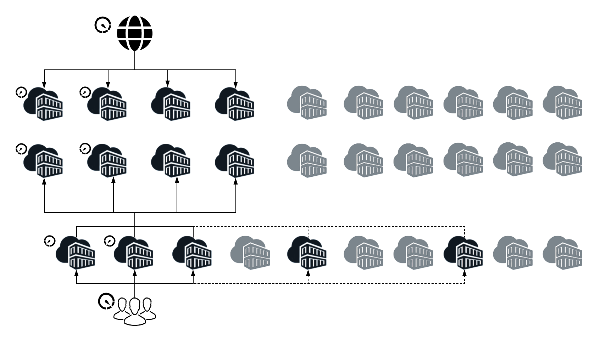

# Nouveautés et différences {#what-is-new-and-what-is-different}

Depuis de nombreuses années, AEM est disponible :

* Local

* en tant que service géré

Il existe des différences intrinsèques entre ces approches antérieures et l&#39;AEM en tant que Cloud Service :

* [Architecture](#architecture)
* [Mises à niveau](#upgrades)
* [Cloud Manager](#cloud-manager)
* [Intégration](#onboarding)
* [Développement](#developing)
* [Opérations et performances](#operations-and-performance)
* [Gestion d’identité](#identity-management)
* [Interface utilisateur de création](#authoring-user-interface)
* [AEM Sites](#aem-sites)
* [AEM Assets](#aem-assets)

>[!NOTE]
>
>Ces aperçus ne sont pas exhaustifs, mais visent à fournir une introduction.

>[!NOTE]
>
>Pour plus d&#39;informations sur les versions sur site et de service géré, consultez la documentation relative à l&#39; [AEM 6.5](https://helpx.adobe.com/fr/support/experience-manager/6-5.html).

## Architecture {#architecture}

>[!NOTE]
>
>Pour plus de détails, voir [Architecture](/help/core-concepts/architecture.md).

AEM as a Cloud Service présente désormais les caractéristiques suivantes :

* Une architecture dynamique avec un nombre variable d’images AEM.

Cette architecture :

* est mise à l’échelle en fonction du trafic *réel* et de l’activité *réelle* ;

* comporte des instances individuelles qui ne s’exécutent que lorsque cela s’avère nécessaire ;

* utilise des applications modulaires ;

* comprend un cluster d’auteur par défaut, ce qui permet d’éviter les temps d’arrêt pour les tâches de maintenance.

Cela permet une mise à l’échelle automatique pour divers schémas d’utilisation :

## Mises à jour AEM {#upgrades}

>[!NOTE]
>Pour plus d&#39;informations, reportez-vous à l&#39; [AEM Version Updates](/help/implementing/deploying/aem-version-updates.md).

aem en tant que Cloud Service utilise maintenant l&#39;intégration continue et la Diffusion continue (CI/CD) pour s&#39;assurer que vos projets se trouvent sur la version AEM la plus récente.

Cela signifie que les instances Production et Stage sont mises à jour vers la dernière version AEM sans interruption de service pour les utilisateurs.

>[!NOTE]
> Si la mise à jour de l’environnement de production échoue, Cloud Manager annule automatiquement l’environnement d’évaluation. Cette opération est effectuée automatiquement pour s’assurer qu’une fois la mise à jour terminée, les environnements d’étape et de production se trouvent sur la même version AEM.

aem mises à jour de version sont de deux types :

* **Mises à jour Push**

   * Peut être publié quotidiennement.
   * Principalement la maintenance, y compris les derniers correctifs de bogues et les mises à jour de sécurité.

      Les modifications étant appliquées régulièrement, l’impact est incrémentiel, ce qui réduit l’impact sur votre service.

* **Nouvelles fonctionnalités mises à jour**

   * Publié selon un calendrier mensuel prévisible.

## Cloud Manager {#cloud-manager}

adobe Cloud Manager fait partie intégrante de l’approche de mise à niveau continue de l’AEM en tant que Cloud Service, car il contrôle toutes les mises à jour apportées à vos instances - ce qui est obligatoire.

Les mises à jour peuvent être déclenchées par Adobe lorsqu’une nouvelle version du service cloud est disponible. Vous pouvez également déclencher les mises à jour de votre application à l’aide des pipelines fournis par Cloud Manager.

Cloud Manager est :

* utilisé pour gérer les programmes et environnements AEM,

* une composante essentielle de l&#39;AEM en tant que Cloud Service ; chaque nouveau client est d’abord configuré pour l’accès à Cloud Manager,

* point d’entrée unique pour votre personnel d’exploitation et de développement.

Plus précisément, le nombre et le type d’programmes d’AEM pouvant être créés à partir de Cloud Manager sont dérivés de :

* du contrat de licence client,

* d&#39;acteurs internes lorsque l&#39;AEM en tant que Cloud Service est utilisé pour l&#39;activation ou la formation,

* des processus externes tels que les essais ont commencé à partir de Adobe.com.

Cloud Manager a évolué en tant que portail en libre-service où les principaux composants de l’AEM en tant que Cloud Service peuvent être créés et configurés :

* Création et gestion de nouveaux programmes. Pour plus d&#39;informations, consultez [Présentation des Programmes et des types](/help/onboarding/getting-access-to-aem-in-cloud/understand-program-types.md) de Programme.

* Création et gestion des environnements AEM dans ces programmes. Refer to [Managing Environments](/help/implementing/cloud-manager/manage-environments.md) for more details.

* Création et gestion des pipelines pour le déploiement du code client et de la configuration associée sur un environnement spécifique. Consultez [Configuration de votre pipeline](/help/implementing/cloud-manager/configure-pipeline.md) CI-CD pour plus d&#39;informations.

* Être informé des événements de cycle de vie importants de ces composants (par exemple, les mises à jour de produits).

Actuellement, Cloud Manager est en mesure de créer des environnements dans 3 régions géographiques (avec plus de régions suivantes) :

* États-Unis (Est)

* EMEA (Pays-Bas)

* APAC (Australie)

>[!NOTE]
>Reportez-vous à [Accès au Experience Manager en tant que Cloud Service](/help/onboarding/getting-access-to-aem-in-cloud/navigation.md) pour commencer à utiliser Cloud Manager en AEM en tant que Cloud Service.

## Intégration {#onboarding}

>[!NOTE]
>
>Pour plus d’informations, voir [Intégration](/help/onboarding/home.md).

Le démarrage et la gestion d&#39;un projet AEM sont simples lorsque l&#39;utilisation d&#39;AEM en tant que service Cloud en tant qu&#39;Adobe est responsable de nombreux aspects :

* Les images d’AEM de référence sont optimisées pour des cas d’utilisation spécifiques.

* La plupart des tâches de configuration manuelle ont été rendues redondantes.

Elle est également très différente de celle qui existe actuellement :

* une phase d&#39;évaluation pour s&#39;assurer que toutes les conditions préalables ont été remplies ; par exemple :

   * Exigences juridiques

   * Accords contractuels

   * Exigences techniques pour tout contenu et/ou code existant personnalisé par le client

* Conditions requises pour le déploiement :

   * Mises à jour du code ; toutes les applications client développées pour une version précédente d&#39;AEM devront être examinées et éventuellement mises à jour.

   * Migration du contenu

## Développement {#developing}

>[!NOTE]
>
>Pour plus de détails, vous pouvez début avec les lignes directrices  de développement et [Développement - le tutoriel](/help/implementing/developing/introduction/develop-wknd-tutorial.md)WKND.

La nouvelle architecture qui prend en charge l&#39;AEM en tant que Cloud Service implique quelques changements clés dans l&#39;expérience globale des développeurs. L’un des principaux objectifs de l’AEM en tant que Cloud Service est de permettre aux clients expérimentés (ayant utilisé AEM sur site ou dans le contexte des services gérés Adobe) de migrer vers l’ le plus rapidement possible en tant que Cloud Service, sans avoir à réécrire la majeure partie de leur code personnalisé. Toutefois, certains ajustements pourraient encore être nécessaires.

### Développement du cloud {#aem-as-a-cloud-service-developing-cloud-development}

Pour que les applications AEM existantes s’exécutent sur AEM en tant que Cloud Service, les étapes suivantes sont attendues :

* Le code et la configuration de l’application doivent être stockés dans le référentiel de code Git du programme Cloud Manager associé.
* Le code et la configuration de l&#39;application doivent être compatibles avec la dernière version de l&#39;AEM de ligne de base (qui peut changer quotidiennement).
   * L’application cliente doit être créée et déployée à l’aide du pipeline Cloud Manager associé à l’environnement Cloud Manager.
* L&#39;application cliente doit transmettre toutes les barrières de qualité, de sécurité et de performances du code appliquées dans le pipeline.
* Les images créées pour l’application cliente doivent être déployées par le pipeline Cloud Manager.

Ce processus est généralement appelé développement Cloud initial. Comme la durée de bout en bout doit prendre des minutes (de 20 à 50 selon la complexité de l&#39;application), il est nécessaire d&#39;adopter des méthodologies de développement rapide avant que le code en attente et les modifications de configuration ne soient tentées dans le cloud.

La console Web, dans laquelle les lots OSGI et leur configuration associée sont gérés, et qui faisait auparavant partie de l&#39;AEM QuickStart, n&#39;est plus directement accessible aux utilisateurs d&#39;un AEM en tant qu&#39;environnement Cloud Service. Cette interface est toujours accessible en mode lecture seule à l’aide d’une nouvelle console de développement. Avec cette console, les développeurs peuvent sélectionner et se connecter directement à n’importe quel noeud particulier d’un service d’auteur ou de publication, puis accéder aux zones bloquées par défaut.

>[!NOTE]
>
>Voir aussi Configuration [OSGi](/help/implementing/deploying/overview.md#osgi-configuration)

Une autre exigence courante pour les développeurs est l&#39;accès rapide aux fichiers journaux des différents environnements. Avec l’AEM en tant que Cloud Service, les fichiers journaux des différents noeuds des noeuds d’auteur et de publication sont disponibles via Cloud Manager, sous la forme de fichiers pouvant être téléchargés ou via des API.

En raison de la séparation claire du code et du contenu, les développeurs peuvent utiliser un processus particulier de mise à jour du contenu dans le cadre d’un déploiement. Les cas d’utilisation types pour le contenu mutable sont les suivants :

* Contenu *par défaut* standard faisant partie du projet client (dossiers, modèles, workflows, etc.)

* Rechercher les définitions d&#39;index

* Listes ACL et autorisations

* Utilisateurs du service et groupes d’utilisateurs

### Développement local {#aem-as-a-cloud-service-developing-local-development}

Afin de soutenir les itérations et le développement rapides, il est également possible de développer des applications AEM en dehors de l&#39;AEM en tant que contexte Cloud Service. À cette fin, les artefacts suivants sont mis à la disposition des développeurs :

* L&#39;AEM en tant que Cloud Service QuickStart : un programme d&#39;installation autonome `.jar` basé sur la dernière base de code AEM, avec la même surface fonctionnelle et API.

* L’AEM en tant que SDK Cloud Service Dispatcher : un processus basé sur les images pour tester et valider localement les configurations du répartiteur

>[!NOTE]
>
>Notez que Cloud QuickStart ne prend pas en charge toutes les fonctionnalités AEM Sites et AEM Assets. Il s&#39;agit d&#39;un simple environnement d&#39;auteur où la majorité des extensions peuvent être développées et testées.

## Opérations et performances {#operations-and-performance}

>[!NOTE]
>
>Pour plus d’informations, commencez par [Sauvegarde](/help/operations/backup.md), [Indexation](/help/operations/indexing.md) et [autres tâches de maintenance](/help/operations/maintenance.md).

Avec l&#39;AEM en tant que Cloud Service, ces opérations sont automatisées de sorte que toute interruption de service n&#39;est plus nécessaire.

Dans ces domaines :

* De nombreuses tâches ont été automatisées.

* Les topologies sont optimisées pour une résilience et une efficacité optimales ; par exemple, la réplication binaire est la réplication par défaut.

* Les tâches à charge importante, telles que les files d’attente, les tâches et les tâches de traitement en masse, ont été déplacées hors de l’instance AEM principale pour être gérées par des micro-services partagés et dédiés.

Les opérations d&#39;AEM en tant que Cloud Service sont également soutenues par une nouvelle infrastructure de surveillance, de rapports et d&#39;alerte. Cela permet aux SREs Adobes (Ingénieurs de fiabilité du site) de maintenir le service en bonne santé de façon proactive. Les différents éléments de l&#39;architecture sont équipés d&#39;une variété de contrôles de santé. Si, pour une raison quelconque, un noeud particulier de l&#39;architecture est jugé malsain, il est retiré du service et remplacé en silence par un nouveau noeud sain.

## Gestion d’identité {#identity-management}

>[!NOTE]
>
>Pour plus de détails, voir [Sécurité - Soutien](/help/security/ims-support.md)IMS.

Un changement majeur apporté à l’AEM en tant que Cloud Service est l’utilisation entièrement intégrée des identifiants d’Adobe pour l’accès au niveau auteur.

Pour ce faire, vous devez utiliser la console [d’administration des](https://helpx.adobe.com/fr/enterprise/using/admin-console.html) Adobes pour gérer les utilisateurs et les groupes d’utilisateurs. Les comptes d’utilisateurs permettent à vos utilisateurs d’accéder aux produits et services d’Adobe, dans la mesure où les informations utilisateur-profil sont centralisées dans l’Adobe Identity Management System (IMS) à partager dans tous les services de cloud. Une fois que l&#39;accès à l&#39;AEM est accordé, les comptes d&#39;utilisateurs peuvent être référencés en AEM en tant que Cloud Service (comme auparavant); par exemple, pour définir des rôles et des autorisations à partir des interfaces utilisateur AEM Security.

Cela permet de combiner les avantages suivants :

* Utilisation de l’Adobe Identity Management System (IMS) pour fournir une authentification unique à toutes les applications de cloud d’Adobes.

* Préférences utilisateur restantes locales pour chaque instance particulière d’AEM en tant que Cloud Service.

## Interface utilisateur de création {#authoring-user-interface}

>[!NOTE]
>
>Pour plus de détails, la gestion  de base est un bon point de départ.

Les principes de base de l’interface utilisateur de création, tant pour les sites que pour les ressources, seront très familiers à toute personne qui a utilisé AEM dans le passé.

La principale différence réside dans le fait que l’interface utilisateur est uniquement tactile ; l’interface utilisateur classique n’est plus disponible. Sinon, les bases restent inchangées, avec seulement de petits changements apparents.

## AEM Sites {#aem-sites}

adobe experience manager sites en tant que Cloud Service vous permet de fournir à vos clients des expériences personnalisées basées sur le contenu, en combinant la puissance du système d’Gestion de contenu AEM avec AEM Digital Asset Management.

Pour plus d&#39;informations, reportez-vous à l&#39;aperçu des [modifications apportées aux sites](/help/sites-cloud/sites-cloud-changes.md).

## AEM Assets {#aem-assets}

Adobe Experience Manager Assets en tant que Cloud Service offre une solution SaaS native de cloud pour les entreprises, qui leur permet non seulement d’exécuter rapidement et efficacement leurs opérations de gestion des ressources numériques et de médias dynamiques, mais également d’utiliser des fonctionnalités intelligentes de prochaine génération, telles que l’IA/ML, à partir d’un système toujours à jour, toujours disponible et toujours en cours d’apprentissage.

L’offre de ressources inclut le traitement des ressources de nouvelle génération dans le cloud et la recherche et l’assimilation des ressources hautes performances.

Pour plus d’informations, voir [Présentation et présentation des ressources en tant que Cloud Service](/help/assets/overview.md).

## Premiers pas avec Adobe Experience Manager as a Cloud Service {#getting-to-know-aem-as-cloud-service}

Pour plus d’informations, voir :

* [Introduction à Adobe Experience Manager as a Cloud Service](/help/overview/introduction.md)
* [Architecture](/help/core-concepts/architecture.md) d’Adobe Experience Manager as a Cloud Service
* [Modifications notables apportées à AEM as a Cloud Service (notes de mise à jour)](/help/release-notes/aem-cloud-changes.md)
* [Modifications notables apportées à AEM Sites as a Cloud Service](/help/sites-cloud/sites-cloud-changes.md)
* [Modifications notables apportées à AEM Assets as a Cloud Service](/help/assets/assets-cloud-changes.md)
* [Introduction à AEM Assets as a Cloud Service](/help/assets/overview.md)
* [Tutoriels sur Adobe Experience Manager as a Cloud Service](https://docs.adobe.com/content/help/en/experience-manager-learn/cloud-service/overview.html)
