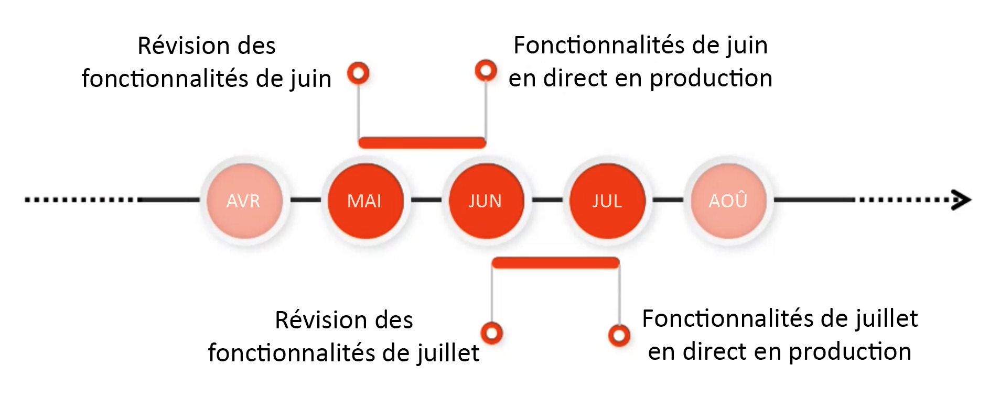
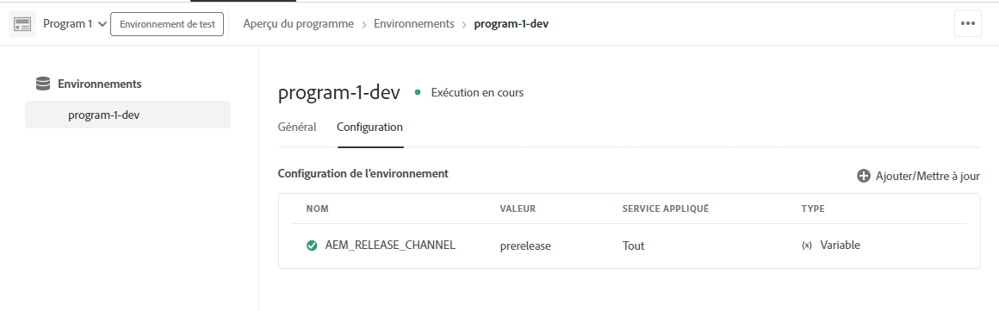

# Canal de version préliminaire d’Adobe Experience Manager as a Cloud Service {#prerelease-channel}

Découvrez comment utiliser le canal de version préliminaire pour obtenir un aperçu des prochaines fonctionnalités d’AEM as a Cloud Service.

## Présentation {#introduction}

Adobe Experience Manager as a Cloud Service offre régulièrement de nouvelles fonctionnalités, conformément à la feuille de route des versions de [Experience Manager ](https://experienceleague.adobe.com/docs/experience-manager-release-information/aem-release-updates/update-releases-roadmap.html?lang=fr#aem-as-cloud-service).

Pour vous familiariser avec les fonctionnalités programmées pour la prochaine mise à jour, vous pouvez vous abonner au canal de version préliminaire. Il vous suffit de configurer vos environnements de développement ou tout environnement de sandbox. Vous pouvez prévisualiser les modifications accessibles par le biais de l’interface utilisateur d’AEM et créer du code par rapport à toute nouvelle API en version préliminaire.

La liste des fonctionnalités de version préliminaire pour une mise à jour donnée est publiée dans les [notes de mise à jour](/help/release-notes/release-notes-cloud/release-notes-current.md).

## Mises à jour d’AEM as a Cloud Service {#releases}

AEM as a Cloud Service comporte deux types de mises à jour :

* Une fois activées, les **mises à jour** ajoutent de nouvelles fonctionnalités à AEM as a Cloud Service.
* Les **versions de maintenance** ajoutent des mises à jour de sécurité, des améliorations de performances et des correctifs. Elles sont appliquées régulièrement et fréquemment.

Ce calendrier de publication permet d’offrir des mises à jour continues sans interruption de service.

Le canal de version préliminaire vous permet de prévisualiser les fonctionnalités contenues dans la prochaine mise à jour. Vous pouvez ainsi les évaluer et planifier leur mise en œuvre dans vos propres projets. Vous prenez ainsi une longueur d’avance pour la mise en œuvre de la prochaine version.

Par exemple, si nous sommes au mois de mai et que vous disposez d’un abonnement au canal de version préliminaire, vous pouvez évaluer les fonctionnalités de la version de juin.



En vous abonnant au canal de version préliminaire, vous pouvez découvrir les prochaines fonctionnalités d’AEM un mois avant leur publication. Vous disposez ainsi de suffisamment de temps pour évaluer l’impact des nouvelles fonctionnalités sur vos projets et personnalisations, ainsi que pour planifier le déploiement des fonctionnalités, les tests et la formation des utilisateurs et utilisatrices.

Pour tirer pleinement parti du canal de version préliminaire, suivez les quatre étapes suivantes.

1. [Marquez votre calendrier](#mark-calendars)
1. [Consultez les notes de mise à jour](#release-notes)
1. [Accédez aux nouvelles fonctionnalités et testez-les](#new-features)
1. [Formez vos utilisateurs et utilisatrices](#train-users)

## Marquer votre calendrier {#mark-calendars}

Le calendrier des mises à jour est établi bien à l’avance et les dates de publication sont publiées le [Adobe Experience League](https://experienceleague.adobe.com/docs/experience-manager-release-information/aem-release-updates/update-releases-roadmap.html?lang=fr#aem-as-cloud-service).

Notez les dates dans votre agenda afin de consacrer du temps à l’examen et aux tests des prochaines fonctionnalités.

## Consulter les notes de mise à jour {#release-notes}

Une fois les dates de publication ajoutées à votre calendrier, accédez au site web [Adobe Experience League](/help/release-notes/release-notes-cloud/release-notes-current.md) le jour J pour consulter les dernières notes de mise à jour.

Chaque version est accompagnée de notes de mise à jour qui décrivent les nouveautés apportées par la version, mais également les fonctionnalités disponibles en version préliminaire. Prenez une longueur d’avance et tirez parti des dernières fonctionnalités d’AEMaaCS !

Vous pouvez également [consulter les problèmes connus](/help/release-notes/maintenance/latest.md), publiés avec chaque version, afin d’être informé(e) de tout problème technique qui pourrait empêcher le bon déroulement des tests ou l’adoption des nouvelles fonctionnalités.

## Activer le canal de version préliminaire pour accéder aux nouvelles fonctionnalités et les essayer {#new-features}

Le canal de version préliminaire peut être activé dans tout environnement de développement ou de sandbox. Toutefois, il ne peut pas être activé dans les environnements d’évaluation et de production.

Les fonctionnalités de la version préliminaire peuvent être expérimentées de différentes manières :

* [Environnements cloud](#cloud-environments)
* [SDK local](#local-sdk)

### Environnements cloud {#cloud-environments}

Pour activer le canal de version préliminaire dans un environnement cloud, vous devez ajouter une nouvelle variable d’environnement. Cette opération peut être réalisée dans l’interface utilisateur de Cloud Manager ou l’interface de ligne de commande.

#### Ajouter une variable d’environnement à l’aide de l’interface utilisateur {#add-with-ui}

1. Connectez-vous à Cloud Manager à l’adresse [my.cloudmanager.adobe.com](https://my.cloudmanager.adobe.com/) et sélectionnez l’organisation appropriée.

1. Accédez au programme pour lequel vous souhaitez activer le canal de version préliminaire.

1. Sélectionnez l’environnement dans lequel vous souhaitez activer le canal de version préliminaire, puis accédez à **Programme** > **Environnement** > **Configuration de l’environnement** pour le configurer.

1. Ajoutez une nouvelle [variable d’environnement](../implementing/cloud-manager/environment-variables.md)

   | Nom | Valeur | Service appliqué | Type |
   |------|-------|-----------------|------|
   | `AEM_RELEASE_CHANNEL` | `prerelease` | Tous | Variable |

1. Enregistrez les modifications et l’environnement s’actualisera avec les boutons (bascule) pour les fonctionnalités de version préliminaire activées.

   

#### Ajouter une variable d’environnement à l’aide de l’interface de ligne de commande {#add-with-cli}

Vous pouvez également utiliser l’API Cloud Manager et l’interface de ligne de commande pour mettre à jour les variables d’environnement.

* À l’aide du point d’entrée des variables d’environnement de l’API Cloud Manager [](https://developer.adobe.com/experience-cloud/cloud-manager/reference/api/#operation/patchEnvironmentVariables), définissez la variable d’environnement `AEM_RELEASE_CHANNEL` sur la valeur `prerelease`.

  ```text
  PATCH /program/{programId}/environment/{environmentId}/variables
  [
          {
                  "name" : "AEM_RELEASE_CHANNEL",
                  "value" : "prerelease",
                  "type" : "string"
          }
  ]
  ```

* [L’interface de ligne de commande de Cloud Manager](https://github.com/adobe/aio-cli-plugin-cloudmanager#aio-cloudmanagerset-environment-variables-environmentid) peut également être utilisée.

  ```shell
  aio cloudmanager:environment:set-variables <ENVIRONMENT_ID> --programId=<PROGRAM_ID> --variable AEM_RELEASE_CHANNEL "prerelease
  ```

La variable peut être supprimée ou redéfinie sur une autre valeur si vous souhaitez que l’environnement soit restauré avec le comportement du canal normal (hors version préliminaire).

### SDK local {#local-sdk}

Vous pouvez voir les nouvelles fonctionnalités de la console Sites dans le SDK de démarrage rapide local et le code par rapport aux nouvelles API dans la version préliminaire en configurant votre projet Maven de façon à référencer le `API Jar` de la version préliminaire situé dans Maven Central. Vous pouvez également voir ces fonctionnalités dans votre environnement de développement local en démarrant le SDK de démarrage rapide standard en mode version préliminaire.

#### Démarrer le SDK de démarrage rapide en mode version préliminaire {#prerelease-mode}

1. Téléchargez le SDK à partir du portail de distribution de logiciels et installez-le comme décrit dans la section [Accès au SDK d’AEM as a Cloud Service](/help/implementing/developing/introduction/aem-as-a-cloud-service-sdk.md).
1. Lors du lancement du démarrage rapide du SDK, incluez l’argument `-r prerelease`.

La valeur est sticky. Elle ne peut donc être sélectionnée que lors du premier démarrage. Réinstallez le SDK pour modifier l’option de ligne de commande.

Comme il peut y avoir plusieurs versions de maintenance AEM entre les versions mensuelles des fonctionnalités, vous pouvez télécharger ces nouveaux SDK et référencer les nouvelles versions du SDK API Jar dans les projets Maven. Les versions de maintenance n’ajouteront pas de fonctionnalités de version préliminaire supplémentaires, mais pourraient inclure d’autres modifications plus modestes comme des correctifs de bogues ou de sécurité et des améliorations de performances.
Les JavaDocs sont publiés sur Maven Central.

#### Créer une version à partir du SDK de version préliminaire {#build-sdk}

1. Modifiez le `pom.xml` de votre projet maven pour référencer un jar de l’API du SDK de version préliminaire distinct, qui est publié sur Maven Central. Il contient une nouvelle API Java pour les fonctionnalités de la version préliminaire et possède une dépendance liée au jar de l’API du SDK. Il utilise la même version.

   À titre d’exemple, voici un extrait de code de la section de gestion des dépendances du modèle pom parent faisant référence au jar de l’API standard :

   ```
   <dependencyManagement>
    <dependencies>
        <dependency>
            <groupId>com.adobe.aem</groupId>
            <artifactId>aem-sdk-api</artifactId>
            <version>${aem.sdk.api}</version>
            <scope>provided</scope>
        </dependency>
   ```

   Puis l’utilisation dans un module :

   ```
    <dependencies>
     <dependency>
         <groupId>com.adobe.aem</groupId>
         <artifactId>aem-sdk-api</artifactId>
     </dependency>
   ```

   Pour passer au SDK de la version préliminaire, remplacez simplement la dépendance de `com.adobe.aem:aem-sdk-api` par `com.adobe.aem:aem-prerelease-sdk-api` comme indiqué ci-dessous :

   ```
   <dependencyManagement>
    <dependencies>
      <dependency>
            <groupId>com.adobe.aem</groupId>
            <artifactId>aem-prerelease-sdk-api</artifactId>
            <version>${aem.sdk.api}</version>
            <scope>provided</scope>
      </dependency>
   <dependencies>
      <dependency>
         <groupId>com.adobe.aem</groupId>
         <artifactId>aem-prerelease-sdk-api</artifactId>
      </dependency>
   ```

   Comme d’habitude, les projets individuels peuvent utiliser la dépendance.

1. Procédez au déploiement sur votre serveur local.

1. Si vous êtes satisfait(e) de son fonctionnement local, validez le code d’une branche de développement et utilisez un pipeline hors production Cloud Manager pour le déploiement dans un environnement abonné au canal de version préliminaire.

>[!CAUTION]
> 
> L’artifactId `aem-prerelease-sdk-api` ne doit jamais être utilisé lors d’un déploiement dans l’environnement en évaluation ou production. Utilisez toujours le `aem-sdk-api` lors d’un déploiement via le pipeline de production. De même, le code référençant les API de version préliminaire ne doit pas être déployé via le pipeline de production.

Le [module externe maven d’analyseur de création du SDK CS AEM version 1.0, et versions ultérieures](https://experienceleague.adobe.com/docs/experience-manager-core-components/using/developing/archetype/build-analyzer-maven-plugin.html?lang=fr#developing) détectera si l’API de version préliminaire est utilisée dans un projet en examinant les dépendances. Si l’analyseur le trouve, il utilisera l’API du SDK de version préliminaire pour analyser le projet.

## Former vos utilisateurs et utilisatrices {#train-users}

Après avoir testé les nouvelles fonctionnalités dans le canal de version préliminaire et une fois que vous avez décidé de les exploiter dans vos projets, vous devez former vos utilisateurs et utilisatrices.

Adobe Experience League propose de nombreuses ressources pour apprendre à utiliser AEMaaCS.

* [Documentation d’AEMaaCS.](https://experienceleague.adobe.com/docs/experience-manager-cloud-service.html?lang=fr)
* [Tutoriels](https://experienceleague.adobe.com/docs/experience-manager-learn/aem-tutorials/overview.html?lang=fr)
* [Vidéo de présentation de la version mensuelle](/help/release-notes/release-notes-cloud/release-notes-current.md#release-video) dans les notes de mise à jour.

## Considérations {#considerations}

Quelques éléments doivent être pris en compte lors de l’utilisation du canal de version préliminaire.

* Le canal de version préliminaire ne contient pas nécessairement toutes les nouvelles fonctionnalités à déployer dans la version suivante.
* Les fonctionnalités de la version préliminaire sont soumises à un contrôle qualité rigoureux et sont conçues pour être complètes et non en version bêta. Si vous constatez des problèmes, signalez-les comme vous le feriez si vous suspectez des bogues dans les fonctionnalités d’une version d’AEM normale.
* Pour déterminer si un environnement est configuré pour le canal de version préliminaire, accédez à la page **À propos** de la console AEM et vérifiez si le numéro de version AEM comprend un suffixe *version préliminaire* tel que ```Adobe Experience Manager 2021.4.5226.20210427T070726Z-210429-PRERELEASE```.


