# Configurer la mise en réseau avancée pour AEM as a Cloud Service {#configuring-advanced-networking}

Cet article vise à vous présenter les différentes fonctionnalités de mise en réseau avancée d’AEM as a Cloud Service, y compris la mise en œuvre en libre-service et l’approvisionnement d’API de VPN, de ports non standard et d’adresses IP de sortie dédiées.

>[!TIP]
>
>Outre cette documentation, il existe également une série de tutoriels conçus pour vous guider dans les différentes options de mise en réseau avancée à cet [emplacement.](https://experienceleague.adobe.com/fr/docs/experience-manager-learn/cloud-service/networking/advanced-networking)

## Vue d’ensemble {#overview}

AEM as a Cloud Service propose les options de mise en réseau avancée suivantes :

* [Sortie de port flexible](#flexible-port-egress) : configurez AEM as a Cloud Service pour autoriser le trafic sortant des ports non standard.
* [Adresse IP de sortie dédiée](#dedicated-egress-ip-address) : configurez le trafic sortant d’AEM as a Cloud Service pour qu’il provienne d’une adresse IP unique.
* [Réseau privé virtuel (VPN)](#vpn) : sécurisez le trafic entre votre infrastructure et AEM as a Cloud Service, si vous avez un VPN.

Cet article décrit en détail chacune de ces options et les raisons pour lesquelles vous pouvez les utiliser, avant de décrire comment elles sont configurées à l’aide de l’interface utilisateur de Cloud Manager et de l’API. L’article se termine par quelques cas d’utilisation avancés.

>[!CAUTION]
>
>Si vous disposez déjà d’une technologie de sortie dédiée héritée et que vous souhaitez configurer l’une de ces options de mise en réseau avancée, [contactez le service clientèle d’Adobe](https://experienceleague.adobe.com/?support-solution=Experience+Manager&amp;lang=fr#home).
>
>Toute tentative de configuration d’une mise en réseau avancée à l’aide de la technologie héritée peut avoir un impact sur la connectivité du site.

### Exigences et restrictions {#requirements}

Lors de la configuration de fonctionnalités de mise en réseau avancée, les restrictions suivantes s’appliquent.

* Un programme peut fournir une option de mise en réseau avancée unique (sortie de port flexible, adresse IP de sortie dédiée ou VPN).
* La mise en réseau avancée n’est pas disponible pour les [programmes sandbox](/help/implementing/cloud-manager/getting-access-to-aem-in-cloud/program-types.md).
* Une personne doit bénéficier du rôle **Administrateur ou administratrice** pour ajouter et configurer l’infrastructure réseau dans votre programme.
* L’environnement de production doit être créé avant que l’infrastructure réseau puisse être ajoutée à votre programme.
* Votre infrastructure réseau doit se trouver dans la même région que la région principale de votre environnement de production.
   * Dans le cas où votre environnement de production possède [des régions de publication supplémentaires](/help/implementing/cloud-manager/manage-environments.md#multiple-regions), vous pouvez créer une autre infrastructure réseau reflétant chaque région supplémentaire.
   * Vous n’avez pas l’autorisation de créer plus d’infrastructures réseau que le nombre maximum de régions configurées dans votre environnement de production.
   * Vous pouvez définir autant d’infrastructures réseau que de régions disponibles dans votre environnement de production, mais la nouvelle infrastructure doit être du même type que l’infrastructure créée précédemment.
   * Lors de la création de plusieurs infrastructures, vous avez l’autorisation de choisir uniquement parmi les régions dans lesquelles aucune infrastructure réseau avancée n’a été créée.

### Configurer et activer la mise en réseau avancée {#configuring-enabling}

L’utilisation de fonctionnalités de mise en réseau avancée nécessite deux étapes :

1. Configuration de l’option de mise en réseau avancée, selon la priorité d’application de la [sortie de port flexible,](#flexible-port-egress) de l’[adresse IP de sortie dédiée,](#dedicated-egress-ip-address) ou du [VPN,](#vpn) au niveau du programme.
1. Pour être utilisée, l’option de mise en réseau avancée doit ensuite être [activée au niveau de l’environnement.](#enabling)

Les deux étapes peuvent être effectuées à l’aide de l’interface utilisateur de Cloud Manager ou de l’API Cloud Manager.

* Lorsque vous utilisez l’interface utilisateur de Cloud Manager, cela signifie créer des configurations réseau avancées à l’aide d’un assistant au niveau du programme, puis modifier chaque environnement dans lequel vous souhaitez activer la configuration.

* Lors de l’utilisation de l’API Cloud Manager, le point d’entrée de l’API `/networkInfrastructures` est appelé au niveau du programme pour déclarer le type de mise en réseau avancée souhaité. Il est suivi d’un appel au point d’entrée `/advancedNetworking` pour chaque environnement afin d’activer l’infrastructure et de configurer des paramètres spécifiques à l’environnement.

## Sortie de port flexible {#flexible-port-egress}

Cette fonctionnalité de mise en réseau avancée vous permet de configurer AEM as a Cloud Service pour récupérer le trafic par des ports autres que HTTP (port 80) et HTTPS (port 443), qui sont ouverts par défaut.

>[!TIP]
>
>Lorsque vous hésitez entre une adresse IP de sortie de port flexible et de sortie dédiée, il est recommandé de choisir une sortie de port flexible si aucune adresse IP spécifique n’est requise. Cela est dû au fait qu’Adobe peut optimiser les performances du trafic de sortie de port flexible.

>[!NOTE]
>
>Après leur création, les types d’infrastructure de sortie de port flexible ne peuvent pas être modifiés. La seule façon de modifier les valeurs de configuration consiste à les supprimer et à les recréer.

### Configuration de l’interface utilisateur {#configuring-flexible-port-egress-provision-ui}

1. Connectez-vous à Cloud Manager à l’adresse [my.cloudmanager.adobe.com](https://my.cloudmanager.adobe.com/) et sélectionnez l’organisation appropriée.

1. Sur la console **[Mes programmes](/help/implementing/cloud-manager/navigation.md#my-programs)**, sélectionnez le programme.

1. Dans la page **Vue d’ensemble du programme**, accédez à l’onglet **Environnements** et sélectionnez **Infrastructure réseau** dans le panneau de gauche.

   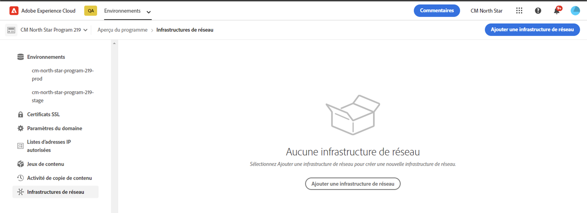

1. Dans l’assistant **Ajouter une infrastructure réseau**, sélectionnez **Sortie de port flexible** et la région dans laquelle elle doit être créée à partir du menu déroulant **Région**, puis cliquez sur **Continuer**.

   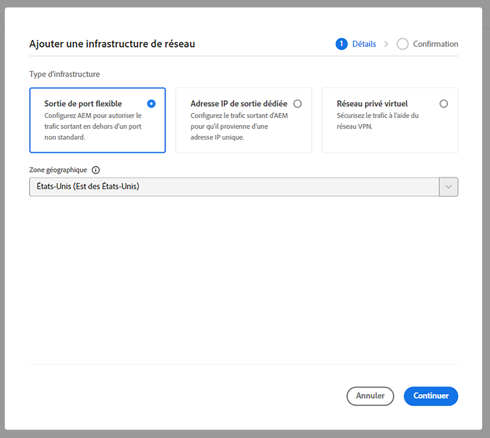

1. L’onglet **Confirmation** résume votre sélection et les étapes suivantes. Cliquez sur **Enregistrer** pour créer l’infrastructure.

   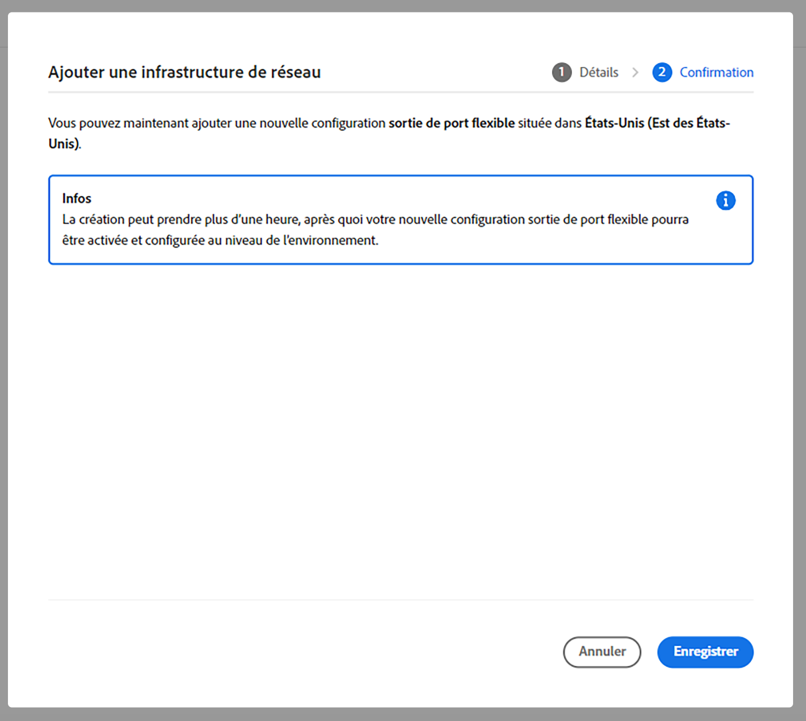

Un nouvel enregistrement s’affiche sous l’en-tête **Infrastructure réseau** dans le panneau latéral, y compris des détails sur le type d’infrastructure, le statut, la région et les environnements sur lesquels elle a été activée.

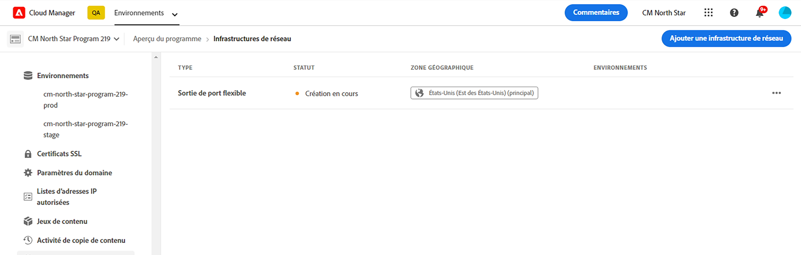

>[!NOTE]
>
>La création de l’infrastructure pour une sortie de port flexible peut prendre jusqu’à une heure, après quoi elle peut être configurée au niveau de l’environnement.

### Configuration de l’API {#configuring-flexible-port-egress-provision-api}

Une fois par programme, le point d’entrée `/program/<programId>/networkInfrastructures` POST est invoqué, simplement en transmettant la valeur du `flexiblePortEgress` pour le paramètre `kind` et la région. Le point d’entrée répond avec l’`network_id` et d’autres informations, y compris le statut.

Une fois l’appel lancé, l’approvisionnement de l’infrastructure réseau prend généralement environ 15 minutes. Un appel au [point d’entrée GET de l’infrastructure réseau](https://developer.adobe.com/experience-cloud/cloud-manager/reference/api/#operation/getNetworkInfrastructure) de Cloud Manager doit afficher le statut **prêt**.

>[!TIP]
>
>Le jeu complet de paramètres et la syntaxe exacte, ainsi que des informations importantes comme les paramètres qui ne peuvent pas être modifiés plus tard, [peuvent être consultés dans la documentation de l’API.](https://developer.adobe.com/experience-cloud/cloud-manager/reference/api/#operation/createNetworkInfrastructure)

### Routage du trafic {#flexible-port-egress-traffic-routing}

Pour le trafic http ou https se rendant dans des ports autres que 80 ou 443, un proxy doit être configuré à l’aide des variables d’environnement hôte et port suivantes :

* pour HTTP : `AEM_PROXY_HOST` / `AEM_HTTP_PROXY_PORT ` (valeur par défaut `proxy.tunnel:3128` dans les versions d’AEM &lt; 6094)
* pour HTTPS : `AEM_PROXY_HOST` / `AEM_HTTPS_PROXY_PORT ` (valeur par défaut `proxy.tunnel:3128` dans les versions d’AEM &lt; 6094)

Par exemple, voici un exemple de code pour envoyer une requête à `www.example.com:8443` :

```java
String url = "www.example.com:8443"
String proxyHost = System.getenv().getOrDefault("AEM_PROXY_HOST", "proxy.tunnel");
int proxyPort = Integer.parseInt(System.getenv().getOrDefault("AEM_HTTPS_PROXY_PORT", "3128"));
HttpClient client = HttpClient.newBuilder()
      .proxy(ProxySelector.of(new InetSocketAddress(proxyHost, proxyPort)))
      .build();
 
HttpRequest request = HttpRequest.newBuilder().uri(URI.create(url)).build();
HttpResponse<String> response = client.send(request, BodyHandlers.ofString());
```

Si vous utilisez des bibliothèques réseau Java™ non standard, configurez des proxys à l’aide des propriétés ci-dessus, pour tout le trafic.

Le trafic non http/s pointant vers des destinations via des ports déclarés dans le paramètre `portForwards` doit référencer une propriété appelée `AEM_PROXY_HOST`, ainsi que le port mappé. Par exemple :

```java
DriverManager.getConnection("jdbc:mysql://" + System.getenv("AEM_PROXY_HOST") + ":53306/test");
```

Le tableau ci-dessous décrit le routage du trafic :

<table>
<thead>
  <tr>
    <th>Trafic</th>
    <th>Condition de destination</th>
    <th>Port</th>
    <th>Connexion</th>
    <th>Exemple de destination externe</th>
  </tr>
</thead>
<tbody>
  <tr>
    <td><b>Protocole HTTP ou HTTPS</b></td>
    <td>Trafic http/s standard</td>
    <td>80 ou 443</td>
    <td>Autorisée</td>
    <td></td>
  </tr> 
  <tr>
    <td></td>
    <td>Trafic non standard (sur d’autres ports en dehors de 80 ou 443) via un proxy http configuré à l’aide de la variable d’environnement et du numéro de port du proxy suivant. Ne déclarez pas le port de destination dans le paramètre portForwards de l’appel API Cloud Manager :<br><ul>
     <li>AEM_PROXY_HOST (par défaut « proxy.tunnel » dans les versions d’AEM &lt; 6094)</li>
     <li>AEM_HTTPS_PROXY_PORT (port par défaut 3128 dans les versions d’AEM &lt; 6094)</li>
    </ul>
    <td>Ports autres que 80 ou 443</td>
    <td>Autorisée</td>
    <td>example.com:8443</td>
  </tr>
  <tr>
    <td></td>
    <td>Trafic non standard (sur d’autres ports autres que 80 ou 443) n’utilisant pas de proxy http</td>
    <td>Ports autres que 80 ou 443</td>
    <td>Bloquée</td>
    <td></td>
  </tr>
  <tr>
    <td><b>Non http ou non https</b></td>
    <td>Le client se connecte à la variable d’environnement <code>AEM_PROXY_HOST</code> à l’aide d’un <code>portOrig</code> déclaré dans le paramètre <code>portForwards</code> de l’API.</td>
    <td>N’importe lequel</td>
    <td>Autorisée</td>
    <td><code>mysql.example.com:3306</code></td>
  </tr>
  <tr>
    <td></td>
    <td>Tout le reste</td>
    <td>N’importe lequel</td>
    <td>Bloquée</td>
    <td><code>db.example.com:5555</code></td>
  </tr>
</tbody>
</table>

#### Configuration Apache/Dispatcher {#apache-dispatcher}

La directive `mod_proxy` Apache au niveau du Dispatcher d’AEM Cloud Service peut être configurée à l’aide des propriétés décrites ci-dessus.

```
ProxyRemote "http://example.com:8080" "http://${AEM_PROXY_HOST}:3128"
ProxyPass "/somepath" "http://example.com:8080"
ProxyPassReverse "/somepath" "http://example.com:8080"
```

```
SSLProxyEngine on //needed for https backends
 
ProxyRemote "https://example.com:8443" "http://${AEM_PROXY_HOST}:3128"
ProxyPass "/somepath" "https://example.com:8443"
ProxyPassReverse "/somepath" "https://example.com:8443"
```

## Adresse IP Egress dédiée {#dedicated-egress-ip-address}

Cette adresse IP dédiée peut améliorer la sécurité lors de l’intégration aux fournisseurs SaaS (comme un fournisseur de solutions de gestion de la relation client) ou d’autres intégrations en dehors d’AEM as a Cloud Service qui offrent une liste d’adresses IP autorisées. L’ajout de l’adresse IP dédiée à la liste autorisée garantit que seul le trafic provenant de votre instance AEM Cloud Service est autorisé à circuler dans le service externe. Cela s’ajoute au trafic provenant de toute autre adresse IP autorisée.

La même adresse IP dédiée est appliquée à tous les environnements d’un programme et s’applique aux services de création et de publication.

Si la fonction d’adresse IP dédiée n’est pas activée, le trafic provenant d’AEM as a Cloud Service passe par un jeu d’adresses IP partagées avec d’autres clientes et clients d’AEM as a Cloud Service.

La configuration de l’adresse IP de sortie dédiée est identique à celle d’une [sortie de port flexible.](#flexible-port-egress) La principale différence est que le trafic sortira toujours d’une adresse IP dédiée et unique après l’application de cette configuration. Pour trouver cette adresse IP, utilisez un résolveur DNS pour identifier l’adresse IP associée à `p{PROGRAM_ID}.external.adobeaemcloud.com`. L’adresse IP n’est pas censée changer, mais si elle le doit malgré tout, vous recevez une notification avancée.

>[!TIP]
>
>Lorsque vous hésitez entre une adresse IP de sortie de port flexible et de sortie dédiée, choisissez une sortie de port flexible si aucune adresse IP spécifique n’est requise. Cela est dû au fait qu’Adobe peut optimiser les performances du trafic de sortie de port flexible.

>[!NOTE]
>
>Si vous avez reçu une adresse IP de sortie dédiée avant le 30/09/2021 (à savoir la version de septembre 2021), votre fonction d’adresse IP de sortie dédiée ne prend en charge que les ports HTTP et HTTPS.
>
>Inclut le HTTP/1.1 et HTTP/2 lorsqu’ils sont chiffrés. De plus, un point d’entrée de sortie dédié peut uniquement communiquer avec une cible via HTTP/HTTPS sur les ports 80/443, respectivement.

>[!NOTE]
>
>Une fois créés, les types d’infrastructure d’adresses IP de sortie dédiée ne peuvent pas être modifiés. La seule façon de modifier les valeurs de configuration consiste à les supprimer et à les recréer.

### Configuration de l’interface utilisateur {#configuring-dedicated-egress-provision-ui}

1. Connectez-vous à Cloud Manager à l’adresse [my.cloudmanager.adobe.com](https://my.cloudmanager.adobe.com/) et sélectionnez l’organisation appropriée.

1. Sur la console **[Mes programmes](/help/implementing/cloud-manager/navigation.md#my-programs)**, sélectionnez le programme.

1. Dans la page **Vue d’ensemble du programme**, accédez à l’onglet **Environnements** et sélectionnez **Infrastructure réseau** dans le panneau de gauche.

   

1. Dans l’assistant **Ajouter une infrastructure réseau** qui démarre, sélectionnez **Adresse IP de sortie dédiée** et la région dans laquelle elle doit être créée à partir du menu déroulant **Région**, puis cliquez sur **Continuer**.

   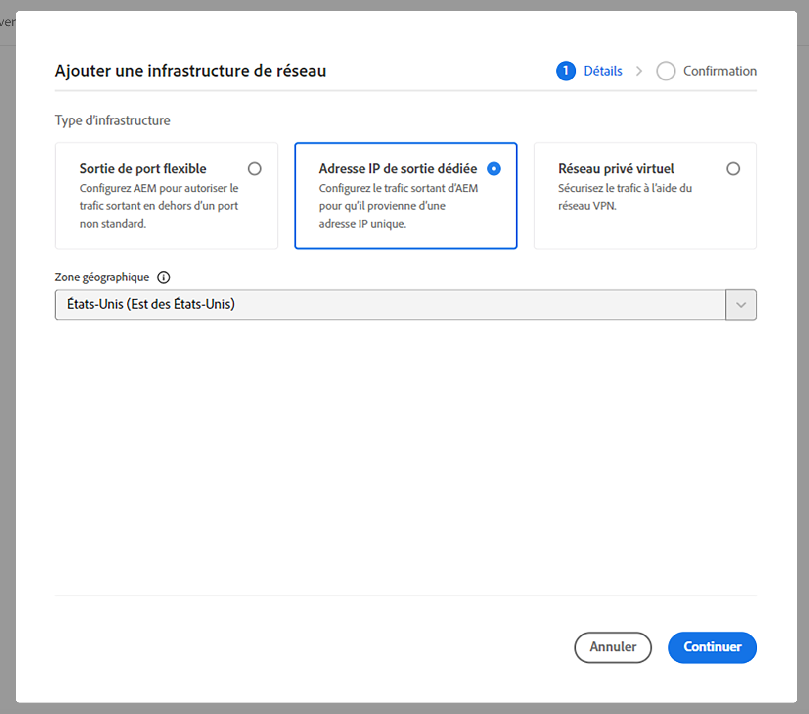

1. L’onglet **Confirmation** résume votre sélection et les étapes suivantes. Cliquez sur **Enregistrer** pour créer l’infrastructure.

   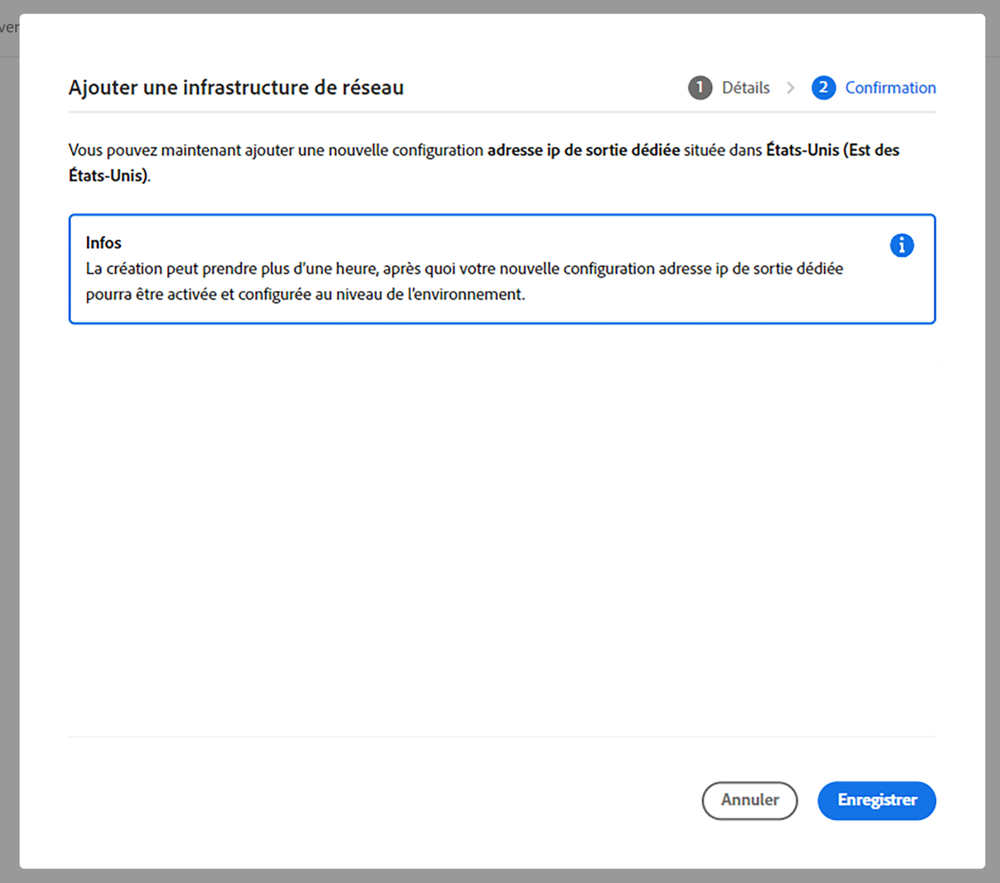

Un nouvel enregistrement s’affiche sous l’en-tête **Infrastructure réseau** dans le panneau latéral, y compris des détails sur le type d’infrastructure, le statut, la région et les environnements sur lesquels elle a été activée.


>[!NOTE]
>
>La création de l’infrastructure pour une sortie de port flexible peut prendre jusqu’à une heure, après quoi elle peut être configurée au niveau de l’environnement.

### Configuration de l’API {#configuring-dedicated-egress-provision-api}

Une fois par programme, le point d’entrée `/program/<programId>/networkInfrastructures` POST est invoqué, simplement en transmettant la valeur du `dedicatedEgressIp` pour le paramètre `kind` et la région. Le point d’entrée répond avec l’`network_id` et d’autres informations, y compris le statut.

Une fois l’appel lancé, l’approvisionnement de l’infrastructure réseau prend généralement environ 15 minutes. Un appel au [point d’entrée GET de l’infrastructure réseau](https://developer.adobe.com/experience-cloud/cloud-manager/reference/api/#operation/getNetworkInfrastructure) de Cloud Manager doit afficher le statut **prêt**.

>[!TIP]
>
>Le jeu complet de paramètres et la syntaxe exacte, ainsi que des informations importantes comme les paramètres qui ne peuvent pas être modifiés plus tard, [peuvent être consultés dans la documentation de l’API.](https://developer.adobe.com/experience-cloud/cloud-manager/reference/api/#operation/createNetworkInfrastructure)

### Routage du trafic {#dedicated-egress-ip-traffic-routing}

Le trafic HTTP ou HTTPS passe par un proxy préconfiguré, à condition qu’il utilise des propriétés système Java™ standard pour les configurations de proxy.

Le trafic non http/s pointant vers des destinations via des ports déclarés dans le paramètre `portForwards` doit référencer une propriété appelée `AEM_PROXY_HOST`, ainsi que le port mappé. Par exemple :

```java
DriverManager.getConnection("jdbc:mysql://" + System.getenv("AEM_PROXY_HOST") + ":53306/test");
```

<table>
<thead>
  <tr>
    <th>Trafic</th>
    <th>Condition de destination</th>
    <th>Port</th>
    <th>Connexion</th>
    <th>Exemple de destination externe</th>
  </tr>
</thead>
<tbody>
  <tr>
    <td><b>Protocole HTTP ou HTTPS</b></td>
    <td>Trafic vers Azure (*.windows.net) ou vers les services Adobe</td>
    <td>N’importe lequel</td>
    <td>Via les adresses IP partagées du cluster (et non l’adresse IP dédiée)</td>
    <td>adobe.io<br>api.windows.net</td>
  </tr>
  <tr>
    <td></td>
    <td>Hôte correspondant au paramètre <code>nonProxyHosts</code></td>
    <td>80 ou 443</td>
    <td>Via les adresses IP partagées du cluster</td>
    <td></td>
  </tr>
  <tr>
    <td></td>
    <td>Hôte correspondant au paramètre <code>nonProxyHosts</code></td>
    <td>Ports autres que 80 ou 443</td>
    <td>Bloquée</td>
    <td></td>
  </tr>
  <tr>
    <td></td>
    <td>Via la configuration du proxy http, configurée par défaut pour le trafic http/s à l’aide de la bibliothèque cliente HTTP Java™ standard</td>
    <td>N’importe lequel</td>
    <td>Via l’adresse IP sortante dédiée</td>
    <td></td>
  </tr>
  <tr>
    <td></td>
    <td>Ignore la configuration du proxy http (par exemple, si elle est explicitement supprimée de la bibliothèque cliente HTTP Java™ standard ou si une bibliothèque Java™ qui ignore la configuration du proxy standard est utilisée).</td>
    <td>80 ou 443</td>
    <td>Via les adresses IP partagées du cluster</td>
    <td></td>
  </tr>
  <tr>
    <td></td>
    <td>Ignore la configuration du proxy http (par exemple, si elle est explicitement supprimée de la bibliothèque cliente HTTP Java™ standard ou si une bibliothèque Java™ qui ignore la configuration du proxy standard est utilisée).</td>
    <td>Ports autres que 80 ou 443</td>
    <td>Bloquée</td>
    <td></td>
  </tr>
  <tr>
    <td><b>Non http ou non https</b></td>
    <td>Le client se connecte à la variable d’environnement <code>AEM_PROXY_HOST</code> à l’aide du <code>portOrig</code> déclaré dans le paramètre d’API <code>portForwards</code></td>
    <td>N’importe lequel</td>
    <td>Via l’adresse IP sortante dédiée</td>
    <td><code>mysql.example.com:3306</code></td>
  </tr>
  <tr>
    <td></td>
    <td>Autre</td>
    <td></td>
    <td>Bloquée</td>
    <td></td>
  </tr>
</tbody>
</table>

### Utilisation de la fonctionnalité {#feature-usage}

Cette fonctionnalité est compatible avec les bibliothèques ou le code Java™ générant du trafic sortant, à condition que les propriétés système Java™ standard soient utilisées pour les configurations de proxy. Dans la pratique, cela devrait inclure la plupart des bibliothèques courantes.

Voici un exemple de code :

```java
public JSONObject getJsonObject(String relativePath, String queryString) throws IOException, JSONException {
  String relativeUri = queryString.isEmpty() ? relativePath : (relativePath + '?' + queryString);
  URL finalUrl = endpointUri.resolve(relativeUri).toURL();
  URLConnection connection = finalUrl.openConnection();
  connection.addRequestProperty("Accept", "application/json");
  connection.addRequestProperty("X-API-KEY", apiKey);

  try (InputStream responseStream = connection.getInputStream(); Reader responseReader = new BufferedReader(new InputStreamReader(responseStream, Charsets.UTF_8))) {
    return new JSONObject(new JSONTokener(responseReader));
  }
}
```

Certaines bibliothèques nécessitent une configuration explicite pour utiliser les propriétés système Java™ standard pour les configurations de proxy.

Exemple utilisant Apache HttpClient qui nécessite des appels explicites à [`HttpClientBuilder.useSystemProperties()`](https://hc.apache.org/httpcomponents-client-4.5.x/current/httpclient/apidocs/org/apache/http/impl/client/HttpClientBuilder.html) ou l’utilisation de [`HttpClients.createSystem()`](https://hc.apache.org/httpcomponents-client-4.5.x/current/httpclient/apidocs/org/apache/http/impl/client/HttpClients.html#createSystem()) :

```java
public JSONObject getJsonObject(String relativePath, String queryString) throws IOException, JSONException {
  String relativeUri = queryString.isEmpty() ? relativePath : (relativePath + '?' + queryString);
  URL finalUrl = endpointUri.resolve(relativeUri).toURL();

  HttpClient httpClient = HttpClientBuilder.create().useSystemProperties().build();
  HttpGet request = new HttpGet(finalUrl.toURI());
  request.setHeader("Accept", "application/json");
  request.setHeader("X-API-KEY", apiKey);
  HttpResponse response = httpClient.execute(request);
  String result = EntityUtils.toString(response.getEntity());
}
```

### Considérations relatives au débogage {#debugging-considerations}

Pour contrôler que le trafic est effectivement sortant sur l’adresse IP dédiée attendue, vérifiez les journaux dans le service de destination, si disponible. Dans le cas contraire, il peut s’avérer utile d’appeler un service de débogage tel que [http://ifconfig.me/ip](https://ifconfig.me/ip), qui renverra l’adresse IP d’appel.

## Réseau privé virtuel (VPN) {#vpn}

Un VPN permet de se connecter à une infrastructure On-Premise ou à un centre de données à partir des instances de création, de publication ou d’aperçu. Cela peut être utile, par exemple, pour sécuriser l’accès à une base de données. Il permet également de se connecter à des fournisseurs SaaS tels qu’un fournisseur CRM qui prend en charge le VPN.

La plupart des appareils VPN dotés de la technologie IPSec sont pris en charge. Consultez les informations de la colonne **Instructions de configuration basées sur l’itinéraire** dans [cette liste d’appareils.](https://learn.microsoft.com/fr-fr/azure/vpn-gateway/vpn-gateway-about-vpn-devices#devicetable) Configurez l’appareil comme décrit dans le tableau.

>[!NOTE]
>
>Les limitations à une infrastructure VPN sont les suivantes :
>
>* La prise en charge est limitée à une connexion VPN unique.
>* Les résolveurs DNS doivent être répertoriés dans l’espace Adresse de passerelle pour résoudre les noms d’hôtes privés.

### Configuration de l’interface utilisateur {#configuring-vpn-ui}

1. Connectez-vous à Cloud Manager à l’adresse [my.cloudmanager.adobe.com](https://my.cloudmanager.adobe.com/) et sélectionnez l’organisation appropriée.

1. Sur la console **[Mes programmes](/help/implementing/cloud-manager/navigation.md#my-programs)**, sélectionnez le programme.

1. Dans la page **Vue d’ensemble du programme**, accédez à l’onglet **Environnements** et sélectionnez **Infrastructure réseau** dans le panneau de gauche.

   

1. Dans l’assistant **Ajouter une infrastructure réseau** qui démarre, sélectionnez **Réseau privé virtuel** et fournissez les informations nécessaires avant de cliquer sur **Continuer**.

   * **Région** : il s’agit de la région dans laquelle l’infrastructure doit être créée.
   * **Espace d’adresses** : l’espace d’adresses ne peut être qu’un /26 CIDR (64 adresses IP) ou une plage d’adresses IP plus grande dans votre espace client.
      * Cette valeur ne peut pas être modifiée ultérieurement.
   * **Informations DNS** : il s’agit d’une liste de résolveurs DNS distants.
      * Appuyez sur `Enter` après avoir saisi une adresse de serveur DNS pour en ajouter une autre.
      * Cliquez sur le bouton `X` à la suite d’une adresse pour la supprimer.
   * **Clé partagée** : il s’agit de votre clé prépartagée VPN.
      * Sélectionnez **Afficher la clé partagée** pour afficher la clé afin de pouvoir vérifier sa valeur.

   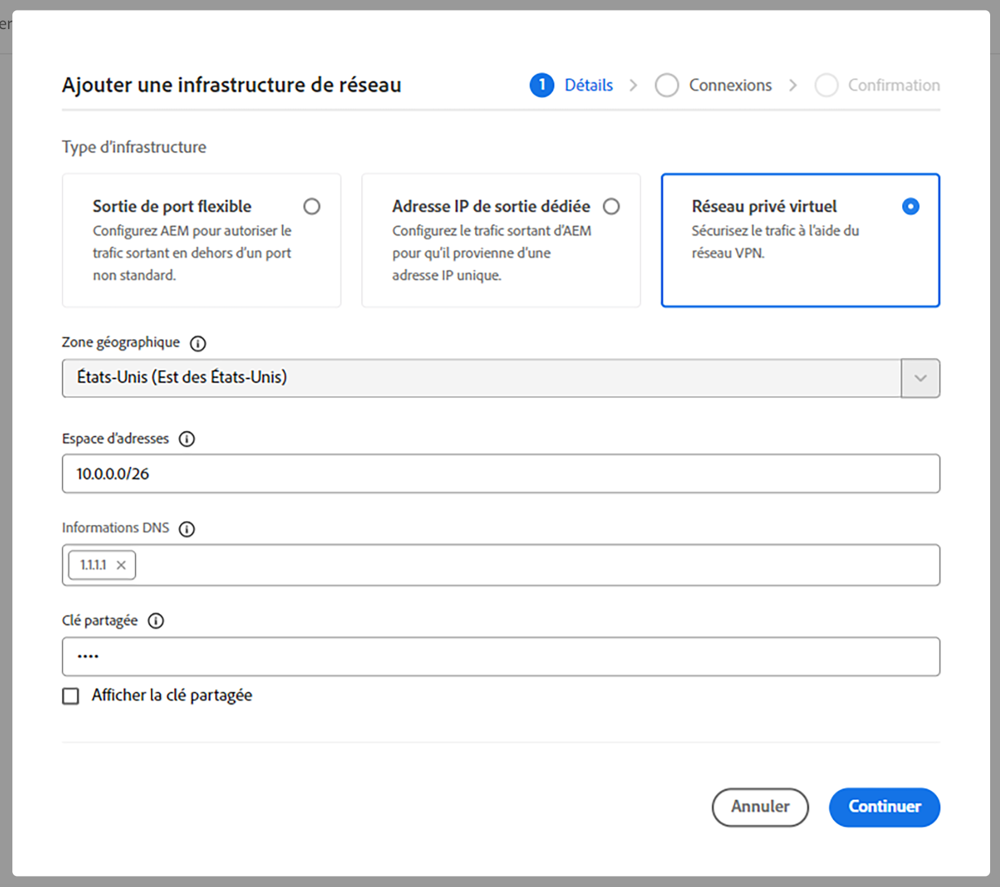

1. Sur l’onglet **Connexions** de l’assistant, fournissez un **Nom de connexion** pour identifier votre connexion VPN et cliquez sur **Ajouter une connexion**.

   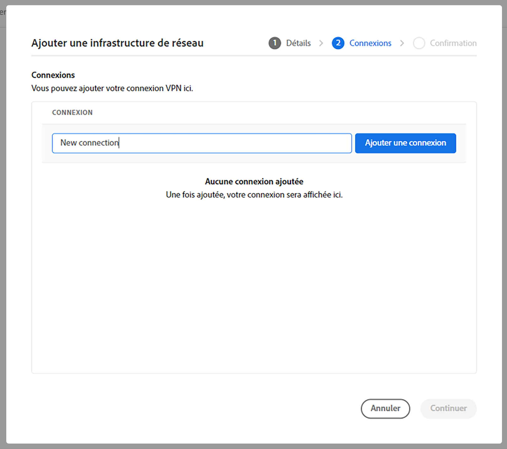

1. Dans la boîte de dialogue **Ajouter une connexion**, définissez votre connexion VPN, puis cliquez sur **Enregistrer**.

   * **Nom de connexion** : il s’agit d’un nom explicite de votre connexion VPN, que vous avez fourni à l’étape précédente et que vous pouvez mettre à jour ici.
   * **Adresse** : il s’agit de l’adresse IP du périphérique VPN.
   * **Emplacement de l’adresse** : il s’agit des plages d’adresses IP à acheminer par le VPN.
      * Appuyez sur `Enter` après avoir saisi une plage pour en ajouter une autre.
      * Cliquez sur le bouton `X` à la suite d’une plage pour la supprimer.
   * **Politique de sécurité IP** : ajustez les valeurs par défaut selon les besoins.

   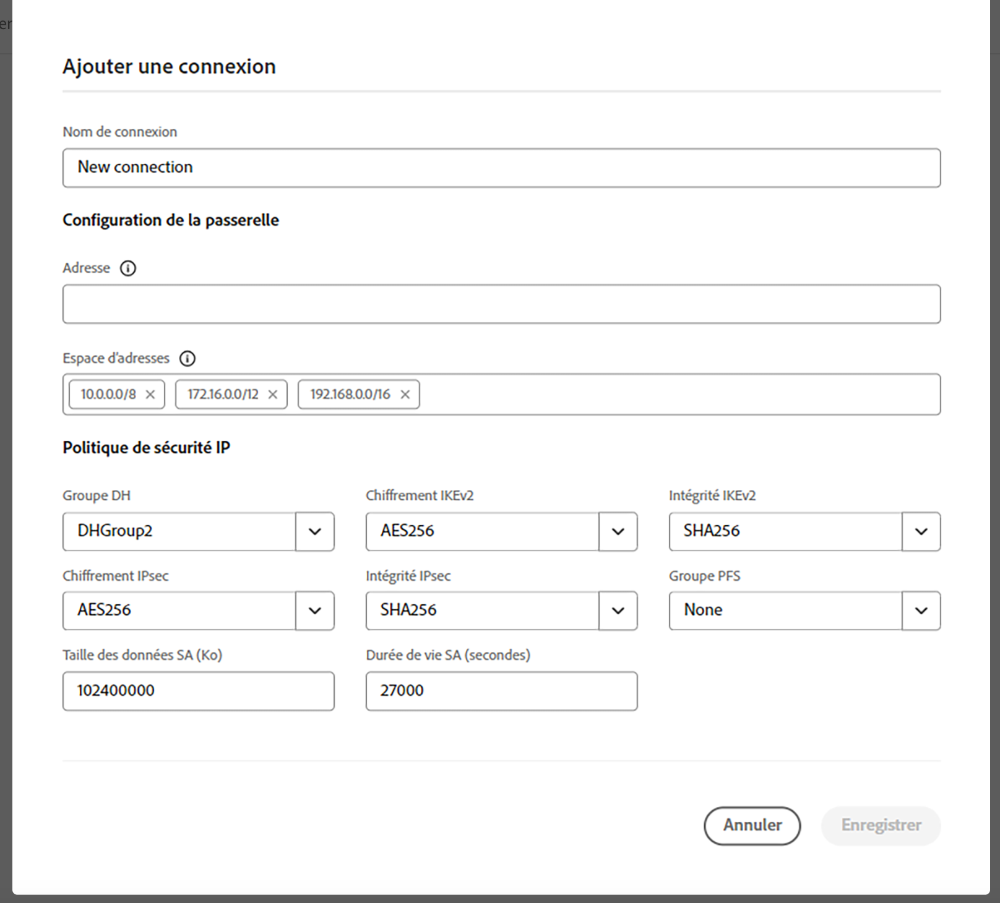

1. La boîte de dialogue se ferme et vous revenez à l’onglet **Connexions** de l’assistant. Cliquez sur **Continuer**.

   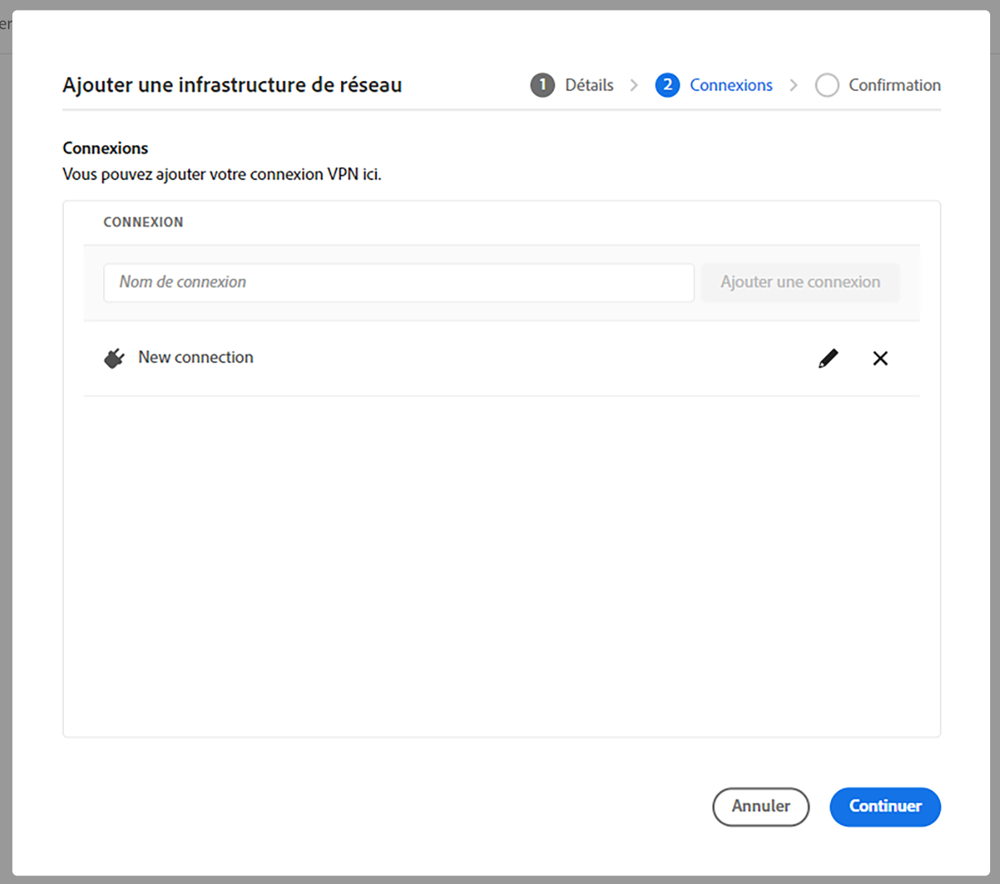

1. L’onglet **Confirmation** résume votre sélection et les étapes suivantes. Cliquez sur **Enregistrer** pour créer l’infrastructure.

   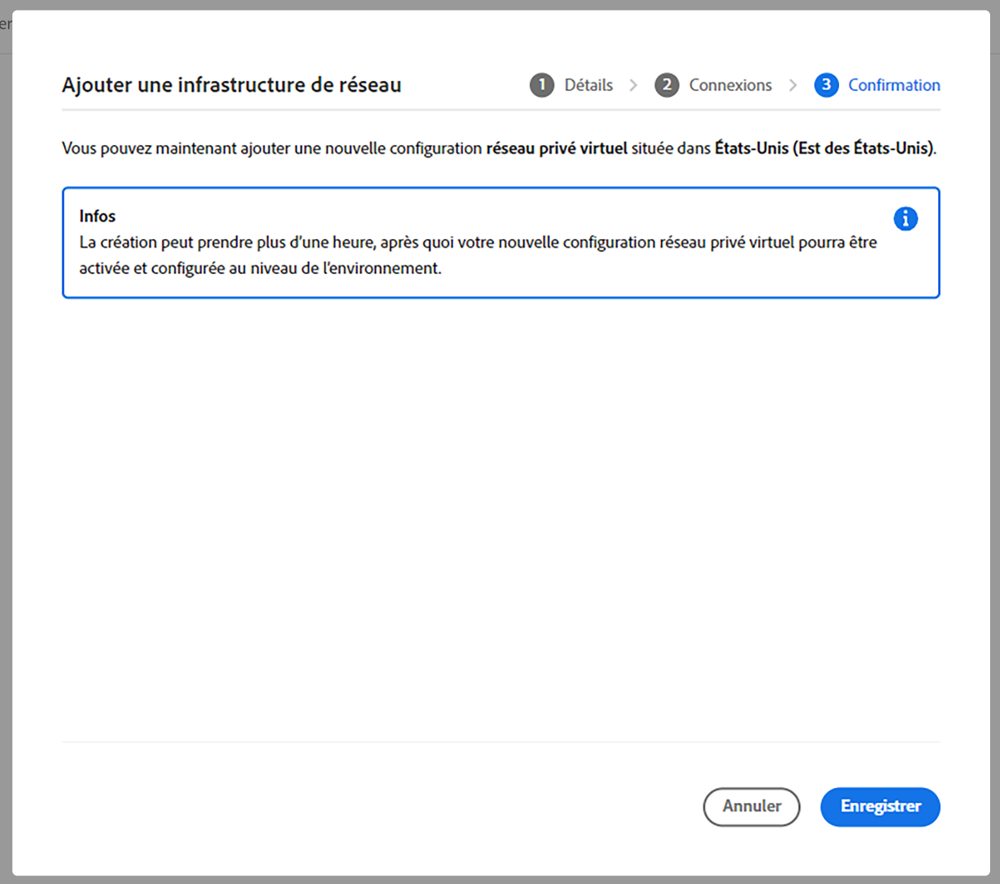

Un nouvel enregistrement s’affiche sous l’en-tête **Infrastructure réseau** dans le panneau latéral, avec des détails sur le type d’infrastructure, le statut, la région et les environnements sur lesquels il a été activé.

### Configuration de l’API {#configuring-vpn-api}

Une fois par programme, le point d’entrée POST `/program/<programId>/networkInfrastructures` est appelé. Il transmet une payload d’informations de configuration. Ces informations incluent la valeur **vpn** pour le paramètre `kind`, la région, l’espace d’adresses (liste des CIDR ; notez que cela ne peut pas être modifié ultérieurement), les résolveurs DNS (pour résoudre les noms dans votre réseau). Cela inclut également des informations de connexion VPN telles que la configuration de la passerelle, la clé VPN partagée et la politique de sécurité IP. Le point d’entrée répond avec l’`network_id` et d’autres informations, y compris le statut.

Une fois l’appel lancé, l’approvisionnement de l’infrastructure réseau prend généralement de 45 à 60 minutes. La méthode GET de l’API peut être appelée pour renvoyer le statut qui passe en fin de compte de `creating` à `ready`. Consultez la documentation de l’API pour connaître tous les statuts.

>[!TIP]
>
>Le jeu complet de paramètres et la syntaxe exacte, ainsi que des informations importantes comme les paramètres qui ne peuvent pas être modifiés plus tard, [peuvent être consultés dans la documentation de l’API.](https://developer.adobe.com/experience-cloud/cloud-manager/reference/api/#operation/createNetworkInfrastructure)

### Routage du trafic {#vpn-traffic-routing}

Le tableau ci-dessous décrit le routage du trafic.

<table>
<thead>
  <tr>
    <th>Trafic</th>
    <th>Condition de destination</th>
    <th>Port</th>
    <th>Connexion</th>
    <th>Exemple de destination externe</th>
  </tr>
</thead>
<tbody>
  <tr>
    <td><b>Protocole HTTP ou HTTPS</b></td>
    <td>Trafic vers Azure ou vers les services Adobe</td>
    <td>N’importe lequel</td>
    <td>Via les adresses IP partagées du cluster (et non l’adresse IP dédiée)</td>
    <td>adobe.io<br>api.windows.net</td>
  </tr>
  <tr>
    <td></td>
    <td>Hôte correspondant au paramètre <code>nonProxyHosts</code></td>
    <td>80 ou 443</td>
    <td>Via les adresses IP partagées du cluster</td>
    <td></td>
  </tr>
  <tr>
    <td></td>
    <td>Hôte correspondant au paramètre <code>nonProxyHosts</code></td>
    <td>Ports autres que 80 ou 443</td>
    <td>Bloquée</td>
    <td></td>
  </tr>
  <tr>
    <td></td>
    <td>Si l’adresse IP est comprise dans la plage d’espace d’<i>adresses de la passerelle VPN</i>, et par la configuration du proxy http (configurée par défaut pour le trafic http/s à l’aide de la bibliothèque cliente HTTP Java™ standard).</td>
    <td>N’importe lequel</td>
    <td>Par le VPN</td>
    <td><code>10.0.0.1:443</code><br>Il peut également s’agir d’un nom d’hôte.</td>
  </tr>
  <tr>
    <td></td>
    <td>Si l’adresse IP n’est pas comprise dans la plage d’<i>espace d’adresses de la passerelle VPN</i>, et par la configuration du proxy http (configurée par défaut pour le trafic http/s à l’aide de la bibliothèque cliente HTTP Java™ standard).</td>
    <td>N’importe lequel</td>
    <td>Via l’adresse IP sortante dédiée</td>
    <td></td>
  </tr>
  <tr>
    <td></td>
    <td>Ignore la configuration du proxy http (par exemple, si elle est explicitement supprimée de la bibliothèque cliente HTTP Java™ standard ou si vous utilisez une bibliothèque Java™ qui ignore la configuration du proxy standard).
</td>
    <td>80 ou 443</td>
    <td>Via les adresses IP partagées du cluster</td>
    <td></td>
  </tr>
  <tr>
    <td></td>
    <td>Ignore la configuration du proxy http (par exemple, si elle est explicitement supprimée de la bibliothèque cliente HTTP Java™ standard ou si vous utilisez une bibliothèque Java™ qui ignore la configuration du proxy standard).</td>
    <td>Ports autres que 80 ou 443</td>
    <td>Bloquée</td>
    <td></td>
  </tr>
  <tr>
    <td><b>Non http ou non https</b></td>
    <td>Si l’adresse IP est comprise dans la plage d’<i>espace d’adresse de la passerelle VPN</i> et que le client se connecte à la variable d’environnement <code>AEM_PROXY_HOST</code> à l’aide d’un <code>portOrig</code> déclaré dans le paramètre d’API <code>portForwards</code></td>
    <td>N’importe lequel</td>
    <td>Par le VPN</td>
    <td><code>10.0.0.1:3306</code><br>Il peut également s’agir d’un nom d’hôte.</td>
  </tr>
  <tr>
    <td></td>
    <td>Si l’adresse IP n’est pas comprise dans la plage d’<i>espace d’adressage de la passerelle VPN</i> et que le client ou la cliente se connecte à la variable d’environnement <code>AEM_PROXY_HOST</code> à l’aide d’un <code>portOrig</code> déclaré dans le paramètre d’API <code>portForwards</code></td>
    <td>N’importe lequel</td>
    <td>Via l’adresse IP sortante dédiée</td>
    <td></td>
  </tr>
  <tr>
    <td></td>
    <td>Autre</td>
    <td>N’importe lequel</td>
    <td>Bloquée</td>
    <td></td>
  </tr>
</tbody>
</table>

### Domaines utiles à la configuration {#vpn-useful-domains-for-configuration}

Le diagramme ci-dessous offre une représentation visuelle d’un ensemble de domaines et d’adresses IP associées utiles à la configuration et au développement. Le tableau sous le diagramme décrit ces domaines et adresses IP.


<table>
<thead>
  <tr>
    <th>Modèle de domaine</th>
    <th>Destination de la sortie (à partir d’AEM)</th>
    <th>Destination de l’entrée (vers AEM)</th>
  </tr>
</thead>
<tbody>
  <tr>
    <td><code>p{PROGRAM_ID}.external.adobeaemcloud.com</code></td>
    <td>Adresse IP sortante dédiée au trafic envoyé vers Internet plutôt que par des réseaux privés </td>
    <td>Les connexions à partir du VPN s’afficheraient sur le réseau de diffusion de contenu comme provenant de cette adresse IP. Pour autoriser uniquement les connexions venant du VPN à accéder à AEM, configurez Cloud Manager afin d’autoriser uniquement cette adresse IP et de bloquer tout le reste. Pour plus d’informations, consultez la section « Restreindre le VPN aux connexions entrantes ».</td>
  </tr>
  <tr>
    <td><code>p{PROGRAM_ID}.{REGION}-gateway.external.adobeaemcloud.com</code></td>
    <td>S/O</td>
    <td>L’adresse IP de la passerelle VPN côté AEM. Votre équipe d’ingénierie réseau peut l’utiliser pour autoriser uniquement les connexions VPN à votre passerelle VPN à partir d’une adresse IP spécifique. </td>
  </tr>
</tbody>
</table>

## Activation des configurations de mise en réseau avancée dans les environnements {#enabling}

Une fois que vous avez configuré une option de mise en réseau avancée pour un programme afin de l’utiliser, qu’il s’agisse de la [sortie de port flexible](#flexible-port-egress), de l’[adresse IP de sortie dédiée](#dedicated-egress-ip-address) ou du [VPN](#vpn), vous devez l’activer au niveau de l’environnement.

Lorsque vous activez une configuration de mise en réseau avancée pour un environnement, vous pouvez également activer le transfert de port facultatif et les hôtes non proxy. Les paramètres sont configurables par environnement afin d’offrir une certaine flexibilité.

* **Transfert de port** : les règles de transfert de port doivent être déclarées pour les ports de destination autres que le port 80/443, mais uniquement si vous n’utilisez pas le protocole http ou https.
   * Les règles de transfert de port sont définies en spécifiant l’ensemble des hôtes de destination (noms ou adresses IP et ports).
   * La connexion du client qui utilise le port 80/443 via http/https doit toujours utiliser les paramètres proxy dans sa connexion pour que les propriétés de la mise en réseau avancée soient appliquées à la connexion.
   * Pour chaque hôte de destination, vous devez mapper le port de destination prévu à un port entre 30 000 et 30 999.
   * Les règles de transfert de port sont disponibles pour tous les types de mise en réseau avancée.

* **Hôtes non proxy** : les hôtes non proxy vous permettent de déclarer un ensemble d’hôtes qui doivent passer par une plage d’adresses IP partagées plutôt que par l’adresse IP dédiée.
   * Cela peut s’avérer utile, car le trafic sortant par les adresses IP partagées peut être optimisé davantage.
   * Les hôtes non proxy ne sont disponibles que pour les adresses IP de sortie dédiées et les types de mise en réseau avancée de VPN.

>[!NOTE]
>
>Vous ne pouvez pas activer de configuration de mise en réseau avancée pour un environnement si l’environnement n’a pas le statut **Mise à jour**.

### Activer à l’aide de l’interface utilisateur {#enabling-ui}

1. Connectez-vous à Cloud Manager à l’adresse [my.cloudmanager.adobe.com](https://my.cloudmanager.adobe.com/) et sélectionnez l’organisation appropriée.

1. Sur la console **[Mes programmes](/help/implementing/cloud-manager/navigation.md#my-programs)**, sélectionnez le programme.

1. Dans la page **Vue d’ensemble du programme**, accédez à l’onglet **Environnements** et sélectionnez l’environnement dans lequel vous souhaitez activer la configuration de mise en réseau avancée sous l’en-tête **Environnements** dans le panneau de gauche. Sélectionnez ensuite l’onglet **Configuration de mise en réseau avancée** de l’environnement sélectionné, puis cliquez sur **Activer l’infrastructure réseau**.

   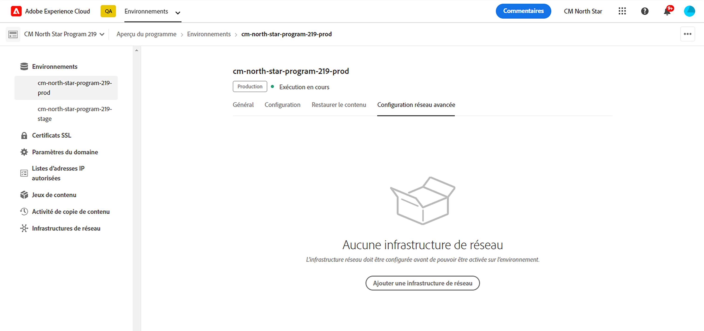

1. La boîte de dialogue **Configuration de la mise en réseau avancée** s’ouvre.

1. Sur l’onglet **Hôtes non proxy**, pour les adresses IP de sortie dédiées et les VPN, vous pouvez éventuellement définir un ensemble d’hôtes. Ces hôtes définis doivent être acheminés via une plage d’adresses IP partagées plutôt que via l’adresse IP dédiée, en fournissant le nom d’hôte dans le champ **Hôte non proxy** et en cliquant sur **Ajouter**.

   * L’hôte est ajouté à la liste des hôtes sur l’onglet.
   * Répétez cette étape si vous souhaitez ajouter plusieurs hôtes.
   * Cliquez sur le bouton X situé à droite de la ligne si vous souhaitez supprimer un hôte.
   * Cet onglet n’est pas disponible pour les configurations flexibles de sortie de port.

   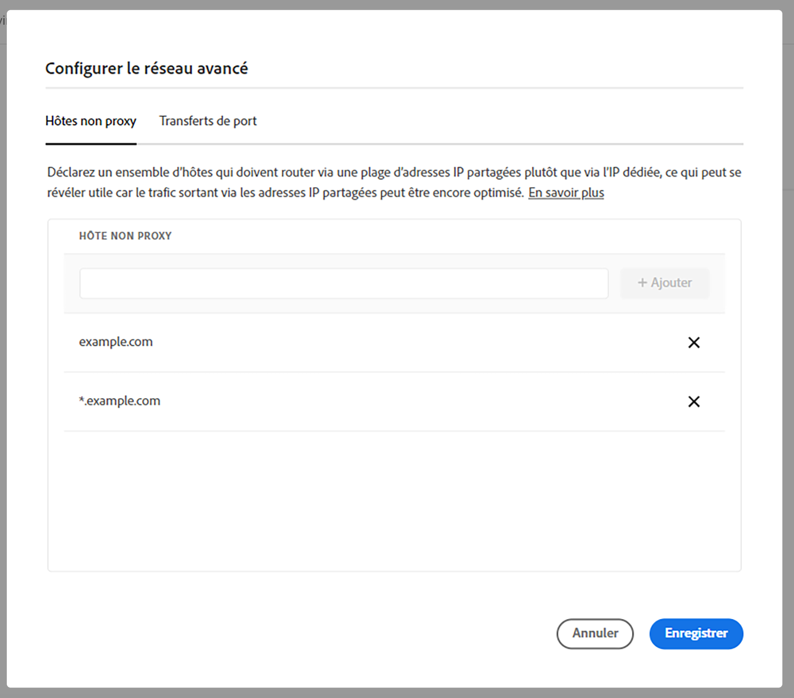

1. Sur l’onglet **Transferts de port**, vous pouvez éventuellement définir des règles de transfert de port pour les ports de destination autres que le port 80/443 si vous n’utilisez pas le protocole HTTP ou HTTPS. Fournissez un **Nom**, une **Origine du port** et une **Destination du port**, puis cliquez sur **Ajouter**.

   * La règle est ajoutée à la liste des règles de l’onglet.
   * Répétez cette étape si vous souhaitez ajouter plusieurs règles.
   * Cliquez sur le bouton X situé à droite de la ligne si vous souhaitez supprimer une règle.

   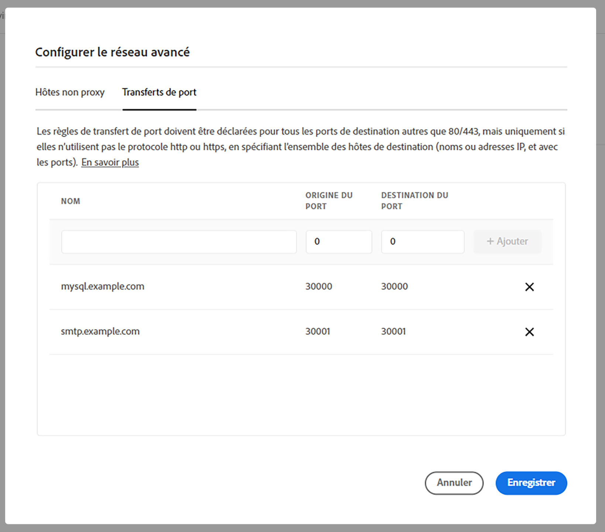

1. Cliquez sur **Enregistrer** dans la boîte de dialogue pour pouvoir appliquer la configuration à l’environnement.

La configuration de mise en réseau avancée est appliquée à l’environnement sélectionné. De retour sur l’onglet **Environnements** vous pouvez voir les détails de la configuration appliquée à l’environnement sélectionné et leur statut.

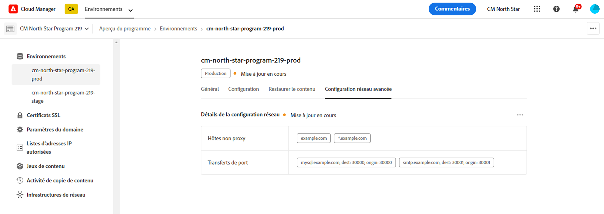

### Activer à l’aide de l’API {#enabling-api}

Pour activer une configuration de mise en réseau avancée pour un environnement, le point d’entrée `PUT /program/<program_id>/environment/<environment_id>/advancedNetworking` doit être appelé par environnement.

L’API doit répondre en quelques secondes seulement et indiquer le statut `updating`. Au bout de 10 minutes environ, un appel au point d’entrée GET de l’environnement de Cloud Manager affiche le statut `ready`, indiquant que la mise à jour de l’environnement est appliquée.

Les règles de transfert de port par environnement peuvent être mises à jour en invoquant à nouveau le point d’entrée `PUT /program/{programId}/environment/{environmentId}/advancedNetworking`, en veillant à inclure l’ensemble complet des paramètres de configuration, plutôt qu’un sous-ensemble.

Les types de mise en réseau avancée de VPN et les adresses IP de sortie dédiées prennent en charge un paramètre `nonProxyHosts`. Vous pouvez ainsi déclarer un ensemble d’hôtes qui doivent passer par une plage d’adresses IP partagées plutôt que par l’adresse IP dédiée. Les URL `nonProxyHost` peuvent être calquées sur `example.com` ou `*.example.com`, le caractère générique n’étant pris en charge qu’au début du domaine.

Notez que même en l’absence de règles de routage du trafic de l’environnement (hôtes ou contournements), `PUT /program/<program_id>/environment/<environment_id>/advancedNetworking` doit toujours être appelé mais avec une payload vide.

>[!TIP]
>
>Le jeu complet de paramètres et la syntaxe exacte, ainsi que des informations importantes comme les paramètres qui ne peuvent pas être modifiés plus tard, [peuvent être consultés dans la documentation de l’API.](https://developer.adobe.com/experience-cloud/cloud-manager/reference/api/#operation/createNetworkInfrastructure)

## Modifier et supprimer des configurations de mise en réseau avancée dans des environnements {#editing-deleting-environments}

Après l’[activation de configurations de mise en réseau avancée pour les environnements,](#enabling) vous pouvez mettre à jour les détails de ces configurations ou les supprimer.

>[!NOTE]
>
>Vous ne pouvez pas modifier l’infrastructure réseau si elle a le statut **Création**, **Mise à jour** ou **Suppression**.

### Modifier ou supprimer à l’aide de l’interface utilisateur {#editing-ui}

1. Connectez-vous à Cloud Manager à l’adresse [my.cloudmanager.adobe.com](https://my.cloudmanager.adobe.com/) et sélectionnez l’organisation appropriée.

1. Sur la console **[Mes programmes](/help/implementing/cloud-manager/navigation.md#my-programs)**, sélectionnez le programme.

1. Dans la page **Vue d’ensemble du programme**, accédez à l’onglet **Environnements** et sélectionnez l’environnement dans lequel vous souhaitez activer la configuration de mise en réseau avancée sous l’en-tête **Environnements** dans le panneau de gauche. Sélectionnez ensuite l’onglet **Configuration de mise en réseau avancée** de l’environnement sélectionné et cliquez sur le bouton représentant des points de suspension.

   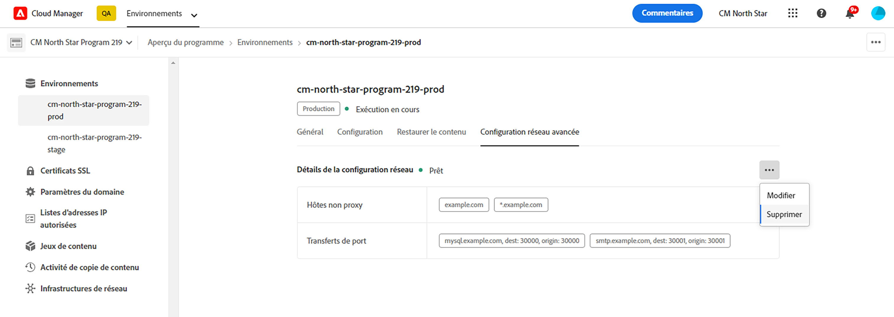

1. Dans le menu représentant des points de suspension, sélectionnez **Modifier** ou **Supprimer**.

   * Si vous choisissez **Modifier**, mettez à jour les informations selon les étapes décrites dans la section précédente, [Activer à l’aide de l’interface utilisateur,](#enabling-ui) et cliquez sur **Enregistrer**.
   * Si vous choisissez **Supprimer**, confirmez la suppression dans la boîte de dialogue de **Suppression de la configuration réseau** avec **Supprimer** ou abandonnez avec **Annuler**.

Les modifications sont répercutées sur l’onglet **Environnements**.

### Modifier ou supprimer à l’aide de l’API {#editing-api}

Pour désactiver la mise en réseau avancée pour un environnement en particulier, appelez `DELETE [/program/{programId}/environment/{environmentId}/advancedNetworking]()`.

>[!TIP]
>
>Le jeu complet de paramètres et la syntaxe exacte, ainsi que des informations importantes comme les paramètres qui ne peuvent pas être modifiés plus tard, [peuvent être consultés dans la documentation de l’API.](https://developer.adobe.com/experience-cloud/cloud-manager/reference/api/#operation/createNetworkInfrastructure)

## Modifier et supprimer l’infrastructure réseau d’un programme {#editing-deleting-program}

Une fois l’infrastructure réseau créée pour un programme, seules les propriétés limitées peuvent être modifiées. Si vous n’en avez plus besoin, vous pouvez supprimer l’infrastructure de mise en réseau avancée pour l’ensemble de votre programme.

>[!NOTE]
>
>Les restrictions suivantes s’appliquent à la modification et à la suppression de l’infrastructure réseau :
>
>* La suppression ne supprime l’infrastructure que si la mise en réseau avancée de tous les environnements est désactivée.
>* Vous ne pouvez pas modifier l’infrastructure réseau si elle a le statut **Création**, **Mise à jour** ou **Suppression**.
>* Seul le type d’infrastructure de mise en réseau avancée de VPN peut être modifié une fois créé, et même dans ce cas, uniquement des champs limités peuvent l’être.
>* Pour des raisons de sécurité, la **Clé partagée** doit toujours être fournie lors de la modification d’une infrastructure de mise en réseau de VPN avancée, même si vous ne modifiez pas la clé elle-même.

### Modifier et supprimer à l’aide de l’interface utilisateur {#delete-ui}

1. Se connecter à Cloud Manager à l’adresse [my.cloudmanager.adobe.com](https://my.cloudmanager.adobe.com/) et sélectionner l’organisation appropriée

1. Sur la console **[Mes programmes](/help/implementing/cloud-manager/navigation.md#my-programs)**, sélectionnez le programme.

1. Dans la page **Vue d’ensemble du programme**, accédez à l’onglet **Environnements** et sélectionnez l’en-tête **Infrastructure réseau** dans le panneau de gauche. Ensuite, cliquez sur le bouton représentant des points de suspension en regard de l’infrastructure que vous souhaitez supprimer.

   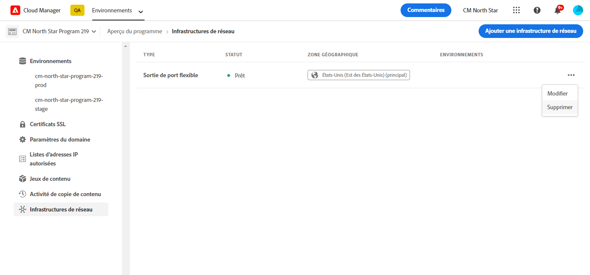

1. Dans le menu représentant des points de suspension, sélectionnez **Modifier** ou **Supprimer**.

1. Si vous choisissez **Modifier**, l’assistant **Modifier l’infrastructure réseau** s’ouvre. Modifiez selon les besoins en suivant les étapes décrites lors de la création de l’infrastructure.

1. Si vous choisissez **Supprimer**, confirmez la suppression dans la boîte de dialogue de **Suppression de la configuration réseau** avec **Supprimer** ou abandonnez avec **Annuler**.

Les modifications sont répercutées sur l’onglet **Environnements**.

### Modifier et supprimer avec l’API {#delete-api}

Pour **supprimer** l’infrastructure réseau d’un programme, appelez `DELETE /program/{program ID}/networkinfrastructure/{networkinfrastructureID}`.

## Modifier le type d’infrastructure de mise en réseau avancée d’un programme {#changing-program}

Il n’est possible de configurer qu’un seul type d’infrastructure de mise en réseau avancée pour un programme à la fois. L’infrastructure de mise en réseau avancée doit être une sortie de port flexible, une adresse IP de sortie dédiée ou un VPN.

Si vous décidez que vous avez besoin d’un autre type d’infrastructure de mise en réseau avancée que celui que vous avez déjà configuré, supprimez le type existant et créez-en un nouveau. Procédez comme suit :

1. [Désactivez la mise en réseau avancée dans tous les environnements.](#editing-deleting-environments)
1. [Supprimez l’infrastructure de mise en réseau avancée.](#editing-deleting-program)
1. Créez le type d’infrastructure de mise en réseau avancée dont vous avez besoin, au choix : [sortie de port flexible,](#flexible-port-egress) [adresse IP de sortie dédiée,](#dedicated-egress-ip-address) ou [VPN.](#vpn)
1. [Réactivez la mise en réseau avancée au niveau de l’environnement.](#enabling)

>[!WARNING]
>
> Cette procédure entraîne une interruption des services de mise en réseau avancée entre la suppression et la recréation.
> Si l’interruption devait entraîner un impact important sur l’activité, contactez le service clientèle pour obtenir de l’aide, en décrivant ce qui a déjà été créé et la raison de la modification.

## Configuration de mise en réseau avancée pour d’autres régions de publication {#advanced-networking-configuration-for-additional-publish-regions}

Lorsqu’une région supplémentaire est ajoutée à un environnement qui dispose déjà d’une mise en réseau avancée configurée, le trafic de la région de publication supplémentaire qui correspond aux règles de mise en réseau avancée traverse la région principale par défaut. Toutefois, si la région principale n’est plus disponible, le trafic de mise en réseau avancée est abandonné si la mise en réseau avancée n’a pas été activée dans la région supplémentaire. Si vous souhaitez optimiser la latence et augmenter la disponibilité en cas de panne de l’une des régions, il est nécessaire d’activer une mise en réseau avancée pour les régions de publication supplémentaires. Les sections ci-après décrivent deux scénarios différents.

>[!NOTE]
>
>Toutes les régions partagent la même [configuration de mise en réseau avancée de l’environnement](https://developer.adobe.com/experience-cloud/cloud-manager/reference/api/#tag/Environment-Advanced-Networking-Configuration), il n’est donc pas possible d’acheminer le trafic vers différentes destinations en fonction de la région d’où il provient.

### Adresse IP de sortie dédiée {#additional-publish-regions-dedicated-egress}

#### Mise en réseau avancée déjà activée dans la région principale {#already-enabled}

Si une configuration de mise en réseau avancée est déjà activée dans la région principale, procédez comme suit :

1. Si vous avez verrouillé votre infrastructure de sorte que l’adresse IP AEM dédiée soit répertoriée, désactivez temporairement toute règle de refus dans cette infrastructure. Si ce n’est pas fait, il y a une courte période pendant laquelle les demandes provenant des adresses IP de la nouvelle région sont refusées par votre propre infrastructure. Notez que cela n’est pas nécessaire si vous avez verrouillé votre infrastructure via le nom de domaine complet (`p1234.external.adobeaemcloud.com`, par exemple), car toutes les régions AEM émettent un trafic de mise réseau avancée du même nom de domaine complet.
1. Créez l’infrastructure de mise en réseau à portée de programme pour la région secondaire par le biais d’un appel POST à l’API de création d’infrastructure réseau de Cloud Manager, comme décrit dans la documentation de mise en réseau avancée. La seule différence dans la configuration JSON du payload par rapport à la région principale est la propriété de la région
1. Si votre infrastructure doit être verrouillée par IP pour autoriser le trafic AEM, ajoutez les adresses IP qui correspondent à `p1234.external.adobeaemcloud.com`. Il devrait y en avoir une par région.

#### Mise en réseau avancée non configurée dans une région {#not-yet-configured}

La procédure est essentiellement similaire aux instructions précédentes. Cependant, si l’environnement de production n’a pas encore été activé pour la mise en réseau avancée, vous avez la possibilité de tester la configuration en l’activant d’abord dans un environnement d’évaluation :

1. Créez une infrastructure de mise en réseau pour toutes les régions à l’aide d’un appel POST à l’[API de création d’infrastructure réseau de Cloud Manager](https://developer.adobe.com/experience-cloud/cloud-manager/reference/api/#tag/Network-infrastructure/operation/createNetworkInfrastructure). La seule différence dans la configuration JSON du payload par rapport à la région principale est la propriété de la région.
1. Pour l’environnement d’évaluation, activez et configurez l’environnement mis en réseau avancé en exécutant `PUT api/program/{programId}/environment/{environmentId}/advancedNetworking`. Pour plus d’informations, voir la [documentation de l’API](https://developer.adobe.com/experience-cloud/cloud-manager/reference/api/#tag/Environment-Advanced-Networking-Configuration/operation/enableEnvironmentAdvancedNetworkingConfiguration).
1. Si nécessaire, verrouillez l’infrastructure externe, de préférence par le nom de domaine complet (par exemple, `p1234.external.adobeaemcloud.com`). Vous pouvez également le faire par adresse IP
1. Si l’environnement d’évaluation fonctionne comme prévu, activez et configurez la configuration de mise en réseau avancée de l’environnement pour la production.

#### VPN {#vpn-regions}

La procédure est presque identique aux instructions d’adresses IP sortantes dédiées. La seule différence est, qu’en plus de la propriété de région configurée différemment de la région principale, le champ `connections.gateway` peut éventuellement être configuré. La configuration peut acheminer vers un autre point d’entrée VPN opéré par votre entreprise, plus proche géographiquement de la nouvelle région.

## Résolution des problèmes

Veuillez noter que les points suivants sont fournis à titre informatif et qu’ils incluent les bonnes pratiques de résolution des problèmes. Ces recommandations visent à aider à diagnostiquer et à résoudre efficacement les problèmes.

### Mise en pool de connexions {#connection-pooling-advanced-networking}

La mise en pool de connexions est une technique personnalisée visant à créer et à maintenir un référentiel de connexions pouvant immédiatement servir à n’importe quel thread qui en a besoin. De nombreuses techniques de mise en pool de connexions sont disponibles sur différentes plateformes et ressources en ligne, chacune ayant ses mérites et ses considérations uniques. Nous encourageons notre clientèle à étudier ces méthodologies, afin d’identifier celle qui est le plus compatible avec l’architecture de ses système.

La mise en œuvre d’une stratégie de mise en pool de connexions appropriée est une mesure proactive visant à corriger une supervision commune dans la configuration du système, ce qui entraîne souvent des performances sous-optimales. En établissant correctement un pool de connexions, Adobe Experience Manager (AEM) peut améliorer l’efficacité des appels externes. Cela permet non seulement de réduire la consommation des ressources, mais aussi d’atténuer le risque de perturbations du service et de réduire la probabilité de rencontrer des demandes en échec lors de la communication avec les serveurs en amont.

À la lumière de ces informations, Adobe vous conseille de réévaluer votre configuration d’AEM actuelle et d’envisager l’incorporation délibérée de la mise en pool de connexions conjointement avec les paramètres de mise en réseau avancée. En gérant le nombre de connexions parallèles et en réduisant au minimum la possibilité de connexions obsolètes, ces mesures permettent de réduire le risque que les serveurs proxy atteignent leurs limites de connexions. Cette mise en œuvre stratégique a donc pour but de réduire la probabilité que les demandes ne parviennent pas à des points d’entrée externes.

#### Questions fréquentes sur les limites de connexion

Lors de l’utilisation de la mise en réseau avancée, le nombre de connexions est limité afin d’assurer la stabilité entre les environnements et d’empêcher que les environnements inférieurs n’épuisent les connexions disponibles.

Les connexions sont limitées à 1 000 par instance AEM et des alertes sont envoyées aux clientes et clients lorsque le nombre atteint 750.

##### La limite de connexion est-elle appliquée uniquement au trafic sortant des ports non standard ou à tout le trafic sortant ?

Cette limite s’applique uniquement aux connexions utilisant la mise en réseau avancée (sortie sur des ports non standard, à l’aide d’une adresse IP de sortie dédiée ou d’un VPN).

##### Nous ne voyons pas de différence significative dans le nombre de connexions sortantes. Pourquoi recevons-nous la notification maintenant ?

Si le client ou la cliente crée des connexions de manière dynamique (par exemple, une ou plusieurs connexions pour chaque demande), une augmentation du trafic peut entraîner un pic de connexions.

##### Est-il possible que nous ayons connu une situation similaire dans le passé sans avoir reçu d’alertes ?

Les alertes ne sont envoyées que lorsque la limite basse est atteinte.

##### Que se passe-t-il si la limite maximale est atteinte ?

Lorsque la limite maximale est atteinte, les nouvelles connexions de sortie d’AEM par le biais d’une mise en réseau avancée (sortie sur des ports non standard, à l’aide d’une IP de sortie dédiée ou d’un VPN) seront abandonnées pour se protéger contre une attaque DoS.

##### La limite peut-elle être augmentée ?

Non, un grand nombre de connexions peut avoir un impact significatif sur les performances et provoquer un DoS dans les capsules et les environnements.

##### Les connexions sont-elles automatiquement fermées par le système AEM après un certain temps ?

Oui, les connexions sont fermées au niveau JVM et à différents points de l’infrastructure réseau. Cependant, cela sera trop tard pour tout service de production. Les connexions doivent être explicitement fermées lorsqu’elles ne sont plus nécessaires ou renvoyées au pool lors de l’utilisation du pool de connexions. Sinon, la consommation des ressources sera trop élevée et peut entraîner un épuisement des ressources.

##### Si la limite de connexion maximale est atteinte, cela affecte-t-il les licences et entraîne-t-il des coûts supplémentaires ?

Non, cette limite n’est associée à aucune licence ni aucun coût. Il s’agit d’une limite technique.

##### Comment savoir si nous nous approchons de la limite ? Quelle est la limite maximale ?

L’alerte est déclenchée lorsque le nombre de connexions dépasse 750. La limite maximale est de 1 000 connexions par instance AEM.

##### Cette limite s’applique-t-elle aux VPN ?

Oui, la limite s’applique aux connexions utilisant la mise en réseau avancée, y compris les VPN.

##### Si nous utilisons une adresse IP de sortie dédiée, cette limite sera-t-elle toujours applicable ?

Oui, la limite est toujours applicable si vous utilisez une adresse IP de sortie dédiée.
