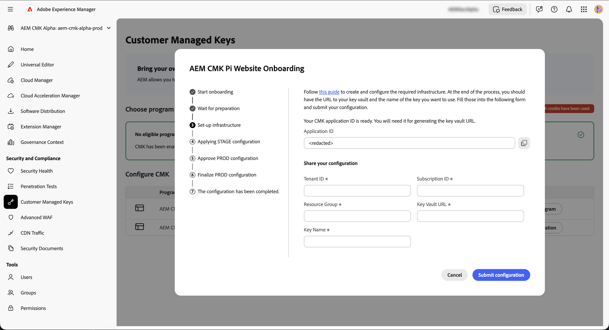

# Configuration des clés gérées par le client pour AEM as a Cloud Service {#customer-managed-keys-for-aem-as-a-cloud-service}

AEM as a Cloud Service stocke actuellement les données client dans Stockage Blob Azure et MongoDB, en utilisant des clés de chiffrement gérées par le fournisseur par défaut pour sécuriser les données. Bien que cette configuration réponde aux besoins de sécurité de nombreuses organisations, les entreprises des secteurs réglementés ou celles qui ont besoin d’une sécurité des données renforcée cherchent à mieux contrôler leurs pratiques de chiffrement. Pour les entreprises qui accordent la priorité à la sécurité des données, à la conformité et à la capacité à gérer leurs clés de chiffrement, la solution de clés gérées par le client ou la cliente (CMK, Customer-Managed Keys) offre une amélioration essentielle.

>[!NOTE]
>
>Avant de configurer votre coffre de clés Azure, vous devez activer la fonction CMK pour votre programme Cloud Service dans Cloud Manager. La fonction CMK est activée dans l’onglet **Sécurité** lors de la création du programme de production ou de la modification d’un programme existant.
>
>Voir [Création de programmes de production](/help/implementing/cloud-manager/getting-access-to-aem-in-cloud/creating-production-programs.md) ou [Modification de programmes](/help/implementing/cloud-manager/getting-access-to-aem-in-cloud/editing-programs.md).


## Objectif de cette solution {#the-problem-being-solved}

Les clés gérées par le fournisseur peuvent créer des difficultés pour les entreprises qui ont besoin d’une confidentialité et d’une intégrité supplémentaires. Sans contrôle sur la gestion des clés, les entreprises éprouvent des difficultés à respecter les exigences de conformité, à mettre en œuvre des politiques de sécurité personnalisées et à garantir une sécurité complète des données.

L’introduction des clés gérées par le client ou la cliente (CMK) résout ces problèmes en permettant aux clientes et clients d’AEM de contrôler entièrement leurs clés de chiffrement. En s’authentifiant via Microsoft Entra ID (anciennement Azure Active Directory), AEM CS se connecte en toute sécurité au coffre de clés Azure du client, ce qui lui permet de gérer le cycle de vie de ses clés de chiffrement, y compris la création, la rotation et la révocation des clés.

La solution CMK offre plusieurs avantages :

* **Gérer le chiffrement des données et des applications :** augmentez la sécurité grâce à la gouvernance directe de votre application AEM et de vos clés de chiffrement des données.
* **Améliorer la confidentialité et l’intégrité :** réduire la probabilité d’accès et de divulgation involontaires de données sensibles ou propriétaires grâce à une gestion complète du chiffrement.
* **Prise en charge du coffre de clés Azure :** l’utilisation du coffre de clés Azure permet de stocker les clés, de traiter les opérations secrètes et d’effectuer des rotations de clés.

En adoptant la fonction CMK, les clients peuvent accroître le contrôle sur leurs pratiques de sécurité et de chiffrement des données, ce qui améliore la sécurité et réduit les risques, tout en préservant l’évolutivité et la flexibilité d’AEM CS.

AEM as a Cloud Service vous permet d’utiliser vos propres clés de chiffrement pour chiffrer les données au repos. Ce guide décrit les étapes à suivre pour configurer une clé gérée par le client (CMK) dans le coffre de clés Azure pour AEM as a Cloud Service.

>[!WARNING]
>
>Après avoir configuré la solution CMK, vous ne pouvez pas revenir aux clés gérées par le système. Il vous incombe de gérer vos clés en toute sécurité et de fournir l’accès à votre coffre de clés, à votre clé et à votre application CMK dans Azure afin d’éviter de perdre l’accès à vos données.

Ce guide décrit les étapes suivantes pour créer et configurer l’infrastructure requise :

1. Configuration de votre environnement
1. Obtenir un ID de l’application à partir d’Adobe
1. Créer un groupe de ressources
1. Créer un coffre de clés
1. Accorder à Adobe l’accès au coffre de clés
1. Créer une clé de chiffrement

Vous devez partager l’URL du coffre de clés, le nom de la clé de chiffrement et des informations sur le coffre de clés avec Adobe.

## Configuration de votre environnement {#setup-your-environment}

L’interface de ligne de commande (CLI) Azure est la seule exigence de ce guide. Si l’interface de ligne de commande Azure n’est pas déjà installée, suivez les instructions d’installation officielles [ici](https://learn.microsoft.com/en-us/cli/azure/install-azure-cli?view=azure-cli-latest).

Avant de poursuivre avec la suite de ce guide, connectez-vous à l’interface en ligne de commande avec `az login`.

>[!NOTE]
>
>Bien que ce guide utilise l’interface de ligne de commande Azure, il est possible d’effectuer les mêmes opérations via la console Azure. Si vous préférez utiliser la console Azure, utilisez les commandes ci-dessous comme référence.


## Démarrer le processus de configuration de CMK pour AEM as a Cloud Service {#request-cmk-for-aem-as-a-cloud-service}

Vous devez demander la configuration des Clés gérées par le client (CMK) pour votre environnement AEM as a Cloud Service via l’interface utilisateur. Pour ce faire, accédez à l’interface utilisateur d’AEM Home Security, sous la section **Clés gérées par le client**.
La page répertorie tous les programmes qui prennent en charge la fonction CMK. Vous pouvez ensuite lancer le processus d’intégration en cliquant sur le bouton Activer le programme .


Si la fonction CMK a été activée dans Cloud Manager lors de la création/modification d’un programme, cliquez sur le bouton Démarrer l’intégration .


## Obtenir un ID de l’application à partir d’Adobe {#obtain-an-application-id-from-adobe}

Après avoir démarré le processus d’intégration, Adobe fournit un identifiant d’application Entra. Cet identifiant d’application est nécessaire pour la suite du guide et crée un principal de service qui permet à Adobe d’accéder à votre coffre de clés. Si vous ne disposez pas déjà d’un identifiant d’application, attendez qu’Adobe le fournisse.


Une fois la requête terminée, l’ID d’application s’affiche dans l’interface utilisateur du CMK.



## Créer un groupe de ressources {#create-a-new-resource-group}

Créez un groupe de ressources à l’emplacement de votre choix.

```powershell
# Choose a location and a name for the resource group.
$location="<AZURE LOCATION>"
$resourceGroup="<RESOURCE GROUP>"

# Create the resource group.
az group create --location $location --resource-group $resourceGroup
```

Si vous disposez déjà d’un groupe de ressources, utilisez-le à la place. Dans la suite de ce guide, l’emplacement du groupe de ressources et son nom sont identifiés respectivement par `$location` et `$resourceGroup`.

## Créer un coffre de clés {#create-a-key-vault}

Créez un coffre de clés pour contenir votre clé de chiffrement. La protection contre la purge doit être activée pour le coffre de clés. La protection contre la purge est nécessaire pour chiffrer les données au repos d’autres services Azure. L’accès au réseau public doit être activé pour que les services Adobe puissent accéder au coffre de clés.

>[!IMPORTANT]
>La désactivation de l’accès réseau public pour le coffre de clés nécessite l’exécution d’opérations telles que la création ou la rotation de clés à partir d’un environnement disposant d’un accès réseau au coffre de clés. Par exemple, une machine virtuelle qui peut accéder au coffre Key Vault.

```powershell
# Reuse this information from the previous step.
$location="<AZURE LOCATION>"
$resourceGroup="<RESOURCE GROUP>"

# Choose a name for the key vault.
$keyVaultName="<KEY VAULT NAME>"

# Create the key vault.
az keyvault create `
  --location $location `
  --resource-group $resourceGroup `
  --name $keyVaultName `
  --default-action=Allow `
  --enable-purge-protection `
  --enable-rbac-authorization `
  --public-network-access Enabled
```

## Accorder à Adobe l’accès au coffre de clés {#grant-adobe-access-to-the-key-vault}

Au cours de cette étape, vous autorisez Adobe à accéder à votre coffre de clés par le biais d’une application Entra. Adobe doit déjà avoir fourni l’identifiant de l’application Entra.

Tout d’abord, vous devez créer un principal de service associé à l’application Entra et lui affecter les rôles Reader du coffre de clés **et** Utilisateur de chiffrement du coffre de clés **.** Les rôles sont limités au coffre de clés créé dans ce guide.

```powershell
# Reuse this information from the previous steps.
$resourceGroup="<RESOURCE GROUP>"
$keyVaultName="<KEY VAULT NAME>"

# The application ID is provided by Adobe.
$appId="<APPLICATION ID>"

# Retrieve the ID of the key vault.
$keyVaultId=(az keyvault show --resource-group $resourceGroup --name $keyVaultName --query id --output tsv)

# Create a new service principal.
$servicePrincipalId=(az ad sp create --id $appId --query id --out tsv)

# Assign the roles to the service principal.
az role assignment create --assignee $servicePrincipalId --role "Key Vault Reader" --scope $keyVaultId
az role assignment create --assignee $servicePrincipalId --role "Key Vault Crypto User" --scope $keyVaultId
```

## Créer une clé de chiffrement {#create-an-encryption-key}

Enfin, vous pouvez créer une clé de chiffrement dans votre coffre de clés. Pour effectuer cette étape, vous avez besoin du rôle **Agent de chiffrement du coffre de clés**. Pour que ce rôle vous soit accordé, contactez votre administrateur système si l’utilisateur connecté ne dispose pas de ce rôle. Vous pouvez également demander à une personne qui dispose déjà de ce rôle de terminer cette étape pour vous.

Un accès réseau au coffre de clés est requis pour créer la clé de chiffrement. Vérifiez d’abord que vous pouvez accéder au coffre de clés et continuez à créer la clé :

```powershell
# Reuse this information from the previous steps.
$keyVaultName="<KEY VAULT NAME>"

# Choose a name for your key.
$keyName="<KEY NAME>"

# Create the key.
az keyvault key create --vault-name $keyVaultName --name $keyName
```

## Partager les informations sur le coffre de clés {#share-the-key-vault-information}

À ce stade, la configuration est terminée. Partagez les informations requises par le biais de l’interface utilisateur du CMK, qui lance le processus de configuration de l’environnement.

```powershell
# Reuse this information from the previous steps.
$resourceGroup="<RESOURCE GROUP>"
$keyVaultName="<KEY VAULT NAME>"

# Retrieve the URL of your key vault.
$keyVaultUri=(az keyvault show --name $keyVaultName `
    --resource-group $resourceGroup `
    --query properties.vaultUri `
    --output tsv)

# In addition we would need the tenantId and the subscriptionId in order to setup the connection.
$tenantId=(az keyvault show --name $keyVaultName `
    --resource-group $resourceGroup `
    --query properties.tenantId `
    --output tsv)
$subscriptionId="<Subscription ID>"
```

Fournissez les informations suivantes dans l’interface utilisateur du CMK :


## Implications de la révocation de l’accès aux clés {#implications-of-revoking-key-access}

La révocation ou la désactivation de l’accès au coffre de clés, à la clé ou à l’application CMK peut entraîner des perturbations opérationnelles importantes de votre environnement AEM as a Cloud Service. Une fois ces clés désactivées, les données d’AEM as a Cloud Service deviennent inaccessibles et les opérations en aval qui reposent sur ces données ne fonctionnent plus. Il est essentiel de comprendre les impacts potentiels avant d’apporter des modifications à vos configurations clés.

Si vous décidez de révoquer l’accès d’AEM as a Cloud Service à vos données, vous pouvez le faire en supprimant le rôle d’utilisateur associé à l’application du coffre de clés d’Azure.

## Configuration du CMK d’évaluation {#stage-cmk-setup}

Une fois que vous avez fourni les informations requises dans l’interface utilisateur du CMK, Adobe lance le processus de configuration de votre environnement d’évaluation AEM as a Cloud Service. Ce processus prend du temps et vous êtes averti une fois qu&#39;il est terminé.


## Configuration de la CMK de production {#prod-cmk-setup}

Une fois la configuration de l’étape terminée, vous devez effectuer une validation complète de bout en bout. Si tout fonctionne correctement, vous devez confirmer que l’environnement de production peut être configuré en conséquence.


Après confirmation dans l’interface utilisateur CMK, Adobe lance le processus de configuration de votre environnement AEM as a Cloud Service Prod. Ce processus prend du temps et vous êtes averti une fois qu&#39;il est terminé.


## Terminer la configuration du CMK {#complete-the-cmk-setup}

Une fois le processus de configuration terminé, vous pouvez voir le statut de votre configuration du CMK dans l’interface utilisateur. Vous pouvez également voir le coffre de clés et la clé de chiffrement.


## Questions et assistance {#questions-and-support}

Contactez Adobe si vous avez des questions, des demandes ou si vous avez besoin d’aide concernant la configuration des clés gérées par le client pour AEM as a Cloud Service. L’assistance Adobe répond à toutes vos questions.
