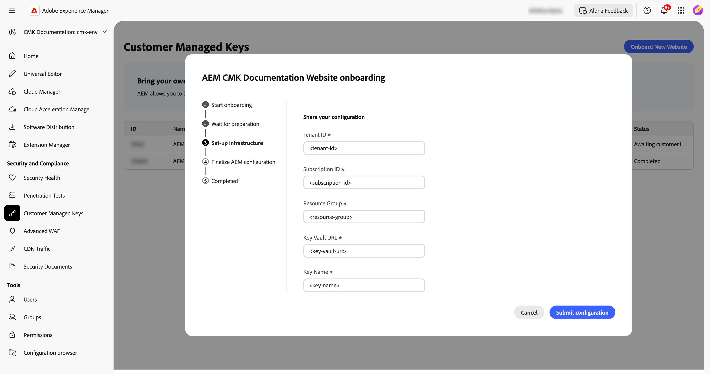

# Configuration des clés gérées par le client ou la cliente pour AEM as a Cloud Service {#customer-managed-keys-for-aem-as-a-cloud-service}

AEM as a Cloud Service stocke actuellement les données client dans Stockage Blob Azure et MongoDB, en utilisant des clés de chiffrement gérées par le fournisseur par défaut pour sécuriser les données. Bien que cette configuration réponde aux besoins de sécurité de nombreuses organisations, les entreprises des secteurs réglementés ou celles nécessitant une sécurité des données renforcée peuvent chercher à mieux contrôler leurs pratiques de chiffrement. Pour les entreprises qui accordent la priorité à la sécurité des données, à la conformité et à la capacité à gérer leurs clés de chiffrement, la solution de clés gérées par le client ou la cliente (CMK, Customer-Managed Keys) offre une amélioration essentielle.

## Le problème en cours de résolution {#the-problem-being-solved}

Les clés gérées par le fournisseur peuvent créer des problèmes pour les entreprises qui ont besoin d’un surcroît de confidentialité et d’intégrité. Sans contrôle sur la gestion des clés, les entreprises éprouvent des difficultés à respecter les exigences de conformité, à mettre en œuvre des politiques de sécurité personnalisées et à garantir une sécurité complète des données.

L’introduction des clés gérées par le client ou la cliente (CMK) résout ces problèmes en permettant aux clientes et clients d’AEM de contrôler entièrement leurs clés de chiffrement. En s’authentifiant via Microsoft Entra ID (anciennement Azure Active Directory), AEM CS se connecte en toute sécurité au coffre de clés Azure du client ou de la cliente, ce qui leur permet de gérer le cycle de vie de leurs clés de chiffrement (création, rotation et révocation des clés).

La solution CMK offre plusieurs avantages :

* **Contrôle des données et chiffrement de l’application :** renforce la sécurité grâce à la gouvernance directe de votre application AEM et de vos clés de chiffrement des données.
* **Améliorer la confidentialité et l’intégrité :** réduit la probabilité d’accès et de divulgation involontaires de données sensibles ou propriétaires grâce à une gestion complète du chiffrement.
* **Prise en charge d’Azure Key Vault :** Azure Key Vault permet le stockage des clés, le traitement des opérations secrètes et l’exécution des rotations de clés.

En adoptant la solution CMK, les clientes et clients peuvent mieux contrôler leurs pratiques de sécurité et de chiffrement des données, améliorer la sécurité et atténuer les risques, tout en continuant à bénéficier de l’évolutivité et de la flexibilité d’AEM CS.

AEM as a Cloud Service vous permet d’apporter vos propres clés de chiffrement pour chiffrer les données au repos. Ce guide décrit les étapes à suivre pour configurer une clé gérée par le client ou la cliente (CMK) dans Azure Key Vault pour AEM as a Cloud Service.

>[!WARNING]
>
>Après avoir configuré la solution CMK, vous ne pouvez pas revenir aux clés gérées par le système. Il vous incombe de gérer vos clés en toute sécurité et de fournir l’accès à votre coffre de clés, à votre clé et à votre application CMK dans Azure afin d’éviter de perdre l’accès à vos données.

Vous bénéficierez également d’un accompagnement à travers les étapes suivantes pour créer et configurer l’infrastructure requise :

1. Configuration de votre environnement
1. Obtenir un ID de l’application à partir d’Adobe
1. Créer un groupe de ressources
1. Création d’un coffre de clés
1. Octroi de l’accès Adobe au coffre de clés
1. Créer une clé de chiffrement

Vous devrez partager l’URL du coffre de clés, le nom de la clé de chiffrement et des informations sur le coffre de clés avec Adobe.

## Configurer votre environnement {#setup-your-environment}

L’interface de ligne de commande (CLI) Azure est la seule exigence de ce guide. Si l’interface de ligne de commande Azure n’est pas déjà installée, suivez les instructions d’installation officielles [ici](https://learn.microsoft.com/fr-fr/cli/azure/install-azure-cli).

Avant de passer au reste de ce guide, connectez-vous à l’interface en ligne de commande avec `az login`.

>[!NOTE]
>
>Bien que ce guide utilise l’interface de ligne de commande Azure, il est possible d’effectuer les mêmes opérations via la console Azure. Si vous préférez utiliser la console Azure, utilisez les commandes ci-dessous comme référence.


## Démarrer le processus de configuration du CMK pour AEM as a Cloud Service {#request-cmk-for-aem-as-a-cloud-service}

Vous devez demander la configuration des Clés gérées par le client (CMK) pour votre environnement AEM as a Cloud Service via l’interface utilisateur. Pour ce faire, accédez à l’interface utilisateur d’AEM Home Security, sous la section **Clés gérées par le client**.
Vous pouvez ensuite démarrer le processus d’intégration en cliquant sur le bouton **Démarrer l’intégration**.


## Obtenir un ID de l’application à partir d’Adobe {#obtain-an-application-id-from-adobe}

Une fois le processus d’intégration démarré, Adobe fournit un identifiant d’application Entra. Cet identifiant d’application est nécessaire pour la suite du guide et sera utilisé pour créer un principal de service qui permet à Adobe d’accéder à votre coffre de clés. Si vous ne disposez pas déjà d’un identifiant d’application, vous devez attendre qu’il soit fourni par Adobe.


Une fois la requête terminée, vous pourrez voir l’ID d’application dans l’interface utilisateur du CMK.


## Créer un groupe de ressources {#create-a-new-resource-group}

Créez un groupe de ressources à l’emplacement de votre choix.

```powershell
# Choose a location and a name for the resource group.
$location="<AZURE LOCATION>"
$resourceGroup="<RESOURCE GROUP>"

# Create the resource group.
az group create --location $location --resource-group $resourceGroup
```

Si vous disposez déjà d’un groupe de ressources, n’hésitez pas à l’utiliser à la place. Dans la suite de ce guide, l’emplacement du groupe de ressources et son nom sont identifiés respectivement par `$location` et `$resourceGroup`.

## Créer un coffre de clés {#create-a-key-vault}

Vous devez créer un coffre de clés pour y stocker votre clé de chiffrement. La protection contre la purge doit être activée pour le coffre de clés. La protection contre la purge est nécessaire pour chiffrer les données au repos d’autres services Azure. L’accès au réseau public doit être activé pour que les services Adobe puissent accéder au coffre de clés.

>[!IMPORTANT]
>La création du coffre Key Vault avec l’accès réseau public désactivé impose l’exécution de toutes les opérations liées au coffre Key Vault, telles que la création ou la rotation de clés, à partir d’un environnement disposant d’un accès réseau au coffre KeyVault, par exemple, une machine virtuelle pouvant accéder au coffre KeyVault.

```powershell
# Reuse this information from the previous step.
$location="<AZURE LOCATION>"
$resourceGroup="<RESOURCE GROUP>"

# Choose a name for the key vault.
$keyVaultName="<KEY VAULT NAME>"

# Create the key vault.
az keyvault create `
  --location $location `
  --resource-group $resourceGroup `
  --name $keyVaultName `
  --default-action=Allow `
  --enable-purge-protection `
  --enable-rbac-authorization `
  --public-network-access Enabled
```

## Accorder à Adobe l’accès au coffre de clés {#grant-adobe-access-to-the-key-vault}

Au cours de cette étape, vous allez permettre à Adobe d’accéder à votre coffre de clés via une application Entra. L’ID de l’application Entra doit déjà avoir été fourni par Adobe.

Tout d’abord, vous devez créer un principal de service associé à l’application Entra et lui affecter les rôles **Reader du coffre de clés** et **Utilisateur de chiffrement du coffre de clés**. Les rôles sont limités au coffre de clés créé dans ce guide.

```powershell
# Reuse this information from the previous steps.
$resourceGroup="<RESOURCE GROUP>"
$keyVaultName="<KEY VAULT NAME>"

# The application ID is provided by Adobe.
$appId="<APPLICATION ID>"

# Retrieve the ID of the key vault.
$keyVaultId=(az keyvault show --resource-group $resourceGroup --name $keyVaultName --query id --output tsv)

# Create a new service principal.
$servicePrincipalId=(az ad sp create --id $appId --query id --out tsv)

# Assign the roles to the service principal.
az role assignment create --assignee $servicePrincipalId --role "Key Vault Reader" --scope $keyVaultId
az role assignment create --assignee $servicePrincipalId --role "Key Vault Crypto User" --scope $keyVaultId
```

## Créer une clé de chiffrement {#create-an-encryption-key}

Enfin, vous pouvez créer une clé de chiffrement dans votre coffre de clés. Notez que vous aurez besoin du rôle **Agent de chiffrement Key Vault** pour effectuer cette étape. Si la personne connectée ne dispose pas de ce rôle, contactez votre administrateur ou administratrice système pour que ce rôle vous soit accordé ou demandez à une personne disposant déjà de ce rôle de terminer cette étape pour vous.

Un accès réseau au coffre de clés est requis pour créer la clé de chiffrement. Vérifiez d’abord que vous pouvez accéder au coffre de clés et continuez à créer la clé :

```powershell
# Reuse this information from the previous steps.
$keyVaultName="<KEY VAULT NAME>"

# Choose a name for your key.
$keyName="<KEY NAME>"

# Create the key.
az keyvault key create --vault-name $keyVaultName --name $keyName
```

## Partager les informations du coffre de clés {#share-the-key-vault-information}

À ce stade, tout est prêt. Il vous suffit de partager certaines informations requises par le biais de l’interface utilisateur du CMK, ce qui lancera le processus de configuration de l’environnement.

```powershell
# Reuse this information from the previous steps.
$resourceGroup="<RESOURCE GROUP>"
$keyVaultName="<KEY VAULT NAME>"

# Retrieve the URL of your key vault.
$keyVaultUri=(az keyvault show --name $keyVaultName `
    --resource-group $resourceGroup `
    --query properties.vaultUri `
    --output tsv)

# In addition we would need the tenantId and the subscriptionId in order to setup the connection.
$tenantId=(az keyvault show --name $keyVaultName `
    --resource-group $resourceGroup `
    --query properties.tenantId `
    --output tsv)
$subscriptionId="<Subscription ID>"
```

Fournissez les informations suivantes dans l’interface utilisateur du CMK :


## Implications de la révocation de l’accès aux clés {#implications-of-revoking-key-access}

La révocation ou la désactivation de l’accès au coffre de clés, à la clé ou à l’application CMK peut entraîner des perturbations importantes, notamment des modifications avec rupture des opérations de votre plateforme. Une fois ces clés désactivées, les données de plateforme peuvent devenir inaccessibles et toutes les opérations en aval qui reposent sur ces données cesseront de fonctionner. Il est essentiel de bien comprendre les impacts en aval avant d’apporter des modifications à aux configurations de vos clés.

Si vous décidez de révoquer l’accès de la plateforme à vos données, vous pouvez le faire en supprimant le rôle d’utilisateur ou d’utilisatrice associé à l’application du coffre de clés dans Azure.

## Étapes suivantes {#next-steps}

Une fois que vous avez fourni les informations requises dans l’interface utilisateur du CMK, Adobe lance le processus de configuration de votre environnement AEM as a Cloud Service. Ce processus peut prendre un certain temps et vous serez averti une fois qu’il sera terminé.


## Terminer la configuration du CMK {#complete-the-cmk-setup}

Une fois le processus de configuration terminé, vous pourrez voir le statut de votre configuration du CMK dans l’interface utilisateur. Vous pouvez également voir le coffre de clés et la clé de chiffrement.


## Questions et assistance {#questions-and-support}

Contactez-nous si vous avez des questions, des demandes ou si vous avez besoin d’aide concernant la configuration des clés gérées par le client pour AEM as a Cloud Service. L’assistance Adobe peut vous aider si vous avez des questions.
