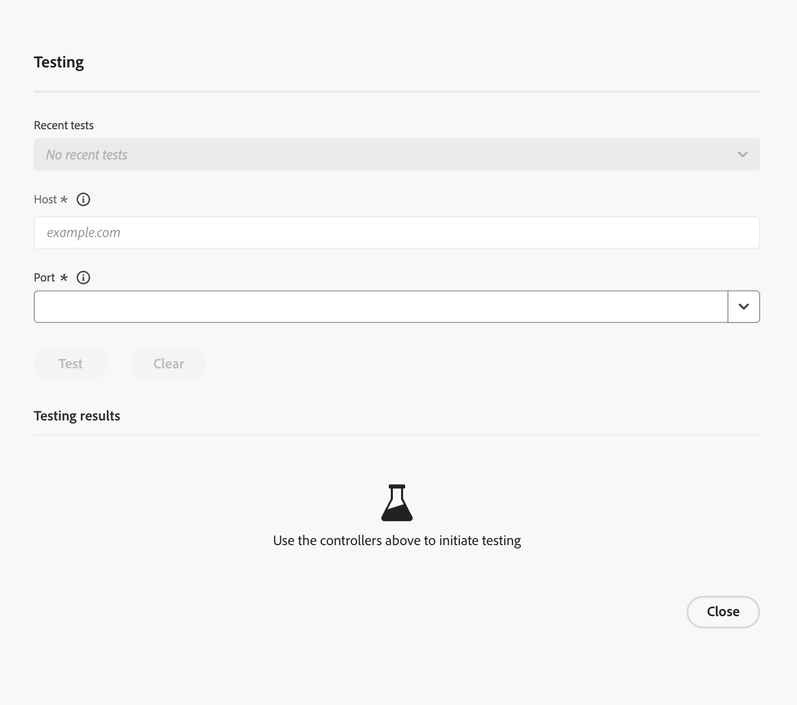

# Test de connectivité réseau {#network-connectivity-test}

Le **test de connectivité réseau** est un outil de diagnostic Cloud Manager qui vous permet de valider la mise en réseau avancée et la configuration VPN avant d’activer la mise en réseau avancée sur vos environnements et avant la mise en ligne. Utilisez-le pour vérifier que les hôtes et ports qu’AEM doit atteindre, y compris les points d’entrée internes ou privés, sont accessibles via le même chemin de connectivité que celui utilisé par Advanced Networking.

Le test s’exécute à partir de l’**infrastructure de proxy de sortie** qui appartient à la configuration réseau avancée de votre programme, et non à partir d’un pod de création ou de publication. Il utilise le même chemin d’accès réseau sortant qu’AEM lorsque la mise en réseau avancée est active. Cette conception est particulièrement utile pour les scénarios **VPN** : vous pouvez confirmer la résolution DNS, le routage réseau, les règles de pare-feu et la disponibilité du service pour les systèmes privés ou locaux avant de passer en ligne.

Pour plus d’informations sur la configuration d’un VPN, d’une adresse IP de sortie dédiée ou d’une sortie de port flexible, voir [ Configuration de la mise en réseau avancée pour AEM as a Cloud Service](/help/security/configuring-advanced-networking.md).

>[!IMPORTANT]
>
>Un test de connectivité réussi prouve que le chemin réseau de la mise en réseau avancée peut atteindre votre cible. Le code de votre application doit toujours être configuré pour utiliser le proxy de mise en réseau avancée si nécessaire (par exemple, les variables d’environnement liées au proxy et le transfert de port). Si le code contourne le proxy, vous pouvez ne pas voir le trafic provenant du chemin de sortie attendu même lorsque le test réussit.

## Quand utiliser cet outil ? {#when-to-use}

* Une fois que **Mise en réseau avancée** est créé au niveau du **programme** et **avant** ou lors de son activation sur **environnements**.
* Pour valider la connectivité **VPN** avec des systèmes privés ou locaux que vous utilisez (par exemple, des noms d’hôtes internes ou des adresses IP privées).
* Pour réduire les problèmes de DNS par rapport aux problèmes de pare-feu ou de routage lorsqu’un service ne répond pas comme prévu.

>[!NOTE]
>
>Cet outil est destiné aux programmes qui utilisent la mise en réseau avancée (VPN, adresse IP de sortie dédiée ou sortie de port flexible). Il ne s’agit pas d’un test à usage général de la connectivité AEM standard sans mise en réseau avancée.

## Conditions préalables {#prerequisites}

* Un programme Cloud Manager.
* Infrastructure réseau avancée déjà créée pour le programme (voir [Configuration de la mise en réseau avancée](/help/security/configuring-advanced-networking.md)).

## Exécution d’un test {#how-to-run-a-test}

1. Connectez-vous à Cloud Manager à l’adresse [my.cloudmanager.adobe.com](https://my.cloudmanager.adobe.com/) et ouvrez votre organisation et votre programme.
1. Ouvrez l’onglet **Environnements** pour le programme. Dans la barre latérale gauche, sélectionnez **Infrastructure réseau**.

1. Sur la page **Infrastructure réseau**, localisez votre infrastructure dans le tableau. Sélectionnez une ligne pour ouvrir l’expérience de test ou ouvrez le menu d’actions de ligne () et choisissez **Tester**.

   

1. La boîte de dialogue **Test réseau** s’ouvre. Saisissez **Hôte** et **Port**, sélectionnez **Test**, puis passez en revue la résolution DNS, l’ouverture du port, la connectivité HTTP et l’accessibilité dans la zone des résultats. Des actions facultatives telles que **Copier dans le presse-papiers** et l’historique des tests récents s’affichent dans la boîte de dialogue. Voir [Comprendre les résultats](#understanding-results) pour savoir comment interpréter chaque section.

   

### Champs d’entrée {#input-fields}

| Champ | Description | Exemples |
| --- | --- | --- |
| **Hôte** | Nom d’hôte ou adresse IP du service auquel AEM doit accéder. | `internal-api.example.com`, `10.0.1.50` |
| **Port** | Port TCP sur l&#39;hôte cible (1-65535). Les valeurs courantes peuvent apparaître dans une liste de raccourcis (par exemple, 80, 443, 587, 22). | `443` |

### Étapes {#test-steps}

1. Saisissez **Host** et **Port**.
1. Sélectionnez **Test**. Les résultats apparaissent généralement en quelques secondes.
1. Facultatif : utilisez l’option **Copier dans le presse-papiers** pour capturer le résultat JSON complet (utile pour les cas d’assistance).
1. Les tests récents peuvent être répertoriés pour des réexécutions rapides.

## Comprendre les résultats {#understanding-results}

L’outil signale plusieurs dimensions. Ils décrivent ensemble si la cible est accessible à partir de la mise en réseau avancée et comment les contrôles basés sur HTTP se comportent.

### Résolution DNS {#dns-resolution}

| Résultat | Signification |
| --- | --- |
| `ips: ["10.0.1.50"]` | Résolution DNS réussie. Le nom d’hôte a été résolu sur la ou les adresses IP répertoriées à l’aide des programmes de résolution associés à votre configuration de réseau avancée. |
| `error: "DNS resolution error: ..."` | Échec de la résolution DNS. Les serveurs DNS configurés n’ont pas pu résoudre le nom d’hôte (nom incorrect, résolveur inaccessible, enregistrement manquant et causes similaires). |

>[!NOTE]
>
>Si vous saisissez une **adresse IP numérique** au lieu d’un nom d’hôte, la résolution DNS est ignorée pour cette valeur et l’adresse IP est utilisée directement.

### Port ouvert {#port-open}

| Résultat | Signification |
| --- | --- |
| `Yes` / true | Connexion TCP réussie — le port est ouvert et accepte les connexions. |
| `No` / false | Le port est fermé, filtré par un pare-feu, ou l’hôte est inatteignable. |

### Connectivité HTTP {#http-connectivity}

Une requête HTTP/HTTPS est tentée sur **chaque port**. L’outil tente toujours d’abord d’utiliser **HTTPS**, puis retourne à **HTTP**. Si aucun des deux ne fonctionne, le résultat est mappé à un message court et lisible **erreur** (voir le tableau ci-dessous).

**Sorties de succès**

| Sortie | Signification |
| --- | --- |
| `protocol: "https"`, `status_code: 200`, `reason: "200 OK"` | Connexion HTTPS réussie. |
| `protocol: "http"`, `status_code: 301`, `reason: "301 Moved Permanently"` | Connexion HTTP réussie ; le service effectue une redirection (généralement vers HTTPS). C&#39;est normal. |

**Sorties d’erreur classifiées**

| Erreur | Remarque | Signification |
| --- | --- | --- |
| `"Not an HTTP/HTTPS service"` | `"The service appears to be a non-HTTP service (e.g., database, message queue, or custom TCP). Use the port_open and reachability fields to verify connectivity."` | Le port est ouvert, mais le service ne parle pas HTTP. Cela est prévu pour les bases de données, le protocole SFTP, le protocole TCP personnalisé et les services similaires. |
| `"Connection refused"` | `"The port is not accepting connections. Verify the service is running and listening on this port."` | Rien n&#39;écoute sur ce port. |
| `"Connection timed out"` | `"The connection timed out. Check firewall rules and network routing."` | Un problème de pare-feu ou de routage empêche la connexion. |
| `"No IPs resolved for host"` | — | Échec de la résolution DNS ; le HTTP ne peut pas être testé. |

>[!NOTE]
>
>Tout code d’état HTTP du service cible (par exemple, `200`, `301`, `302`, `403`, `404` ou `500`) est un **signal de réussite** pour la connectivité ; il signifie que le **chemin d’accès au réseau** fonctionne. Le code d’état reflète la propre réponse du service, et non l’intégrité globale du réseau. Pour les services non HTTP, l’outil indique **Pas de service HTTP/HTTPS** ; utilisez **Port ouvert** et **Accessibilité** comme indicateurs fiables pour ces services.

### Accessibilité {#reachability}

| Résultat | Signification |
| --- | --- |
| **Accessible** | L’hôte et le port cibles sont accessibles à partir de l’infrastructure de mise en réseau avancée. La configuration réseau est correcte. |
| **Inatteignable : port non accessible** | DNS résolu avec succès, mais TCP sur le port n&#39;a pas réussi. Il s’agit généralement d’un problème de pare-feu ou de routage. |
| **Inaccessible : échec de la résolution DNS** | Le nom d&#39;hôte n&#39;a pas pu être résolu avec votre configuration. Cela indique un problème de configuration DNS. |

### Plusieurs résolveurs DNS {#multiple-dns-resolvers}

Si votre infrastructure de réseau avancé définit **plusieurs résolveurs DNS** :

* Lorsque **tous les programmes de résolution renvoient des résultats identiques**, un **résultat consolidé unique** intitulé `default` s’affiche.
* Lorsque les programmes de résolution renvoient **résultats différents**, le résultat de chaque programme de résolution est affiché **séparément** (intitulé `resolver_1`, `resolver_2`, etc.), **avec l’adresse IP du programme de résolution**, afin que vous puissiez voir quel serveur DNS est à l’origine de l’incohérence.

## Résolution des problèmes {#troubleshooting}

Les scénarios suivants associent ce que vous êtes susceptible de voir dans l’outil à des étapes pour réduire la cause. Pour obtenir un fichier JSON complet **Copier dans le presse-papiers** qui illustre les mêmes situations, voir [Exemples de sorties](#example-outputs).

### Échec de la résolution DNS {#dns-failed}

#### Sortie

Le nom d’hôte n’a pas été résolu à l’aide de vos paramètres DNS de mise en réseau avancés. L’outil ne peut donc pas tester le port. Dans la vue des résultats, la **résolution DNS** affiche une chaîne d’erreur et la **accessibilité** signale que le DNS a échoué :

```
DNS Resolution: error: "DNS resolution error: ..."
Reachability: "Unreachable: DNS resolution failed"
```

#### Recommandations

1. **Vérifiez que le nom d&#39;hôte est correct**—recherchez les fautes de frappe et vérifiez que vous utilisez la **zone DNS** prévue (la mauvaise zone est une erreur courante).
1. Assurez-vous **vos résolveurs DNS** ceux configurés dans l’infrastructure réseau, sont **accessibles à partir de la plage CIDR de mise en réseau avancée** (le même espace d’adresse que celui utilisé par l’outil et AEM pour les contrôles sortants). Si vous dépendez de DNS privé, ces serveurs doivent être accessibles via le tunnel VPN ou dans l&#39;espace d&#39;adresse réseau que le routage expose à la mise en réseau avancée.
1. **Vérifiez que vos serveurs DNS configurés peuvent résoudre le nom d&#39;hôte** — Advanced Networking utilise **uniquement** les résolveurs définis dans la configuration de votre infrastructure réseau, **pas** DNS public (par exemple, `8.8.8.8`). Si votre DNS interne ne comporte aucun enregistrement pour ce nom d’hôte, la résolution échoue.
1. **Pour les configurations VPN :** vérifiez que les adresses IP du serveur DNS se trouvent dans l’espace d’adresse VPN (le CIDR réseau distant pour lequel le tunnel est conçu). Les résolveurs sur un sous-réseau qui n&#39;est pas acheminé via le tunnel VPN ne sont pas accessibles depuis la mise en réseau avancée.

### Le DNS fonctionne mais le port n’est pas accessible {#dns-ok-port-blocked}

#### Sortie

L’outil peut résoudre l’hôte, mais TCP sur le port ne réussit pas. Un résumé se présente souvent comme suit :

```
DNS Resolution: ips: ["10.0.1.50"]
Port Open: No
Reachability: "Unreachable: Port not accessible"
```

#### Recommandations

1. **Consultez les règles de pare-feu et de liste autorisée sur le service cible** : le trafic entrant provenant de votre plage CIDR d’infrastructure de réseau avancée (et les adresses IP de sortie utilisées par AEM) doit être autorisé. Si vous utilisez un VPN, incluez des CIDR de réseau distant comme votre conception l’exige.
1. **Vérifiez que le service est en cours d’exécution** et **d’écoute sur l’hôte et le port** vous avez saisi dans le test.
1. **Pour les configurations VPN :** vérifiez que le tunnel est ouvert, que le routage atteint le sous-réseau cible et que l’adresse cible se trouve dans l’espace d’adresse du réseau distant transmis sur le VPN.
1. Sur votre infrastructure, passez en revue les **groupes de sécurité réseau (NSG), règles de sécurité ou équivalents** qui peuvent bloquer le port entre la mise en réseau avancée et la cible.
1. **Confirmez le numéro de port** - assurez-vous que le processus écoute réellement sur le port que vous testez.

### Le test indique atteignable, mais AEM ne se connecte pas {#reachable-but-aem-fails}

#### Sortie

La vérification de connectivité elle-même réussit. Un résumé condensé se présente souvent comme suit :

```
Port Open: Yes
Reachability: "Reachable"
```

Cela signifie que le chemin entre la mise en réseau avancée et l’hôte et le port que vous avez testés est ouvert. Cela ne garantit pas que le trafic de l’application AEM utilise ce chemin d’accès : lorsque votre code s’exécute, les journaux de service peuvent toujours n’afficher aucune demande provenant de l’adresse IP de sortie attendue.

#### Recommandations

1. **Le code de l’application doit être configuré pour utiliser le proxy**. Le test de connectivité prouve que le chemin d’accès réseau fonctionne, mais AEM doit acheminer explicitement les requêtes par le biais du **proxy de mise en réseau avancée** (par exemple, via la variable d’environnement **`AEM_PROXY_HOST`**). Si le code établit des connexions directes sans le proxy, le trafic ne passe pas par l’infrastructure de mise en réseau avancée.
1. **Vérification des paramètres de proxy dans vos clients HTTP** - Les clients HTTP doivent utiliser la même configuration de proxy (`AEM_PROXY_HOST` et transfert de port, le cas échéant).
1. **Vérifiez la configuration du transfert de port** pour la mise en réseau avancée au niveau de l’**environnement** : en `portForwards`, chaque entrée doit mapper **`portOrig`** à **`portDest`** sur l’**hôte cible** approprié. **`portOrig`** est le **port auquel votre code d’application AEM se connecte** lorsqu’il ouvre la connexion sortante via le proxy. **`portDest`** est le **port réel sur le service cible** où le processus distant écoute. Le **hôte cible** est le **nom d’hôte ou adresse de ce service** tel qu’utilisé dans le transfert. Les trois doivent correspondre à la manière dont votre application est écrite pour se connecter.
1. **Vérifiez`nonProxyHosts`**. Si l’hôte cible y est répertorié, les requêtes **ignorez le proxy** pour cet hôte et ne suivront pas le chemin d’accès Réseau avancé que vous avez validé.

### HTTP affiche une erreur mais le port est ouvert {#http-error-port-open}

#### Sortie

TCP réussit, mais la sonde HTTP/HTTPS signale toujours un échec. Un résumé se présente souvent comme suit :

```
Port Open: Yes
HTTP Connectivity: error: "Connection error: ..." or "Both HTTPS and HTTP failed. ..."
Reachability: "Reachable"
```

#### Recommandations

1. **Le service peut ne pas parler HTTP ou HTTPS** par exemple, TCP brut, gRPC ou un autre protocole. La sonde HTTP peut échouer pendant que `Port open: Yes` et `Reachability: Reachable` confirment toujours que le chemin réseau fonctionne. Utilisez ces champs comme source de vérité pour les services non HTTP.
1. **Examiner la configuration du protocole TLS et du certificat**. Si HTTPS échoue mais que HTTP réussit (parfois indiqué par une note telle que `HTTPS failed, HTTP succeeded`), le service peut avoir des problèmes de certificat ou peut uniquement proposer HTTP sur ce port.

### Délai d’expiration de la demande {#timeout}

#### Sortie

```json
{ "error": "Request timeout" }
```

#### Recommandations

1. **Autoriser le temps de réponse du service** : la vérification utilise un délai d’expiration de 5 secondes. Les cibles qui répondent plus lentement expireront même si elles sont par ailleurs saines.
1. **Tenir compte de la latence du réseau**. Sur les connexions VPN, une latence élevée ou un tunnel défectueux peut pousser l&#39;aller-retour au-delà de la limite ; vérifiez le statut et le routage du tunnel.
1. **Réexécutez le test**. Des problèmes réseau ponctuels peuvent produire un délai d’expiration qui ne se reproduit pas.

## Exemples de sorties {#example-outputs}

### Test HTTPS réussi (par exemple API interne sur le port 443) {#example-output-successful-https}

```json
{
  "resolvers": [
    {
      "name": "default",
      "dns_resolution": {
        "ips": ["10.0.1.50"]
      },
      "port_open": true,
      "http_connectivity": {
        "protocol": "https",
        "status_code": 200,
        "reason": "200 OK"
      },
      "reachability": "Reachable"
    }
  ]
}
```

### Test de service non HTTP réussi (par exemple, base de données sur le port 5432) {#example-output-successful-non-http}

```json
{
  "resolvers": [
    {
      "name": "default",
      "dns_resolution": {
        "ips": ["10.0.1.50"]
      },
      "port_open": true,
      "http_connectivity": {
        "error": "Not an HTTP/HTTPS service",
        "note": "The service appears to be a non-HTTP service (e.g., database, message queue, or custom TCP). Use the port_open and reachability fields to verify connectivity."
      },
      "reachability": "Reachable"
    }
  ]
}
```

>[!NOTE]
>
>L’erreur HTTP est attendue pour les services non HTTP. **Port ouvert : true** et **Accessibilité : accessible** confirmez que le chemin d’accès réseau fonctionne.

### Échec de la résolution DNS {#example-output-dns-resolution-failure}

```json
{
  "resolvers": [
    {
      "name": "default",
      "dns_resolution": {
        "error": "DNS resolution error: dial udp 10.0.0.2:53: i/o timeout"
      },
      "port_open": false,
      "http_connectivity": {
        "error": "DNS resolution failed"
      },
      "reachability": "Unreachable: DNS resolution failed"
    }
  ]
}
```

### Port Non Accessible (Pare-Feu/Service Arrêté) {#example-output-port-not-accessible}

```json
{
  "resolvers": [
    {
      "name": "default",
      "dns_resolution": {
        "ips": ["10.0.1.50"]
      },
      "port_open": false,
      "http_connectivity": {
        "error": "Connection error: dial tcp 10.0.1.50:443: i/o timeout"
      },
      "reachability": "Unreachable: Port not accessible"
    }
  ]
}
```

## Remarques importantes {#important-notes}

### Ce Que Ne Fait Pas Ce Test {#what-this-test-does-not-do}

* Le test ne s’exécute pas dans une capsule de création ou de publication AEM. Il s’exécute à partir de **infrastructure de proxy de sortie**. Cela valide la couche réseau, et non la configuration de proxy au niveau de l’application dans votre code.
* Cela ne valide pas les paramètres de proxy de votre application AEM. Même lorsque le résultat est `Reachable`, le code AEM doit toujours être configuré pour utiliser le proxy.
* Il ne valide pas la configuration de transfert de port au niveau de l’environnement en soi. Il teste la connectivité brute à partir du chemin d’accès à l’infrastructure.
* Il n’envoie pas de payloads personnalisés. Les tests HTTP émettent une requête `GET` de base à `/`.

### Temps de réponse {#response-time}

* **Typique :** environ 2 à 3 secondes.
* **Maximum :** délai d’expiration d’environ cinq secondes.
* **Tous les résolveurs DNS** et les contrôles de connectivité s’exécutent en parallèle.

### Services HTTP ou non HTTP {#http-vs-non-http-services}

L’outil tente une connexion HTTP/HTTPS sur chaque port. Pour les services non HTTP (par exemple, PostgreSQL sur le port 5432, MySQL sur 3306, SFTP sur 22, Redis sur 6379), la vérification HTTP peut échouer avec une erreur de connexion, ce qui est attendu. Fiez-vous à `Port open` et `Reachability` pour confirmer la connectivité de ces services.

## Informations connexes {#related-information}

* [Configurer la mise en réseau avancée pour AEM as a Cloud Service](/help/security/configuring-advanced-networking.md)
* [Tutoriels avancés sur la mise en réseau dans Experience League](https://experienceleague.adobe.com/fr/docs/experience-manager-learn/cloud-service/networking/advanced-networking)
