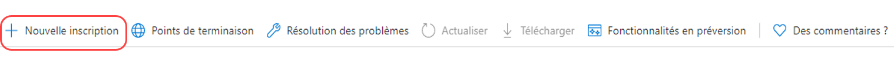

# Prise en charge d’OAuth2 pour le service de messagerie {#oauth2-support-for-the-mail-service}

AEM as a Cloud Service offre la prise en charge d’OAuth2 pour son service de messagerie intégré, afin de permettre aux entreprises de se conformer aux exigences en matière de messagerie sécurisée.

Vous pouvez configurer OAuth pour plusieurs fournisseurs de messagerie. Vous trouverez ci-dessous des instructions détaillées pour configurer le service de messagerie d’AEM afin de l’authentifier via OAuth2 avec Microsoft® Office 365 Outlook. D’autres fournisseurs peuvent être configurés de la même manière.

Pour plus d’informations sur le service de messagerie d’AEM as a Cloud Service, voir [Envoi d’e-mail](/help/implementing/developing/introduction/development-guidelines.md#sending-email).

## Microsoft® Outlook {#microsoft-outlook}

1. Accédez à [https://portal.azure.com/](https://portal.azure.com/) et connectez-vous.
1. Recherchez **Azure Active Directory** dans la barre de recherche et cliquez sur le résultat. Vous pouvez également accéder directement à [https://portal.azure.com/#blade/Microsoft_AAD_IAM/ActiveDirectoryMenuBlade/Overview](https://portal.azure.com/#blade/Microsoft_AAD_IAM/ActiveDirectoryMenuBlade/Overview).
1. Cliquez sur **Enregistrement de l’application** > **Nouvel enregistrement**.

   

1. Renseignez les informations selon vos besoins puis cliquez sur **Enregistrement**.
1. Accédez à l’application nouvellement créée, puis sélectionnez **Autorisations d’API**.
<!-- Alexandru: removing as a result of CQDOC-20609 
1. Click **Add Permission** > **Graph Permission** > **Delegated Permissions**. -->
1. Sélectionnez les autorisations ci-dessous pour votre application, puis cliquez sur **Ajouter une autorisation** :

   >[!NOTE]
   >
   >La configuration des autorisations peut évoluer au fil du temps. Travaillez avec Microsoft® si elles ne fonctionnent pas comme prévu.

   * `https://outlook.office.com/SMTP.Send`
   * `openid`
   * `offline_access`
   * `email`
   * `profile`
1. Accédez à **Authentification** > **Ajouter une plateforme** > **Web**, et dans la section **URL de redirection**, ajoutez les URL ci-dessous, une avec et une sans barre oblique :
   * `http://localhost/`
   * `http://localhost`
1. Appuyez sur **Configurer** après avoir ajouté chaque URL et configurez vos paramètres en fonction de vos besoins.
1. Ensuite, accédez à **Certificats et secrets**, cliquez sur **Nouveau secret client** et suivez les étapes sur l’écran pour créer un secret. Veillez à prendre note de ce secret pour une utilisation ultérieure.
1. Appuyez sur **Aperçu** dans le volet de gauche et copiez les valeurs pour **ID d’application (client)** et **ID de répertoire (locataire)** pour une utilisation ultérieure.

Pour effectuer une récapitulation, utilisez les informations suivantes pour configurer OAuth2 pour le service de messagerie du côté AEM :

* L’URL d’authentification, qui est créée avec l’identifiant du locataire. Elle se présente comme suit : `https://login.microsoftonline.com/<tenantID>/oauth2/v2.0/authorize`
* L’URL du jeton, qui est construite avec l’ID du locataire. Elle se présente comme suit : `https://login.microsoftonline.com/<tenantID>/oauth2/v2.0/token`
* L’URL d’actualisation, qui est créée avec l’ID du locataire. Elle se présente comme suit : `https://login.microsoftonline.com/<tenantID>/oauth2/v2.0/token`
* L’ID client
* Le secret client

### Génération du jeton d’actualisation {#generating-the-refresh-token}

Ensuite, générez le jeton d’actualisation qui fait partie de la configuration OSGi lors d’une étape suivante en procédant comme suit :

1. Ouvrez l’URL suivante dans le navigateur après avoir remplacé `clientID` et `tenantID` par les valeurs propres à votre compte :

   ```
   https://login.microsoftonline.com/%3ctenantID%3e/oauth2/v2.0/authorize?client_id=%3cclientId%3e&response_type=code&redirect_uri=http://localhost&response_mode=query&scope=https://outlook.office.com/SMTP.Send%20email%20openid%20profile%20offline_access&state=12345`
   ```

1. Sur demande, accordez l’autorisation.
1. L’URL redirige vers un nouvel emplacement, créé au format suivant :

   ```
   http://localhost/?code=<code>&state=12345&session_state=4f984c6b-cc1f-47b9-81b2-66522ea83f81#`
   ```

1. Copiez la valeur de `<code>` dans l’exemple ci-dessus.
1. Utilisez la commande cURL suivante pour obtenir le refreshToken. Remplacez tenantID, clientID et clientSecret par les valeurs de votre compte et par la valeur de `<code>` :

   ```
   curl --location --request POST 'https://login.microsoftonline.com/<tenantId>/oauth2/v2.0/token' \
   --header 'Content-Type: application/x-www-form-urlencoded' \
   --header 'Cookie: buid=0.ARgAep0nU49DzUGmoP2wnvyIkcQjsx26HEpOnvHS0akqXQgYAAA.AQABAAEAAAD--DLA3VO7QrddgJg7Wevry9XPJSKbGVlPt5NWYxLtTl3K1W0LwHXelrffApUo_K02kFrkvmGm94rfBT94t25Zq4bCd5IM3yFOjWb3V22yDM7-rl112sLzbBQBRCL3QAAgAA; esctx=AQABAAAAAAD--DLA3VO7QrddgJg7Wevr4a8wBjYcNbBXRievdTOd15caaeAsQdXeBAQA3tjVQaxmrOXFGkKaE7HBzsJrzA-ci4RRpor-opoo5gpGLh3pj_iMZuqegQPEb1V5sUVQV8_DUEbBv5YFV2eczS5EAhLBAwAd1mHx6jYOL8LwZNDFvd2-MhVXwPd6iKPigSuBxMogAA; x-ms-gateway-slice=estsfd; stsservicecookie=estsfd; fpc=Auv6lTuyAP1FuOOCfj9w0U_5vR5dAQAAALDXP9gOAAAAwIpkkQEAAACT2T_YDgAAAA' \
   --data-urlencode 'client_id=<clientID>' \
   --data-urlencode 'scope=https://outlook.office.com/SMTP.Send email openid profile offline_access' \
   --data-urlencode 'redirect_uri=http://localhost' \
   --data-urlencode 'grant_type=authorization_code' \
   --data-urlencode 'client_secret=<clientSecret>' \
   --data-urlencode 'code=<code>'
   ```

1. Prenez note des éléments refreshToken et accessToken.

### Validation des jetons {#validating-the-tokens}

Avant de poursuivre la configuration d’OAuth côté AEM, veillez à valider les éléments accessToken et refreshToken avec la procédure suivante :

1. Générez le jeton accessToken à l&#39;aide du refreshToken produit lors de la procédure précédente en utilisant la curl suivante, en remplaçant les valeurs de `<client_id>`,`<client_secret>` et `<refreshToken>` :

   ```
   curl --location --request POST 'https://login.microsoftonline.com/<tenetId>/oauth2/v2.0/token' \
   --header 'Content-Type: application/x-www-form-urlencoded' \
   --header 'Cookie: buid=0.ARgAep0nU49DzUGmoP2wnvyIkcQjsx26HEpOnvHS0akqXQgYAAA.AQABAAEAAAD--DLA3VO7QrddgJg7Wevry9XPJSKbGVlPt5NWYxLtTl3K1W0LwHXelrffApUo_K02kFrkvmGm94rfBT94t25Zq4bCd5IM3yFOjWb3V22yDM7-rl112sLzbBQBRCL3QAAgAA; esctx=AQABAAAAAAD--DLA3VO7QrddgJg7Wevr4a8wBjYcNbBXRievdTOd15caaeAsQdXeBAQA3tjVQaxmrOXFGkKaE7HBzsJrzA-ci4RRpor-opoo5gpGLh3pj_iMZuqegQPEb1V5sUVQV8_DUEbBv5YFV2eczS5EAhLBAwAd1mHx6jYOL8LwZNDFvd2-MhVXwPd6iKPigSuBxMogAA; x-ms-gateway-slice=estsfd; stsservicecookie=estsfd; fpc=Auv6lTuyAP1FuOOCfj9w0U_IezHLAQAAAPeNSdgOAAAA' \
   --data-urlencode 'client_id=<client_id>' \
   --data-urlencode 'scope=https://outlook.office.com/SMTP.Send email openid profile offline_access' \
   --data-urlencode 'redirect_uri=http://localhost' \
   --data-urlencode 'grant_type=refresh_token' \
   --data-urlencode 'client_secret=<client_secret>' \
   --data-urlencode 'refresh_token=<refreshToken>'
   ```

1. Envoyez un e-mail à l’aide du jeton accessToken, afin de vérifier s’il fonctionne correctement.

>[!NOTE]
>
> Vous pouvez obtenir la collection d’API Postman à partir de [cet emplacement](https://learn.microsoft.com/fr-fr/entra/identity-platform/v2-oauth2-auth-code-flow).
>
> Voir la [documentation de MSFT OAuth](https://learn.microsoft.com/fr-fr/exchange/client-developer/legacy-protocols/how-to-authenticate-an-imap-pop-smtp-application-by-using-oauth) pour plus détails.

### Intégration à AEM as a Cloud Service {#integration-with-aem-as-a-cloud-service}

1. Créez un fichier de propriétés OSGI appelé `com.day.cq.mailer.oauth.impl.OAuthConfigurationProviderImpl.cfg.json` sous `/apps/<my-project>/osgiconfig/config` avec la syntaxe suivante :

   ```
   {
       authUrl: "<Authorization Url>",
       tokenUrl: "<Token Url>",
       clientId: "<clientID>",
       clientSecret: "$[secret:SECRET_SMTP_OAUTH_CLIENT_SECRET]",
       scopes: [
          "scope1",
          "scope2"
       ],
       authCodeRedirectUrl: "http://localhost",
       refreshUrl: "<Refresh token Url>",
       refreshToken: "$[secret:SECRET_SMTP_OAUTH_REFRESH_TOKEN]"
   }
   ```

1. Renseignez les champs `authUrl`, `tokenUrl` et `refreshURL` en les construisant comme décrit dans la section précédente.
1. Ajoutez les portées suivantes à la configuration :

   >[!NOTE]
   >
   >Les portées peuvent évoluer au fil du temps. Travaillez avec Microsoft® si elles ne fonctionnent pas comme prévu.

   * `https://outlook.office.com/SMTP.Send`
   * `openid`
   * `offline_access`
   * `email`
   * `profile`
1. Créez un fichier de propriétés OSGI appelé `called com.day.cq.mailer.DefaultMailService.cfg.json`
sous `/apps/<my-project>/osgiconfig/config` avec la syntaxe suivante : Les valeurs `smtp.host` et `smtp.port` correspondent à une configuration réseau avancée, comme décrit dans le [tutoriel sur le service de messagerie](https://experienceleague.adobe.com/fr/docs/experience-manager-learn/cloud-service/networking/examples/email-service).

   ```
   {
    "smtp.host": "$[env:AEM_PROXY_HOST;default=proxy.tunnel]",
    "smtp.user": "<user account that logged into get the oauth tokens>",
    "smtp.password": "value not used",
    "smtp.port": 30465,
    "from.address": "<from address used for sending>",
    "smtp.ssl": false,
    "smtp.starttls": true,
    "smtp.requiretls": true,
    "debug.email": false,
    "oauth.flow": true
   }
   ```

1. Pour Outlook, la valeur de configuration `smtp.host` est `smtp.office365.com`.
1. Au moment de l’exécution, transmettez les secrets `refreshToken values` et `clientSecret` à l’aide de l’[API des variables Cloud Manager](/help/implementing/deploying/configuring-osgi.md#setting-values-via-api) ou en utilisant [Cloud Manager pour ajouter des variables](/help/implementing/cloud-manager/environment-variables.md). Les valeurs des variables `SECRET_SMTP_OAUTH_REFRESH_TOKEN` et `SECRET_SMTP_OAUTH_CLIENT_SECRET` doivent être définies.

### Résolution des problèmes {#troubleshooting}

Si le service de messagerie ne fonctionne pas correctement, vous devez régénérer le `refreshToken` comme décrit ci-dessus, en transmettant la nouvelle valeur via l’API Cloud Manager. Le déploiement de la nouvelle valeur prend quelques minutes.
