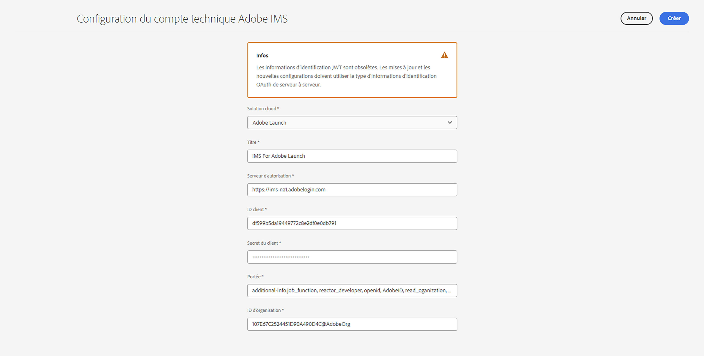
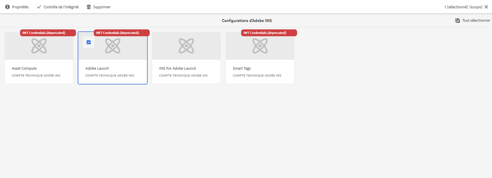
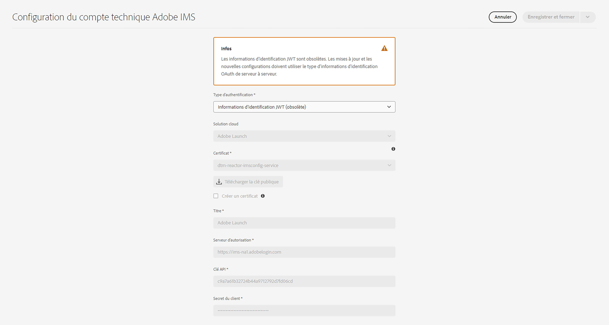
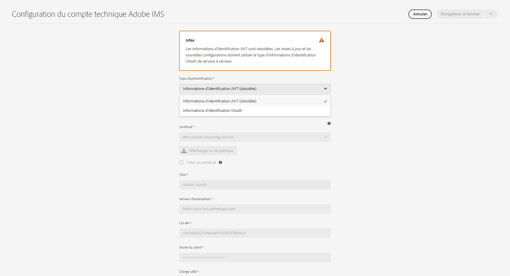
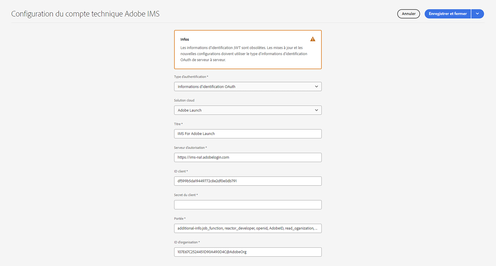

# Configurer des intégrations IMS pour AEM as a Cloud Service {#setting-up-ims-integrations-for-aemaacs}

>[!NOTE]
>
>Les configurations JWT configurées automatiquement ne doivent pas être migrées manuellement, car elles seront gérées automatiquement par Adobe.

Adobe Experience Manager (AEM) as a Cloud Service peut être intégré à de nombreuses autres solutions Adobe. Par exemple, Adobe Target, Adobe Analytics et d’autres.

Les intégrations utilisent une intégration IMS configurée avec S2S OAuth.

* Une fois que vous avez créé ce qui suit :

   * [Les informations d’identification dans la Developer Console](#credentials-in-the-developer-console)

* Vous pouvez ensuite effectuer ce qui suit :

   * Créer une (nouvelle) [configuration OAuth](#creating-oauth-configuration)

   * [Migrer une configuration JWT existante vers une configuration OAuth](#migrating-existing-JWT-configuration-to-oauth)

>[!CAUTION]
>
>Auparavant, les configurations étaient effectuées avec les [informations d’identification JWT désormais sujettes à l’obsolescence dans Adobe Developer Console](/help/security/jwt-credentials-deprecation-in-adobe-developer-console.md).
>
>De telles configurations ne peuvent plus être créées ou mises à jour, mais peuvent être migrées vers des configurations OAuth.

## Informations d’identification dans la Developer Console {#credentials-in-the-developer-console}

Dans un premier temps, vous devez configurer les informations d’identification OAuth dans Adobe Developer Console.

Pour plus de détails sur la façon de procéder, consultez la documentation de la Developer Console, en fonction de vos besoins :

* Vue d’ensemble :

   * [Authentification de serveur à serveur](https://developer.adobe.com/developer-console/docs/guides/authentication/ServerToServerAuthentication/)

* Créer de nouvelles informations d’identification OAuth :

   * [Guide de mise en œuvre des informations d’identification OAuth de serveur à serveur](https://developer.adobe.com/developer-console/docs/guides/authentication/ServerToServerAuthentication/implementation)

* Migrer des informations d’identification JWT existantes vers des informations d’identification OAuth :

   * [Migrer des informations d’identification du compte de service (JWT) vers les informations d’identification OAuth de serveur à serveur](https://developer.adobe.com/developer-console/docs/guides/authentication/ServerToServerAuthentication/migration/)

Par exemple :

## Créer une configuration OAuth {#creating-oauth-configuration}

Pour créer une nouvelle intégration Adobe IMS à l’aide d’OAuth, procédez comme suit :

1. Dans AEM, accédez à **Outils**, **Sécurité**, **Intégration Adobe IMS**.

1. Sélectionnez **Créer**.

1. Complétez la configuration en fonction des détails de la [Developer Console](https://developer.adobe.com/developer-console/docs/guides/authentication/ServerToServerAuthentication/implementation). Par exemple :

   

1. **Enregistrez** vos modifications.

## Migrer une configuration JWT existante vers une configuration OAuth {#migrating-existing-JWT-configuration-to-oauth}

Pour migrer une intégration Adobe IMS existante basée sur les informations d’identification JWT, procédez comme suit :

>[!NOTE]
>
>Cet exemple montre une configuration IMS de lancement.

1. Dans AEM, accédez à **Outils**, **Sécurité**, **Intégration Adobe IMS**.

1. Sélectionnez la configuration JWT qui doit être migrée. Les configurations JWT affichent l’avertissement **Informations d’identification JWT (obsolètes)**.

1. Sélectionnez **Propriétés** :

   

1. La configuration s’ouvrira en lecture seule :

   

1. Sélectionnez **OAuth** dans la liste déroulante des **types d’authentification** :

   

1. Les propriétés disponibles seront mises à jour. Utilisez les détails de la Developer Console pour les compléter :

   

1. Sélectionnez **Enregistrer et fermer** pour conserver vos mises à jour.
Lorsque vous revenez à la console, l’avertissement **Informations d’identification JWT (obsolètes)** a disparu.
