# Affichage principal de la gestion des autorisations {#principal-view-for-permissions-management}

## Présentation {#overview}

AEM introduit la gestion des autorisations pour les utilisateurs et les groupes. La fonctionnalité principale reste la même que celle de l’interface utilisateur classique, mais celle-ci est plus efficace et conviviale.

## Accès à l’interface utilisateur {#accessing-the-ui}

La nouvelle gestion des autorisations basée sur l’interface utilisateur est accessible via la carte Autorisations sous Sécurité, comme illustré ci-dessous :

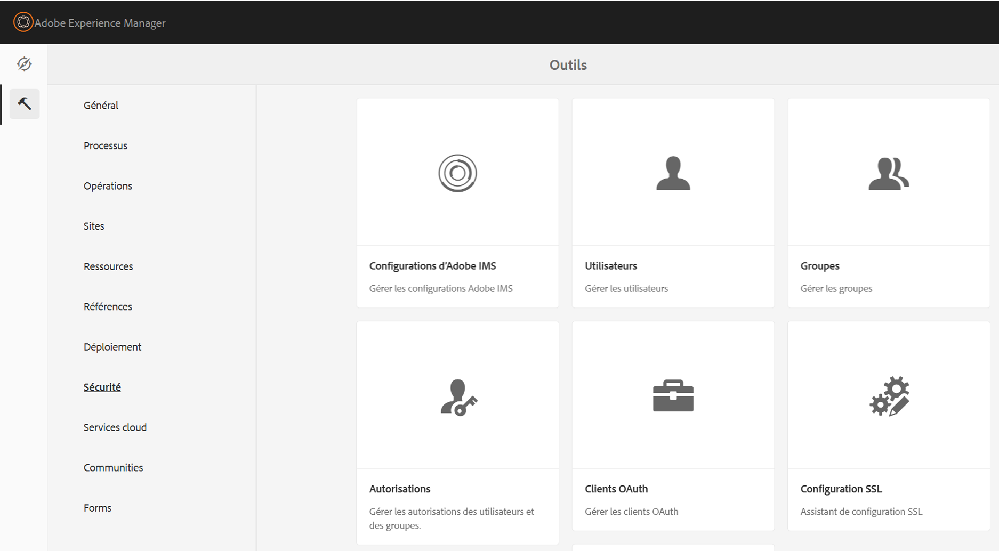

Le nouvel affichage facilite la consultation de l’ensemble des privilèges et restrictions pour un principal donné pour tous les chemins d’accès pour lesquels les autorisations ont été accordées explicitement. Ainsi, plus besoin d’accéder à

CRXDE pour gérer les privilèges et les restrictions avancés. Elle a été consolidée dans la même vue.

Il existe un filtre qui permet aux utilisateurs et utilisatrices de sélectionner le type d’entités à examiner : **Utilisateurs**, **Groupes** ou **Tous**, et de rechercher n’importe quelle entité&#x200B;**.**

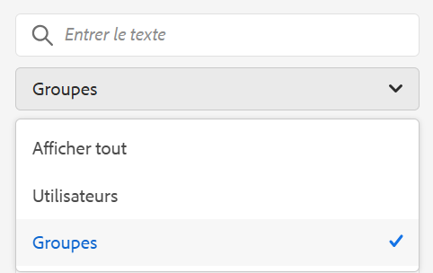

## Affichage des autorisations d’une entité {#viewing-permissions-for-a-principal}

Le cadre de gauche permet aux utilisateurs et utilisatrices de faire défiler l’écran vers le bas pour trouver une entité ou rechercher un Groupe ou un Utilisateur en fonction du filtre sélectionné, comme illustré ci-dessous :

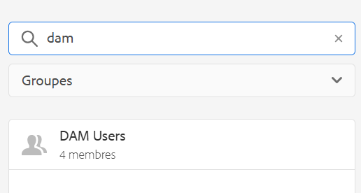

Cliquez sur le nom pour afficher les autorisations attribuées sur la droite. Le volet des autorisations affiche la liste des entrées de contrôle d’accès sur des chemins spécifiques, ainsi que les restrictions configurées.

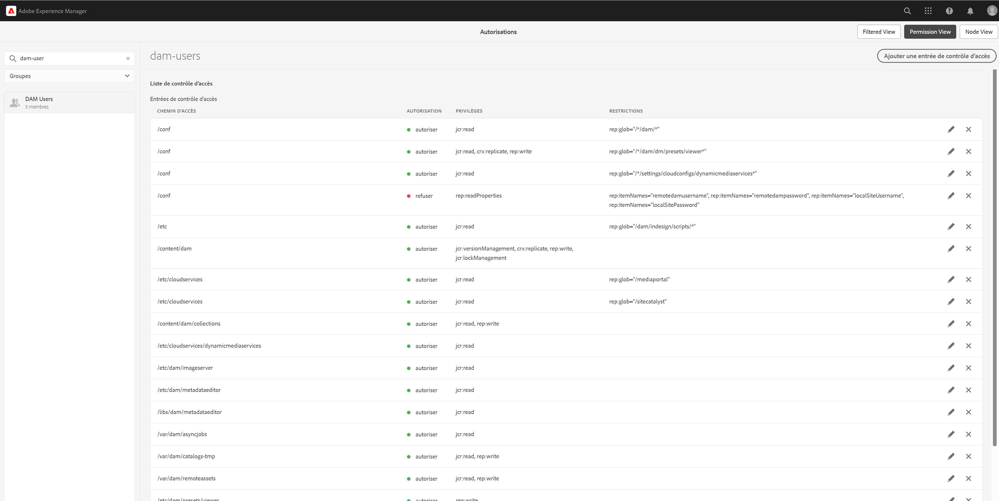

## Ajout d’une nouvelle entrée de contrôle d’accès pour une entité {#adding-new-access-control-entry-for-a-principal}

De nouvelles autorisations peuvent être ajoutées grâce à l’ajout d’une entrée de contrôle d’accès. Cliquez simplement sur le bouton Ajouter ACE.

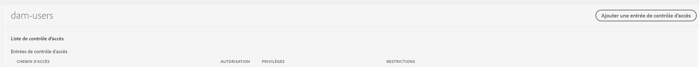

La fenêtre ci-dessous s’affiche. L’étape suivante consiste à choisir le chemin d’accès pour lequel l’autorisation doit être configurée.

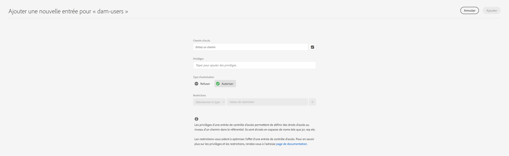

Ici, un chemin d’accès est sélectionné, pour lequel vous pouvez configurer une autorisation pour **dam-users** :

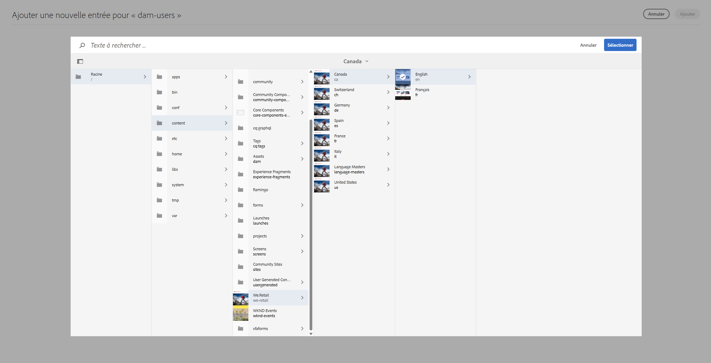

Une fois le chemin sélectionné, le workflow revient sur l’écran depuis lequel un ou plusieurs privilèges peuvent être sélectionnés parmi les espaces de noms disponibles (comme `jcr`, `rep` ou `crx`), comme indiqué ci-dessous.

Vous pouvez ajouter des privilèges en effectuant une recherche à partir du champ de texte, puis en sélectionnant dans la liste.

>[!NOTE]
>
>Pour obtenir la liste complète des privilèges et descriptions, voir [Administration des utilisateurs et utilisatrices, des groupes et des droits d’accès](https://experienceleague.adobe.com/fr/docs/experience-manager-65/content/security/user-group-ac-admin#access-right-management).

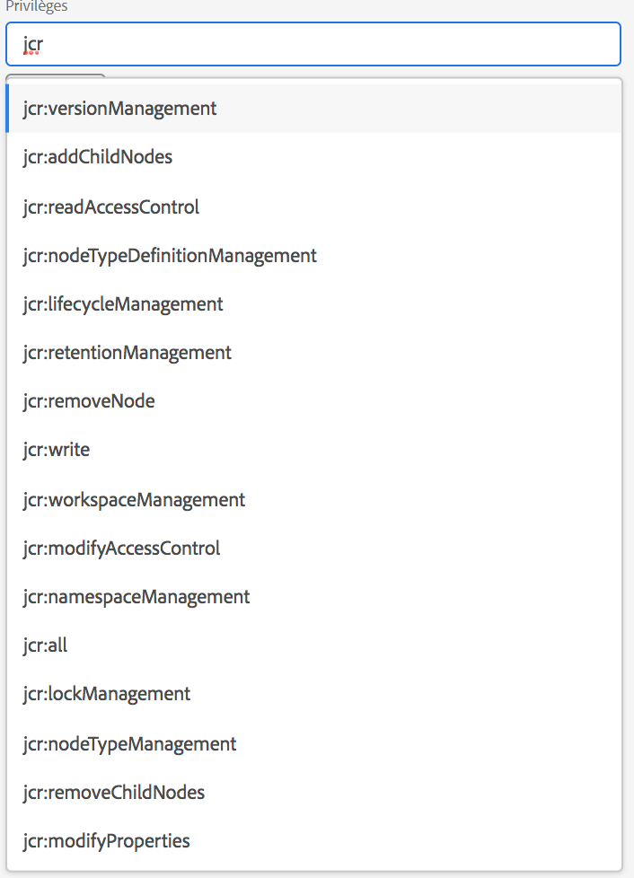 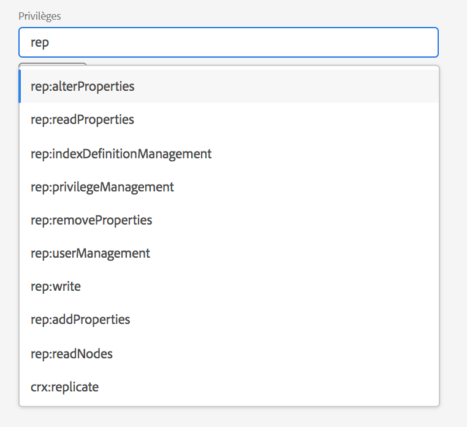

Une fois la liste des privilèges sélectionnée, l’utilisateur ou utilisatrice peut choisir le Type d’autorisation : Deny (Refuser) ou Allow (Autoriser), comme illustré ci-dessous.

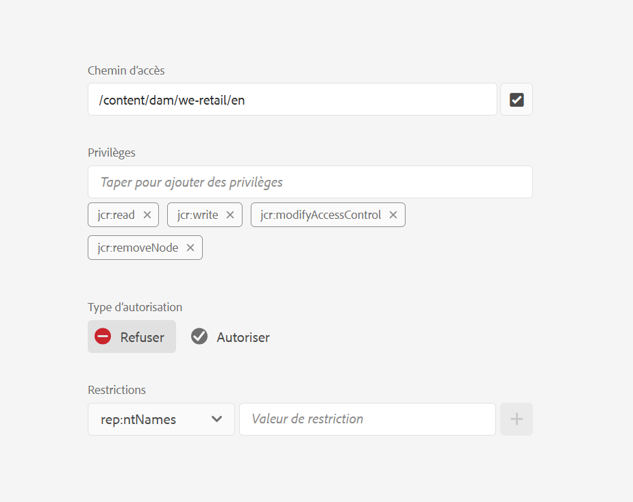 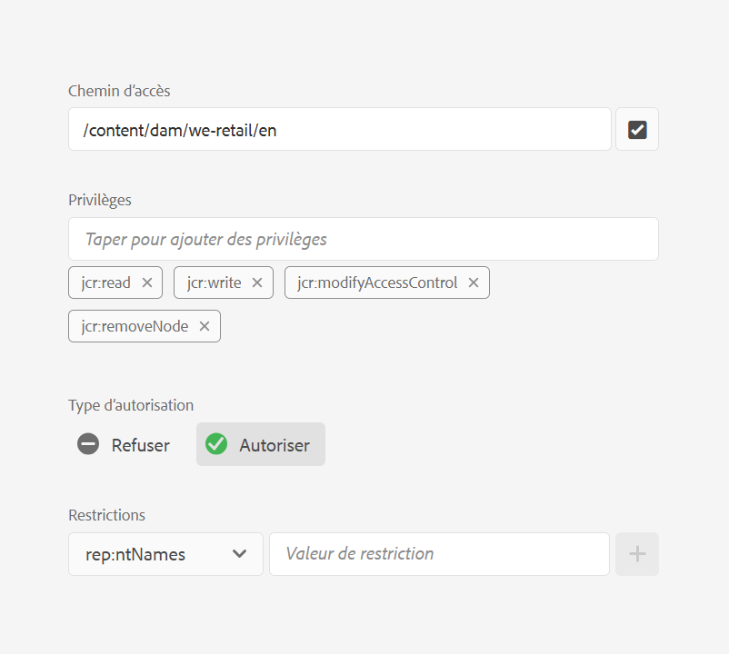

## Utilisation des restrictions {#using-restrictions}

Outre la liste des privilèges et le type d’autorisation d’un chemin donné, cet écran permet également d’ajouter des restrictions pour un contrôle d’accès précis, comme illustré ci-dessous :

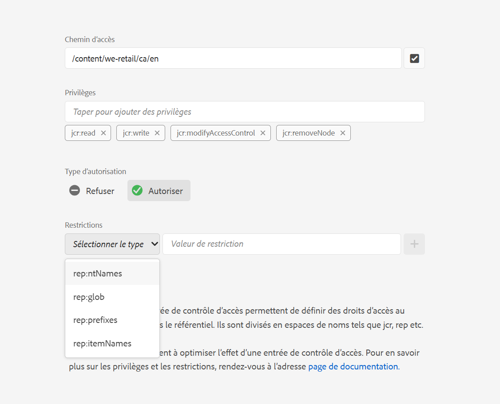

>[!NOTE]
>
>Pour plus d’informations sur la signification de chaque restriction, consultez la [documentation Jackrabbit Oak](https://jackrabbit.apache.org/oak/docs/security/authorization/restriction.html).

Vous pouvez ajouter des restrictions comme illustré ci-dessous en choisissant le type de restriction, en entrant la valeur et en appuyant sur l’icône **+**.

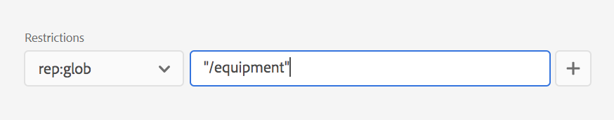 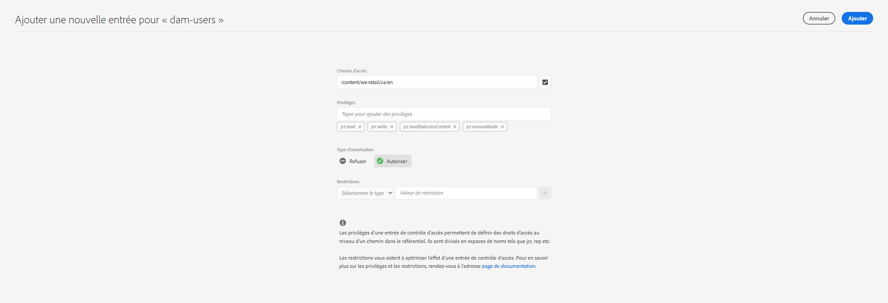

La nouvelle entrée de contrôle d’accès est reflétée dans la liste de contrôle d’accès, comme illustré ci-dessous. Notez que `jcr:write` est une autorisation agrégée qui inclut `jcr:removeNode`, qui a été ajouté précédemment, mais qui n’apparaît pas ci-dessous, car il se trouve sous `jcr:write`.

## Modification des ACE {#editing-aces}

Pour modifier les entrées de contrôle d’accès, sélectionnez une entité et choisissez l’entrée de contrôle d’accès que vous souhaitez modifier.

Par exemple, il est possible de modifier l’entrée ci-dessous pour **dam-users** en cliquant sur l’icône en forme de crayon à droite :

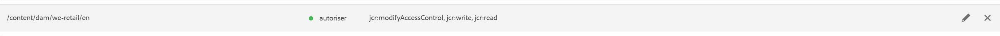

Les entrées de contrôle d’accès configurées présélectionnées apparaissent sur l’écran de modification. Il est possible de les supprimer en cliquant sur la croix située en regard de celles-ci ou d’ajouter de nouvelles autorisations pour le chemin donné, comme illustré ci-dessous.

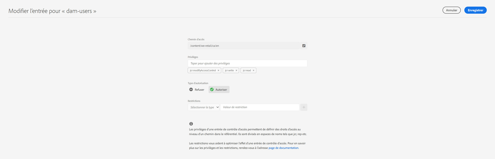

Ici, le privilège `addChildNodes` est ajouté pour **dam-users** sur le chemin donné.

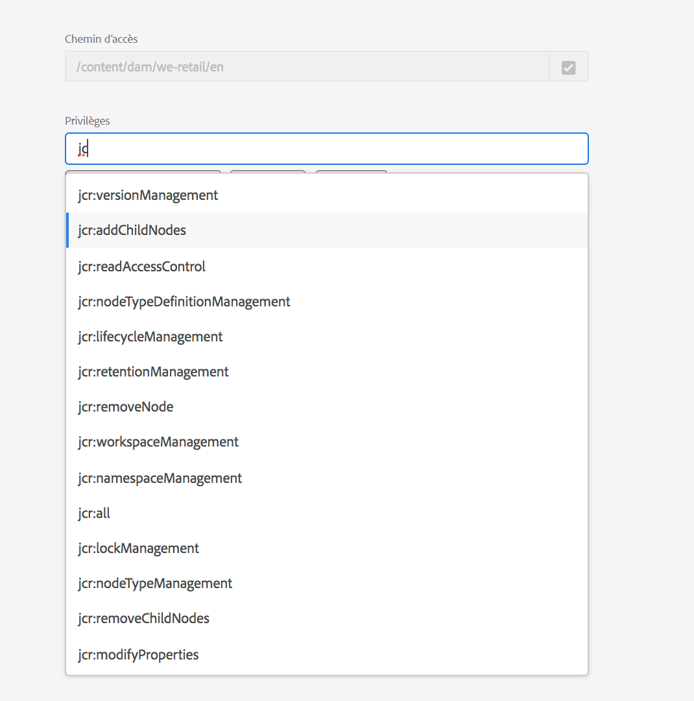

Les modifications peuvent être enregistrées en cliquant sur le bouton **Enregistrer** en haut à droite. Les modifications sont répercutées sur les nouvelles autorisations pour les **dam-users**, comme illustré ci-dessous :

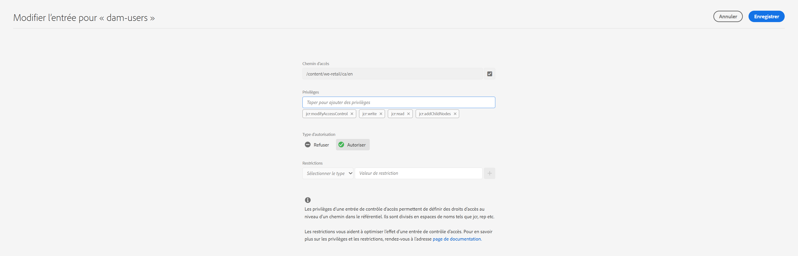

## Suppression des ACE {#deleting-aces}

Vous pouvez supprimer des entrées de contrôle d’accès pour supprimer l’ensemble des autorisations accordées à un principal sur un chemin spécifique. L’icône X en regard de ACE peut être utilisée pour la supprimer, comme illustré ci-dessous :

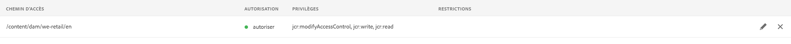 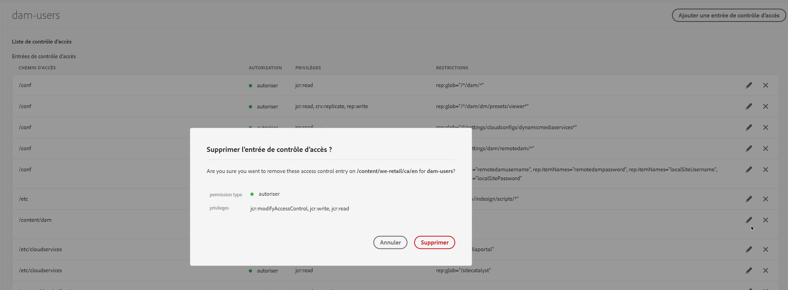

## Vue Autorisations {#permissions-view}

### Vue Autorisations de l’interface utilisateur tactile {#touch-ui-permisions-view}

Les administrateurs ont besoin de plus de contrôle granulaire et de visibilité sur les attributions d’autorisations au niveau du nœud pour une meilleure sécurité et gestion dans AEM. Auparavant, seule une vue des autorisations basée sur les principaux était disponible, ce qui limitait la possibilité de voir comment les listes de contrôle d’accès étaient appliquées à des nœuds spécifiques ou à des vues filtrées. Le nouveau nœud et la vue filtrée offrent une perspective détaillée et contextualisée des attributions d’autorisations, permettant une meilleure gestion et un meilleur audit des configurations de sécurité. Cette fonctionnalité améliore la surveillance administrative et simplifie la gestion des autorisations, améliore la sécurité, réduit les erreurs de configuration et rationalise les contrôles d’accès des utilisateurs dans AEM.

Vous pouvez accéder à la vue de l’interface utilisateur tactile Autorisations en cliquant sur **Outils - Sécurité - Autorisations**, comme illustré ci-dessous :

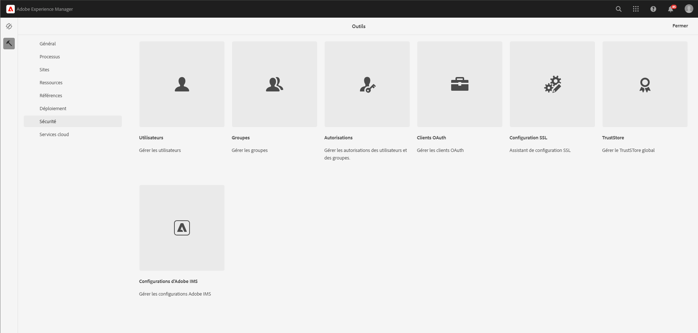

Une fois que vous avez lancé la vue Autorisations, vous pouvez cliquer sur **Vue du nœud** ou **Vue filtrée** dans le coin supérieur droit de l’écran, en fonction de vos préférences d’affichage.

#### Affichage des nœuds

Dans cette vue, les listes de contrôle d’accès sont présentées pour chaque nœud individuel (chemin d’accès). Il fournit des informations sur :

Listes de contrôle d’accès locales pour le nœud sélectionné.
Listes de contrôle d’accès effectives, qui incluent les listes de contrôle d’accès appliquées à chaque nœud parent jusqu’à la racine (« / »).
Les utilisateurs ont la possibilité d’ajouter, de supprimer ou de mettre à jour des listes ACL. Lorsque l’utilisateur clique sur un chemin, le volet de gauche affiche ses enfants, tandis que le côté droit présente une vue tabulaire de toutes les listes de contrôle d’accès associées à ce chemin.

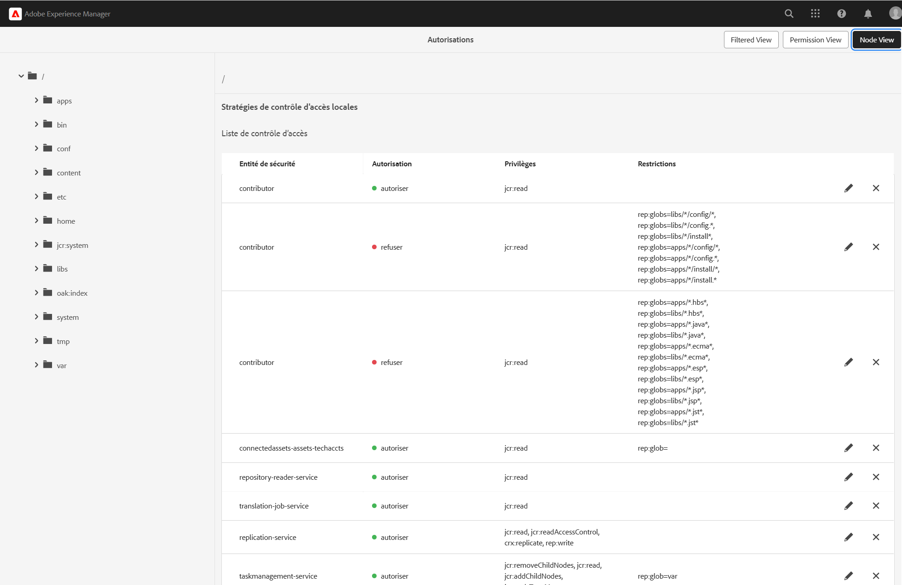

#### Affichage filtré

Cette vue permet aux utilisateurs de rechercher efficacement des autorisations sur un chemin d’accès et des principaux spécifiés. Dans cette vue, les utilisateurs peuvent facilement déterminer le type d’autorisations accordées à un groupe d’entités de sécurité pour le chemin d’accès sélectionné.
En outre, la vue filtrée fournit des informations sur les listes de contrôle d’accès actuelles. Elle affiche les listes de contrôle d’accès associées au nœud parent du chemin d’accès sélectionné, en tenant compte du principal sélectionné et des principaux communs.

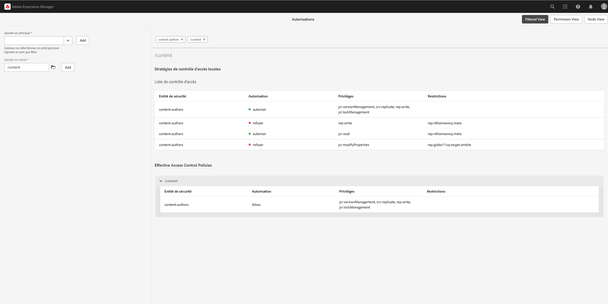

### Vue Autorisations du navigateur de référentiel {#the-repository-browser-permissions-view}

La vue des autorisations est également accessible via le [navigateur de référentiel](/help/implementing/developing/tools/repository-browser.md).

Vous pouvez y accéder comme suit :

1. Ouvrez Developer Console, puis cliquez sur l’onglet **Repository Browser**, puis sur **open Repository Browser**.

   

1. Une fois dans le navigateur de référentiel, cliquez sur l’onglet **Autorisations**

   

**Remarque** : pour afficher les autorisations, des droits d’administrateur sont requis. Suivez les étapes mentionnées [ici](/help/implementing/developing/tools/repository-browser.md#navigate-the-hierarchy-navigate-the-hierarchy) pour accéder aux autorisations.

## Combinaisons de privilèges de l’interface utilisateur classique {#classic-ui-privilege-combinations}

La nouvelle interface utilisateur des autorisations utilise explicitement l’ensemble de base de privilèges au lieu de combinaisons prédéfinies qui ne reflètent pas vraiment les privilèges sous-jacents exacts qui ont été accordés.

Ceci entraînait une certaine confusion quant à la configuration exacte. Le tableau suivant répertorie le mappage entre les combinaisons de privilèges de l’interface utilisateur classique et les privilèges réels qui les constituent :

<table>
 <tbody>
  <tr>
   <th>Combinaisons de privilèges de l’interface utilisateur classique</th>
   <th>Privilège de l’interface utilisateur Autorisations</th>
  </tr>
  <tr>
   <td>Lecture</td>
   <td><code>jcr:read</code></td>
  </tr>
  <tr>
   <td>Modification</td>
   <td>
<code>jcr:modifyProperties</code>
 
<code>jcr:lockManagement</code>
 
<code>jcr:versionManagement</code>
 </td>
  </tr>
  <tr>
   <td>Créer</td>
   <td>
<code>jcr:addChildNodes</code>
 
<code>jcr:nodeTypeManagement</code>
 </td>
  </tr>
  <tr>
   <td>Supprimer</td>
   <td>
<code>jcr:removeNode</code>
 
<code>jcr:removeChildNodes</code>
 </td>
  </tr>
  <tr>
   <td>Lecture de l’ACL</td>
   <td><code>jcr:readAccessControl</code></td>
  </tr>
  <tr>
   <td>Modification de l’ACL</td>
   <td><code>jcr:modifyAccessControl</code></td>
  </tr>
  <tr>
   <td>Réplication</td>
   <td><code>crx:replicate</code></td>
  </tr>
 </tbody>
</table>
