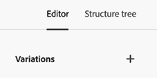
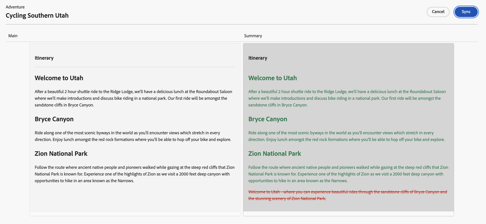
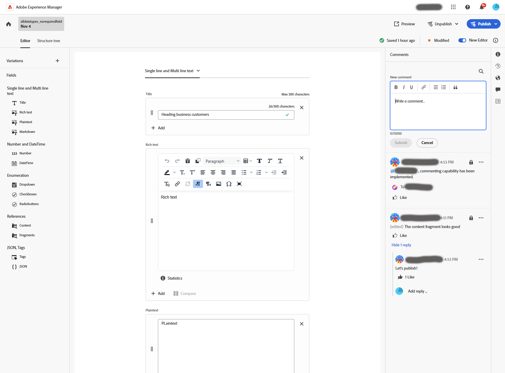
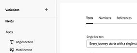

# Créer des fragments de contenu {#authoring-content-fragments}

La création de vos fragments de contenu est axée à la fois sur la diffusion découplée et la création de pages.

Deux éditeurs sont disponibles pour les fragments de contenu. L’éditeur décrit dans cette section :

* a été développé pour la diffusion de contenu découplé (bien qu’il puisse être utilisé dans tous les scénarios).
* est disponible à partir de la console **Fragments de contenu**

Cet éditeur fournit les éléments suivants :

* [Enregistrement automatique](#saving-autosaving), pour éviter la perte accidentelle de modifications.
* [Chargement en ligne des ressources en tant que références de contenu](#reference-images) sans avoir à les charger au préalable dans la gestion des ressources numériques.
* [Générer des variations](#generate-variations-ai) pour utiliser l’IA dédiée à la génération afin d’accélérer la création de contenu en fonction des invites.
* [Aperçu](#preview-content-fragment) de l’expérience rendue fournie par le fragment de contenu.
* Possibilité de [Publier](#publish-content-fragment) et [Dépublier](#unpublish-content-fragment) à partir de l’éditeur.
* Possibilité d’[afficher et ouvrir des copies de langue associées](#view-language-copies) dans l’éditeur.
* Possibilité d’[afficher les détails de la version](#view-version-history) dans l’éditeur. Vous pouvez également revenir à une version sélectionnée.
* Possibilité d’[afficher et ouvrir les références parentes](#view-parent-references).
* Une vue hiérarchique du fragment de contenu et de ses références, à l’aide de l’[arborescence de structure](#structure-tree).

>[!WARNING]
>
>L’éditeur décrit dans cette section est *uniquement* disponible dans l’as a Cloud Service [Unified Shell](/help/overview/aem-cloud-service-on-unified-shell.md) ; donc *en ligne* Adobe Experience Manager (AEM), et non une instance locale.

## Éditeur de fragment de contenu {#content-fragment-editor}

Lorsque vous ouvrez l’éditeur de fragment de contenu pour la première fois, vous voyez quatre zones principales :

* barre d’outils supérieure : pour obtenir des informations clés et des actions
   * lien vers la console de fragments de contenu (icône Accueil)
   * informations sur le modèle et le dossier
   * des liens vers [Aperçu](#preview-content-fragment) ; si le Modèle d’URL d’aperçu par défaut est configuré pour le modèle ;
   * [Publication](#publish-content-fragment) et [Dépublication](#unpublish-content-fragment)
   * une option pour afficher tout **Références parentes** (icône de lien)
   * le fragment **[État](/help/sites-cloud/administering/content-fragments/managing.md#statuses-content-fragments)**, et les dernières informations enregistrées ;
   * bascule pour passer à l’éditeur d’origine (basé sur les ressources)

     >[!WARNING]
     >
     >L’éditeur d’origine s’ouvre dans le même onglet. Il n’est pas recommandé d’ouvrir les deux éditeurs en même temps.

* panneau de gauche : affiche la variable **[Variations](#variations)** pour le fragment de contenu et son **Champs**:
   * ces liens peuvent être utilisés pour [parcourir la structure du fragment de contenu](#navigate-structure)
* panneau de droite : présente des onglets [affichant les propriétés (métadonnées) et les balises](#view-properties-tags), des informations sur le [historique de version](#view-version-history) et des informations relatives aux [copies de langue](#view-language-copies)
   * dans le **Propriétés** vous pouvez mettre à jour l’onglet **Titre** et **Description** pour le fragment, ou **Variation**
   * Dans l’onglet **Commentaires**, vous pouvez ajouter et lire des commentaires pour vous aider à collaborer avec d’autres auteurs
* panneau central : affiche les champs réels et le contenu de la variation sélectionnée.
   * permet de modifier le contenu.
      * lorsqu’ils sont configurés (en tant que multiples) dans le modèle, divers types de données vous permettent d’**Ajouter** des instances du champ approprié
   * Si des champs **Espace réservé d’onglet** sont définis dans le modèle, ils sont affichés ici et :
      * peut être utilisé pour la navigation.
      * s’affiche soit horizontalement, soit sous forme de liste déroulante.

  >[!NOTE]
  >
  >Selon les définitions du modèle sous-jacent, les champs peuvent être soumis à certains types de [Validation](/help/assets/content-fragments/content-fragments-models.md#validation).

## Navigation dans la structure du fragment de contenu. {#navigate-structure}

un seul fragment de contenu ;

* Se compose de deux niveaux :

   * **[Variations](#variations)** du fragment de contenu
   * **Champs** : définis par le modèle de fragment de contenu et utilisés par chaque variation.

* Peut contenir plusieurs références.

### Variations et champs {#variations-and-fields}

Dans le panneau de gauche, vous pouvez voir :

* la liste des **[variations](#variations)** qui ont été créées pour ce fragment :
   * **Principal** est la variation présente lors de la création initiale du fragment de contenu ; vous pouvez en ajouter d’autres ultérieurement
   * vous pouvez utiliser Generate Variations(#generate-variations) pour utiliser un modèle basé sur une invite créé par Adobe pour un cas d’utilisation spécifique.
   * vous pouvez également [créer une variation](#create-variation)
* le **Champs** au sein du fragment et ses variantes :
   * l’icône indique le [type de données](/help/sites-cloud/administering/content-fragments/content-fragment-models.md#data-types)
   * le texte est le nom du champ
   * ensemble, ils fournissent un lien direct vers le contenu du champ dans le panneau central (pour la variation actuelle)

### Suivre les liens {#follow-links}

L’icône de lien s’affiche dans différentes parties de l’éditeur. Cette icône peut être utilisée pour ouvrir l’élément affiché, par exemple, un modèle de fragment de contenu, une référence parente ou un fragment référencé :

### Arborescence de la structure {#structure-tree}

Ouvrez l’onglet **Arborescence de structure** de la barre d’outils de l’éditeur pour afficher la structure hiérarchique du fragment de contenu et ses références. Utilisez les icônes de lien pour accéder aux références.

>[!NOTE]
>
>Voir [ Analyse de la structure du fragment de contenu - Arborescence de structure](/help/sites-cloud/administering/content-fragments/analysis.md#structure-tree) pour plus d’informations.

## Enregistrement et enregistrement automatique {#saving-autosaving}

<!-- CHECK: cannot be saved, no undo, redo -->

À chaque mise à jour que vous effectuez, le fragment de contenu est automatiquement enregistré. La dernière fois enregistrée s’affiche dans la barre d’outils supérieure.

## Variations {#variations}

Les [variations](/help/sites-cloud/administering/content-fragments/overview.md#main-and-variations) sont une fonctionnalité importante des fragments de contenu AEM. Ils vous permettent de créer et de modifier des copies du contenu **Principal** à utiliser sur des canaux et scénarios spécifiques, ce qui rend la diffusion de contenu découplé et la création de pages encore plus flexibles.

L’éditeur vous permet d’effectuer les opérations suivantes :

* [Créer des variations](#create-variation) du contenu **Principal**

* [Utilisez Generate Variations AI](#generate-variations-ai) pour utiliser Generative AI afin d’utiliser un modèle basé sur des invites créé par Adobe pour un cas d’utilisation spécifique.

* Sélectionnez la variation requise pour modifier le contenu

* [Renommer la variation](#rename-variation)

* [Suppression d’une variation](#delete-variation)

### Création d’une variation {#create-variation}

Pour créer une variante de votre fragment de contenu :

1. Dans le panneau de gauche, sélectionnez le **signe plus** (**Créer une variation**) situé à droite de **Variations**.

   >[!NOTE]
   >
   >Une fois votre première variation créée, les variations existantes sont répertoriées dans le même panneau.

   

1. Dans la boîte de dialogue, saisissez un **Titre** pour votre variation, ainsi qu’un **Description** si nécessaire :

   

1. **Créer** la variation. Il apparaît dans la liste.

### Renommer une variation {#rename-variation}

Pour renommer une **variation** :

1. Sélectionnez la variation requise.

1. Ouvrez l’onglet **Propriétés** dans le panneau de droite.

1. Mettez à jour la variation **Titre**.

1. Appuyez sur **Retour** ou passez à un autre champ pour enregistrer automatiquement la modification. Le titre est mis à jour dans le panneau **Variations** sur la gauche.

### Créer des variations à l’aide de GenAI avec Générer des variations {#generate-variations-ai}

Utilisez les variations génératives pour tirer parti de l’IA générative afin d’accélérer la création de contenu.

Ouvrez l’éditeur de fragment de contenu pour trouver le point d’entrée afin de générer des variations.

Voir [ Générer des variations - Intégré aux éditeurs AEM](/help/generative-ai/generate-variations-integrated-editor.md) pour en savoir plus.

### Suppression d’une variation {#delete-variation}

Pour supprimer une variante de votre fragment de contenu :

>[!NOTE]
>
>Impossible de supprimer **Principal**.

1. Sélectionnez la variation.

1. Dans le panneau **Variation**, sélectionnez l’icône de suppression (corbeille) :

   

1. Une boîte de dialogue s’ouvre. Sélectionnez **Supprimer** pour confirmer l’action.

## Modifier les champs de texte multiligne - Texte brut ou Markdown {#edit-multi-line-text-fields-plaintext-markdown}

Les champs **[texte multiligne](/help/sites-cloud/administering/content-fragments/content-fragment-models.md#data-types)** peuvent avoir l’un des trois formats suivants :

* Texte brut
* [Texte (Markdown)](/help/sites-cloud/administering/content-fragments/markdown.md)
* [Texte enrichi](#edit-multi-line-text-fields-rich-text)

Les champs définis en tant que Texte brut ou Markdown ont une simple zone de texte, sans options de mise en forme (à l’écran) :

## Modifier les champs de texte multiligne - Texte enrichi {#edit-multi-line-text-fields-rich-text}

Pour les champs **[texte multiligne](/help/sites-cloud/administering/content-fragments/content-fragment-models.md#data-types)** définis en tant que **texte enrichi**, différentes fonctionnalités sont disponibles :

* Modifiez le contenu :
   * Annuler, rétablir
   * Coller en tant que texte
   * Copier
   * Sélectionner le format de paragraphe
   * Créer/gérer une table
   * Mise en forme du texte ; gras, italique, souligné, couleur
   * Définir l’alignement des paragraphes
   * Créer/gérer des listes ; à puces, numérotées
   * Retrait de texte ; diminution, augmentation
   * Effacer la mise en forme actuelle
   * Insertion de liens
   * Sélection et insertion de références aux ressources d’image
   * Ajouter des caractères spéciaux
* [Éditeur plein écran](#full-screen-editor-rich-text) : basculez entre l’écran complet et le flux entrant.
* [Statistiques](#statistics-rich-text)
* [Comparer et synchroniser](#compare-and-synchronize-rich-text)

Par exemple :

>[!NOTE]
>
>Les champs de texte multiligne sont également indiqués par l’[icône](#fields-datatypes-icons) appropriée dans le panneau **Champs**.

### Éditeur plein écran - Texte enrichi {#full-screen-editor-rich-text}

L’éditeur plein écran propose les mêmes options de modification que lors du flux entrant, mais offre plus d’espace pour le texte.

Par exemple :

### Statistiques - Texte enrichi {#statistics-rich-text}

L’action **Statistiques** affiche une plage d’informations sur le texte d’un champ multiligne.

Par exemple :

### Comparer et synchroniser - Texte enrichi {#compare-and-synchronize-rich-text}

L’action **Comparer** est disponible pour les champs multilignes lorsqu’une **Variation** est ouverte.

Le champ multiligne s’ouvre alors en plein écran et :

* affiche en parallèle le contenu des deux **Principal** et actuel **Variation**, en mettant les différences en surbrillance

* les différences sont indiquées par la couleur :

   * le contenu ajouté (à la variation) est indiqué en vert
   * le contenu supprimé (de la variation) figure en rouge.
   * le texte remplacé apparaît en bleu

* fournit l’action **Sync**, qui synchronise le contenu de **Principal** à la variation actuelle

   * Si **Principal** a été mis à jour, ces modifications sont transférées à la variation
   * Si la variation a été mise à jour, ces modifications sont remplacées par le contenu de **Principal**

  >[!CAUTION]
  >
  >La synchronisation n’est disponible que pour copier les modifications *de **Principal**dans la variation*.
  >
  >Le transfert des modifications *d’une variation vers **Principal*** n’est pas disponible en tant qu’option.

Par exemple, un scénario où le contenu de la variation a été complètement réécrit, de sorte qu’une synchronisation remplace ce nouveau contenu par le contenu de **Principal** :

## Gestion des références {#manage-references}

### Références à un fragment {#fragment-references}

[Références de fragment](/help/sites-cloud/administering/content-fragments/content-fragment-models.md#fragment-reference-nested-fragments) peut être utilisé pour :

* [créer une référence à un fragment de contenu existant ;](#create-reference-existing-content-fragment)
* [créer un fragment de contenu, puis le référencer ;](#create-reference-content-fragment)

#### Créer une référence à un fragment de contenu existant {#create-reference-existing-content-fragment}

Pour créer une référence à un fragment de contenu existant :

1. Sélectionnez le champ .
1. Sélectionnez **Ajouter un fragment existant**.
1. Sélectionnez le fragment requis dans le sélecteur de fragments.

   >[!NOTE]
   >
   >Vous n’êtes autorisé à sélectionner qu’un seul fragment à la fois.

#### Créer un fragment de contenu et une référence {#create-reference-content-fragment}

Vous pouvez également [sélectionner **Créer un fragment** pour ouvrir la boîte de dialogue **Créer**](/help/sites-cloud/administering/content-fragments/managing.md#creating-a-content-fragment). Une fois créé, ce fragment sera référencé.

### Références du contenu {#content-references}

Les [références de contenu](/help/sites-cloud/administering/content-fragments/content-fragment-models.md#content-reference) sont utilisées pour référencer d’autres types de contenu AEM, tels que les images, les pages et les fragments d’expérience.

#### Images de référence {#reference-images}

Dans les champs **Référence de contenu** vous pouvez :

* ressources de référence qui existent déjà dans votre référentiel local
* ressources de référence résidant dans un référentiel distant
* charger les ressources directement dans le champ ; cela évite d’avoir à utiliser la console **Assets** pour effectuer le chargement

  >[!NOTE]
  >
  >Pour charger directement une image dans le champ **Référence de contenu**, elle **doit** :
  >
  >* définir un **Chemin racine** (dans le [Modèle de fragment de contenu](/help/sites-cloud/administering/content-fragments/content-fragment-models.md#content-reference)) ; Indique l’emplacement de stockage de l’image.
  >* inclure **Image** dans la liste des types de contenu acceptés

##### Assets locale de référence {#reference-local-assets}

Pour référencer une ressource locale, vous pouvez effectuer l’une des opérations suivantes :

* faites glisser et déposez directement le nouveau fichier de ressource (par exemple, à partir de votre système de fichiers) dans le champ **Référence de contenu**
* Utilisez l’action **Ajouter une ressource**, puis sélectionnez **Parcourir Assets** ou **Télécharger** pour ouvrir le sélecteur approprié à utiliser :

  

##### Assets distante de référence {#reference-remote-assets}

Pour référencer des ressources distantes :

1. Spécifiez le **référentiel** distant lors de la recherche de ressources :

   

2. Une fois la sélection effectuée, l’emplacement est visible dans les informations sur les ressources :

   

###### Assets à distance - Limites {#remote-assets-limitations}

Il existe certaines limitations lors du référencement de ressources distantes :

* Seules les ressources [approuvées](/help/assets/approve-assets.md) sont disponibles pour référence à partir d’un référentiel de ressources distant.

* Si une ressource référencée est supprimée du référentiel distant, une référence de contenu est rompue.

* Tous les référentiels de ressources de diffusion auxquels l’utilisateur a accès peuvent être sélectionnés. La liste disponible ne peut pas être limitée.

* L’instance AEM et les instances du référentiel de ressources distant doivent être dans la même version.

* Aucune métadonnée de ressource n’est exposée via l’API de gestion ou l’API de diffusion. Vous devez utiliser l’API de métadonnées de ressource pour récupérer les détails des métadonnées de la ressource :

   * les métadonnées de la ressource : [https://developer.adobe.com/experience-cloud/experience-manager-apis/api/stable/assets/delivery/#operation/getAssetMetadata](https://developer.adobe.com/experience-cloud/experience-manager-apis/api/stable/assets/delivery/#operation/getAssetMetadata)

   * obtenez des informations de métadonnées en bloc à l’aide de l’API de recherche (expérimental) : [https://developer.adobe.com/experience-cloud/experience-manager-apis/api/stable/assets/delivery/#operation/search](https://developer.adobe.com/experience-cloud/experience-manager-apis/api/stable/assets/delivery/#operation/search)

>[!NOTE]
>
>Consultez également la section [API AEM GraphQL à utiliser avec des fragments de contenu - Prise en charge des ressources Dynamic Media pour OpenAPI (Assets à distance)](/help/headless/graphql-api/content-fragments.md#dynamic-media-for-openapi-asset-support)

#### Pages de référence {#reference-pages}

Pour ajouter des références à des pages AEM, des fragments d’expérience ou d’autres types de contenu de ce type :

1. Sélectionnez **Ajouter un chemin de contenu**.

1. Ajoutez le chemin d’accès requis dans le champ de saisie.

1. Confirmez avec **Ajouter**.

>[!NOTE]
>
>Il ne doit pas être utilisé pour les références à :
>
>* Fragments de contenu - utilisez une [référence de fragment](#fragment-references)
>* Images - utilisez [Images de référence](#reference-images).

### Afficher les références parentes {#view-parent-references}

Si vous sélectionnez l’icône de lien dans la barre d’outils supérieure, une liste de toutes les références parentes s’ouvre.

Par exemple :

Une fenêtre s’ouvre, répertoriant toutes les références associées. Pour ouvrir une référence, sélectionnez le nom ou le titre, ou l’icône de lien.

Par exemple :

## Affichage des propriétés et des balises {#view-properties-tags}

Dans l’onglet des propriétés du panneau de droite, les propriétés (métadonnées) et les balises peuvent être affichées. Les propriétés peuvent être :

* pour le **fragment de contenu** - si **principal** est actuellement sélectionné
* pour une **Variation** spécifique

### Modifier les propriétés et les balises {#edit-properties-tags}

Dans l’onglet des propriétés (panneau de droite), vous pouvez également modifier les éléments suivants :

* **Titre**
* **Description**
* **Balises** : à l’aide de la liste déroulante ou de la boîte de dialogue de sélection

  

### Ouvrir le modèle de fragment de contenu {#open-content-fragment-model}

Lorsque vous avez sélectionné **Principal**, le nom du modèle de fragment de contenu sous-jacent s’affiche dans la section des propriétés. Si vous sélectionnez l’icône de lien, le modèle s’ouvre dans un onglet distinct.

Par exemple :

## Afficher l’historique des versions {#view-version-history}

Dans l’onglet **Historique des versions** du panneau de droite, les détails de la version actuelle et des versions précédentes s’affichent :

>[!NOTE]
>
>Une nouvelle version est créée lorsque le fragment de contenu est publié.

### Comparer les versions {#compare-version}

Pour un fragment de contenu, vous pouvez comparer une version précédente à la version actuelle.

Pour comparer une version précédente à la version actuelle :

1. Sélectionnez l’icône des trois petits points en regard de la version.

1. Sélectionnez **Comparer**.

Cela ouvre une vue qui affiche les différences entre la version actuelle du contenu et la version précédente sélectionnée du fragment de contenu. Dans le menu déroulant **Variations avec modifications** vous pouvez choisir de voir les différences entre le contenu principal et/ou le contenu d’une variation.

Les différences sont indiquées par la couleur :

* Vert : indique le contenu ajouté (à la version actuelle)
* Rouge : indique le contenu supprimé (de la version actuelle)

### Rétablissement d’une version {#revert-version}

Vous pouvez revenir à n’importe quelle version.

Pour revenir à une version spécifique :

1. Sélectionnez l’icône des trois petits points en regard de la version.

1. Sélectionnez **Rétablir**.

## Afficher les copies de langue {#view-language-copies}

Les détails de toutes les copies de langue associées sont affichés dans l’onglet **Propriétés de la langue**. Si vous sélectionnez une icône de lien, la copie s’ouvre dans un onglet distinct.

Par exemple :

>[!NOTE]
>
>Pour plus d’informations sur la traduction d’un fragment de contenu et la création de copies de langue, consultez le [Parcours de traduction découplée AEM](/help/journey-headless/translation/overview.md).

## Commentaires sur votre fragment {#commenting-on-your-fragment}

Pour vous permettre de collaborer au sein du produit et dans le contexte, l’onglet **Commentaires** dans le panneau de droite fournit les fonctionnalités suivantes :

* Ajouter un nouveau commentaire
* Balisage d’utilisateurs spécifiques dans un commentaire
   * Ils reçoivent alors une notification comportant un lien pour ouvrir directement le fragment
* Aimer un commentaire existant
* Répondre à un commentaire
* Formatez vos commentaires ; une mise en forme de base est disponible.
* Effectuer une recherche de texte dans les commentaires existants
* Modifier un commentaire existant
* Supprimer les commentaires

>[!NOTE]
>
>Ces commentaires ne sont pas visibles en tant que [Annotations dans l’éditeur d’origine](/help/assets/content-fragments/content-fragments-managing.md#annotating-a-content-fragment) ni dans le [Journal de la console Assets](/help/assets/content-fragments/content-fragments-managing.md#timeline-for-content-fragments).

## Prévisualiser le fragment {#preview-content-fragment}

L’éditeur de fragment de contenu permet aux auteurs de prévisualiser leurs modifications dans une application frontale externe. Pour activer le bouton **[Aperçu](/help/sites-cloud/administering/content-fragments/preview.md#preview-url-pattern)** dans la barre d’outils supérieure de l’éditeur, le **Modèle d’URL d’aperçu par défaut** doit être défini. Vous pouvez sélectionner ce bouton pour lancer l’application externe (dans un onglet distinct) afin d’effectuer le rendu du fragment de contenu.

## Publier votre fragment {#publish-content-fragment}

Vous pouvez **Publier** votre fragment vers votre :

* Aperçu de l’instance
* Instance de publication

Vous pouvez publier le fragment à partir de l’éditeur ou de la console. Voir [ Publication et prévisualisation d’un fragment ](/help/sites-cloud/administering/content-fragments/managing.md#publishing-and-previewing-a-fragment) pour plus d’informations.

## Dépublication du fragment {#unpublish-content-fragment}

Vous pouvez également **Dépublier** votre fragment à partir de votre :

* Aperçu de l’instance
* Instance de publication

Vous pouvez dépublier votre fragment à partir de l’éditeur ou de la console. Voir [ Dépublication d’un fragment ](/help/sites-cloud/administering/content-fragments/managing.md#unpublishing-a-fragment) pour plus d’informations.

## Champs, types de données et icônes {#fields-datatypes-icons}

Le panneau **Champs** répertorie tous les champs du fragment de contenu. L’icône indique le **[type de données](/help/sites-cloud/administering/content-fragments/content-fragment-models.md#data-types)** :

<table style="table-layout:auto">
 <tbody>
  <tr>
   <td>
<b>Une seule ligne de texte</b>
 </td>
   <td>
  
</td>
  </tr>
  <tr>
   <td>
<b>Plusieurs lignes de texte</b>
 </td>
   <td>
  
</td>
  </tr>
  <tr>
   <td>
<b>Nombre</b>
 </td>
   <td>
  
</td>
  </tr>
  <tr>
   <td>
<b>Booléen</b>
 </td>
   <td>
  
</td>
  </tr>
  <tr>
   <td>
<b>Date et heure</b>
 </td>
   <td>
  
</td>
  </tr>
  <tr>
   <td>
<b>Énumération</b>
 </td>
   <td>
  
</td>
  </tr>
  <tr>
   <td>
<b>Balises</b>
 </td>
   <td>
  
</td>
  </tr>
  <tr>
   <td>
<b>Référence de contenu</b>
 </td>
   <td>
  
</td>
  </tr>
  <tr>
   <td>
<b>Référence du fragment</b>
 </td>
   <td>
  
</td>
  </tr>
  <tr>
   <td>
<b>Objet JSON</b>
 </td>
   <td>
  
</td>
  </tr>
  <tr>
   <td>
<b>Espace réservé pour onglet</b>

Bien que n’étant pas représenté par une icône réelle, un <b>Espace réservé d’onglet</b> est représenté dans le panneau de gauche.  Il est également représenté dans le panneau central, soit horizontalement comme illustré, soit dans une liste déroulante (lorsqu’il y en a trop à afficher horizontalement).
 </td>
   <td>
  
</td>
  </tr>
 </tbody>
</table>

## Bon à savoir {#good-to-know}

* Pour modifier un fragment de contenu, vous devez disposer [des autorisations appropriées](/help/implementing/developing/extending/content-fragments-customizing.md#asset-permissions). Si vous rencontrez des problèmes, contactez votre administration système.

  Par exemple, si vous ne disposez pas des autorisations `edit`, l’éditeur sera en lecture seule.

* Un modèle de fragment de contenu peut souvent définir des champs de données nommés **Titre** et **Description**. Si ces champs existent, il s’agit de champs définis par l’utilisateur ou l’utilisatrice et qui peuvent être mis à jour dans le panneau *central* lors de la modification du fragment.

  Le fragment de contenu et ses variations comportent également des champs de métadonnées (propriétés de variation) appelés **Titre** et **Description**. Ces champs font partie intégrante de tout fragment de contenu et sont initialement définis lors du fragment. Elles peuvent être mises à jour dans le panneau *droit* lors de la modification du fragment.

* Consultez la documentation d’Assets pour obtenir des informations complètes sur l’[éditeur de fragment de contenu d’origine](/help/assets/content-fragments/content-fragments-variations.md) disponible à partir des consoles **Assets** et **fragments de contenu**.

* Votre équipe de projet peut personnaliser l’éditeur si nécessaire. Voir [Personnalisation de la console et de l’éditeur de fragments de contenu](/help/implementing/developing/extending/content-fragments-console-and-editor.md) pour plus d’informations.
