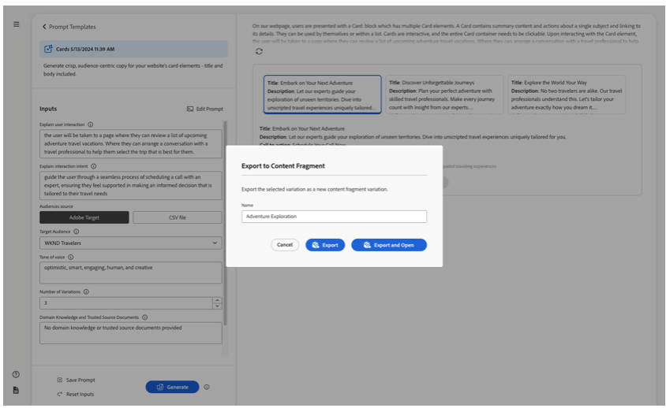

# Créer des fragments de contenu {#authoring-content-fragments}

La création de fragments de contenu est axée sur la diffusion sans interface utilisateur et la création de pages.

Deux éditeurs sont disponibles pour les fragments de contenu. L’éditeur décrit dans cette section :

* a été développé pour la diffusion de contenu sans interface utilisateur graphique (bien qu’il puisse être utilisé pour tous les scénarios).
* est disponible à partir de la console **Fragments de contenu**

Cet éditeur fournit les éléments suivants :

* [ Enregistrement automatique ](#saving-autosaving) pour éviter la perte accidentelle de modifications.
* [Chargement en ligne de ressources en tant que références de contenu](#reference-images), sans avoir à les charger dans la gestion des ressources numériques d’abord.
* [Générer des variations](#generate-variations-ai) pour utiliser l’IA générique afin d’accélérer la création de contenu en fonction des invites.
* [Aperçu](#preview-content-fragment) de l’expérience rendue par le fragment de contenu.
* Possibilité de [Publish](#publish-content-fragment) et [Annuler la publication](#unpublish-content-fragment) de l’éditeur.
* Possibilité de [afficher et ouvrir les copies de langue associées](#view-language-copies) dans l’éditeur.
* Possibilité de [afficher les détails de version](#view-version-history) dans l’éditeur. Vous pouvez également revenir à une version sélectionnée.
* Possibilité de [afficher et d’ouvrir les références parentes](#view-parent-references).
* Une vue hiérarchique du fragment de contenu et de ses références, à l’aide de l’ [arborescence de structure](#structure-tree).

>[!WARNING]
>
>L’éditeur décrit dans cette section est *uniquement* disponible as a Cloud Service *online* Adobe Experience Manager (AEM).

## Éditeur de fragment de contenu {#content-fragment-editor}

Lorsque vous ouvrez l’éditeur de fragments de contenu pour la première fois, quatre zones principales s’affichent :

* barre d’outils supérieure : pour obtenir des informations clés et des actions
   * lien vers la console de fragments de contenu (icône Accueil)
   * informations sur le modèle et le dossier
   * liens vers [Aperçu (si le modèle d’URL d’aperçu par défaut est configuré pour le modèle)](/help/sites-cloud/administering/content-fragments/content-fragment-models.md#content-fragment-model-properties)
   * Actions [Publish](#publish-content-fragment) et [Annuler la publication](#unpublish-content-fragment)
   * une option pour afficher tout **Références parentes** (icône de lien)
   * le fragment **[État](/help/sites-cloud/administering/content-fragments/managing.md#statuses-content-fragments)**, et les dernières informations enregistrées ;
   * bascule pour passer à l’éditeur d’origine (basé sur les ressources)

     >[!WARNING]
     >
     >L’éditeur d’origine s’ouvre dans le même onglet. Il est déconseillé d’ouvrir les deux éditeurs en même temps.

* panneau de gauche : affiche la variable **[Variations](#variations)** pour le fragment de contenu et son **Champs**:
   * ces liens peuvent être utilisés pour [parcourir la structure de fragment de contenu](#navigate-structure)
* panneau de droite : présente des onglets [ qui affichent les propriétés (métadonnées) et les balises ](#view-properties-tags), des informations sur l’ [historique de version](#view-version-history) et des informations relatives à des [copies de langue](#view-language-copies)
   * dans le **Propriétés** vous pouvez mettre à jour l’onglet **Titre** et **Description** pour le fragment, ou **Variation**
* panneau central : affiche les champs réels et le contenu de la variation sélectionnée.
   * permet de modifier le contenu.
      * lorsqu’ils sont configurés (comme plusieurs) dans le modèle, différents types de données vous permettent d’**ajouter** instances du champ approprié
   * si les champs **Espace réservé d’onglet** sont définis dans le modèle qui s’affiche ici et peuvent être utilisés pour la navigation ; ils seront présentés horizontalement ou sous la forme d’une liste déroulante.

  >[!NOTE]
  >
  >Selon les définitions du modèle sous-jacent, les champs peuvent être soumis à certains types de [validation](/help/assets/content-fragments/content-fragments-models.md#validation).

## Navigation dans la structure du fragment de contenu {#navigate-structure}

un fragment de contenu unique ;

* Se compose de deux niveaux :

   * **[Variations](#variations)** du fragment de contenu
   * **Champs** - définis par le modèle de fragment de contenu et utilisés par chaque variation

* Peut contenir une variété de références.

### Variations et champs {#variations-and-fields}

Dans le panneau de gauche, vous pouvez voir :

* la liste des **[variations](#variations)** créées pour ce fragment :
   * **Main** est la variation présente lors de la première création du fragment de contenu. Vous pouvez en ajouter d’autres ultérieurement.
   * vous pouvez utiliser l’option Générer des variations (#generate-variations) pour utiliser un modèle basé sur une invite que l’Adobe a créé pour un cas d’utilisation spécifique.
   * vous pouvez également [créer une variation](#create-variation)
* les **champs** dans le fragment et ses variations :
   * l’icône indique le [Type de données](/help/sites-cloud/administering/content-fragments/content-fragment-models.md#data-types)
   * le texte est le nom du champ.
   * ensemble, elles fournissent un lien direct vers le contenu du champ dans le panneau central (pour la variation actuelle).

### Suivre les liens {#follow-links}

L’icône de lien s’affiche dans différentes parties de l’éditeur. Vous pouvez l’utiliser pour ouvrir l’élément affiché, par exemple un modèle de fragment de contenu, une référence parente ou un fragment référencé :

### Arborescence de la structure {#structure-tree}

Ouvrez l’onglet **Arborescence de structure** de la barre d’outils de l’éditeur pour afficher la structure hiérarchique du fragment de contenu et ses références. Utilisez les icônes de lien pour accéder aux références.

>[!NOTE]
>
>Pour plus d’informations, voir [Analyse de la structure du fragment de contenu - Arborescence de structure](/help/sites-cloud/administering/content-fragments/analysis.md#structure-tree) .

## Enregistrement et enregistrement automatique {#saving-autosaving}

<!-- CHECK: cannot be saved, no undo, redo -->

À chaque mise à jour que vous effectuez, le fragment de contenu est automatiquement enregistré. La dernière fois enregistrée s’affiche dans la barre d’outils supérieure.

## Variations {#variations}

[Variations](/help/sites-cloud/administering/content-fragments/overview.md#main-and-variations) est une fonctionnalité importante pour  des fragments de contenu. Ils vous permettent de créer et de modifier des copies du contenu **Main** pour une utilisation sur des canaux spécifiques, ainsi que des scénarios, ce qui rend la diffusion de contenu sans interface utilisateur graphique et la création de pages encore plus flexible.

Dans l’éditeur, vous pouvez effectuer les opérations suivantes :

* [Créer des variations](#create-variation) du contenu **Main**

* [ Utilisez Generate Variations AI](#generate-variations-ai) pour utiliser Generative AI afin d’utiliser un modèle basé sur une invite que l’Adobe a créé pour un cas d’utilisation spécifique.

* Sélectionnez la variation requise pour modifier le contenu.

* [Renommer la variation](#rename-variation)

* [Suppression d’une variation](#delete-variation)

### Création d’une variation {#create-variation}

Pour créer une variation de votre fragment de contenu :

1. Dans le panneau de gauche, sélectionnez le signe **plus** (**Créer une variation**) situé à droite de **Variations**.

   >[!NOTE]
   >
   >Après avoir créé votre première variation, les variations existantes sont répertoriées dans le même panneau.

   

1. Dans la boîte de dialogue, saisissez un **titre** pour votre variation et une **description** si vous le souhaitez :

   

1. **Créez** la variation. Il apparaît dans la liste.

### Renommer une variation {#rename-variation}

Pour renommer une **variation** :

1. Sélectionnez la variation requise.

1. Ouvrez l’onglet **Propriétés** dans le panneau de droite.

1. Mettez à jour la variation **Title**.

1. Appuyez sur **Retour** ou déplacez-vous vers un autre champ pour enregistrer automatiquement la modification. Le titre est mis à jour dans le panneau **Variations** sur la gauche.

### Créer des variations à l’aide de GenAI avec Générer des variations {#generate-variations-ai}

Utilisez les variations génériques pour tirer parti de l’IA générique pour accélérer la création de contenu.

Pour utiliser les variations génériques dans l’éditeur de fragment de contenu :

1. Ouvrez l’éditeur de fragments de contenu. Dans l’en-tête, vous trouverez le point d’entrée pour générer des variations :

   

1. L’option Générer des variations s’ouvre dans un nouvel onglet. Dans le rail de gauche, vous pouvez voir l’instance AEM Cloud et le fragment de contenu pour lequel vous créez du contenu. Sélectionnez l’invite à utiliser ou créez une invite.

   >[!NOTE]
   >
   >Les modèles d’invite d’Adobe disponibles sont désormais limités, mais d’autres modèles seront ajoutés dans les prochaines versions.

   

1. Générez du contenu en remplissant les invites. Le modèle de contenu du fragment sera automatiquement utilisé pour générer du contenu à l’aide de GenAI.

   >[!NOTE]
   >
   >Actuellement, seuls les champs de texte sont pris en charge.

   

1. Sélectionnez la variante de génération que vous souhaitez et sélectionnez &quot;Exporter la variation&quot;. Confirmez le nom de la variation de fragment de contenu et sélectionnez l’une des options suivantes :

   * **Export** : exportez la variation vers le fragment de contenu et restez dans l’application Générer la variation.
   * **Exporter et ouvrir** : exportez la variation vers le fragment de contenu et ouvrez un nouvel onglet qui affiche le fragment de contenu avec la nouvelle variation de GenAI.

     

1. Les variations générées s’affichent dans l’éditeur de fragment de contenu principal.

   

Voir [Générer des variations](/help/generative-ai/generate-variations.md) pour en savoir plus.

### Suppression d’une variation {#delete-variation}

Pour supprimer une variation de votre fragment de contenu :

    >[!REMARQUE]
    >
    >Vous ne pouvez pas supprimer **Main**.

1. Sélectionnez la variation.

1. Dans le panneau **Variation**, sélectionnez l’icône de suppression (corbeille) :

   

1. Une boîte de dialogue s’ouvre. Sélectionnez **Supprimer** pour confirmer l’action.

## Modifier des champs de texte multiligne : texte brut ou Markdown {#edit-multi-line-text-fields-plaintext-markdown}

Les champs de **[texte multiligne](/help/sites-cloud/administering/content-fragments/content-fragment-models.md#data-types)** peuvent avoir l’un des trois formats suivants :

* Texte brut
* [Texte (Markdown)](/help/sites-cloud/administering/content-fragments/markdown.md)
* [Texte enrichi](#edit-multi-line-text-fields-rich-text)

Les champs définis comme Texte brut ou Texte (Markdown) comportent une zone de texte simple, sans options de formatage (à l’écran) :

## Modifier des champs de texte multiligne - Texte enrichi {#edit-multi-line-text-fields-rich-text}

Pour les champs **[Texte multiligne](/help/sites-cloud/administering/content-fragments/content-fragment-models.md#data-types)** définis comme **Texte enrichi**, différentes fonctionnalités sont disponibles :

* Modifiez le contenu :
   * Annuler/rétablir
   * Coller/coller en tant que texte
   * Copier
   * Sélectionner le format de paragraphe
   * Créer/gérer un tableau
   * Mise en forme de texte ; gras, italique, souligné, couleur
   * Définition de l’alignement des paragraphes
   * Créer/gérer des listes ; à puces, numérotées
   * Retrait du texte ; diminuer, augmenter
   * Effacer la mise en forme actuelle
   * Insérer des liens
   * Sélection et insertion de références aux ressources d’image
   * Ajout de caractères spéciaux
* [Éditeur plein écran](#full-screen-editor-rich-text) - bascule entre le mode plein écran et le mode intégré
* [Statistiques](#statistics-rich-text)
* [Comparer et synchroniser](#compare-and-synchronize-rich-text)

Par exemple :

>[!NOTE]
>
>Les champs de texte multi-lignes sont également indiqués par l’icône [appropriée](#fields-datatypes-icons) dans le panneau **Champs**.

### Éditeur plein écran - Texte enrichi {#full-screen-editor-rich-text}

L’éditeur plein écran offre les mêmes options de modification que lors de l’importation dans le flux, mais offre plus d’espace pour le texte.

Par exemple :

### Statistiques - Texte enrichi {#statistics-rich-text}

L’action **Statistics** affiche diverses informations sur le texte dans un champ multiligne.

Par exemple :

### Comparaison et synchronisation - Texte enrichi {#compare-and-synchronize-rich-text}

L’action **Comparer** est disponible pour les champs multilignes lorsque vous avez ouvert une **Variation**.

Le champ multiligne s’ouvre alors en plein écran et :

* affiche le contenu de **Main** et de la **Variation** actuelle en parallèle, avec toutes les différences mises en surbrillance ;

* les différences sont indiquées par la couleur :

   * le vert indique le contenu ajouté (à la variation)
   * le contenu supprimé (de la variation) figure en rouge.
   * le texte remplacé apparaît en bleu

* fournit l’action **Sync**, qui synchronise le contenu de **Main** avec la variation actuelle ;

   * si **Main** a été mis à jour, ces modifications seront transférées à la variation
   * si la variation a été mise à jour, ces modifications seront écrasées par le contenu de **Main**

  >[!CAUTION]
  >
  >La synchronisation n’est disponible que pour copier les modifications *de **Main**vers la variation*.
  >
  >Le transfert des modifications *d’une variation vers **Main*** n’est pas disponible en tant qu’option.

Par exemple, dans le cas où le contenu de la variation a été entièrement réécrit, une synchronisation remplace donc ce nouveau contenu par le contenu de **Main** :

## Gestion des références {#manage-references}

### Références à un fragment {#fragment-references}

[Références de fragment](/help/sites-cloud/administering/content-fragments/content-fragment-models.md#fragment-reference-nested-fragments) peut être utilisé pour :

* [créer une référence à un fragment de contenu existant ;](#create-reference-existing-content-fragment)
* [créer un fragment de contenu, puis le référencer ;](#create-reference-content-fragment)

#### Créer une référence à un fragment de contenu existant {#create-reference-existing-content-fragment}

Pour créer une référence à un fragment de contenu existant :

1. Sélectionnez le champ.
1. Sélectionnez **Ajouter un fragment existant**.
1. Sélectionnez le fragment requis dans le sélecteur de fragments.

   >[!NOTE]
   >
   >Vous pouvez sélectionner un seul fragment à la fois.

#### Création d’un fragment de contenu et référence {#create-reference-content-fragment}

Vous pouvez également [sélectionner **Créer un fragment** pour ouvrir la boîte de dialogue **Créer**](/help/sites-cloud/administering/content-fragments/managing.md#creating-a-content-fragment). Une fois créé, ce fragment sera référencé.

### Références du contenu {#content-references}

Les [références de contenu](/help/sites-cloud/administering/content-fragments/content-fragment-models.md#content-reference) servent à référencer d’autres types de contenu AEM, tels que des images, des pages et des fragments d’expérience.

#### Images de référence {#reference-images}

Dans les champs **Référence du contenu**, vous pouvez :

* ressources de référence qui existent déjà dans le référentiel
* téléchargez-les directement sur le champ, ce qui évite d’utiliser la console **Assets** pour télécharger

  >[!NOTE]
  >
  >Pour télécharger directement une image dans le champ **Référence du contenu**, il **doit** :
  >
  >* avoir un **chemin d’accès racine** défini (dans le [modèle de fragment de contenu](/help/sites-cloud/administering/content-fragments/content-fragment-models.md#content-reference)). Cela indique l’emplacement de stockage de l’image.
  >* inclure **Image** dans la liste des types de contenu acceptés

Pour ajouter une ressource, vous pouvez effectuer l’une des opérations suivantes :

* faites glisser et déposez directement le nouveau fichier de ressource (par exemple, depuis votre système de fichiers) dans le champ **Référence du contenu**
* utilisez l’action **Ajouter une ressource**, puis sélectionnez **Parcourir Assets** ou **Télécharger** pour ouvrir le sélecteur approprié à utiliser :

  

#### Pages de référence {#reference-pages}

Pour ajouter des références à des pages AEM, des fragments d’expérience ou d’autres types de contenu de ce type :

1. Sélectionnez **Ajouter le chemin d’accès au contenu**.

1. Ajoutez le chemin d’accès requis dans le champ de saisie.

1. Confirmez avec **Ajouter**.

>[!NOTE]
>
>Cela ne doit pas être utilisé pour les références à :
>
>* Fragments de contenu : utilisez une [référence de fragment](#fragment-references)
>* Images - utilisez [Images de référence](#reference-images)

### Afficher les références parentes {#view-parent-references}

La sélection de l’icône de lien dans la barre d’outils supérieure ouvre une liste de toutes les références parentes.

Par exemple :

Une fenêtre s’ouvre, répertoriant toutes les références associées. Pour ouvrir une référence, sélectionnez le nom ou le titre, ou l’icône de lien.

Par exemple :

## Affichage des propriétés et des balises {#view-properties-tags}

Dans l’onglet Propriétés du panneau de droite, les propriétés (métadonnées) et les balises peuvent être visualisées. Les propriétés peuvent être les suivantes :

* pour le **fragment de contenu**, si **Main** est actuellement sélectionné
* pour une **Variation** spécifique

### Modification des propriétés et des balises {#edit-properties-tags}

Dans l’onglet Propriétés (panneau de droite), vous pouvez également modifier :

* **Titre**
* **Description**
* **Balises** : utilisation de la liste déroulante ou de la boîte de dialogue de sélection

  

### Ouvrir le modèle de fragment de contenu {#open-content-fragment-model}

Lorsque **Main** est sélectionné, le nom du modèle de fragment de contenu sous-jacent s’affiche dans la section des propriétés. Lorsque vous sélectionnez l’icône de lien, le modèle s’ouvre dans un onglet distinct.

Par exemple :

## Affichage de l’historique des versions {#view-version-history}

Dans l’onglet **Historique des versions** du panneau de droite, les détails des versions actuelle et précédente s’affichent :

>[!NOTE]
>
>Une nouvelle version est créée lorsque le fragment de contenu est publié.

### Comparer la version {#compare-version}

Pour un fragment de contenu, vous pouvez comparer une version précédente à la version actuelle.

Pour comparer une version précédente à la version actuelle :

1. Sélectionnez l’icône de trois points en regard de la version.

1. Sélectionnez **Comparer**.

Cela ouvre une vue qui affiche les différences entre la version actuelle du contenu et la version précédente sélectionnée du fragment de contenu. Dans la liste déroulante **Variations avec modifications** , vous pouvez sélectionner pour afficher les différences par rapport au contenu principal et/ou au contenu par rapport à une variation.

Les différences sont indiquées par la couleur :

* Vert : indique le contenu ajouté (à la version actuelle)
* Rouge : indique le contenu supprimé (de la version actuelle)

### Rétablissement d’une version {#revert-version}

Vous pouvez restaurer n’importe quelle version.

Pour revenir à une version spécifique :

1. Sélectionnez l’icône de trois points en regard de la version.

1. Sélectionnez **Rétablir**.

## Affichage des copies de langue {#view-language-copies}

Dans l’onglet **Propriétés de langue**, les détails des copies de langue associées s’affichent. Lorsque vous sélectionnez une icône de lien, la copie s’ouvre dans un onglet distinct.

Par exemple :

>[!NOTE]
>
>Pour plus d’informations sur la traduction d’un fragment de contenu et la création de copies de langue, voir le [Parcours de traduction AEM sans affichage](/help/journey-headless/translation/overview.md).

## Aperçu du fragment {#preview-content-fragment}

L’éditeur de fragment de contenu permet aux auteurs de prévisualiser leurs modifications dans une application frontale externe.

Pour utiliser cette fonctionnalité, vous devez d’abord :

* Contactez votre équipe informatique pour configurer l’application frontale externe qui effectuera le rendu du fragment de contenu en utilisant sa sortie JSON.
* Lorsque l’application frontale externe est configurée, le **modèle d’URL d’aperçu par défaut** doit être défini comme une propriété [ du modèle de fragment de contenu approprié](/help/sites-cloud/administering/content-fragments/content-fragment-models.md#properties).

Une fois l’URL définie, le bouton **Aperçu** est actif. Vous pouvez sélectionner ce bouton pour lancer l’application externe (dans un onglet distinct) afin de générer le fragment de contenu.

## Publish de votre fragment {#publish-content-fragment}

Vous pouvez **Publish** insérer votre fragment dans :

* Prévisualiser l’instance
* Instance Publish

Vous pouvez publier votre fragment à partir de l’éditeur ou de la console. Pour plus d’informations, voir [Publication et aperçu d’un fragment](/help/sites-cloud/administering/content-fragments/managing.md#publishing-and-previewing-a-fragment) .

## Annuler la publication de votre fragment {#unpublish-content-fragment}

Vous pouvez également **Annuler la publication** de votre fragment à partir de :

* Prévisualiser l’instance
* Instance Publish

Vous pouvez annuler la publication de votre fragment dans l’éditeur ou dans la console. Pour plus d’informations, voir [Annulation de la publication d’un fragment](/help/sites-cloud/administering/content-fragments/managing.md#unpublishing-a-fragment) .

## Champs, types de données et icônes {#fields-datatypes-icons}

Le panneau **Champs** répertorie tous les champs du fragment de contenu. L’icône indique le **[Type de données](/help/sites-cloud/administering/content-fragments/content-fragment-models.md#data-types)** :

<table style="table-layout:auto">
 <tbody>
  <tr>
   <td>
<b>Une seule ligne de texte</b>
 </td>
   <td>
  
</td>
  </tr>
  <tr>
   <td>
<b>Plusieurs lignes de texte</b>
 </td>
   <td>
  
</td>
  </tr>
  <tr>
   <td>
<b>Nombre</b>
 </td>
   <td>
  
</td>
  </tr>
  <tr>
   <td>
<b>Booléen</b>
 </td>
   <td>
  
</td>
  </tr>
  <tr>
   <td>
<b>Date et heure</b>
 </td>
   <td>
  
</td>
  </tr>
  <tr>
   <td>
<b>Énumération</b>
 </td>
   <td>
  
</td>
  </tr>
  <tr>
   <td>
<b>Balises</b>
 </td>
   <td>
  
</td>
  </tr>
  <tr>
   <td>
<b>Référence de contenu</b>
 </td>
   <td>
  
</td>
  </tr>
  <tr>
   <td>
<b>Référence du fragment</b>
 </td>
   <td>
  
</td>
  </tr>
  <tr>
   <td>
<b>Objet JSON</b>
 </td>
   <td>
  
</td>
  </tr>
  <tr>
   <td>
<b>Espace réservé pour tabulation</b>

Bien que non représenté par une icône réelle, un <b>espace réservé d’onglet</b> est représenté dans le panneau de gauche.  Il est également représenté dans le panneau central, horizontalement comme affiché, ou dans une liste déroulante (lorsqu’il y en a trop à afficher horizontalement).
 </td>
   <td>
  
</td>
  </tr>
 </tbody>
</table>

## Bon à savoir {#good-to-know}

* Pour modifier un fragment de contenu, vous avez besoin de [ des autorisations appropriées](/help/implementing/developing/extending/content-fragments-customizing.md#asset-permissions). Si vous rencontrez des problèmes, contactez votre administration système.

  Par exemple, si vous ne disposez pas des autorisations `edit`, l’éditeur sera en lecture seule.

* Un modèle de fragment de contenu peut souvent définir des champs de données nommés **Title** et **Description**. Si ces champs existent, il s’agit de champs définis par l’utilisateur et ils peuvent être mis à jour dans le *panneau central* lors de la modification du fragment.

  Le fragment de contenu et ses variantes ont également des champs de métadonnées (propriétés de variation) appelés **Titre** et **Description**. Ces champs font partie intégrante d’un fragment de contenu et sont initialement définis lors du fragment. Ils peuvent être mis à jour dans le *panneau de droite* lors de la modification du fragment.

* Pour plus d’informations sur l’ [ éditeur de fragment de contenu d’origine ](/help/assets/content-fragments/content-fragments-variations.md), reportez-vous à la documentation Assets ; elle est disponible à partir de la console **Assets** et de la console **Fragments de contenu**.

* Votre équipe de projet peut personnaliser l’éditeur si nécessaire. Pour plus d’informations, voir [Personnalisation de la console de fragments de contenu et de l’éditeur](/help/implementing/developing/extending/content-fragments-console-and-editor.md) .
