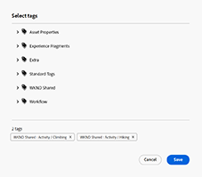

# Créer des fragments de contenu {#authoring-content-fragments}

La création de fragments de contenu est axée sur la diffusion sans interface utilisateur et la création de pages.

Deux éditeurs sont disponibles pour les fragments de contenu. L’éditeur décrit dans cette section :

* a été développé pour la diffusion de contenu sans interface utilisateur graphique (bien qu’il puisse être utilisé pour tous les scénarios).
* est disponible à partir du **Fragments de contenu** console

Cet éditeur fournit les éléments suivants :

* [Enregistrement automatique](#saving-autosaving), afin d’éviter toute perte accidentelle de modifications.
* [Chargement en ligne de ressources en tant que références de contenu](#reference-images), sans avoir à les charger dans la gestion des ressources numériques.
* [Aperçu](#preview-content-fragment) de l’expérience rendue fournie par le fragment de contenu.
* Capacité à [Publier](#publish-content-fragment) et [Dépublier](#unpublish-content-fragment) à partir de l’éditeur.
* Capacité à [afficher et ouvrir les copies de langue associées ;](#view-language-copies) dans l’éditeur.
* Capacité à [afficher les détails de version ;](#view-version-history) dans l’éditeur.
   * Vous pouvez également revenir à une version sélectionnée.
* Capacité à [afficher et ouvrir les références parentes ;](#view-parent-references).
* Une vue hiérarchique du fragment de contenu et de ses références, à l’aide de la variable [Arborescence de structure](#structure-tree).

>[!CAUTION]
>
>L’éditeur décrit dans cette section est *only* disponible dans le *en ligne* Adobe Experience Manager (AEM) as a Cloud Service.

>[!CAUTION]
>
>Pour modifier un fragment de contenu, vous devez [les autorisations appropriées](/help/implementing/developing/extending/content-fragments-customizing.md#asset-permissions). Contactez votre administrateur système si vous rencontrez des problèmes.
> 
>Par exemple, si vous n’avez pas `edit` autorisations L’éditeur est en lecture seule.

>[!NOTE]
>
>Pour plus d’informations sur la fonction [éditeur de fragment de contenu d’origine](/help/assets/content-fragments/content-fragments-variations.md) - il est disponible à partir de la **Ressources** et la console **Fragments de contenu** console.

>[!NOTE]
>
>Votre équipe de projet peut personnaliser l’éditeur si nécessaire. Voir [Personnalisation de la console de fragments de contenu et de l’éditeur](/help/implementing/developing/extending/content-fragments-console-and-editor.md) pour plus de détails.

## Éditeur de fragment de contenu {#content-fragment-editor}

Lorsque vous ouvrez l’éditeur de fragments de contenu pour la première fois, quatre zones principales s’affichent :

* barre d’outils supérieure : pour obtenir des informations clés et des actions
   * lien vers la console de fragments de contenu (icône Accueil)
   * informations sur le modèle et le dossier
   * liens vers [Aperçu (si le modèle d’URL d’aperçu par défaut est configuré pour le modèle)](/help/sites-cloud/administering/content-fragments/content-fragment-models.md#content-fragment-model-properties)
   * [Publier](#publish-content-fragment), et [Dépublier](#unpublish-content-fragment) actions
   * une option pour afficher tout **Références parentes** (icône de lien)
   * le fragment **[État](/help/sites-cloud/administering/content-fragments/managing.md#statuses-content-fragments)**, et les dernières informations enregistrées ;
   * bascule pour passer à l’éditeur d’origine (basé sur les ressources)
* panneau de gauche : affiche la variable **[Variations](#variations)** pour le fragment de contenu et son **Champs**:
   * ces liens peuvent être utilisés pour [parcourir la structure du fragment de contenu ;](#navigate-structure)
* panneau de droite : présente les onglets [affichage des propriétés (métadonnées) et des balises](#view-properties-tags), informations sur la variable [historique des versions](#view-version-history)et les informations relatives à [copies de langue](#view-language-copies)
   * dans le **Propriétés** vous pouvez mettre à jour l’onglet **Titre** et **Description** pour le fragment, ou **Variation**
* panneau central : affiche les champs réels et le contenu de la variation sélectionnée.
   * permet de modifier le contenu.
   * if **Espace réservé de tabulation** Les champs sont définis dans le modèle qu’ils sont affichés ici et peuvent être utilisés pour naviguer ; ils seront présentés horizontalement ou sous forme de liste déroulante.

>[!CAUTION]
>
>Un modèle de fragment de contenu peut souvent définir des champs de données nommés **Titre** et **Description**. Si ces champs existent, il s’agit de champs définis par l’utilisateur et ils peuvent être mis à jour dans la variable *panneau central* lors de la modification du fragment.
>
>Le fragment de contenu et ses variations comportent également des champs de métadonnées (propriétés de variation) appelés **Titre** et **Description**. Ces champs font partie intégrante d’un fragment de contenu et sont initialement définis lors du fragment. Ils peuvent être mis à jour dans le *panneau droit* lors de la modification du fragment.

## Navigation dans la structure du fragment de contenu {#navigate-structure}

un fragment de contenu unique ;

* Se compose de deux niveaux :

   * **[Variations](#variations)** du fragment de contenu
   * **Champs** : défini par le modèle de fragment de contenu et utilisé par chaque variation.

* Peut contenir une variété de références.

### Variations et champs {#variations-and-fields}

Dans le panneau de gauche, vous pouvez voir :

* la liste de **[Variations](#variations)** qui ont été créés pour ce fragment :
   * **Principal** est la variation présente lors de la première création du fragment de contenu ; vous pouvez en ajouter d’autres ultérieurement.
   * vous pouvez sélectionner et ouvrir une variation pour modification.
   * vous pouvez également [création d’une variation](#create-variation)
* la valeur **Champs** dans le fragment et ses variations :
   * l’icône indique que [Type de données](/help/sites-cloud/administering/content-fragments/content-fragment-models.md#data-types)
   * le texte est le nom du champ.
   * ensemble, elles fournissent un lien direct vers le contenu du champ dans le panneau central (pour la variation actuelle).

### Suivre les liens {#follow-links}

L’icône de lien s’affiche dans différentes parties de l’éditeur. Vous pouvez l’utiliser pour ouvrir l’élément affiché, par exemple un modèle de fragment de contenu, une référence parente ou un fragment référencé :

### Arborescence de structure {#structure-tree}

Ouvrez le **Arborescence de structure** de la barre d’outils de l’éditeur pour afficher la structure hiérarchique du fragment de contenu et ses références. Utilisez les icônes de lien pour accéder aux références.

>[!NOTE]
>
>Voir [Analyse de la structure du fragment de contenu - Arborescence de structure](/help/sites-cloud/administering/content-fragments/analysis.md#structure-tree) pour plus d’informations.

## Enregistrement et enregistrement automatique {#saving-autosaving}

<!-- CHECK: cannot be saved, no undo, redo -->

À chaque mise à jour que vous effectuez, le fragment de contenu est automatiquement enregistré. La dernière fois enregistrée s’affiche dans la barre d’outils supérieure.

## Variations {#variations}

[Variations](/help/sites-cloud/administering/content-fragments/overview.md#main-and-variations) sont une fonctionnalité importante des fragments de contenu AEM. Ils vous permettent de créer et de modifier des copies de la **Principal** contenu à utiliser sur des canaux et des scénarios spécifiques, ce qui rend la diffusion de contenu sans interface utilisateur et la création de pages encore plus flexible.

Dans l’éditeur, vous pouvez effectuer les opérations suivantes :

* [Création de variations](#create-variation) de **Principal** content

* Sélectionnez la variation requise pour modifier le contenu.

* [Renommer la variation](#rename-variation)

* [Suppression d’une variation](#delete-variation)

### Création d’une variation {#create-variation}

Pour créer une variation de votre fragment de contenu :

1. Dans le panneau de gauche, sélectionnez la variable **symbole plus** (**Créer une variation**) qui est à droite de **Variations**.

   >[!NOTE]
   >
   >Après avoir créé votre première variation, les variations existantes sont répertoriées dans le même panneau.

   

1. Dans la boîte de dialogue, saisissez une **Titre** pour votre variation, et une **Description** si vous le souhaitez :

   

1. **Créer** la variation. Il apparaît dans la liste.

### Renommer une variation {#rename-variation}

Pour renommer une **Variation**:

1. Sélectionnez la variation requise.

1. Ouvrez le **Propriétés** dans le panneau de droite.

1. Mise à jour de la variation **Titre**.

1. Soit appuyez **Retour** ou passez à un autre champ pour enregistrer automatiquement la modification. Le titre est mis à jour dans la variable **Variations** panneau sur la gauche.

### Suppression d’une variation {#delete-variation}

Pour supprimer une variation de votre fragment de contenu :

>[!NOTE]
>
>Vous ne pouvez pas supprimer **Principal**.

1. Sélectionnez la variation.

1. Dans le **Variation** , sélectionnez l’icône de suppression (corbeille) :

   

1. Une boîte de dialogue s’ouvre. Sélectionner **Supprimer** pour confirmer l’action.

## Modifier des champs de texte multiligne : texte brut ou Markdown {#edit-multi-line-text-fields-plaintext-markdown}

**[Texte multi-lignes](/help/sites-cloud/administering/content-fragments/content-fragment-models.md#data-types)** Les champs peuvent avoir l’un des trois formats suivants :

* Texte brut
* [Texte (Markdown)](/help/sites-cloud/administering/content-fragments/markdown.md)
* [Texte enrichi](#edit-multi-line-text-fields-rich-text)

Les champs définis comme Texte brut ou Texte (Markdown) comportent une zone de texte simple, sans options de formatage (à l’écran) :

## Modifier des champs de texte multiligne - Texte enrichi {#edit-multi-line-text-fields-rich-text}

Pour **[Texte multi-lignes](/help/sites-cloud/administering/content-fragments/content-fragment-models.md#data-types)** champs définis comme **Texte enrichi**, différentes fonctionnalités sont disponibles :

* Modifiez le contenu :
   * Annuler/rétablir
   * Coller/coller en tant que texte
   * Copier
   * Sélectionner le format de paragraphe
   * Créer/gérer un tableau
   * Mise en forme de texte ; gras, italique, souligné, couleur
   * Définition de l’alignement des paragraphes
   * Créer/gérer des listes ; à puces, numérotées
   * Retrait du texte ; diminuer, augmenter
   * Effacer la mise en forme actuelle
   * Insérer des liens
   * Sélection et insertion de références aux ressources d’image
   * Ajout de caractères spéciaux
* [Éditeur plein écran](#full-screen-editor-rich-text) - bascule entre le mode plein écran et le mode intégré
* [Statistiques](#statistics-rich-text)
* [Comparer et synchroniser](#compare-and-synchronize-rich-text)

Par exemple :

>[!NOTE]
>
>Les champs de texte multiligne sont également indiqués par les [icon](#fields-datatypes-icons) dans le **Champs** du panneau.

### Éditeur plein écran - Texte enrichi {#full-screen-editor-rich-text}

L’éditeur plein écran offre les mêmes options de modification que lors de l’importation dans le flux, mais offre plus d’espace pour le texte.

Par exemple :

### Statistiques - Texte enrichi {#statistics-rich-text}

L’action **Statistiques** affiche une plage d’informations sur le texte dans un champ multiligne.

Par exemple :

### Comparaison et synchronisation - Texte enrichi {#compare-and-synchronize-rich-text}

L’action **Comparer** est disponible pour les champs multilignes lorsque vous avez une **Variation** ouvrez .

Le champ multiligne s’ouvre alors en plein écran et :

* affiche le contenu des deux **Principal** et le **Variation** en parallèle, avec les différences surlignées

* les différences sont indiquées par la couleur :

   * le contenu ajouté figure en vert (ajouté à la variation) ;
   * le contenu supprimé (de la variation) figure en rouge.
   * le texte remplacé apparaît en bleu

* fournit la variable **Synchronisation** qui synchronise le contenu à partir de **Principal** à la variation actuelle ;

   * if **Principal** a été mis à jour, puis ces modifications seront transférées à la variation.
   * si la variation a été mise à jour, ces modifications seront remplacées par le contenu de **Principal**

  >[!CAUTION]
  >
  >La synchronisation n’est disponible que pour copier les modifications *de **Principal**à la variation*.
  >
  >Transfert des modifications *d’une variation à&#x200B;**Principal*** n’est pas disponible en tant qu’option.

Par exemple, dans le cas d’un scénario où le contenu de la variation a été entièrement réécrit, une synchronisation remplace donc ce nouveau contenu par le contenu de **Principal**:

## Gestion des références {#manage-references}

### Références à un fragment {#fragment-references}

[Références de fragment](/help/sites-cloud/administering/content-fragments/content-fragment-models.md#fragment-reference-nested-fragments) peut être utilisé pour :

* [créer une référence à un fragment de contenu existant ;](#create-reference-existing-content-fragment)
* [créer un fragment de contenu, puis le référencer ;](#create-reference-content-fragment)

#### Créer une référence à un fragment de contenu existant {#create-reference-existing-content-fragment}

Pour créer une référence à un fragment de contenu existant :

1. Sélectionnez le champ.
1. Sélectionner **Ajouter un fragment existant**.
1. Sélectionnez le fragment requis dans le sélecteur de fragments.

   >[!NOTE]
   >
   >Vous pouvez sélectionner un seul fragment à la fois.

#### Création d’un fragment de contenu et référence {#create-reference-content-fragment}

Vous pouvez également [select **Créer un fragment** pour ouvrir le **Créer** dialog](/help/sites-cloud/administering/content-fragments/managing.md#creating-a-content-fragment). Une fois créé, ce fragment sera référencé.

### Références du contenu {#content-references}

[Références de contenu](/help/sites-cloud/administering/content-fragments/content-fragment-models.md#content-reference) sont utilisés pour référencer d’autres types de contenu AEM, tels que des images, des pages et des fragments d’expérience.

#### Images de référence {#reference-images}

Dans **Référence de contenu** vous pouvez effectuer les deux opérations suivantes :

* ressources de référence qui existent déjà dans le référentiel
* les charger directement dans le champ ; cela évite d’utiliser la variable **Ressources** console à télécharger

  >[!NOTE]
  >
  >Pour charger directement une image dans la fonction **Référence de contenu** champ, it **must**:
  >
  >* avoir une **Chemin racine** définie (dans la variable [Modèle de fragment de contenu](/help/sites-cloud/administering/content-fragments/content-fragment-models.md#content-reference)). Cela indique l’emplacement de stockage de l’image.
  >* include **Image** dans la liste des types de contenu acceptés

Pour ajouter une ressource, vous pouvez effectuer l’une des opérations suivantes :

* faites glisser et déposez directement le nouveau fichier de ressource (par exemple, depuis votre système de fichiers) dans le **Référence de contenu** field
* utilisez la méthode **Ajout d’une ressource** , puis sélectionnez l’une des options suivantes : **Parcourir les ressources** ou **Télécharger** pour ouvrir le sélecteur approprié afin d’utiliser :

  

#### Pages de référence {#reference-pages}

Pour ajouter des références à des pages AEM, des fragments d’expérience ou d’autres types de contenu :

1. Sélectionner **Ajouter un chemin d’accès au contenu**.

1. Ajoutez le chemin d’accès requis dans le champ de saisie.

1. Confirmer avec **Ajouter**.

### Afficher les références parentes {#view-parent-references}

La sélection de l’icône de lien dans la barre d’outils supérieure ouvre une liste de toutes les références parentes.

Par exemple :

Une fenêtre s’ouvre, répertoriant toutes les références associées. Pour ouvrir une référence, sélectionnez le nom ou le titre, ou l’icône de lien.

Par exemple :

## Affichage des propriétés et des balises {#view-properties-tags}

Dans l’onglet Propriétés du panneau de droite, les propriétés (métadonnées) et les balises peuvent être visualisées. Les propriétés peuvent être les suivantes :

* pour le **Fragment de contenu** - if **Principal** est actuellement sélectionné
* pour un **Variation**

### Modification des propriétés et des balises {#edit-properties-tags}

Dans l’onglet Propriétés (panneau de droite), vous pouvez également modifier :

* **Titre**
* **Description**
* **Balises**: utilisation de la liste déroulante ou de la boîte de dialogue de sélection

  

### Ouvrir le modèle de fragment de contenu {#open-content-fragment-model}

Lorsque vous **Principal** sélectionné, le nom du modèle de fragment de contenu sous-jacent s’affiche dans la section propriétés . Lorsque vous sélectionnez l’icône de lien, le modèle s’ouvre dans un onglet distinct.

Par exemple :

## Affichage de l’historique des versions {#view-version-history}

Dans le **Historique des versions** dans le panneau de droite, les détails des versions actuelle et précédente s’affichent :

>[!NOTE]
>
>Une nouvelle version est créée lorsque le fragment de contenu est publié.

### Rétablissement d’une version {#revert-version}

Vous pouvez restaurer n’importe quelle version.

Pour revenir à une version spécifique :

1. Sélectionnez l’icône de trois points en regard de la version.

1. Sélectionner **Rétablir**.

## Affichage des copies de langue {#view-language-copies}

Dans le **Propriétés de langue** les détails des onglets des copies de langue associées s’affichent. Lorsque vous sélectionnez une icône de lien, la copie s’ouvre dans un onglet distinct.

Par exemple :

>[!NOTE]
>
>Pour plus d’informations sur la traduction d’un fragment de contenu et la création de copies de langue, voir la section [AEM Parcours de traduction sans affichage](/help/journey-headless/translation/overview.md).

## Aperçu du fragment {#preview-content-fragment}

L’éditeur de fragment de contenu permet aux auteurs de prévisualiser leurs modifications dans une application frontale externe.

Pour utiliser cette fonctionnalité, vous devez d’abord :

* Contactez votre équipe informatique pour configurer l’application frontale externe qui effectuera le rendu du fragment de contenu en utilisant sa sortie JSON.
* Une fois l’application front-end externe configurée, la variable **Modèle d’URL d’aperçu par défaut** doit être défini comme une [de la propriété du modèle de fragment de contenu approprié.](/help/sites-cloud/administering/content-fragments/content-fragment-models.md#properties).

Une fois l’URL définie, la variable **Aperçu** est actif. Vous pouvez sélectionner ce bouton pour lancer l’application externe (dans un onglet distinct) afin de générer le fragment de contenu.

## Publication du fragment {#publish-content-fragment}

Vous pouvez **Publier** votre fragment dans :

* Prévisualiser l’instance
* Instance de publication

Vous pouvez publier votre fragment à partir de l’éditeur ou de la console. Voir [Publication et aperçu d’un fragment](/help/sites-cloud/administering/content-fragments/managing.md#publishing-and-previewing-a-fragment) pour plus d’informations.

## Annuler la publication de votre fragment {#unpublish-content-fragment}

Vous pouvez également **Dépublier** votre fragment à partir de :

* Prévisualiser l’instance
* Instance de publication

Vous pouvez annuler la publication de votre fragment dans l’éditeur ou dans la console. Voir [Annulation de la publication d’un fragment](/help/sites-cloud/administering/content-fragments/managing.md#unpublishing-a-fragment) pour plus d’informations.

## Champs, types de données et icônes {#fields-datatypes-icons}

La variable **Champs** répertorie tous les champs du fragment de contenu. L’icône indique que **[Type de données](/help/sites-cloud/administering/content-fragments/content-fragment-models.md#data-types)**:

<table style="table-layout:auto">
 <tbody>
  <tr>
   <td>
<b>Une seule ligne de texte</b>
 </td>
   <td>
  
</td>
  </tr>
  <tr>
   <td>
<b>Plusieurs lignes de texte</b>
 </td>
   <td>
  
</td>
  </tr>
  <tr>
   <td>
<b>Nombre</b>
 </td>
   <td>
  
</td>
  </tr>
  <tr>
   <td>
<b>Booléen</b>
 </td>
   <td>
  
</td>
  </tr>
  <tr>
   <td>
<b>Date et heure</b>
 </td>
   <td>
  
</td>
  </tr>
  <tr>
   <td>
<b>Énumération</b>
 </td>
   <td>
  
</td>
  </tr>
  <tr>
   <td>
<b>Balises</b>
 </td>
   <td>
  
</td>
  </tr>
  <tr>
   <td>
<b>Référence de contenu</b>
 </td>
   <td>
  
</td>
  </tr>
  <tr>
   <td>
<b>Référence du fragment</b>
 </td>
   <td>
  
</td>
  </tr>
  <tr>
   <td>
<b>Objet JSON</b>
 </td>
   <td>
  
</td>
  </tr>
  <tr>
   <td>
<b>Espace réservé pour tabulation</b>

Même si elle n’est pas représentée par une icône réelle, une <b>Espace réservé de tabulation</b> est représenté dans le panneau de gauche, ainsi que dans le panneau central.
 </td>
   <td>
  
</td>
  </tr>
 </tbody>
</table>
