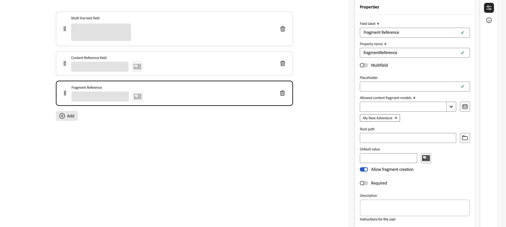

# Définition de modèles de fragment de contenu {#defining-content-fragment-models}

Les modèles de fragment de contenu dans Adobe Experience Manager (AEM) as a Cloud Service définissent la structure du contenu de vos [fragments de contenu](/help/sites-cloud/administering/content-fragments/overview.md). Ces fragments peuvent ensuite être utilisés pour la création de pages ou comme base pour votre contenu découplé.

Cette page explique comment définir votre modèle de fragment de contenu à l’aide de l’éditeur dédié. Voir [&#x200B; Gestion de vos modèles de fragment de contenu &#x200B;](/help/sites-cloud/administering/content-fragments/managing-content-fragment-models.md) pour accéder à d’autres tâches et options disponibles une fois vos fragments créés, y compris [les actions disponibles à partir de la console Fragments de contenu](/help/sites-cloud/administering/content-fragments/managing-content-fragment-models.md#actions), [l’autorisation du modèle sur votre dossier](/help/sites-cloud/administering/content-fragments/managing-content-fragment-models.md#allowing-content-fragment-models-assets-folder) et [la publication de votre modèle](/help/sites-cloud/administering/content-fragments/managing-content-fragment-models.md#publishing-a-content-fragment-model).

>[!NOTE]
>
>Tenez compte des [&#x200B; Bonnes pratiques &#x200B;](/help/sites-cloud/administering/content-fragments/overview.md#best-practices) lorsque vous utilisez vos modèles de fragment de contenu et vos fragments de contenu.

>[!CAUTION]
>
>Si vous souhaitez interroger plusieurs fragments référencés, il n’est pas recommandé que les différents modèles de fragment aient des noms de champ portant le même nom, mais avec des types différents.
>
>Pour plus d’informations, consultez [API AEM GraphQL à utiliser avec des fragments de contenu - Limites](/help/headless/graphql-api/content-fragments.md#limitations)

>[!NOTE]
>
>Si vous créez un modèle avec ce nouvel éditeur, vous devez toujours l’utiliser pour ce modèle.
>
>Si vous ouvrez ensuite le modèle avec l’[éditeur de modèles d’origine](/help/assets/content-fragments/content-fragments-models.md), le message suivant s’affiche :
>
>* « Un schéma d’interface utilisateur personnalisé est configuré pour ce modèle. L’ordre des champs affichés dans cette interface utilisateur peut ne pas correspondre au schéma d’interface utilisateur. Pour afficher les champs alignés avec le schéma d’interface utilisateur, vous devez passer au nouvel éditeur de fragment de contenu. »

## Définition de votre modèle de fragment de contenu {#defining-your-content-fragment-model}

Le modèle de fragment de contenu définit efficacement la structure des fragments de contenu résultants à l’aide d’une sélection de **[types de données](#data-types)**. Grâce à l’éditeur de modèles, vous pouvez ajouter des instances de types de données, puis les configurer pour créer les champs requis :

>[!CAUTION]
>
>La modification d’un modèle déjà utilisé par des fragments de contenu existants peut avoir un impact sur ces fragments dépendants.

1. Dans la console Fragments de contenu, sélectionnez le panneau des [Modèles de fragment de contenu](/help/sites-cloud/administering/content-fragments/managing-content-fragment-models.md#basic-structure-handling-content-fragment-models-console) et accédez au dossier contenant votre modèle de fragment de contenu.

   >[!NOTE]
   >
   >Vous pouvez également ouvrir un modèle directement après [sa création](/help/sites-cloud/administering/content-fragments/managing-content-fragment-models.md#creating-a-content-fragment-model).

1. Ouvrez le modèle requis pour **Modifier** ; utilisez l’un des liens d’action rapide ou sélectionnez le modèle, puis l’action dans la barre d’outils.


   

   Une fois ouvert, l’éditeur de modèles affiche :

   * haut :
      * Icône **Accueil**
      * option permettant de basculer entre le [original](/help/assets/content-fragments/content-fragments-models.md) et le nouvel éditeur
      * **Annuler**
      * **Enregistrer**

   * gauche : **Types de données** disponible pour la création de champs

   * au milieu : champs déjà définis avec l&#39;option **Ajouter**

   * à droite : à l’aide des icônes situées à l’extrémité droite, vous pouvez choisir entre :

      * **Propriétés** : définit et affiche les propriétés du champ sélectionné
      * **Détails du modèle** : afficher le statut **Activé**, **Titre du modèle**, **Balises**, **Description** et **URL d’aperçu**

1. **Pour ajouter un champ**

   * Vous pouvez effectuer les actions suivantes :

      * Faites glisser un type de données du panneau de gauche vers l’emplacement souhaité pour un champ dans le panneau du milieu.
      * Sélectionnez l’icône **+** en fonction d’un type de données pour l’ajouter en bas de la liste des champs.
      * Sélectionnez **Ajouter** dans le panneau du milieu, puis le type de données requis dans la liste déroulante qui en résulte pour ajouter un champ au bas de la liste.

     >[!NOTE]
     >
     >Les champs **espace réservé pour tabulation** doivent toujours apparaître au-dessus des champs existants.

   * Vous pouvez repositionner un champ en formant des points à gauche de la zone de champ :

     

   * Une fois qu’un champ a été ajouté au modèle (et est sélectionné), le panneau de droite affiche les **Propriétés** qui peuvent être définies pour ce type de données particulier. Vous pouvez définir ici ce qui est requis pour le spécifique
champ .

      * De nombreuses propriétés s’expliquent d’elles-mêmes. Pour plus d’informations, consultez [Propriétés (types de données)](#properties).
      * Si vous entrez un **libellé de champ**, le **nom de propriété** est automatiquement renseigné. S’il est vide, il peut être mis à jour manuellement par la suite.

        >[!CAUTION]
        >
        >Lors de la mise à jour manuelle de la propriété **Nom de la propriété** pour un type de données, les noms doivent contenir *uniquement* A-Z, a-z, 0-9 et le trait de soulignement « _ » comme caractère spécial.
        >
        >Si les modèles créés dans des versions antérieures d’AEM contiennent des caractères interdits, supprimez ou modifiez ces caractères.

     Par exemple :

     

     >[!NOTE]
     >
     >Lorsqu’un champ est défini comme **Obligatoire**, le **Libellé** indiqué dans le volet central est signalé par un astérisque (**&#42;**).

1. **Pour supprimer un champ**

   Sélectionnez l’icône de corbeille pour le champ approprié dans le panneau du milieu.

   

1. Ajoutez tous les champs obligatoires et définissez les propriétés connexes, le cas échéant.

1. Sélectionnez **Enregistrer** pour conserver la définition.

## Types de données {#data-types}

Une sélection de types de données est disponible pour la définition de votre modèle :

* **Une seule ligne de texte**
   * Ajouter un champ pour une seule ligne de texte ; la longueur maximale peut être définie
   * Le champ peut être configuré pour permettre aux auteurs de fragments de créer de nouvelles instances du champ

* **Plusieurs lignes de texte**
   * Zone de texte pouvant contenir du texte enrichi, du texte brut ou du texte Markdown.
   * Le champ peut être configuré pour permettre aux auteurs de fragments de créer de nouvelles instances du champ

  >[!NOTE]
  >
  >Que la zone de texte soit du texte enrichi, du texte brut ou Markdown, est définie dans le modèle par la propriété **Type par défaut**.
  >
  >Ce format ne peut pas être modifié à partir de l’[éditeur de fragment de contenu](/help/sites-cloud/administering/content-fragments/authoring.md), mais uniquement à partir du modèle.

* **Nombre**
   * Ajouter un champ numérique
   * Le champ peut être configuré pour permettre aux auteurs de fragments de créer de nouvelles instances du champ

* **Booléen**
   * Ajoutez une case à cocher booléenne

* **Date et heure**
   * Ajouter un champ de date et/ou d’heure

* **Énumération**
   * Ajouter un ensemble de champs Case à cocher, Bouton radio ou Liste déroulante
      * Vous pouvez spécifier les options disponibles pour l’auteur du fragment

* **Balises**
   * Permet aux auteurs de fragments d’accéder à des zones de balises et de les sélectionner.

* **Référence du fragment**
   * Fait référence à d’autres fragments de contenu ; peut être utilisé pour [créer du contenu imbriqué](#using-references-to-form-nested-content)
   * Le type de données peut être configuré pour permettre aux auteurs de fragments de procéder aux opérations suivantes :
      * Modifier directement le fragment référencé.
      * Créer un fragment de contenu basé sur le modèle approprié
      * Création de nouvelles instances du champ
   * La référence spécifie le chemin d’accès à la ressource référencée ; par exemple, `/content/dam/path/to/resource`

     <!--
    * Internally the reference is held as a universally unique ID (UUID) that references the resource
    * You do not need to know the UUID; in the fragment editor you can browse to the required fragment.
    -->

  <!--
  >[!NOTE]
  >
  >The UUIDs are repository specific. If you use the [Content Copy Tool](/help/implementing/developing/tools/content-copy.md) to copy Content Fragments, the UUIDs will be recalculated in the target environment.
  -->

* **Référence de contenu**
   * Fait référence à d’autres contenus, tous types confondus ; peut être utilisée pour [créer du contenu imbriqué](#using-references-to-form-nested-content).
   * Si une image est référencée, vous pouvez choisir d’afficher une miniature.
   * Le champ peut être configuré pour permettre aux auteurs de fragments de créer de nouvelles instances du champ
   * La référence spécifie le chemin d’accès à la ressource référencée ; par exemple, `/content/dam/path/to/resource`

     <!--
    * Internally the reference is held as a universally unique ID (UUID) that references the resource
    * You do not need to know the UUID; in the fragment editor you can browse to the required asset resource
    -->

  <!--
  >[!NOTE]
  >
  >The UUIDs are repository specific. If you use the [Content Copy Tool](/help/implementing/developing/tools/content-copy.md) to copy Content Fragments, the UUIDs will be recalculated in the target environment.
  -->

* **Objet JSON.**
   * Permet à l’auteur du fragment de contenu de saisir la syntaxe JSON dans les éléments correspondants d’un fragment.
      * Permettre à AEM de stocker directement JSON que vous avez copié/collé à partir d’un autre service.
      * Le fichier JSON est transmis et généré sous la forme JSON dans GraphQL.
      * Inclut la mise en surbrillance de la syntaxe JSON, la saisie automatique et la mise en surbrillance des erreurs dans l’éditeur de fragment de contenu.

* **Espace réservé pour tabulation**
   * Permet l’introduction d’onglets à utiliser lors de la modification du contenu du fragment de contenu.
      * Elles s’affichent sous forme de séparateurs dans l’éditeur de modèles et séparent les sections de la liste des types de données de contenu. Chaque instance représente le début d’un nouvel onglet.
      * Dans l’éditeur de fragments, chaque instance s’affiche sous la forme d’un onglet.

     >[!NOTE]
     >
     >Ce type de données est uniquement utilisé à des fins de mise en forme. Il est ignoré par le schéma GraphQL AEM.
     >
     >Les champs **espace réservé pour tabulation** doivent toujours apparaître au-dessus des champs existants.

## Propriétés (types de données) {#properties}

De nombreuses propriétés s’expliquent d’elles-mêmes. Pour certaines propriétés, les détails supplémentaires sont les suivants :

* **Nom de la propriété**

  Lors de la mise à jour manuelle de cette propriété pour un type de données, les noms **doivent** contenir *uniquement* A-Z, a-z, 0-9 et le trait de soulignement « _ » comme caractère spécial.

  >[!CAUTION]
  >
  >Si les modèles créés dans des versions antérieures d’AEM contiennent des caractères interdits, supprimez ou modifiez ces caractères.

* **Rendre en tant que**

  Les différentes options de réalisation/rendu du champ dans un fragment. Souvent, cela vous permet de définir si l’auteur verra une seule instance du champ ou sera autorisé à créer plusieurs instances. Lorsque le **champ multiple** est utilisé, vous pouvez définir le nombre minimal et maximal d’éléments. Voir [Validation](#validation) pour plus de détails.

* **Libellé du champ**
La saisie d’un **Libellé du champ** génère automatiquement un **Nom de la propriété**, qui peut ensuite être mis à jour manuellement si nécessaire.

* **Validation**
La validation de base est disponible par le biais de mécanismes tels que la propriété **Requis**. Certains types de données comportent des champs de validation supplémentaires. Voir [Validation](#validation) pour plus de détails.

* Pour le type données **texte multiligne**, il est possible de définir le **type par défaut** en tant que :

   * **Texte enrichi**
   * **Texte (Markdown)**
   * **Texte brut**

  Si elle n’est pas spécifiée, la valeur par défaut **Texte enrichi** est utilisée pour ce champ.

  La modification du **Type par défaut** dans un modèle de fragment de contenu ne prend effet sur un fragment de contenu existant et associé qu’une fois ce fragment ouvert dans l’éditeur et enregistré.

* **Unique**
Le contenu (pour le champ spécifique) doit être unique pour tous les fragments de contenu créés à partir du modèle actuel.

  Cette propriété permet de s’assurer que les auteurs de contenu ne peuvent pas répéter le contenu déjà ajouté dans un autre fragment du même modèle.

  Par exemple, un champ **Une seule ligne de texte** appelé `Country` dans le modèle de fragment de contenu ne peut pas avoir la valeur `Japan` dans deux fragments de contenu dépendants. Un avertissement est émis en cas de tentative concernant la deuxième instance.

  >[!NOTE]
  >
  >L’unicité est assurée par la racine de langue.

  >[!NOTE]
  >
  >Les variations peuvent avoir la même valeur *unique* que les variations du même fragment, mais pas la même valeur que celle utilisée dans une variation d’autres fragments.

* Consultez la section **[Référence de contenu](#content-reference)** pour plus d’informations sur ce type de données spécifique et ses propriétés.

* Voir la section **[Référence du fragment (Fragments imbriqués)](#fragment-reference-nested-fragments)** pour plus d’informations sur ce type de données spécifique et ses propriétés.

* **Traduisible**

  Activez la case à cocher **Traduisible** dans un champ de l’éditeur de modèle de fragment de contenu pour :

   * vous assurer que le nom de la propriété du champ est ajouté à la configuration de traduction, `/content/dam/<sites-configuration>` de contexte, s’il n’est pas déjà présent ;
   * Pour GraphQL : définir une propriété `<translatable>` dans le champ Fragment de contenu sur `yes` afin d’autoriser le filtre de requête GraphQL pour la sortie JSON avec du contenu traduisible uniquement.

## Validation {#validation}

Différents types de données incluent désormais la possibilité de définir les exigences de validation lorsque le contenu est saisi dans le fragment résultant :

* **Une seule ligne de texte**
   * Comparaison avec une expression régulière prédéfinie (regex).
* **Nombre**
   * Vérification de valeurs spécifiques.
* **Référence de contenu**
   * Test de types de contenu spécifiques.
   * Seuls peuvent être référencés des fichiers de taille de fichier spécifiée ou inférieure.
   * Seules peuvent être référencées les images d’une plage prédéfinie de largeur et/ou de hauteur (en pixels).
* **Référence du fragment**
   * Testez un modèle de fragment de contenu spécifique.
* **Nombre minimum d’éléments** / **Nombre maximum d’éléments**

  Les champs qui ont été définis comme un **champ multiple** (défini avec **Rendre en tant que**) ont les options suivantes :

   * **Nombre minimum d’éléments**
   * **Nombre maximal d’éléments**

  Elles sont validées dans l’[Éditeur de fragment de contenu](/help/sites-cloud/administering/content-fragments/authoring.md).

## Utilisation de références pour former un contenu imbriqué {#using-references-to-form-nested-content}

Les fragments de contenu peuvent former du contenu imbriqué à l’aide de l’un des types de données suivants :

* [Référence de contenu](#content-reference)
   * Fournit une référence simple à un autre contenu, quel que soit son type.
   * Fourni par le type de données **Référence de contenu**
   * Peut être configuré pour une ou plusieurs références (dans le fragment résultant).

* [Référence du fragment](#fragment-reference-nested-fragments) (fragments imbriqués)
   * Fait référence à d’autres fragments, en fonction des modèles spécifiques spécifiés.
   * Fourni par le type de données **Référence de fragment**
   * Permet d’inclure/récupérer des données structurées.

     >[!NOTE]
     >
     >Cette méthode est particulièrement intéressante lorsque vous utilisez [diffusion de contenu découplée à l’aide de fragments de contenu avec GraphQL](/help/sites-cloud/administering/content-fragments/content-delivery-with-graphql.md).
   * Peut être configuré pour une ou plusieurs références (dans le fragment résultant).

<!--
>[!NOTE]
>
>See [Upgrade your Content Fragments for UUID References](/help/headless/graphql-api/uuid-reference-upgrade.md) for further information about Content/Fragment Reference and Content/Fragment Reference (UUID), and upgrading to the UUID-based data types.
-->

>[!NOTE]
>
>AEM dispose d’une protection récurrente pour :
>
>* Références du contenu
>  Cela empêche l’utilisateur d’ajouter une référence au fragment actif et peut conduire à une boîte de dialogue vide dans le sélecteur de référence du fragment.
>
>* Références de fragment dans GraphQL
>  Si vous créez une requête profonde qui renvoie plusieurs fragments de contenu référencés les uns par les autres, elle renvoie la valeur null lors de la première occurrence.

>[!CAUTION]
>
>Si vous souhaitez interroger plusieurs fragments référencés, il n’est pas recommandé que les différents modèles de fragment aient des noms de champ portant le même nom, mais avec des types différents.
>
>Pour plus d’informations, consultez [API AEM GraphQL à utiliser avec des fragments de contenu - Limites](/help/headless/graphql-api/content-fragments.md#limitations)

### Référence de contenu {#content-reference}

Le type de données **Référence de contenu** vous permet d’effectuer le rendu du contenu à partir d’une autre source, par exemple une image, une page ou un fragment d’expérience.

Outre les propriétés standard, vous pouvez spécifier les éléments suivants :

* Le **Chemin racine**, qui spécifie ou représente l’emplacement de stockage de tout contenu référencé

  >[!NOTE]
  >
  >Ceci est obligatoire si vous souhaitez charger et référencer directement des images dans ce champ lors de l’utilisation de l’éditeur de fragment de contenu.
  >
  >Voir [Images de référence](/help/sites-cloud/administering/content-fragments/authoring.md#reference-images) pour plus d’informations.

* Types de contenu pouvant être référencés

  >[!NOTE]
  >
  >Ils doivent inclure **Image** si vous souhaitez charger et référencer directement des images dans ce champ lors de l’utilisation de l’éditeur de fragment de contenu.
  >
  >Voir [Images de référence](/help/sites-cloud/administering/content-fragments/authoring.md#reference-images) pour plus d’informations.

* Limites relatives aux tailles de fichier
* Si une image est référencée :

   * Afficher la miniature
   * Limites de hauteur et de largeur pour l’image


### Référence du fragment (fragments imbriqués) {#fragment-reference-nested-fragments}

Le type de données **Référence de fragment** peut référencer un ou plusieurs fragments de contenu. Cette fonctionnalité est particulièrement intéressante lors de la récupération de contenu à utiliser dans votre application, car elle vous permet de récupérer des données structurées avec plusieurs calques.

Par exemple :

* Modèle définissant les détails d’un employé, notamment :
   * Référence au modèle qui définit l’employeur (entreprise)

```xml
type EmployeeModel {
    name: String
    firstName: String
    company: CompanyModel
}

type CompanyModel {
    name: String
    street: String
    city: String
}
```

>[!NOTE]
>
>Les références de fragment sont particulièrement intéressantes pour la [diffusion de contenu découplé à l’aide de fragments de contenu avec GraphQL](/help/sites-cloud/administering/content-fragments/content-delivery-with-graphql.md).

Outre les propriétés standard, vous pouvez définir les éléments suivants :

* **Afficher comme** :

   * **multifield** : l’auteur du fragment peut créer plusieurs références individuelles

   * **fragmentreference** : permet à l’auteur du fragment de sélectionner une référence unique à un fragment.

* **Type de modèle**
Il est possible de sélectionner plusieurs modèles. Lors de l’ajout de références à un fragment de contenu, tous les fragments référencés doivent avoir été créés à l’aide de ces modèles.

* **Chemin racine**
Cette propriété spécifie ou représente un chemin racine pour tous les fragments référencés.

* **Autoriser la création de fragments**

  Cette propriété permet à la personne chargée de la création du fragment de créer un fragment en fonction du modèle approprié.

   * **fragmentreferencecomposite** : permet à l’auteur du fragment de créer un composite en sélectionnant plusieurs fragments.

  

>[!NOTE]
>
>Un mécanisme de protection de récurrence est en place. Elle interdit à l’utilisateur de sélectionner le fragment de contenu actuel dans la référence de fragment et peut conduire à une boîte de dialogue vide du sélecteur de référence de fragment.
>
>Il existe également une protection contre la périodicité pour les références de fragments dans GraphQL. Si vous créez une requête profonde entre deux fragments de contenu qui se référencent mutuellement, elle renvoie la valeur « null ».
