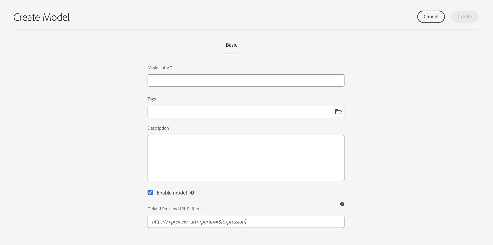
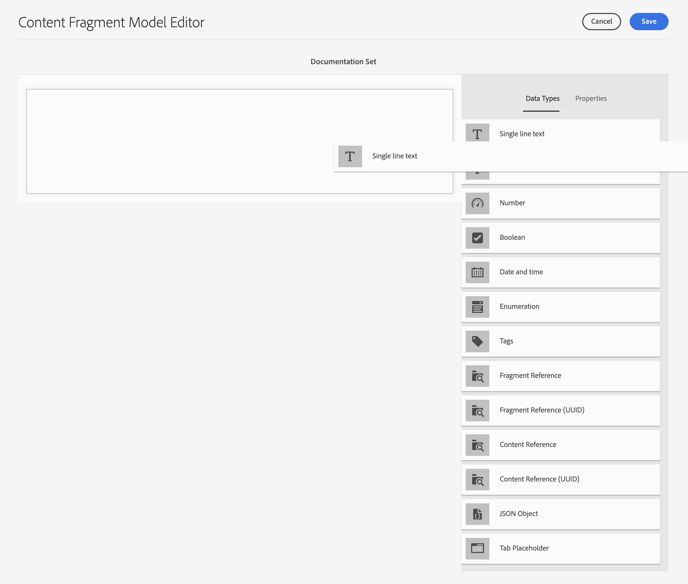

# Modèles de fragment de contenu {#content-fragment-models}

Les modèles de fragment de contenu dans Adobe Experience Manager (AEM) as a Cloud Service définissent la structure du contenu de vos [fragments de contenu](/help/sites-cloud/administering/content-fragments/overview.md). Ces fragments peuvent ensuite être utilisés pour la création de pages ou comme base pour votre contenu sans interface utilisateur.

Pour utiliser des modèles de fragments de contenu, procédez comme suit :

1. [Activez la fonctionnalité Modèle de fragment de contenu pour votre instance.](/help/sites-cloud/administering/content-fragments/setup.md)
1. [Créez](#creating-a-content-fragment-model) et [configurez](#defining-your-content-fragment-model) vos modèles de fragments de contenu.
1. [Activez vos modèles de fragment de contenu](#enabling-disabling-a-content-fragment-model) à utiliser lors de la création de fragments de contenu.
1. [Autorisez vos modèles de fragments de contenu sur les dossiers de ressources requis](#allowing-content-fragment-models-assets-folder) en configurant des **politiques**.

## Création d’un modèle de fragment de contenu {#creating-a-content-fragment-model}

1. Accédez à **Outils**, **Général**, puis ouvrez les **modèles de fragment de contenu**.
1. Accédez au dossier correspondant à votre [configuration, ou sous-configuration](/help/sites-cloud/administering/content-fragments/setup.md).
1. Utilisez **Créer** pour ouvrir l’assistant.

   >[!CAUTION]
   >
   >Si l’[ utilisation des modèles de fragments de contenu n’a pas été activée](/help/sites-cloud/administering/content-fragments/setup.md), l’option **Créer** ne sera pas disponible.

1. Spécifiez le **Titre du modèle**.
Vous pouvez également définir différentes propriétés ; par exemple, ajouter **Balises**, une **Description**, sélectionner **Activer le modèle** à [activer le modèle](#enabling-disabling-a-content-fragment-model) si nécessaire et définir le
   **Modèle d’URL d’aperçu par défaut**.

   >[!NOTE]
   >
   >Pour plus d’informations, voir [Modèle de fragment de contenu - Propriétés](#content-fragment-model-properties) .

   

1. Utilisez **Créer** pour enregistrer le modèle vide. Un message indique le succès de l’action. Vous pouvez sélectionner **Ouvrir** pour modifier immédiatement le modèle ou **Terminé** pour revenir à la console.

>[!CAUTION]
>
>Si vous interrogez plusieurs fragments référencés, il n’est pas recommandé que les différents modèles de fragments portent des noms de champ portant le même nom, mais des types différents.
>
>Pour plus d’informations, reportez-vous à la section [API GraphQL AEM à utiliser avec des fragments de contenu - Limites](/help/headless/graphql-api/content-fragments.md#limitations)

### Modèle de fragment de contenu – Propriétés {#content-fragment-model-properties}

Ces propriétés sont définies lors de la création d’un modèle et peuvent être modifiées ultérieurement avec l’option **Properties** pour le modèle de fragment de contenu :

* **De base**
   * **Titre du modèle**
   * **Balises**
   * **Description**
   * **Activer le modèle**
   * **Modèle d’URL d’aperçu par défaut**
L’éditeur de fragment de contenu permet aux auteurs de **prévisualiser** leur contenu dans une application frontale externe. Une fois le **service d’aperçu** configuré, ajoutez l’URL de l’application frontale.

     L’URL d’aperçu doit suivre le modèle suivant :
    `https://<preview_url>?param=${expression}`

     Les expressions disponibles sont les suivantes :

      * `${contentFragment.path}`
      * `${contentFragment.model.path}`
      * `${contentFragment.model.name}`
      * `${contentFragment.variation}`
      * `${contentFragment.id}`

   * **Charger l’image**

<!-- CHECK: currently under FT -->
<!--
* **GraphQL**
  Define names relevant for GraphQL.
  Changing the GraphQL API Name, or Query field names will impact client applications.
  * **API Name**
    Represents the GraphQL type and query field names in the GraphQL schema.
  * **Single Query Field Name**
    Represents the GraphQL single query field name in the GraphQL schema.
  * **Multiple Query Field Name**
    Represents the GraphQL multiple query field name in the GraphQL schema.
-->

## Définition de votre modèle de fragment de contenu {#defining-your-content-fragment-model}

Le modèle de fragment de contenu définit efficacement la structure des fragments de contenu obtenus à l’aide d’une sélection de **[types de données](#data-types)**. Grâce à l’éditeur de modèles, vous pouvez ajouter des instances de types de données, puis les configurer pour créer les champs requis :

>[!CAUTION]
>
>La modification d’un modèle déjà utilisé par les fragments de contenu existants peut avoir une incidence sur ces fragments dépendants.

1. Accédez à **Outils**, **Général**, puis ouvrez les **modèles de fragment de contenu**.

1. Accédez au dossier contenant votre modèle de fragment de contenu.
1. Ouvrez le modèle requis en vue de le **Modifier** ; utilisez l’action rapide ou sélectionnez le modèle, puis l’action dans la barre d’outils.

   Une fois ouvert, l’éditeur de modèles affiche :

   * à gauche : les champs déjà définis
   * à droite : les **types de données** disponibles pour la création des champs (et les **propriétés** à utiliser une fois les champs créés).

   >[!NOTE]
   >
   >Lorsqu’un champ est défini comme **Obligatoire**, le **Libellé** indiqué dans le volet de gauche est marqué d’un astérisque (**&#42;**).


1. **Pour ajouter un champ**

   * Faites glisser un type de données à l’emplacement souhaité pour un champ :

     

   * Une fois qu’un champ a été ajouté au modèle, le panneau de droite affiche les **propriétés** qui peuvent être définies pour ce type de données spécifique. Vous pouvez définir ce qui est obligatoire pour ce champ.

      * De nombreuses propriétés s’expliquent d’elles-mêmes. Pour plus d’informations, voir [Propriétés](#properties).
      * Si vous entrez un **libellé de champ**, le **nom de propriété** est automatiquement renseigné. S’il est vide, il peut être mis à jour manuellement par la suite.

        >[!CAUTION]
        >
        Lors de la mise à jour manuelle de la propriété **Property Name** pour un type de données, les noms doivent contenir *only* A-Z, a-z, 0-9 et le trait de soulignement &quot;_&quot; comme caractère spécial.
        >
        Si les modèles créés dans des versions antérieures d’AEM contiennent des caractères interdits, supprimez ou modifiez ces caractères.

     Par exemple :

     

1. **Pour supprimer un champ**

   Sélectionnez le champ requis, puis l’icône représentant une corbeille. Le système vous invite à confirmer l’action.

   

1. Ajoutez tous les champs obligatoires et définissez les propriétés connexes, le cas échéant. Par exemple :

   

1. Sélectionnez **Enregistrer** pour conserver la définition.

## Types de données {#data-types}

Une sélection de types de données est disponible pour la définition de votre modèle :

* **Une seule ligne de texte**
   * Ajouter un champ pour une seule ligne de texte ; la longueur maximale peut être définie
   * Le champ peut être configuré pour permettre aux auteurs de fragments de créer de nouvelles instances du champ.

* **Plusieurs lignes de texte**
   * Zone de texte pouvant contenir du texte enrichi, du texte brut ou du texte Markdown.
   * Le champ peut être configuré pour permettre aux auteurs de fragments de créer de nouvelles instances du champ.

  >[!NOTE]
  >
  Que la zone de texte soit de type Texte enrichi, Texte brut ou Texte (Markdown), est définie dans le modèle par la propriété **Type par défaut**.
  >
  Ce format ne peut pas être modifié à partir de l’[ éditeur de fragment de contenu](/help/sites-cloud/administering/content-fragments/authoring.md), mais uniquement à partir du modèle.

* **Nombre**
   * Ajouter un champ numérique
   * Le champ peut être configuré pour permettre aux auteurs de fragments de créer de nouvelles instances du champ.

* **Booléen**
   * Ajoutez une case à cocher booléenne

* **Date et heure**
   * Ajouter un champ Date et/ou Heure

* **Énumération**
   * Ajouter un ensemble de champs de case à cocher, de bouton radio ou de liste déroulante
      * Vous pouvez spécifier les options disponibles pour l’auteur du fragment.

* **Balises**
   * Permet aux auteurs de fragments d’accéder à des zones de balises et de les sélectionner.

* **Référence de contenu**
   * Fait référence à d’autres contenus, tous types confondus ; peut être utilisée pour [créer du contenu imbriqué](#using-references-to-form-nested-content).
   * Si une image est référencée, vous pouvez choisir d’afficher une miniature.
   * Le champ peut être configuré pour permettre aux auteurs de fragments de créer de nouvelles instances du champ.

* **Référence du fragment**
   * Références d’autres fragments de contenu ; peut être utilisé pour [créer du contenu imbriqué](#using-references-to-form-nested-content)
   * Le champ peut être configuré pour permettre aux auteurs de fragments de :
      * Modifier directement le fragment référencé
      * Créez un fragment de contenu en fonction du modèle approprié.
      * Créer de nouvelles instances du champ

* **Objet JSON.**
   * Permet à l’auteur du fragment de contenu de saisir la syntaxe JSON dans les éléments correspondants d’un fragment.
      * Permettre à AEM de stocker directement JSON que vous avez copié/collé à partir d’un autre service.
      * Le fichier JSON est transmis et généré sous la forme JSON dans GraphQL.
      * Inclut la mise en surbrillance de la syntaxe JSON, la saisie automatique et la mise en surbrillance des erreurs dans l’éditeur de fragments de contenu.

* **Espace réservé pour tabulation**
   * Permet l’introduction d’onglets à utiliser lors de la modification du contenu du fragment de contenu.
      * Elles s’affichent sous forme de séparateurs dans l’éditeur de modèles, séparant les sections de la liste des types de données de contenu. Chaque instance représente le début d’un nouvel onglet.
      * Dans l’éditeur de fragments, chaque instance s’affiche sous la forme d’un onglet.

     >[!NOTE]
     >
     Ce type de données est uniquement utilisé à des fins de mise en forme. Il est ignoré par le schéma GraphQL AEM.

## Propriétés {#properties}

De nombreuses propriétés s’expliquent d’elles-mêmes. Pour certaines propriétés, les détails supplémentaires sont les suivants :

* **Nom de la propriété**

  Lors de la mise à jour manuelle de cette propriété pour un type de données, les noms **must** contiennent *only* A-Z, a-z, 0-9 et le trait de soulignement &quot;_&quot; comme caractère spécial.

  >[!CAUTION]
  >
  Si les modèles créés dans des versions antérieures d’AEM contiennent des caractères interdits, supprimez ou modifiez ces caractères.

* **Render As**

  Les différentes options permettant de réaliser/restituer le champ dans un fragment. Cela vous permet souvent de définir si l’auteur verra une seule instance du champ ou s’il sera autorisé à créer plusieurs instances. Lorsque **Multiple Field** est utilisé, vous pouvez définir le nombre minimal et maximal d’éléments. Pour plus d’informations, voir [Validation](#validation) .

* **Libellé du champ**
La saisie d’un **libellé du champ** génère automatiquement un **nom de propriété**, qui peut ensuite être mis à jour manuellement si nécessaire.

* **Validation**
La validation de base est disponible par le biais de mécanismes tels que la propriété **Requis**. Certains types de données comportent des champs de validation supplémentaires. Voir [Validation](#validation) pour plus de détails.

* Pour le type données **texte multiligne**, il est possible de définir le **type par défaut** en tant que :

   * **Texte enrichi**
   * **Texte (Markdown)**
   * **Texte brut**

  Si elle n’est pas spécifiée, la valeur par défaut **Texte enrichi** est utilisée pour ce champ.

  La modification du **type par défaut** dans un modèle de fragment de contenu n’aura effet que sur un fragment de contenu existant associé une fois ce fragment ouvert dans l’éditeur et enregistré.

* **Unique**
Le contenu (pour le champ spécifique) doit être unique dans tous les fragments de contenu créés à partir du modèle actuel.

  Cette propriété permet de s’assurer que les auteurs de contenu ne peuvent pas répéter le contenu déjà ajouté dans un autre fragment du même modèle.

  Par exemple, un champ **Une seule ligne de texte** appelé `Country` dans le modèle de fragment de contenu ne peut pas avoir la valeur `Japan` dans deux fragments de contenu dépendants. Un avertissement est émis en cas de tentative concernant la deuxième instance.

  >[!NOTE]
  >
  L’unicité est assurée par la racine de langue.

  >[!NOTE]
  >
  Les variations peuvent avoir la même valeur *unique* que les variations du même fragment, mais pas la même valeur que celle utilisée dans une variation d’autres fragments.

* Consultez la section **[Référence de contenu](#content-reference)** pour plus d’informations sur ce type de données spécifique et ses propriétés.

* Voir la section **[Référence du fragment (Fragments imbriqués)](#fragment-reference-nested-fragments)** pour plus d’informations sur ce type de données spécifique et ses propriétés.

* **Traduisible**

  Activez la case à cocher **Traduisible** dans un champ de l’éditeur de modèle de fragment de contenu pour :

   * vous assurer que le nom de la propriété du champ est ajouté à la configuration de traduction, `/content/dam/<sites-configuration>` de contexte, s’il n’est pas déjà présent ;
   * Pour GraphQL : définir une propriété `<translatable>` dans le champ Fragment de contenu sur `yes` afin d’autoriser le filtre de requête GraphQL pour la sortie JSON avec du contenu traduisible uniquement.

## Validation {#validation}

Différents types de données incluent désormais la possibilité de définir les exigences de validation lorsque le contenu est saisi dans le fragment résultant :

* **Une seule ligne de texte**
   * Comparaison avec une expression régulière prédéfinie (regex).
* **Nombre**
   * Vérification de valeurs spécifiques.
* **Référence de contenu**
   * Test de types de contenu spécifiques.
   * Seuls peuvent être référencés des fichiers de taille de fichier spécifiée ou inférieure.
   * Seules peuvent être référencées les images d’une plage prédéfinie de largeur et/ou de hauteur (en pixels).
* **Référence du fragment**
   * Testez un modèle de fragment de contenu spécifique.
* **Nombre min. d’éléments** / **Nombre max. d’éléments**

  Les champs qui ont été définis comme **Multiple Field** (définis avec **Render As**) ont les options suivantes :

   * **Nombre min. d’éléments**
   * **Nombre max. d’éléments**

  Ils sont validés dans l’ [ éditeur de fragment de contenu ](/help/sites-cloud/administering/content-fragments/authoring.md).

## Utilisation de références pour former un contenu imbriqué {#using-references-to-form-nested-content}

Les fragments de contenu peuvent former du contenu imbriqué à l’aide de l’un des types de données suivants :

* **[Référence de contenu](#content-reference)**
   * Fournit une référence simple à un autre contenu, quel que soit son type.
   * Peut être configurée pour une ou plusieurs références (dans le fragment résultant).

* **[Référence du fragment](#fragment-reference-nested-fragments)** (fragments imbriqués)
   * Fait référence à d’autres fragments, en fonction des modèles spécifiques spécifiés.
   * Permet d’inclure/récupérer des données structurées.
     >[!NOTE]
     >
     Cette méthode est particulièrement intéressante lorsque vous utilisez [la diffusion de contenu sans affichage à l’aide de fragments de contenu avec GraphQL](/help/sites-cloud/administering/content-fragments/content-delivery-with-graphql.md).
   * Peut être configuré pour une ou plusieurs références (dans le fragment résultant).

>[!NOTE]
>
AEM dispose d’une protection de périodicité pour :
>
* Références de contenu
Cela empêche l’utilisateur d’ajouter une référence au fragment actif et peut entraîner une boîte de dialogue de sélecteur de référence de fragment vide.
>
* Références de fragment dans GraphQL
Si vous créez une requête profonde qui renvoie plusieurs fragments de contenu référencés les uns par les autres, elle renvoie null à la première occurrence.

>[!CAUTION]
>
Si vous interrogez plusieurs fragments référencés, il n’est pas recommandé que les différents modèles de fragments portent des noms de champ portant le même nom, mais des types différents.
>
Pour plus d’informations, reportez-vous à la section [API GraphQL AEM à utiliser avec des fragments de contenu - Limites](/help/headless/graphql-api/content-fragments.md#limitations)

### Référence de contenu {#content-reference}

La référence de contenu vous permet d’effectuer le rendu du contenu à partir d’une autre source, par exemple une image, une page ou un fragment d’expérience.

Outre les propriétés standard, vous pouvez spécifier les éléments suivants :

* **Chemin d’accès racine**, qui spécifie où stocker tout contenu référencé
  >[!NOTE]
  >
  Ceci est obligatoire si vous souhaitez télécharger directement et référencer des images dans ce champ lors de l’utilisation de l’éditeur de fragments de contenu.
  >
  Pour plus d’informations, voir [Images de référence](/help/sites-cloud/administering/content-fragments/authoring.md#reference-images) .

* Types de contenu pouvant être référencés
  >[!NOTE]
  >
  Elles doivent inclure **Image** si vous souhaitez télécharger directement et référencer des images dans ce champ lors de l’utilisation de l’éditeur de fragment de contenu.
  >
  Pour plus d’informations, voir [Images de référence](/help/sites-cloud/administering/content-fragments/authoring.md#reference-images) .

* Limites relatives aux tailles de fichier
* Si une image est référencée :
   * Afficher la miniature
   * Limites de hauteur et de largeur pour l’image


### Référence du fragment (fragments imbriqués) {#fragment-reference-nested-fragments}

La référence au fragment fait référence à un ou plusieurs fragments de contenu. Cette fonctionnalité est particulièrement intéressante lors de la récupération de contenu à utiliser dans votre application, car elle vous permet de récupérer des données structurées avec plusieurs calques.

Par exemple :

* Un modèle définissant les détails d’un employé, notamment :
   * Référence au modèle qui définit l’employeur (entreprise)

```xml
type EmployeeModel {
    name: String
    firstName: String
    company: CompanyModel
}

type CompanyModel {
    name: String
    street: String
    city: String
}
```

>[!NOTE]
>
Les références de fragments présentent un intérêt particulier pour la [diffusion de contenu sans affichage à l’aide de fragments de contenu avec GraphQL](/help/sites-cloud/administering/content-fragments/content-delivery-with-graphql.md).

Outre les propriétés standard, vous pouvez définir les éléments suivants :

* **Afficher comme** :

   * **multifield** : l’auteur du fragment peut créer plusieurs références individuelles

   * **fragmentreference** : permet à l’auteur du fragment de sélectionner une référence unique à un fragment.

* **Type de modèle**
Il est possible de sélectionner plusieurs modèles. Lors de l’ajout de références à un fragment de contenu, tout fragment référencé doit avoir été créé à l’aide de ces modèles.

* **Chemin racine**
Indique un chemin racine pour tout fragment référencé.

* **Autoriser la création de fragments**

  Cette propriété permet à la personne chargée de la création du fragment de créer un fragment en fonction du modèle approprié.

   * **fragmentreferencecomposite** : permet à l’auteur du fragment de créer un composite en sélectionnant plusieurs fragments.

  

>[!NOTE]
>
Un mécanisme de protection contre les répétitions est en place. Il interdit à l’utilisateur de sélectionner le fragment de contenu actuel dans la référence du fragment et peut entraîner une boîte de dialogue de sélecteur de référence du fragment vide.
>
Il existe également une protection de périodicité pour les références de fragments dans GraphQL. Si vous créez une requête profonde entre deux fragments de contenu qui se référencent mutuellement, elle renvoie la valeur « null ».

## Activation ou désactivation d’un modèle de fragment de contenu {#enabling-disabling-a-content-fragment-model}

Vous pouvez **Activer** ou **Désactiver** vos modèles de fragment de contenu pour un contrôle total de leur utilisation.

### Activation d’un modèle de fragment de contenu {#enabling-a-content-fragment-model}

Une fois qu’un modèle a été créé, il doit être activé afin qu’il :

* Peut être sélectionné lors de la création d’un fragment de contenu.
* Pouvoir être référencé à partir d’un modèle de fragment de contenu.
* Être disponible pour GraphQL ; le schéma est ensuite généré.

Pour activer un modèle marqué comme :

* **Brouillon** : nouveau (jamais activé).
* **Désactivé** : a été spécifiquement désactivé.

Vous utilisez l’option **Activer** de l’une des manières suivantes :

* La barre d’outils supérieure, lorsque le modèle concerné est sélectionné.
* L’action rapide correspondante (placez le pointeur de la souris sur le modèle concerné).


### Désactivation d’un modèle de fragment de contenu {#disabling-a-content-fragment-model}

Un modèle peut également être désactivé afin que :

* Le modèle ne soit plus disponible comme base pour la création de *nouveaux* fragments de contenu.
* Toutefois :
   * Le schéma GraphQL continue à être généré et peut toujours être interrogé (pour éviter tout impact sur l’API JSON).
   * Tout fragment de contenu basé sur le modèle peut toujours être interrogé et renvoyé à partir du point d’entrée GraphQL.
* Le modèle ne peut plus être référencé, mais les références existantes sont conservées intactes et peuvent toujours être interrogées et renvoyées à partir du point d’entrée GraphQL.

Pour désactiver un modèle marqué comme **Activé**, utilisez l’option **Désactiver** de l’une des deux manières suivantes :

* La barre d’outils supérieure, lorsque le modèle concerné est sélectionné.
* L’action rapide correspondante (placez le pointeur de la souris sur le modèle concerné).


## Autorisation de modèles de fragments de contenu dans votre dossier de ressources {#allowing-content-fragment-models-assets-folder}

Pour mettre en œuvre une gouvernance du contenu, vous pouvez configurer des **Politiques** sur le dossier de ressources pour contrôler les modèles de fragment de contenu autorisés pour la création de fragments dans ce dossier.

>[!NOTE]
>
Le mécanisme est similaire à [l’autorisation de modèles de page](/help/sites-cloud/authoring/page-editor/templates.md#allowing-a-template-author) pour une page et ses enfants, dans les propriétés avancées d’une page.

Pour configurer les **politiques** des **modèles de fragments de contenu autorisés** :

1. Recherchez et ouvrez les **Propriétés** pour le dossier de ressources requis.

1. Ouvrez l’onglet **Politiques** pour configurer les éléments suivants :

   * **Hérité de`<folder>`**

     Les stratégies sont automatiquement héritées lors de la création de dossiers enfants ; la stratégie peut être reconfigurée (et l’héritage rompu) si les sous-dossiers doivent autoriser des modèles différents du dossier parent.

   * **Modèles de fragments de contenu autorisés par chemin**

     Il est possible d’autoriser plusieurs modèles.

   * **Modèles de fragments de contenu autorisés par balise**

     Il est possible d’autoriser plusieurs modèles.

   

1. **Enregistrez** les modifications.

Les modèles de fragment de contenu autorisés pour un dossier sont résolus comme suit :
* **Politiques** pour les **modèles de fragments de contenu autorisés**.
* Si elles sont absentes, essayez de déterminer la politique à l’aide des règles d’héritage.
* Si la chaîne d’héritage ne produit pas de résultat, examinez la configuration de **Services cloud** pour ce dossier (directement dans un premier temps, puis par héritage).
* Si aucun des éléments ci-dessus ne donne de résultats, il n’existe aucun modèle autorisé pour ce dossier.

## Suppression d’un modèle de fragment de contenu {#deleting-a-content-fragment-model}

>[!CAUTION]
>
La suppression d’un modèle de fragment de contenu peut avoir un impact sur les fragments dépendants.

Pour supprimer un modèle de fragment de contenu :

1. Accédez à **Outils**, **Général**, puis ouvrez les **modèles de fragment de contenu**.

1. Accédez au dossier contenant votre modèle de fragment de contenu.
1. Sélectionnez votre modèle, puis l’option **Supprimer** dans la barre d’outils.

   >[!NOTE]
   >
   Si le modèle est référencé, un avertissement s’affiche, afin que vous puissiez prendre les mesures appropriées.

## Publication d’un modèle de fragment de contenu {#publishing-a-content-fragment-model}

Les modèles de fragment de contenu doivent être publiés avant ou après la publication de fragments de contenu dépendants.

Pour publier un modèle de fragment de contenu :

1. Accédez à **Outils**, **Général**, puis ouvrez les **modèles de fragment de contenu**.

1. Accédez au dossier contenant votre modèle de fragment de contenu.
1. Sélectionnez votre modèle, puis l’option de **publication** dans la barre d’outils.
L’état de publication s’affiche dans la console.

   >[!NOTE]
   >
   Si vous publiez un fragment de contenu pour lequel le modèle n’a pas encore été publié, une liste de sélection l’indique et le modèle est publié avec le fragment.

## Dépublication d’un modèle de fragment de contenu {#unpublishing-a-content-fragment-model}

Les modèles de fragment de contenu peuvent être dépubliés s’ils ne sont référencés par aucun fragment.

Pour annuler la publication d’un modèle de fragment de contenu :

1. Accédez à **Outils**, **Général**, puis ouvrez les **modèles de fragment de contenu**.

1. Accédez au dossier contenant votre modèle de fragment de contenu.
1. Sélectionnez votre modèle, puis l’option **Dépublier** dans la barre d’outils.
Le statut publié est indiqué dans la console.

Si vous essayez d’annuler la publication d’un modèle actuellement utilisé par un ou plusieurs fragments, un avertissement d’erreur s’affiche. Par exemple :


Le message vous invite à consulter le panneau [References](/help/sites-cloud/authoring/basic-handling.md#references) pour en savoir plus :


## Modèles de fragment de contenu (publiés) verrouillés {#locked-published-content-fragment-models}

Cette fonctionnalité fournit une gouvernance pour les modèles de fragment de contenu qui ont été publiés.

### La difficulté {#the-challenge}

* Les modèles de fragment de contenu déterminent le schéma des requêtes GraphQL dans AEM.

   * Les schémas GraphQL AEM sont créés dès qu’un modèle de fragment de contenu est créé. Ils peuvent exister dans les environnements de création et de publication.

   * Les schémas en environnement de publication sont les plus critiques, car ils fournissent les bases de la diffusion en direct du contenu de fragment de contenu au format JSON.

* Des problèmes peuvent survenir lorsque des modèles de fragment de contenu sont modifiés. Cela signifie que le schéma change, ce qui peut à son tour affecter les requêtes GraphQL existantes.

* L’ajout de nouveaux champs à un modèle de fragment de contenu ne doit (généralement) avoir aucun effet négatif. Toutefois, la modification de champs de données existants (par exemple, le nom) ou la suppression de définitions de champ rompt les requêtes GraphQL existantes lorsqu’elles interrogent ces champs.

### Les exigences {#the-requirements}

* Sensibiliser les utilisateurs aux risques de la modification de modèles déjà utilisés pour la diffusion de contenu en direct (c’est-à-dire des modèles qui ont déjà été publiés).

* Éviter également toute modification imprévue.

L’un de ces critères peut interrompre les requêtes si les modèles modifiés sont republiés.

### La solution {#the-solution}

Pour résoudre ces problèmes, les modèles de fragment de contenu sont *verrouillés* en mode LECTURE SEULE pour l’auteur dès leur publication. Cet état est indiqué par **Verrouillé** :


Lorsque le modèle est **Verrouillé** (en mode LECTURE SEULE ), vous pouvez voir le contenu et la structure des modèles, mais vous ne pouvez pas les modifier.

Vous pouvez gérer les modèles **verrouillés** à partir de la console ou de l’éditeur de modèles :

* Console

  Dans la console, vous pouvez gérer le mode LECTURE SEULE avec les actions **Déverrouiller** et **Verrouiller** dans la barre d’outils :

  

   * Vous pouvez **Déverrouiller** un modèle pour activer les modifications.

     Si vous sélectionnez **Déverrouiller**, un avertissement s’affiche et vous devez confirmer l’action **Déverrouiller** :
     

     Vous pouvez ensuite ouvrir le modèle pour le modifier.

   * Vous pouvez également **Verrouiller** le modèle par la suite.
   * La republication du modèle le renvoie immédiatement en mode **Verrouillé** (LECTURE SEULE).

* Éditeur de modèles

   * Lorsque vous ouvrez un modèle verrouillé, trois actions s’affichent : **Annuler**, **Afficher en lecture seule**, **Modifier** :

     

   * Si vous sélectionnez **Afficher la lecture seule**, vous pouvez voir le contenu et la structure du modèle :

     

   * Si vous sélectionnez **Modifier**, vous pouvez modifier et enregistrer vos mises à jour :

     

     >[!NOTE]
     >
     Un avertissement peut toujours s’afficher en haut de l’écran, mais seulement lorsque le modèle est déjà utilisé par les fragments de contenu existants.

   * **Annuler** vous renvoie à la console.
