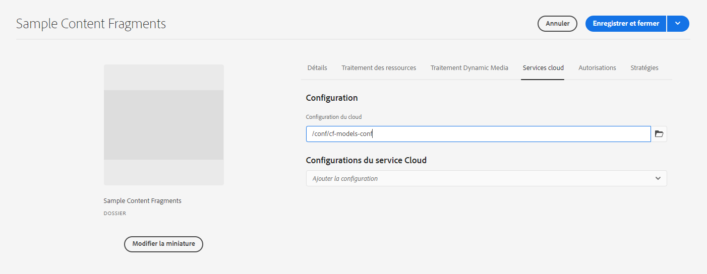

# Fragments de contenu – Explorateur de configurations{#content-fragments-configuration-browser}

Découvrez comment activer une fonctionnalité de fragment de contenu spécifique dans l’explorateur de configurations.

## Activation de la fonctionnalité de fragments de contenu pour votre instance {#enable-content-fragment-functionality-instance}

Avant d’utiliser les fragments de contenu, vous devez utiliser l’**Explorateur de configurations** pour activer les éléments suivants :

* **Modèles de fragment de contenu** – obligatoire
* **Requêtes persistantes GraphQL** – facultatif

>[!CAUTION]
>
>Si vous n’activez pas les **modèles de fragment de contenu** :
>
>* L’option **Créer** ne sera pas disponible pour la création de modèles.
>* Vous ne pourrez pas [sélectionner la configuration Sites pour créer le point d’entrée](/help/headless/graphql-api/graphql-endpoint.md) associé.

Pour activer la fonctionnalité de fragments de contenu, vous devez :

* activer l’utilisation de la fonctionnalité de fragments de contenu par le biais de l’explorateur de configurations ;
* appliquer la configuration à votre dossier de ressources.

### Activation de la fonctionnalité de fragments de contenu dans l’explorateur de configurations {#enable-content-fragment-functionality-in-configuration-browser}

Pour [utiliser certaines fonctionnalités de fragments de contenu,](#creating-a-content-fragment-model) vous **devez** commencer par les activer par le biais de l’**explorateur de configurations** :

>[!NOTE]
>
>Pour plus de détails, voir également [Explorateur de configurations :](/help/implementing/developing/introduction/configurations.md#using-configuration-browser).

>[!NOTE]
>
>[Sous-configurations](/help/implementing/developing/introduction/configurations.md#configuration-resolution) (une configuration imbriquée dans une autre configuration) sont entièrement prises en charge pour une utilisation avec les fragments de contenu, les modèles de fragment de contenu et les requêtes GraphQL.
>
>Il suffit de noter que :
>
>
>* Après la création des modèles dans une sous-configuration, il n’est PAS possible de déplacer ou de copier le modèle vers une autre sous-configuration.
>
>* Un point d’entrée GraphQL est (toujours) basé sur une configuration parent (racine).
>
>* Les requêtes persistantes sont (toujours) enregistrées en fonction de la configuration parent (racine).

1. Accédez à **Outils**, **Général**, puis ouvrez l’**Explorateur de configurations**.

1. Utilisez le bouton **Créer** pour ouvrir la boîte de dialogue.

   1. Spécifiez un **Titre**.
   1. Pour activer leur utilisation, sélectionnez
      * **Modèles de fragment de contenu**
      * **Requêtes persistantes GraphQL**

      

1. Sélectionnez **Créer** pour enregistrer la définition.

<!-- 1. Select the location appropriate to your website. -->

### Application de la configuration à votre dossier {#apply-the-configuration-to-your-folder}

Lorsque la configuration **global** est activé pour la fonctionnalité de fragment de contenu, elle s’applique ensuite à tout dossier de ressources accessible par le biais de **Ressources** console.

Pour utiliser d’autres configurations (c’est-à-dire à l’exclusion de la version globale) avec un dossier de ressources comparable, vous devez définir la connexion. Pour ce faire, utilisez **Configuration** sous l’onglet **Services cloud** des **Propriétés du dossier** du dossier approprié.

