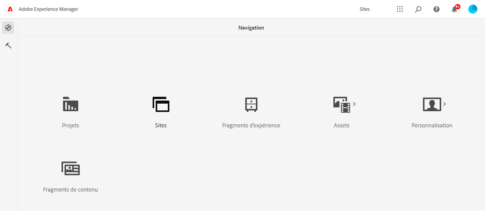
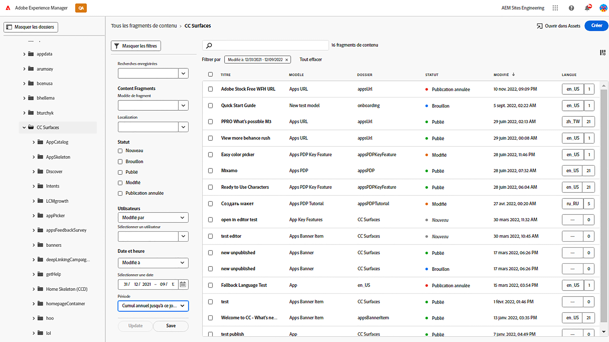
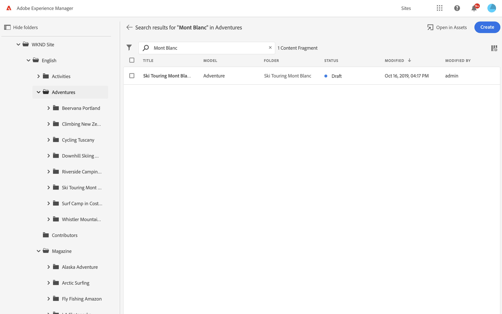

# Console Fragments de contenu  {#content-fragments-console}

Découvrez comment la console Fragments de contenu optimise l’accès à vos fragments de contenu, ce qui vous permet de les créer, de les rechercher et de les gérer en prenant des actions d’administration telles que la publication, l’annulation de la publication et la copie.

La console Fragments de contenu est dédiée à la gestion, à la recherche et à la création de fragments de contenu. Il a été optimisé pour une utilisation dans un contexte sans affichage, mais il est également utilisé lors de la création de fragments de contenu à utiliser dans la création de pages.

>[!NOTE]
>
>Cette console affiche uniquement les fragments de contenu. Il n’affiche pas d’autres types de ressources, tels que des images et des vidéos.

>[!NOTE]
>
>L’accès à vos fragments de contenu est actuellement possible via :
>
>* this **Fragments de contenu** console
>* la valeur **Ressources** console - voir [Gestion des fragments de contenu](/help/assets/content-fragments/content-fragments-managing.md)

La console Fragments de contenu est directement accessible à partir du niveau supérieur de la navigation globale :

Sélection **Fragments de contenu** ouvre la console dans un nouvel onglet.

Vous pouvez constater ici qu’il existe trois principaux domaines :

* Barre d’outils supérieure
   * Fournit une fonctionnalité d’AEM standard
   * Affiche également votre organisation IMS
* Panneau de gauche
   * Ici, vous pouvez masquer ou afficher l’arborescence de dossiers.
   * Vous pouvez sélectionner une branche spécifique de l’arborescence.
* Panneau principal/droit : à partir de là, vous pouvez :
   * Consultez la liste de tous les fragments de contenu dans la branche sélectionnée de l’arborescence.
      * L’emplacement est indiqué par les chemins de navigation ; elles peuvent également être utilisées pour modifier l’emplacement
      * Les fragments de contenu du dossier sélectionné et tous les dossiers enfants s’affichent.
         * Différents champs d’informations sur un fragment de contenu fournissent des liens ; ils peuvent ouvrir le fragment approprié dans l’éditeur.
      * Vous pouvez sélectionner un en-tête de colonne pour trier le tableau en fonction de cette colonne. sélectionner à nouveau pour basculer entre ascendant et descendant
   * **[Créer](#creating-new-content-fragment)** un nouveau fragment de contenu ;
   * [Filtrer](#filtering-fragments) les fragments de contenu en fonction d’une sélection de prédicats et enregistrez le filtre en vue d’une utilisation ultérieure.
   * [Rechercher](#searching-fragments) les fragments de contenu ;
   * Personnaliser la vue du tableau pour afficher les colonnes d’informations sélectionnées
   * Utilisation **Ouvrir dans Assets** pour ouvrir directement l’emplacement actuel dans le **Ressources** console.

      >[!NOTE]
      >
      >Le **Ressources** La console permet d’accéder aux ressources, telles que les images, les vidéos, etc.  Cette console est accessible :
      >
      >* en utilisant la variable **Ouvrir dans Assets** lien (dans la console Fragments de contenu)
      >* directement depuis le volet de navigation global

La sélection d’un fragment spécifique ouvre une barre d’outils axée sur les actions disponibles pour ce fragment. Vous pouvez également sélectionner plusieurs fragments ; la sélection des actions sera adaptée en conséquence.

## Création d’un fragment de contenu {#creating-new-content-fragment}

Sélection **Créer** ouvre la compression **Nouveau fragment de contenu** dialog :

## Filtrage des fragments {#filtering-fragments}

Le panneau Filtre offre les options suivantes :

* une sélection de prédicats qui peuvent être sélectionnés et combinés ;
* l&#39;opportunité **Enregistrer** votre configuration
* l’option permettant de récupérer un filtre de recherche enregistré pour réutilisation

## Recherche de fragments {#searching-fragments}

La zone de recherche prend en charge la recherche de texte intégral. Saisissez vos termes de recherche dans la zone de recherche :

Fournit les résultats sélectionnés :

La zone de recherche permet également d’accéder rapidement à **Fragments de contenu récents** et **Recherches enregistrées**:

