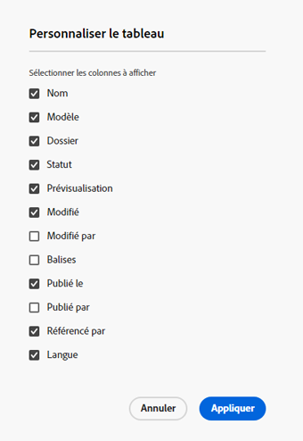

# Console Fragments de contenu  {#content-fragments-console}

Découvrez comment la console Fragments de contenu optimise l’accès à vos fragments de contenu, ce qui vous permet de les créer, de les rechercher et de les gérer en prenant des actions administratives telles que la publication, l’annulation de la publication et la copie.

La console Fragments de contenu est dédiée à la gestion, à la recherche et à la création de fragments de contenu. Il a été optimisé pour une utilisation dans un contexte sans affichage, mais il est également utilisé lors de la création de fragments de contenu à utiliser dans la création de pages.

>[!NOTE]
>
>Cette console affiche uniquement les fragments de contenu. Il n’affiche pas d’autres types de ressources, tels que des images et des vidéos.

>[!NOTE]
>
>L’accès à vos fragments de contenu est actuellement possible via :
>
>* this **Fragments de contenu** console
>* la valeur **Ressources** console - voir [Gestion des fragments de contenu](/help/assets/content-fragments/content-fragments-managing.md)

>[!NOTE]
>
>Une sélection de [des raccourcis clavier peuvent être utilisés dans cette console.](/help/sites-cloud/administering/content-fragments/content-fragments-console-keyboard-shortcuts.md).

La console Fragments de contenu est directement accessible à partir du niveau supérieur de la navigation globale :

## Structure et gestion de base de la console {#basic-structure-handling-content-fragments-console}

Sélection **Fragments de contenu** ouvre la console dans un nouvel onglet.

Vous pouvez constater ici qu’il existe trois principaux domaines :

* Barre d’outils supérieure
   * Fournit une fonctionnalité d’AEM standard
   * Affiche également votre organisation IMS
* Panneau de gauche
   * Ici, vous pouvez masquer ou afficher l’arborescence de dossiers.
   * Vous pouvez sélectionner une branche spécifique de l’arborescence.
* Panneau principal/droit : à partir de là, vous pouvez :
   * Consultez la liste de tous les fragments de contenu dans la branche sélectionnée de l’arborescence :
      * L’emplacement est indiqué par les chemins de navigation ; elles peuvent également être utilisées pour modifier l’emplacement
      * Les fragments de contenu du dossier sélectionné et tous les dossiers enfants s’affichent :
         * [Divers champs d&#39;information](#selectuse-available-columns) à propos d’un fragment de contenu fournit des liens ; en fonction du champ, ces éléments peuvent :
            * Ouvrez le fragment approprié dans l’éditeur.
            * Affichage des informations sur les références
            * Afficher des informations sur les versions linguistiques du fragment
         * Vous pouvez [sélectionnez un ou plusieurs fragments de contenu pour afficher les actions disponibles.](#actions-selected-content-fragment)
      * Vous pouvez sélectionner un en-tête de colonne pour trier le tableau en fonction de cette colonne. sélectionner à nouveau pour basculer entre ascendant et descendant
   * **[Créer](#creating-new-content-fragment)** un nouveau fragment de contenu ;
   * [Filtrer](#filtering-fragments) les fragments de contenu en fonction d’une sélection de prédicats et enregistrez le filtre en vue d’une utilisation ultérieure.
   * [Rechercher](#searching-fragments) les fragments de contenu ;
   * [Personnaliser la vue du tableau pour afficher les colonnes d’informations sélectionnées](#selectuse-available-columns)
   * Utilisation **Ouvrir dans Assets** pour ouvrir directement l’emplacement actuel dans le **Ressources** console

      >[!NOTE]
      >
      >Le **Ressources** La console permet d’accéder aux ressources, telles que les images, les vidéos, etc.  Cette console est accessible :
      >
      >* en utilisant la variable **Ouvrir dans Assets** lien (dans la console Fragments de contenu)
      >* directement depuis le volet de navigation global

## Actions pour un fragment de contenu (sélectionné) {#actions-selected-content-fragment}

La sélection d’un fragment spécifique ouvre une barre d’outils axée sur les actions disponibles pour ce fragment. Vous pouvez également sélectionner plusieurs fragments ; la sélection des actions sera adaptée en conséquence.

* **Ouvrez**
* **Publier** (et **Annuler la publication**)
* **Copier**
* **Déplacer**
* **Renommer**
* **Supprimer**

>[!NOTE]
>
>Des actions telles que Publier, Annuler la publication, Supprimer, Déplacer, Renommer, Copier, déclenchent une tâche asynchrone. La progression de cette tâche peut être surveillée via l’interface utilisateur des tâches asynchrones AEM.

## Informations fournies sur vos fragments de contenu {#information-content-fragments}

Le panneau principal/droit (mode Tableau) de la console fournit diverses informations sur vos fragments de contenu. Certains éléments fournissent également des liens directs vers d’autres actions et/ou informations :

* **Nom**
   * Fournit un lien pour ouvrir le fragment dans l’éditeur.
* **Modèle**
   * Fournit un lien pour ouvrir le fragment dans l’éditeur.
* **Dossier**
   * Fournit un lien pour ouvrir le dossier dans la console.
Placez le pointeur de la souris sur le nom du dossier pour afficher le chemin d’accès JCR.
* **État**
   * Informations uniquement
* **Modifié**
   * Informations uniquement
* **Modifié par**
   * Informations uniquement
* **Publié sur**
   * Informations uniquement
* **Publié par**
   * Informations uniquement
* **Référencé par**

   * Fournit un lien qui ouvre une boîte de dialogue répertoriant toutes les références parentes de ce fragment ; notamment le référencement de fragments de contenu, de fragments d’expérience et de pages. Pour ouvrir une référence spécifique, cliquez sur le bouton **Titre** dans la boîte de dialogue.

      

* **Langue**

   * Indique les paramètres régionaux du fragment de contenu, ainsi que le nombre total de copies de langue/paramètres régionaux associées au fragment de contenu.

      

      * Cliquez/appuyez sur le décompte pour ouvrir une boîte de dialogue qui affiche toutes les copies de langue. Pour ouvrir une copie de langue spécifique, cliquez sur le bouton **Titre** dans la boîte de dialogue.

         

## Sélectionner les colonnes disponibles {#select-available-columns}

Comme pour d’autres consoles, vous pouvez configurer les colonnes visibles et disponibles pour une action :

Vous y trouverez une liste de colonnes que vous pouvez masquer ou afficher :

## Création d’un fragment de contenu {#creating-new-content-fragment}

Sélection **Créer** ouvre la compression **Nouveau fragment de contenu** dialog :

## Filtrage des fragments {#filtering-fragments}

Le panneau Filtre offre les options suivantes :

* une sélection de prédicats qui peuvent être sélectionnés et combinés ;
* l&#39;opportunité **Enregistrer** votre configuration
* l’option permettant de récupérer un filtre de recherche enregistré pour réutilisation

## Recherche de fragments {#searching-fragments}

La zone de recherche prend en charge la recherche de texte intégral. Saisissez vos termes de recherche dans la zone de recherche :

Fournit les résultats sélectionnés :

La zone de recherche permet également d’accéder rapidement à **Fragments de contenu récents** et **Recherches enregistrées**:

