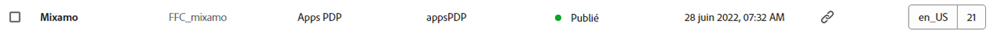
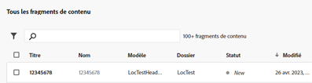
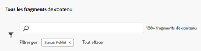

# Console Fragments de contenu  {#content-fragments-console}

Découvrez comment la console Fragments de contenu optimise l’accès à vos fragments de contenu, ce qui vous permet de les créer, de les rechercher et de les gérer à travers des actions administratives telles que la publication, la dépublication et la copie.

La console Fragments de contenu est dédiée à la gestion, à la recherche et à la création de fragments de contenu. Optimisée pour une utilisation dans un contexte headless, elle est également utilisée lors de la création de fragments de contenu à utiliser dans la création de pages.

>[!NOTE]
>
>Cette console affiche uniquement les fragments de contenu. Elle n’affiche pas d’autres types de ressources, telles des images et des vidéos.

>[!NOTE]
>
>L’accès à vos fragments de contenu est actuellement possible via :
>
>* Cette console **Fragments de contenu**.
>* La console **Ressources**. Voir la section [Gérer des fragments de contenu](/help/assets/content-fragments/content-fragments-managing.md).

>[!NOTE]
>
>Une sélection de [raccourcis clavier peuvent être utilisés dans cette console](/help/sites-cloud/administering/content-fragments/content-fragments-console-keyboard-shortcuts.md).

>[!NOTE]
>
>Votre équipe de projet peut personnaliser la console en cas de besoin. Voir [Personnalisation de la console Fragments de contenu](/help/implementing/developing/extending/content-fragment-console-customizing.md) pour plus de détails.

La console Fragments de contenu est directement accessible à partir du niveau supérieur de la navigation globale :

## Structure et gestion de base de la console {#basic-structure-handling-content-fragments-console}

Sélectionner **Fragments de contenu** ouvre la console dans un nouvel onglet.

Vous pouvez constater ici qu’il existe trois zones principales :

* La barre d’outils supérieure :
   * Fournit les fonctionnalités AEM standard.
   * Affiche également votre organisation IMS.
* Le panneau de gauche :
   * Ici, vous pouvez masquer ou afficher l’arborescence de dossiers.
   * Vous pouvez sélectionner une branche spécifique de l’arborescence.
   * Il peut être redimensionné pour afficher les dossiers imbriqués.
* Le panneau principal/droit, à partir duquel vous pouvez :
   * Consulter la liste de tous les fragments de contenu dans la branche sélectionnée de l’arborescence. :
      * L’emplacement est indiqué par les chemins de navigation. Ceux-ci peuvent également être utilisés pour modifier l’emplacement.
      * Les fragments de contenu du dossier sélectionné et tous les dossiers enfants s’affichent. :
         * [Plusieurs champs d’information](#selectuse-available-columns) à propos d’un fragment de contenu fournissent des liens ; en fonction du champ, ces éléments peuvent :
            * Ouvrir le fragment approprié dans l’éditeur
            * Afficher des informations à propos des références
            * Afficher des informations sur les versions linguistiques du fragment
      * Lorsque vous placez le pointeur de la souris sur les en-têtes de colonne, un sélecteur d’actions déroulant et des curseurs de largeur s’affichent. Ils vous permettent d’effectuer les opérations suivantes :
         * Trier : sélectionnez l’action appropriée pour trier par ordre croissant ou décroissant.
Le tableau entier sera trié en fonction de cette colonne. Le tri n’est disponible que sur les colonnes appropriées.
         * Redimensionnez la colonne à l’aide de l’action ou des curseurs de largeur.

## Actions {#actions}

Dans la console, vous pouvez utiliser différentes actions, directement ou après la sélection d’un fragment spécifique :

* Diverses actions sont directement [disponible à partir de la console](#available-actions)
* Vous pouvez [sélectionnez un ou plusieurs fragments de contenu pour afficher les actions appropriées.](#actions-selected-content-fragment)

### Actions (non sélectionnées) {#actions-unselected}

Certaines actions sont disponibles à partir de la console, sans sélectionner de fragment de contenu spécifique :

* **[Créer](/help/sites-cloud/administering/content-fragments/content-fragments-managing.md#creating-a-content-fragment)** un fragment de contenu.
* [Filtrer](#filtering-fragments) les fragments de contenu en fonction d’une sélection de prédicats et enregistrer le filtre en vue d’une utilisation ultérieure.
* [Rechercher](#searching-fragments) les fragments de contenu.
* [Personnaliser la vue du tableau pour afficher les colonnes d’informations sélectionnées.](#select-available-columns)
* Utiliser **Ouvrir dans Assets** pour ouvrir directement l’emplacement actuel dans la console **Ressources**

   >[!NOTE]
   >
   >La console **Ressources** permet d’accéder aux ressources, telles que les images, les vidéos, etc.  Il est possible d’accéder à cette console :
   >
   >* en utilisant le lien **Ouvrir dans Assets** (dans la console Fragments de contenu) ;
   >* directement depuis le volet de navigation globale.

### Actions pour un fragment de contenu (sélectionné) {#actions-selected-content-fragment}

La sélection d’un fragment spécifique ouvre une barre d’outils axée sur les actions disponibles pour ce fragment. Vous pouvez également sélectionner plusieurs fragments. La sélection des actions sera adaptée en conséquence.

* **Ouvrir**
* **[Publier](/help/sites-cloud/administering/content-fragments/content-fragments-managing.md#publishing-and-previewing-a-fragment)** (et **[Dépublier](/help/sites-cloud/administering/content-fragments/content-fragments-managing.md#unpublishing-a-fragment)**)
* **Copier**
* **Déplacer**
* **Renommer**
* **[Supprimer](/help/sites-cloud/administering/content-fragments/content-fragments-managing.md#deleting-a-fragment)**

>[!NOTE]
>
>Des actions telles que Publier, Dépublier, Supprimer, Déplacer, Renommer ou Copier déclenchent un traitement asynchrone. Il est possible de surveiller la progression de ce traitement via l’interface utilisateur des traitements asynchrones AEM.

## Les informations fournies sur vos fragments de contenu {#information-content-fragments}

Le panneau principal/droit (vue du tableau) de la console fournit diverses informations sur vos fragments de contenu. Certains éléments fournissent également des liens directs vers d’autres actions et/ou informations :

* **Nom**
   * Fournit un lien pour ouvrir le fragment dans l’éditeur.
* **Modèle**
   * Fournit un lien pour ouvrir le fragment dans l’éditeur.
* **Dossier**
   * Fournit un lien pour ouvrir le dossier dans la console.
Placez le pointeur de la souris sur le nom du dossier pour afficher le chemin d’accès JCR.
* **Statut**
   * Informations uniquement
* **Aperçu**
   * Informations uniquement:
      * **Synchronisation**: Le fragment de contenu est synchronisé sur la **Auteur** et **Aperçu** services.
      * **Désynchronisé**: Le fragment de contenu n’est pas synchronisé sur la page **Auteur** et ****Aperçu** services. Vous devez **Publier** to **Aperçu** pour s’assurer que les deux instances redeviennent synchronisées.
      * blank: Le fragment de contenu n’existe pas sur le **Aperçu** service.
* **Modifié**
   * Informations uniquement
* **Modifié par**
   * Informations uniquement
* **Publié sur**
   * Informations uniquement
* **Publié par**
   * Informations uniquement
* **Référencé par**

   * Fournit un lien qui ouvre une boîte de dialogue répertoriant toutes les références parentes de ce fragment, notamment le référencement de fragments de contenu, de fragments d’expérience et de pages. Pour ouvrir une référence spécifique, cliquez sur le bouton **Titre** dans la boîte de dialogue.

      

* **Langue**

   * Indique les paramètres régionaux du fragment de contenu, ainsi que le nombre total de copies de langue/paramètres régionaux associées au fragment de contenu.

      

      * Cliquez/appuyez sur le décompte pour ouvrir une boîte de dialogue qui affiche toutes les copies de langue. Pour ouvrir une copie de langue spécifique, cliquez sur le **Titre** dans la boîte de dialogue.

         

## Sélectionner les colonnes disponibles {#select-available-columns}

Comme pour d’autres consoles, vous pouvez configurer les colonnes visibles et disponibles pour une action :

Vous y trouverez une liste de colonnes que vous pouvez masquer ou afficher :

## Filtrer des fragments {#filtering-fragments}

Le panneau de filtrage offre les options suivantes :

* une sélection de prédicats ; un ou plusieurs prédicats peuvent être sélectionnés et combinés pour créer le filtre.
* l’opportunité d’**Enregistrer** votre configuration ;
* l’option permettant de récupérer un filtre de recherche enregistré pour réutilisation.

### Filtrage rapide {#fast-filtering}

Vous pouvez également sélectionner un prédicat en cliquant sur une valeur de colonne spécifique dans la liste. Vous pouvez sélectionner une ou plusieurs valeurs pour combiner des prédicats.

Par exemple, sélectionnez **Publié** dans la colonne **Statut** :

>[!NOTE]
>
>Le filtrage rapide est uniquement pris en charge pour les colonnes **Modèle**, **Statut**, **Modifié par**, et **Publié par**.

Une fois cette option sélectionnée, elle s’affiche sous forme de prédicat de filtre et la liste est filtrée en conséquence :

## Rechercher des fragments {#searching-fragments}

La zone de recherche prend en charge la recherche de texte intégral. Saisissez vos termes de recherche dans la zone de recherche :

Fournit les résultats sélectionnés :

La zone de recherche permet également d’accéder rapidement aux **Fragments de contenu récents** et aux **Recherches enregistrées** :

