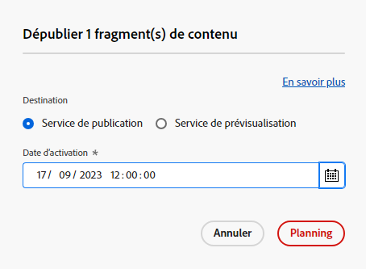

# Gérer des fragments de contenu {#managing-content-fragments}

Découvrez comment utiliser la console **Fragments de contenu** pour gérer vos fragments de contenu AEM. Ils peuvent être utilisés pour la création de pages ou comme base de votre contenu headless.

Après avoir défini vos [modèles de fragment de contenu](#creating-a-content-model), vous pouvez les utiliser pour [créer vos fragments de contenu](#creating-a-content-fragment).

L’[éditeur de fragment de contenu](#opening-the-fragment-editor) fournit différents [modes](#modes-in-the-content-fragment-editor) vous permettant :

* de [modifier du](#editing-the-content-of-your-fragment) contenu et de [gérer des variations ;](#creating-and-managing-variations-within-your-fragment)
* [d’annoter votre fragment ;](/help/sites-cloud/administering/content-fragments/content-fragments-variations.md#annotating-a-content-fragment)
* [d’associer du contenu à votre fragment ;](#associating-content-with-your-fragment)
* [de configurer des métadonnées ;](#viewing-and-editing-the-metadata-properties-of-your-fragment)
* [d’affcher l’arborescence de la structure ;](/help/sites-cloud/administering/content-fragments/content-fragments-structure-tree.md)
* [de générer un aperçu de la représentation JSON.](/help/sites-cloud/administering/content-fragments/content-fragments-json-preview.md)

>[!NOTE]
>
>Il est possible d’utiliser les fragments de contenu comme suit :
>
>* lors de la création de pages ; voir [Création de pages avec des fragments de contenu](/help/sites-cloud/authoring/fundamentals/content-fragments.md).
>* pour la [Diffusion de contenu découplé utilisant des fragments de contenu avec GraphQL](/help/sites-cloud/administering/content-fragments/content-fragments-graphql.md).

>[!NOTE]
>
>Les fragments de contenu sont stockés sous forme de **ressources**. Ils sont principalement gérés à partir de la console **Fragments de contenu** mais peuvent également être gérés à partir de la console [Ressources](/help/assets/content-fragments/content-fragments-managing.md).

## Console Fragments de contenu {#content-fragments-console}

La console Fragments de contenu permet d’accéder directement à vos fragments et aux tâches qui s’y rapportent. Pour plus d’informations, consultez la section suivante :

* [Structure de base et gestion de la console Fragments de contenu](/help/sites-cloud/administering/content-fragments/content-fragments-console.md#basic-structure-handling-content-fragments-console)

* [Les informations fournies sur vos fragments de contenu](/help/sites-cloud/administering/content-fragments/content-fragments-console.md#information-content-fragments)

* [Actions pour un fragment de contenu dans la console Fragments de contenu](/help/sites-cloud/administering/content-fragments/content-fragments-console.md#actions-selected-content-fragment)

* [Personnaliser les colonnes disponibles dans la console Fragments de contenu](/help/sites-cloud/administering/content-fragments/content-fragments-console.md#select-available-columns)

* [Rechercher et filtrer dans la console Fragments de contenu](/help/sites-cloud/administering/content-fragments/content-fragments-console.md#filtering-fragments)

## Créer des fragments de contenu {#creating-content-fragments}

### Création d’un modèle de contenu {#creating-a-content-model}

Les [modèles de fragments de contenu](/help/sites-cloud/administering/content-fragments/content-fragments-models.md) peuvent être activés et créés, avant de créer des fragments de contenu avec le contenu structuré.

### Création d’un fragment de contenu {#creating-a-content-fragment}

Pour créer un fragment de contenu :

1. Dans la console **Fragments de contenu**, sélectionnez **Créer** (en haut à droite).

   >[!NOTE]
   >
   >Pour prédéfinir l’emplacement du nouveau fragment, vous pouvez accéder au dossier dans lequel vous souhaitez créer le fragment ou spécifier l’emplacement pendant le processus de création.

1. La boîte de dialogue **Nouveau fragment de contenu** s’ouvre. À partir d’ici, vous pouvez spécifier les éléments suivants :

   * **Emplacement** : saisie automatique avec l’emplacement actuel, mais vous pouvez sélectionner un autre emplacement si nécessaire.
   * **Modèle de fragment de contenu** : sélectionnez le modèle à utiliser comme base du fragment dans la liste déroulante.
   * **Titre**
   * **Nom** : auto-renseignée en fonction de la variable **Titre**, mais vous pouvez la modifier si nécessaire.
   * **Description**

   

1. Sélectionnez **Créer** ou **Créer et ouvrir** pour conserver votre définition.

## Statuts des fragments de contenu {#statuses-content-fragments}

Au cours de son existence, un fragment de contenu peut avoir plusieurs statuts, comme indiqué dans la [console Fragments de contenu](/help/sites-cloud/administering/content-fragments/content-fragments-console.md) :

* **Nouveau**
Un nouveau fragment de contenu a été créé, mais n’a jamais été modifié, ni ouvert, dans l’éditeur de fragment de contenu.
* **Brouillon**
Quelqu’un a modifié ou ouvert le (nouveau) fragment de contenu dans l’éditeur de fragment de contenu, mais il n’a pas encore été publié.
* **Publié**
Le fragment de contenu a été publié.
* **Modifié**
Le fragment de contenu a été modifié après sa publication (mais avant de publier la modification).
* **Dépublié**
La publication du fragment de contenu a été annulée.

## Ouverture de l’éditeur de fragments {#opening-the-fragment-editor}

Pour ouvrir votre fragment à des fins de modification :

>[!CAUTION]
>
>Pour modifier un fragment de contenu, vous devez disposer des [autorisations appropriées](/help/implementing/developing/extending/content-fragments-customizing.md#asset-permissions). Contactez votre administrateur système si vous rencontrez des problèmes.

1. Utilisez la console **Fragments de contenu** afin de naviguer jusqu’à l’emplacement de votre fragment de contenu.
1. Ouvrez le fragment à modifier en le sélectionnant, puis en cliquant sur **Ouvrir** dans la barre d’outils.

1. L’éditeur de fragment s’ouvre alors. Apportez les modifications nécessaires :

   

1. Après avoir apporté vos modifications, cliquez sur **Enregistrer**, **Enregistrer et fermer** ou **Fermer** selon les besoins.

   >[!NOTE]
   >
   >L’option **Enregistrer et fermer** est disponible dans la liste déroulante **Enregistrer**.

   >[!NOTE]
   >
   >Les options **Enregistrer et fermer** et **Fermer** vous font quitter l’éditeur. Pour plus d’informations sur le fonctionnement des différentes options avec les fragments de contenu, voir [Enregistrer, Fermer et Versions](#save-close-and-versions).

## Modes et actions dans l’éditeur de fragment de contenu {#modes-actions-content-fragment-editor}

L’éditeur de fragments de contenu comporte différents modes et actions.

### Modes dans l’éditeur de fragment de contenu {#modes-in-the-content-fragment-editor}

Naviguez entre les différents modes en utilisant les icônes du panneau latéral :

* Variations : [Modification du contenu](#editing-the-content-of-your-fragment) et [Gestion des variations](#creating-and-managing-variations-within-your-fragment)

* [Annotations](/help/sites-cloud/administering/content-fragments/content-fragments-variations.md#annotating-a-content-fragment)
* [Contenu associé](#associating-content-with-your-fragment)
* [Métadonnées](#viewing-and-editing-the-metadata-properties-of-your-fragment)
* [Arborescence de la structure](/help/sites-cloud/administering/content-fragments/content-fragments-structure-tree.md)
* [Aperçu](/help/sites-cloud/administering/content-fragments/content-fragments-json-preview.md)

### Barre d’outils d’actions dans l’éditeur de fragment de contenu {#toolbar-actions-in-the-content-fragment-editor}

Certaines fonctions de la barre d’outils supérieure sont disponibles dans différents modes :

* Un message s’affiche lorsque le fragment est déjà référencé sur une page de contenu. Vous pouvez **Fermer** le message.

* Le panneau latéral peut être masqué/affiché en appuyant sur l’icône **Activer/désactiver le panneau latéral**.

* Sous le nom du fragment, vous pouvez voir le nom du [Modèle de fragment de contenu](/help/sites-cloud/administering/content-fragments/content-fragments-models.md) utilisé pour créer le fragment actif :

   * Le nom est également un lien servant à ouvrir l’éditeur de modèles.

* Voir le statut du fragment, par exemple, les informations relatives à la date et à l’heure de création, de modification ou de publication. Le statut est également codé par couleur :

   * **Nouveau** : gris
   * **Version préliminaire** : bleu
   * **Publié** : vert
   * **Modifié** : orange
   * **Désactivé** : rouge

* **Enregistrer** permet d’accéder à l’option **Enregistrer et fermer**.

* La liste déroulante marquée des trois points (**...**) donne accès à des actions supplémentaires :
   * **Mettre à jour les références de page**
      * Cette option met à jour toutes les références de la page.
   * **[Publication rapide](/help/assets/manage-publication.md#quick-publish)**
   * **[Gérer la publication](/help/assets/manage-publication.md#manage-publication)**

<!--
This updates any page references and ensures that the Dispatcher is flushed as required. -->

## Enregistrer, Fermer et Versions {#save-close-and-versions}

>[!NOTE]
>
>Les versions peuvent également être [créées, comparées et rétablies à partir de la chronologie](/help/sites-cloud/administering/content-fragments/content-fragments-managing.md#timeline-for-content-fragments).

L’éditeur possède différentes options :

* **Enregistrer** et **Enregistrer et fermer**

   * **Enregistrer** enregistrera les dernières modifications et vous resterez dans l’éditeur.
   * **Enregistrer et fermer** enregistrer les dernières modifications et vous permet de quitter l’éditeur.

  >[!CAUTION]
  >
  >Pour modifier un fragment de contenu, vous devez disposer des [autorisations appropriées](/help/implementing/developing/extending/content-fragments-customizing.md#asset-permissions). Contactez votre administrateur système si vous rencontrez des problèmes.

  >[!NOTE]
  >
  >Pour rester dans l’éditeur, il suffit d’apporter une série de modifications avant d’enregistrer.

  >[!CAUTION]
  >
  >En plus de simplement enregistrer vos modifications, ces actions mettent également à jour les références éventuelles et s’assurent que le Dispatcher est nettoyé si nécessaire. Le traitement de ces modifications peut prendre du temps. Cela peut avoir un impact sur les performances d’un système volumineux/complexe/lourdement chargé.
  >
  >Gardez ce temps de processus à l’esprit lorsque vous utilisez **Enregistrer et fermer**, puis renseignez rapidement l’éditeur de fragments pour effectuer et enregistrer d’autres modifications.

* **Fermer**

  Quitte l’éditeur sans enregistrer les dernières modifications (c’est-à-dire depuis la dernière **Enregistrer**).

Lorsque vous modifiez votre fragment de contenu, AEM crée automatiquement des versions pour que le contenu précédent puisse être restauré si vous annulez les modifications (en cliquant sur **Fermer** sans enregistrer) :

1. Lorsqu’un fragment de contenu est ouvert pour modification, AEM vérifie l’existence d’un jeton basé sur les cookies indiquant s’il existe une *session de modification* :

   1. Si le jeton est trouvé, le fragment est considéré comme faisant partie de la session de modification existante.
   2. Si le jeton n’est *pas* disponible et que l’utilisateur ou l’utilisatrice commence à modifier le contenu, une version est créée et un jeton est envoyé au client pour cette nouvelle session de modification, où il est enregistré dans un cookie.

2. Lors d’une session de modification *active*, le contenu en cours de modification est automatiquement enregistré toutes les 600 secondes (par défaut).

   >[!NOTE]
   >
   >L’intervalle d’enregistrement automatique est configurable à l’aide du mécanisme `/conf`.
   >
   >Valeur par défaut, voir :
   >  `/libs/settings/dam/cfm/jcr:content/autoSaveInterval`

3. Si l’utilisateur choisit d’annuler la modification, la version créée au début de la session de modification est restaurée et le jeton est supprimé afin de mettre fin à la session de modification.
4. Si l’utilisateur choisit d’**enregistrer** les modifications apportées, les éléments/variations mis à jour sont conservés et le jeton est supprimé pour mettre fin à la session de modification.

## Modification du contenu du fragment {#editing-the-content-of-your-fragment}

Une fois que vous avez ouvert le fragment, vous pouvez utiliser l’onglet [Variations](/help/sites-cloud/administering/content-fragments/content-fragments-variations.md) pour créer votre contenu.

## Création et gestion de variations dans un fragment {#creating-and-managing-variations-within-your-fragment}

Une fois que vous avez créé le contenu maître, vous pouvez créer et gérer des [Variations](/help/sites-cloud/administering/content-fragments/content-fragments-variations.md) de ce contenu.

## Association de contenu au fragment {#associating-content-with-your-fragment}

Vous pouvez également [associer du contenu](/help/sites-cloud/administering/content-fragments/content-fragments-assoc-content.md) à un fragment. Cela fournit une connexion de sorte que les ressources (c’est-à-dire les images) puissent être (éventuellement) utilisées avec le fragment lorsqu’il est ajouté à une page de contenu.

## Affichage et modification des métadonnées (propriétés) du fragment {#viewing-and-editing-the-metadata-properties-of-your-fragment}

Vous pouvez afficher et modifier les propriétés d’un fragment à l’aide de l’onglet [Métadonnées](/help/sites-cloud/administering/content-fragments/content-fragments-metadata.md).

## Publication et aperçu d’un fragment {#publishing-and-previewing-a-fragment}

Vous pouvez publier vos fragments de contenu sur :

* la valeur **[Service de publication](/help/overview/architecture.md#runtime-architecture)** - pour un accès public complet

* la valeur **[Service de prévisualisation](/help/overview/architecture.md#runtime-architecture)** - pour prévisualiser le contenu avant sa disponibilité complète

  >[!CAUTION]
  >
  Publication de fragments de contenu dans le **Service de prévisualisation** n’est disponible que depuis le [Console Fragments de contenu](/help/sites-cloud/administering/content-fragments/content-fragments-console.md); en utilisant la variable **Publier** action.

  >[!NOTE]
  >
  Pour plus d’informations sur les environnements d’aperçu, voir :
  >
  * [Gestion des environnements](/help/implementing/cloud-manager/manage-environments.md#access-preview-service)
  * [Configuration des paramètres OSGi pour le niveau d’aperçu](/help/implementing/preview-tier/preview-tier-configuring-osgi.md#configuring-osgi-settings-for-the-preview-tier)
  * [Débogage de l’aperçu à l’aide de Developer Console](/help/implementing/preview-tier/preview-tier-configuring-osgi.md#debugging-preview-using-the-developer-console)

Pour publier vos fragments de contenu à l’aide du **Publier** dans la barre d’outils de la fonction [Console Fragments de contenu](/help/sites-cloud/administering/content-fragments/content-fragments-console.md#actions-selected-content-fragment):

>[!CAUTION]
>
Si votre fragment est basé sur un modèle, vous devez vous assurer que le [modèle a été publié](/help/sites-cloud/administering/content-fragments/content-fragments-models.md#publishing-a-content-fragment-model).
>
Si vous publiez un fragment de contenu pour lequel le modèle n’a pas encore été publié, une liste de sélection l’indique et le modèle est publié avec le fragment.

1. Sélectionnez un ou plusieurs de vos fragments dans la liste.

1. Dans la barre d’outils, sélectionnez **Publier** puis l’un des éléments suivants pour ouvrir la boîte de dialogue appropriée :

   * **Maintenant** - sélectionnez l’une des options suivantes : **Service de publication**, ou la variable **Service Preview**; après confirmation, le fragment est publié immédiatement.
   * **Planification** - en plus du service requis, vous pouvez également sélectionner la date et l’heure de publication du fragment.

   Si nécessaire, vous devez spécifier les références à publier. Par défaut, les références sont également publiées dans le service Preview pour s’assurer qu’il n’y a aucune coupure dans le contenu.
Par exemple, pour une requête de publication planifiée :
   

1. Confirmez l’action de publication.

Vous pouvez également publier sur le **Service de publication** de la [Éditeur de fragment de contenu](#toolbar-actions-in-the-content-fragment-editor) en utilisant :
* **Publication rapide**
* **Gérer la publication**

>[!NOTE]
>
Après vous [publier une page qui utilise le fragment ;](/help/sites-cloud/authoring/fundamentals/content-fragments.md#publishing), le fragment est répertorié dans les références de page.

>[!CAUTION]
>
Une fois qu’un fragment est publié, référencé ou les deux, AEM affiche un avertissement lorsqu’un auteur ouvre à nouveau le fragment en vue de le modifier. L’auteur est averti que les modifications apportées au fragment vont également affecter les pages référencées.

## Dépublication d’un fragment {#unpublishing-a-fragment}

Pour annuler la publication de fragments de contenu, sélectionnez un ou plusieurs fragments, puis **Annuler la publication** dans la barre d’outils de la fonction [Console Fragments de contenu](/help/sites-cloud/administering/content-fragments/content-fragments-console.md#actions-selected-content-fragment). Vous pouvez sélectionner **Maintenant** ou **Planifié**.

Lorsque la boîte de dialogue correspondante s’ouvre, vous pouvez sélectionner le service approprié :

>[!NOTE]
>
Le **Annuler la publication** L’action n’est visible que lorsque des fragments publiés sont disponibles.

>[!CAUTION]
>
Si le fragment est déjà référencé à partir d’un autre fragment ou d’une page, alors un message d’avertissement s’affiche et vous devez confirmer que vous souhaitez poursuivre.

## Suppression d’un fragment {#deleting-a-fragment}

Pour supprimer un fragment :

1. Dans la console **Fragments de contenu**, naviguez jusqu’à l’emplacement de votre fragment de contenu.
2. Sélectionnez le fragment.

   >[!NOTE]
   >
   L’action **Supprimer** n’est pas proposée comme action rapide.

3. Sélectionnez **Supprimer** dans la barre d’outils.
4. Confirmez l’action **Supprimer**.

   >[!CAUTION]
   >
   Si le fragment est déjà référencé à partir d’un autre fragment ou d’une page, un message d’avertissement s’affiche et vous devez confirmer que vous souhaitez procéder à une **suppression forcée**. Le fragment, ainsi que son composant de fragment de contenu, sont supprimés de toutes les pages de contenu.

## Recherche des références parentes du fragment {#parent-references-fragment}

Les détails des références parentes sont accessibles à partir de la colonne **Références** de la [Console Fragments de contenu](/help/sites-cloud/administering/content-fragments/content-fragments-console.md#information-content-fragments).

## Recherche des copies de langue du fragment {#language-copies-fragment}

Les détails des copies de langue sont accessibles à partir de la colonne **Langue** de la [Console Fragments de contenu](/help/sites-cloud/administering/content-fragments/content-fragments-console.md#information-content-fragments).

## Chronologie pour les fragments de contenu {#timeline-for-content-fragments}

>[!NOTE]
>
Cette fonctionnalité n’est disponible que dans la console **Ressources**.

Outre les options standard, la [Chronologie](/help/assets/manage-digital-assets.md#timeline) fournit les informations et les actions spécifiques aux fragments de contenu :

* Affichage d’informations sur les versions, les commentaires et les annotations
* Actions pour les versions

   * **[Revenir à cette version](#reverting-to-a-version)** (sélectionner un fragment existant, puis une version spécifique)

   * **[Comparer à actuel](#comparing-fragment-versions)** (sélectionner un fragment existant, puis une version spécifique)

   * Ajouter une **étiquette** et/ou un **commentaire** (sélectionner un fragment existant, puis une version spécifique)

   * **Enregistrer comme version** (sélectionner un fragment existant, puis la flèche vers le haut située en bas du journal)

* Actions pour les annotations

   * **Supprimer**

>[!NOTE]
>
Les commentaires sont les suivants :
>
* Fonctionnalité standard de toutes les ressources
* Créé dans le journal
* Lié à la ressource de fragment
>
Les annotations (pour les fragments de contenu) sont les suivantes :
>
* Entré dans l’éditeur de fragments
* Spécifique à un segment de texte sélectionné dans le fragment
>

Par exemple :

## Comparaison des versions de fragments {#comparing-fragment-versions}

>[!NOTE]
>
Cette fonctionnalité n’est disponible que dans la console **Ressources**.

L’action **Comparer avec la version actuelle** est disponible à partir du [Journal](/help/sites-cloud/administering/content-fragments/content-fragments-managing.md#timeline-for-content-fragments) après avoir sélectionné une version spécifique.

Cette action ouvre :

* la version **actuelle** (la plus récente) (à gauche) ;

* la version sélectionnée **v&lt;*x.y*>** (à droite).

Elles sont affichées côte à côte, où :

* les différences sont mises en surbrillance ;

   * le texte supprimé est en rouge ;
   * le texte inséré est en vert ;
   * le texte remplacé est en bleu.

* L’icône Plein écran vous permet d’ouvrir l’une des versions seule puis de basculer à nouveau sur la vue parallèle.
* Vous pouvez **rétablir** la version spécifique
* **Terminé** vous ramène à la console.

>[!NOTE]
>
Vous ne pouvez pas modifier le contenu d’un fragment lors de la comparaison de fragments.

## Restauration vers une version spécifique   {#reverting-to-a-version}

>[!NOTE]
>
Cette fonctionnalité n’est disponible que dans la console **Ressources**.

Vous pouvez rétablir une version spécifique de votre fragment :

* Directement à partir du [Journal](/help/sites-cloud/administering/content-fragments/content-fragments-managing.md#timeline-for-content-fragments).

  Sélectionnez la version requise, puis l’action **Revenir à cette version**.

* Lors de la [comparaison d’une version à la version actuelle](/help/sites-cloud/administering/content-fragments/content-fragments-managing.md#comparing-fragment-versions), vous pouvez **restaurer** la version sélectionnée.
