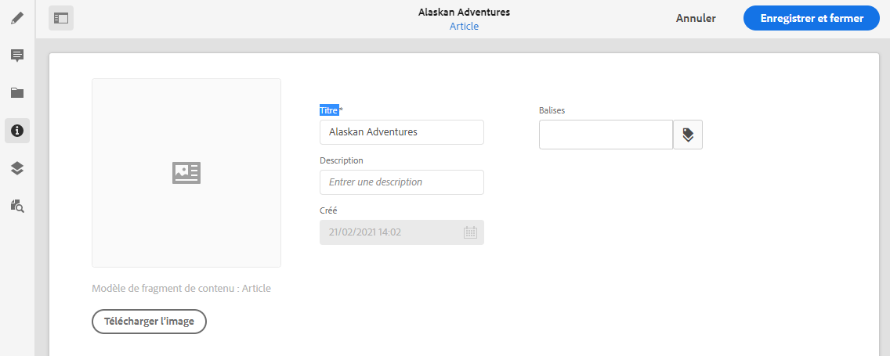

# Métadonnées – propriétés des fragments {#metadata-fragment-properties}

Découvrez comment afficher et modifier les propriétés de métadonnées de vos fragments de contenu AEM.

## Modification des propriétés/métadonnées {#editing-properties-meta-data}

Vous pouvez afficher et modifier les métadonnées (propriétés) des fragments de contenu :

1. Dans la console **Ressources**, naviguez jusqu’à l’emplacement de votre fragment de contenu.
2. Vous pouvez :

   * Sélectionnez [**Afficher les propriétés** pour ouvrir les boîtes de dialogue](/help/assets/manage-digital-assets.md#editing-properties). Une fois la collection ouverte pour consultation, vous pouvez également la modifier.
   * Ouvrez le fragment de contenu à modifier, puis sélectionnez **Métadonnées** dans le panneau latéral.

   

3. L’onglet **De base** fournit des options que vous pouvez afficher ou modifier :

   * Une miniature, pour laquelle vous pouvez **charger une image**
   * Le **modèle de fragment de contenu** indique le modèle utilisé pour créer le fragment actif.
   * **Titre**
   * **Description**
   * **Balises**
      * Les [balises](/help/sites-cloud/authoring/features/tags.md) sont particulièrement puissantes lors de l’organisation de vos fragments, car elles peuvent être utilisées pour la classification et la taxonomie du contenu. Les balises peuvent être utilisées dans le but de rechercher du contenu (par balises) et d’appliquer des opérations en bloc.
Par exemple, vous pouvez baliser les fragments pertinents en tant que « lancement de Noël » pour ne les parcourir que sous forme de sous-ensemble, ou les copier pour les utiliser avec un autre lancement futur dans un nouveau dossier.
   * Créé (affichage uniquement)
   
