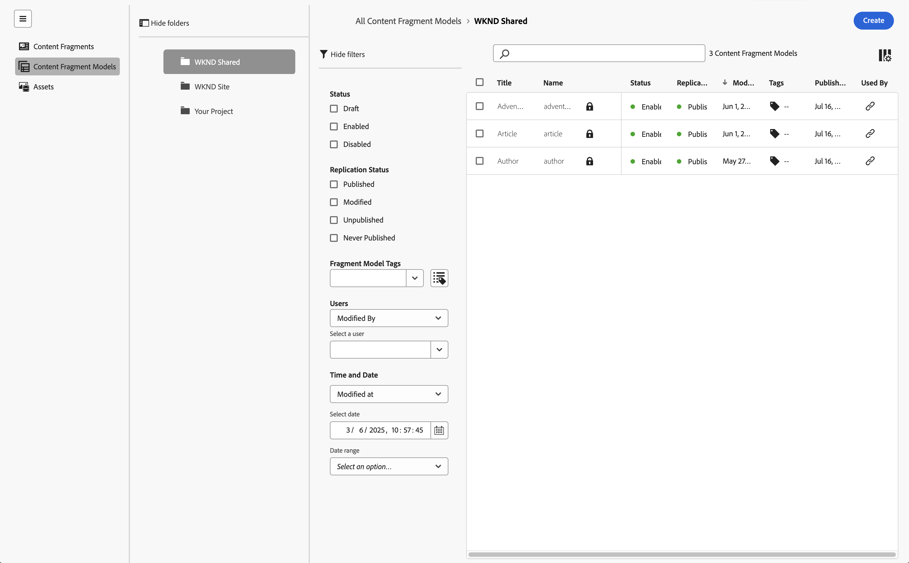

# Gestion des modèles de fragment de contenu {#managing-content-fragment-models}

Dans la console Fragments de contenu , vous pouvez gérer vos modèles de fragment de contenu, puis [ouvrir l’éditeur](/help/sites-cloud/administering/content-fragments/content-fragment-models.md) pour définir la structure.

Les modèles de fragment de contenu dans Adobe Experience Manager (AEM) as a Cloud Service définissent la structure du contenu de vos [fragments de contenu](/help/sites-cloud/administering/content-fragments/overview.md). Ces fragments peuvent ensuite être utilisés comme base pour votre contenu découplé ou pour la création de pages.

>[!NOTE]
>
>Cette page couvre la section de la console qui affiche (uniquement) les modèles de fragment de contenu. Pour les autres panneaux, voir :
>
>* [Gestion des fragments de contenu](/help/sites-cloud/administering/content-fragments/managing.md)
>* [Affichage et gestion d’Assets dans la console Fragments de contenu](/help/sites-cloud/administering/content-fragments/assets-content-fragments-console.md)

>[!NOTE]
>
>Les fragments de contenu sont stockés sous forme de **ressources**. Les modèles de fragment de contenu sont principalement gérés à partir de la console **Fragments de contenu**, mais peuvent également être gérés à partir de la console [Assets](/help/assets/content-fragments/content-fragments-managing.md) et de l’option [Modèles de fragment de contenu](/help/assets/content-fragments/content-fragments-models.md) disponible à partir de **Outils** - **Général**.

## Utilisation des modèles de fragment de contenu {#how-to-work-with-content-fragment-models}

Pour donner un aperçu très rapide, pour utiliser les modèles de fragment de contenu, procédez comme suit :

1. [Activez la fonctionnalité Modèle de fragment de contenu pour votre instance.](/help/sites-cloud/administering/content-fragments/setup.md)
1. [Créez](#creating-a-content-fragment-model) votre modèle de fragment de contenu.
   * À ce stade, vous pouvez également **Activer** modèle (à utiliser lors de la création de fragments de contenu).
1. [Définissez](/help/sites-cloud/administering/content-fragments/content-fragment-models.md#defining-your-content-fragment-model) la structure de votre modèle.
1. [Activez votre modèle de fragment de contenu](#enabling-a-content-fragment-model) si ce n’est pas déjà fait.
1. [Autorisez vos modèles de fragments de contenu sur les dossiers de ressources requis](#allowing-content-fragment-models-assets-folder) en configurant des **politiques**.

## Structure de base et gestion des modèles de fragment de contenu dans la console {#basic-structure-handling-content-fragment-models-console}

Vous pouvez utiliser le panneau tout à gauche de la console [Fragments de contenu](/help/sites-cloud/administering/content-fragments/overview.md#content-fragments-console) pour sélectionner **Modèles de fragment de contenu** comme type de ressource à afficher, parcourir et gérer :

Cette action ouvre la vue pour les modèles de fragment de contenu :

Vous pouvez constater ici qu’il existe trois zones principales :

* La barre d’outils supérieure :
   * Fournit les fonctionnalités AEM standard.
   * Affiche votre organisation IMS
   * Fournit diverses [actions](#actions-unselected), qui peuvent [changer lorsque vous sélectionnez un ou plusieurs modèles](#actions-selected-content-fragment-models)
* Le panneau de gauche :
   * Affiche les [chemins d’accès à toutes les configurations](/help/sites-cloud/administering/content-fragments/setup.md#enable-content-fragment-functionality-configuration-browser) répertoriés sous forme de dossiers
   * Ici, vous pouvez masquer ou afficher l’arborescence de dossiers.
   * Vous pouvez sélectionner un dossier spécifique de l’arborescence
   * Il peut être redimensionné pour afficher les dossiers imbriqués (sous-configurations)
   * Outre les modèles de fragment de contenu, vous pouvez afficher [Fragments de contenu](/help/sites-cloud/administering/content-fragments/managing.md) ou [Assets](/help/sites-cloud/administering/content-fragments/assets-content-fragments-console.md) ; vous pouvez également compresser ou développer des liens vers les panneaux
* Le panneau principal/droit, à partir duquel vous pouvez :
   * Voir la liste de tous les modèles de fragment de contenu conservés dans le dossier sélectionné :
      * Les modèles de fragment de contenu du dossier sélectionné et tous les sous-dossiers s’affichent :
         * L’emplacement est indiqué par les chemins de navigation. Ceux-ci peuvent également être utilisés pour modifier l’emplacement :
      * [Des informations s’affichent pour chaque modèle](#information-content-fragment-models)
         * [Vous pouvez sélectionner les colonnes à afficher](#select-columns-console)
      * [Plusieurs champs d’information](#information-content-fragment-models) à propos d’un modèle de fragment de contenu fournissent des liens ; en fonction du champ, ils peuvent :
         * Ouvrez le modèle approprié dans l’éditeur
         * Afficher des informations sur le chemin d’accès à la configuration
         * Afficher des informations sur l’état du modèle
      * [Certains autres champs d’information](#information-content-fragments) à propos d’un modèle de fragment de contenu peuvent être utilisés pour le [filtrage rapide](#fast-filtering) :
         * Sélectionnez une valeur dans la colonne pour l’appliquer immédiatement en tant que filtre
         * Le filtrage rapide est pris en charge pour les colonnes **Modifié par**, **Publié par** et **Statut**.
      * Lorsque vous placez le pointeur de la souris sur les en-têtes de colonne, un sélecteur d’actions déroulant et des curseurs de largeur s’affichent. Ils vous permettent d’effectuer les opérations suivantes :
         * Trier : sélectionnez l’action appropriée pour trier par ordre croissant ou décroissant.
Le tableau entier sera trié en fonction de cette colonne. Le tri n’est disponible que sur les colonnes appropriées.
         * Redimensionnez la colonne à l’aide de l’action ou des curseurs de largeur.
      * Sélectionnez un ou plusieurs modèles pour effectuer d’autres [actions](#actions-selected-content-fragment-models)
   * Ouvrez le panneau [Filtre](#filter-content-fragment-models)
   * Plusieurs [raccourcis clavier](/help/sites-cloud/administering/content-fragments/keyboard-shortcuts.md) sont disponibles dans cette console

## Informations fournies sur vos modèles de fragment de contenu {#information-content-fragment-models}

Le panneau principal/droit (vue du tableau) de la console fournit diverses informations sur vos modèles de fragment de contenu. Certains éléments fournissent également des liens directs vers d’autres actions et/ou informations :

* **Nom**
   * Fournit un lien pour ouvrir le modèle dans l’éditeur.
* **Verrouillé** (icône de cadenas)
   * Lorsque le modèle est verrouillé, une icône de cadenas l’indique.
* **Chemin**
   * Fournit le chemin d’accès sous la forme d’un lien pour ouvrir la configuration dans la console.
Placez le pointeur de la souris sur le nom du dossier pour afficher le chemin d’accès JCR.
* **Statut**
   * Informations uniquement.
   * Peut être utilisé pour le [filtrage rapide](#fast-filtering)
* **Statut de réplication**
   * Informations uniquement.
   * Peut être utilisé pour le [filtrage rapide](#fast-filtering).
* **Prévisualisation**
   * Informations uniquement.
* **Modifié à**
   * Informations uniquement.
   * Peut être utilisé pour le [filtrage rapide](#fast-filtering).
* **Modifié par**
   * Informations uniquement.
   * Peut être utilisé pour le [filtrage rapide](#fast-filtering).
* **Balises**
   * Informations uniquement.
   * Ouvre une boîte de dialogue affichant toutes les balises liées au modèle.
   * Peut être utilisé pour le [filtrage rapide](#fast-filtering).
* **Publié sur**
   * Informations uniquement.
   * Peut être utilisé pour le [filtrage rapide](#fast-filtering).
* **Publié par**
   * Informations uniquement.
   * Peut être utilisé pour le [filtrage rapide](#fast-filtering).
* **Utilisé par**
   * Ouvre une boîte de dialogue répertoriant les fragments de contenu basés sur le modèle. La liste fournit des liens pour vous permettre d’ouvrir directement des fragments.

## Propriétés du modèle {#model-properties}

Lorsque vous sélectionnez un modèle spécifique, ses propriétés s’affichent (comme défini lors de la [création du modèle](#creating-a-content-fragment-model)). Si le modèle n’est pas **verrouillé**, certains éléments peuvent être mis à jour. Vous pouvez également utiliser l’icône d’information (en regard du modèle **Titre**) pour ouvrir et fermer ce panneau d’informations.

* **[Chemin](/help/sites-cloud/administering/content-fragments/setup.md#enable-content-fragment-functionality-configuration-browser)**
* **[Statut](#enabling-a-content-fragment-model)**
* **Titre**
* **Balises**
* **Description**
* **[Modèle d’URL de prévisualisation](/help/sites-cloud/administering/content-fragments/preview.md#preview-url-pattern)**

<!-- CHECK: currently under FT -->
<!--
* **GraphQL**
  Define names relevant for GraphQL.
  Changing the GraphQL API Name, or Query field names will impact client applications.
  * **API Name**
    Represents the GraphQL type and query field names in the GraphQL schema.
  * **Single Query Field Name**
    Represents the GraphQL single query field name in the GraphQL schema.
  * **Multiple Query Field Name**
    Represents the GraphQL multiple query field name in the GraphQL schema.
-->

## Actions {#actions}

Une fois que vous avez sélectionné un dossier (dans le panneau de gauche), vous pouvez utiliser différentes actions, directement ou après avoir sélectionné un modèle spécifique :

* Diverses actions sont directement [disponibles à partir de la console](#actions-unselected).
* Vous pouvez [sélectionner un ou plusieurs modèles de fragment de contenu pour afficher les actions appropriées](#actions-selected-content-fragment)

### Actions (non sélectionnées) {#actions-unselected}

Certaines actions sont disponibles à partir de la console, après avoir sélectionné un dossier, mais sans sélectionner de modèle de fragment de contenu spécifique :

* **[Créer](#creating-a-content-fragment-model)** un nouveau modèle (vide)

### Actions pour un modèle de fragment de contenu dans la console Fragments de contenu {#actions-selected-content-fragment-models}

La sélection d’un modèle spécifique ouvre une barre d’outils axée sur les actions disponibles pour ce modèle. Vous pouvez également sélectionner plusieurs modèles ; les actions disponibles seront ajustées en conséquence.

* **[Modifier](/help/sites-cloud/administering/content-fragments/content-fragment-models.md)** pour définir votre modèle de fragment de contenu.
* **[Publier](#publishing-a-content-fragment-model)** et **[Dépublier](#unpublishing-a-content-fragment-model)** au niveau [Publier](/help/implementing/cloud-manager/manage-environments.md#environment-types) ou [Aperçu](/help/implementing/cloud-manager/manage-environments.md#access-preview-service).
* **Verrouiller**/**Déverrouiller** pour contrôler si un utilisateur est autorisé à modifier le modèle.
* **Copiez** votre modèle.
* **[Activer](#enabling-a-content-fragment-model)**/**[Désactiver](#disabling-a-content-fragment-model)** pour contrôler si un utilisateur est autorisé à créer des fragments de contenu basés sur ce modèle.

La sélection d’un modèle unique affiche également les [propriétés du modèle](#properties) dans le panneau de droite.

## Sélectionner les colonnes affichées dans la console {#select-columns-console}

Comme pour d’autres consoles, vous pouvez configurer les colonnes visibles et disponibles pour une action :

Vous y trouverez une liste de colonnes que vous pouvez masquer ou afficher :

## Filtrer les modèles de fragment de contenu {#filter-content-fragment-models}

Le panneau de filtrage offre les options suivantes :

* une sélection de prédicats ;
   * y compris les champs de statut, les balises, les utilisateurs, etc
   * un ou plusieurs prédicats peuvent être sélectionnés et combinés pour créer le filtre

<!--
* the opportunity to **Save** your filter
* the option to retrieve a saved search filter for reuse
-->

Une fois sélectionnées, les options **Filtrer par** s’affichent (en haut du panneau principal). Ils peuvent être désélectionnés à partir de là. Par exemple :

### Filtrage rapide {#fast-filtering}

Vous pouvez également sélectionner un prédicat en cliquant sur une valeur de colonne spécifique dans la liste. Vous pouvez sélectionner une ou plusieurs valeurs pour combiner des prédicats.

Sélectionnez par exemple **Activé** dans la colonne **Statut**. Une fois cette option sélectionnée, elle s’affiche sous forme de prédicat de filtre et la liste est filtrée en conséquence.

>[!NOTE]
>
>Le filtrage rapide est uniquement pris en charge pour les colonnes **Statut**, **Modifié par**, **Balises** et **Publié par**.

>[!NOTE]
>
>Le filtrage rapide fonctionne de la même manière que pour les [fragments de contenu](/help/sites-cloud/administering/content-fragments/managing.md#fast-filtering) dans la console.

## Création d’un modèle de fragment de contenu {#creating-a-content-fragment-model}

1. Accédez au dossier approprié à votre [configuration, ou sous-configuration](/help/sites-cloud/administering/content-fragments/setup.md).
1. Utilisez **Créer** pour ouvrir la boîte de dialogue.

   >[!CAUTION]
   >
   >L&#39;option **Créer** ne sera disponible que dans les cas suivants :
   >
   >* Si l[utilisation des modèles de fragment de contenu a été activée &#x200B;](/help/sites-cloud/administering/content-fragments/setup.md)
   >* lorsque vous avez sélectionné le dossier dans lequel vous souhaitez créer le modèle.

1. Sélectionnez le **Chemin** de la configuration et spécifiez le **Nom**.

   >[!NOTE]
   >
   >La configuration sera automatiquement remplie avec la configuration actuelle (le dossier dans lequel vous vous trouvez actuellement).
   >
   >Vous pouvez également modifier la configuration en cliquant sur l’icône de dossier.

   Vous pouvez également définir différentes propriétés :

   * **Titre**
Si vous saisissez d’abord le **Titre**, le **Nom** est généré à partir de celui-ci.
   * a **Description**
   * **Activer le modèle** pour [activer le modèle](#enabling-disabling-a-content-fragment-model)

   >[!NOTE]
   >
   >Voir [&#x200B; Modèle de fragment de contenu - Propriétés &#x200B;](#model-properties) pour plus d’informations.

   

1. Utilisez **Créer** pour enregistrer le modèle vide, ou **Créer et ouvrir**.

### Activation d’un modèle de fragment de contenu {#enabling-a-content-fragment-model}

Une fois qu’un modèle a été créé, il doit être activé pour :

* Peut être sélectionné lors de la création d’un fragment de contenu.
* Pouvoir être référencé à partir d’un modèle de fragment de contenu.
* Être disponible pour GraphQL ; le schéma est ensuite généré.

Vous pouvez **Activer** un modèle :

* Lors de la création d’un modèle
   * Une option est présentée dans la boîte de dialogue.
* Lorsqu’un modèle a été spécifiquement **Désactivé**
   * Lorsque le modèle requis est sélectionné, l’action **Activer** est disponible dans la barre d’outils supérieure.

### Désactivation d’un modèle de fragment de contenu {#disabling-a-content-fragment-model}

Un modèle peut également être désactivé afin que :

* Le modèle ne soit plus disponible comme base pour la création de *nouveaux* fragments de contenu.
* Toutefois :
   * Le schéma GraphQL continue à être généré et peut toujours être interrogé (pour éviter tout impact sur l’API JSON).
   * Tout fragment de contenu basé sur le modèle peut toujours être interrogé et renvoyé à partir du point d’entrée GraphQL.
* Le modèle ne peut plus être référencé, mais les références existantes sont conservées intactes et peuvent toujours être interrogées et renvoyées à partir du point d’entrée GraphQL.

Pour désactiver un modèle marqué comme **Activé**, utilisez l’option **Désactiver** à partir de :

* La barre d’outils supérieure, lorsque le modèle concerné est sélectionné.

## Autorisation de modèles de fragments de contenu dans votre dossier de ressources {#allowing-content-fragment-models-assets-folder}

Pour mettre en œuvre une gouvernance du contenu, vous pouvez configurer des **Politiques** sur le dossier de ressources pour contrôler les modèles de fragment de contenu autorisés pour la création de fragments dans ce dossier.

>[!NOTE]
>
>Le mécanisme est similaire à [l’autorisation de modèles de page](/help/sites-cloud/authoring/page-editor/templates.md#allowing-a-template-author) pour une page et ses enfants, dans les propriétés avancées d’une page.

Pour configurer les **politiques** des **modèles de fragments de contenu autorisés** :

1. Recherchez et ouvrez les **Propriétés** pour le dossier de ressources requis.

1. Ouvrez l’onglet **Politiques** pour configurer les éléments suivants :

   * **Hérité de`<folder>`**

     Les politiques sont automatiquement héritées lors de la création de dossiers enfants ; la politique peut être reconfigurée (et l’héritage rompu) si des sous-dossiers doivent autoriser des modèles différents du dossier parent.

   * **Modèles de fragments de contenu autorisés par chemin**

     Il est possible d’autoriser plusieurs modèles.

   * **Modèles de fragments de contenu autorisés par balise**

     Il est possible d’autoriser plusieurs modèles.

   

1. **Enregistrez** les modifications.

Les modèles de fragment de contenu autorisés pour un dossier sont résolus comme suit :

* **Politiques** pour les **modèles de fragments de contenu autorisés**.
* Si elles sont absentes, essayez de déterminer la politique à l’aide des règles d’héritage.
* Si la chaîne d’héritage ne produit pas de résultat, examinez la configuration de **Services cloud** pour ce dossier (directement dans un premier temps, puis par héritage).
* Si aucun des éléments ci-dessus ne donne de résultats, il n’existe aucun modèle autorisé pour ce dossier.

## Suppression d’un modèle de fragment de contenu {#deleting-a-content-fragment-model}

>[!CAUTION]
>
>La suppression d’un modèle de fragment de contenu peut avoir un impact sur les fragments dépendants.

Pour supprimer un modèle de fragment de contenu :

1. Accédez à et sélectionnez votre modèle de fragment de contenu. Vous pouvez sélectionner plusieurs modèles.

1. Sélectionnez **Supprimer** dans la barre d’outils.

   >[!NOTE]
   >
   >Si le modèle est référencé, un avertissement est émis afin que vous puissiez prendre les mesures appropriées.

## Publication d’un modèle de fragment de contenu {#publishing-a-content-fragment-model}

Les modèles de fragment de contenu doivent être publiés avant ou pendant la publication des fragments de contenu dépendants.

Pour publier un modèle de fragment de contenu :

1. Accédez à et sélectionnez votre modèle de fragment de contenu. Vous pouvez sélectionner plusieurs modèles.

1. Sélectionnez **Publier** dans la barre d’outils.

1. Dans la boîte de dialogue Publier , sélectionnez la **Destination** :

   * **Service de publication**
   * **Service de prévisualisation**

1. Le workflow de publication des modèles sélectionnés et de leurs références sera lancé. Le statut publié s’affiche alors dans la console.

## Dépublication d’un modèle de fragment de contenu {#unpublishing-a-content-fragment-model}

Les modèles de fragment de contenu peuvent être dépubliés s’ils ne sont référencés par aucun fragment.

Pour dépublier un modèle de fragment de contenu :

1. Accédez à et sélectionnez votre modèle de fragment de contenu.
Le statut publié est indiqué dans la console.

1. Sélectionnez **Dépublier** dans la barre d’outils.

1. Dans la boîte de dialogue Dépublier , sélectionnez la **Destination** :

   * **Service de publication**
   * **Service de prévisualisation**

1. Le workflow de dépublication des modèles sélectionnés et de leurs références sera lancé. Le statut Dépublié s’affiche alors dans la console.

Si vous essayez de dépublier un modèle actuellement utilisé par un ou plusieurs fragments, un avertissement d’erreur s’affiche. Le message vous invite à vérifier le panneau [Références](/help/sites-cloud/authoring/basic-handling.md#references) pour en savoir plus :

## Modèles de fragment de contenu verrouillés {#locked-content-fragment-models}

Cette fonctionnalité vous permet de contrôler si un modèle peut être mis à jour, mais elle fournit également une gouvernance pour les modèles de fragment de contenu qui ont été publiés.

### La difficulté {#the-challenge}

* Les modèles de fragment de contenu déterminent le schéma des requêtes GraphQL dans AEM.

   * Les schémas GraphQL AEM sont créés dès qu’un modèle de fragment de contenu est créé. Ils peuvent exister dans les environnements de création et de publication.

   * Les schémas en environnement de publication sont les plus critiques, car ils fournissent les bases de la diffusion en direct du contenu de fragment de contenu au format JSON.

* Des problèmes peuvent survenir lorsque des modèles de fragment de contenu sont modifiés. Cela signifie que le schéma change, ce qui peut à son tour affecter les requêtes GraphQL existantes.

* L’ajout de nouveaux champs à un modèle de fragment de contenu ne doit (généralement) avoir aucun effet négatif. Toutefois, la modification de champs de données existants (par exemple, le nom) ou la suppression de définitions de champ rompt les requêtes GraphQL existantes lorsqu’elles interrogent ces champs.

### Les exigences {#the-requirements}

* Sensibiliser les utilisateurs aux risques de la modification de modèles déjà utilisés pour la diffusion de contenu en direct (c’est-à-dire des modèles qui ont déjà été publiés).

* Éviter également toute modification imprévue.

L’un ou l’autre de ces critères peut interrompre les requêtes si les modèles modifiés sont republiés.

### La solution {#the-solution}

Pour résoudre ces problèmes, les modèles de fragment de contenu sont *verrouillés* en mode LECTURE SEULE pour l’auteur dès leur publication. Ce statut est indiqué par la mention **Verrouillé**.

Lorsque le modèle est **Verrouillé** (en mode LECTURE SEULE ), vous pouvez voir le contenu et la structure des modèles, mais vous ne pouvez pas les modifier.

Vous pouvez gérer les modèles **verrouillés** à partir de la console ou de l’éditeur de modèles :

* Console

  Dans la console, vous pouvez gérer le mode LECTURE SEULE avec les actions **Déverrouiller** et **Verrouiller** dans la barre d’outils.

   * Vous pouvez **Déverrouiller** un modèle pour activer les modifications.

     Si vous sélectionnez **Déverrouiller** un avertissement s’affiche et vous devez confirmer l’action **Déverrouiller**.

     Vous pouvez ensuite ouvrir le modèle pour le modifier.

   * Vous pouvez également **Verrouiller** le modèle par la suite.
   * La republication du modèle le renvoie immédiatement au mode **Verrouillé** (LECTURE SEULE).

* Éditeur de modèles

   * Lorsque vous ouvrez un modèle verrouillé, trois actions s’affichent : **Annuler**, **Afficher en lecture seule**, **Modifier**.

   * Si vous sélectionnez **Afficher en lecture seule**, vous pouvez voir le contenu et la structure du modèle.

   * Si vous sélectionnez **Modifier**, vous pouvez modifier et enregistrer vos mises à jour :

     

     >[!NOTE]
     >
     >Un avertissement peut toujours s’afficher en haut de l’écran, mais seulement lorsque le modèle est déjà utilisé par les fragments de contenu existants.

   * **Annuler** vous renvoie à la console.
