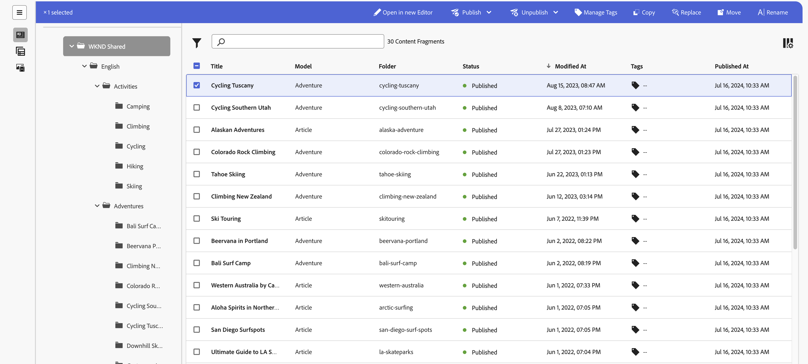

# Gérer des fragments de contenu {#managing-content-fragments}

Découvrez comment gérer vos **Fragments de contenu** dans Adobe Experience Manager (AEM) as a Cloud Service, à partir du [Console Fragments de contenu](#content-fragments-console), et [Éditeur de fragment de contenu](/help/sites-cloud/administering/content-fragments/authoring.md#content-fragment-editor). Ces fragments de contenu peuvent être utilisés comme base de votre contenu sans affichage ou pour la création de pages.

>[!NOTE]
>
>Votre équipe de projet peut personnaliser la console et l’éditeur si nécessaire. Voir [Personnalisation de la console de fragments de contenu et de l’éditeur](/help/implementing/developing/extending/content-fragments-console-and-editor.md) pour plus de détails.

Après avoir défini votre [Modèles de fragment de contenu](#creating-a-content-model) vous pouvez les utiliser pour :

* [Création de fragments de contenu](#creating-a-content-fragment).
* Ouvrez ensuite le [Éditeur de fragment de contenu](#opening-the-fragment-editor) to [créer votre contenu et gérer vos variations ;](#editing-the-content-of-your-fragment).
* [Gérer les balises](#manage-tags)
* [Affichage et modification des propriétés (métadonnées)](#viewing-and-editing-properties)
* [d’affcher l’arborescence de la structure ;](/help/sites-cloud/administering/content-fragments/authoring.md#structure-tree)

>[!NOTE]
>
>Il est possible d’utiliser les fragments de contenu comme suit :
>
>* pour [Diffusion de contenu sans affichage à l’aide de fragments de contenu avec GraphQL](/help/sites-cloud/administering/content-fragments/content-delivery-with-graphql.md),
>* lors de la création de pages ; voir [Création de pages avec des fragments de contenu](/help/sites-cloud/authoring/fundamentals/content-fragments.md).

>[!NOTE]
>
>Les fragments de contenu sont stockés sous forme de **ressources**. Ils sont principalement gérés à partir de la console **Fragments de contenu** mais peuvent également être gérés à partir de la console [Ressources](/help/assets/content-fragments/content-fragments-managing.md).

## Console Fragments de contenu {#content-fragments-console}

La console Fragments de contenu est dédiée à la gestion, à la recherche et à la création de fragments de contenu. Optimisée pour une utilisation dans un contexte headless, elle est également utilisée lors de la création de fragments de contenu à utiliser dans la création de pages.

La console Fragments de contenu permet d’accéder directement à vos fragments et aux tâches qui s’y rapportent. La console est directement accessible à partir du niveau supérieur de la navigation globale.

Pour plus d’informations, consultez la section suivante :

* [Structure de base et gestion de la console Fragments de contenu](#basic-structure-handling-content-fragments-console)

* [Les informations fournies sur vos fragments de contenu](#information-content-fragments)

* [Actions pour un fragment de contenu dans la console Fragments de contenu](#actions-selected-content-fragment)

* [Sélectionner les colonnes affichées dans la console](#select-columns-console)

* [Rechercher et filtrer dans la console Fragments de contenu](#filtering-fragments)

* Une sélection de [raccourcis clavier](/help/sites-cloud/administering/content-fragments/keyboard-shortcuts.md) sont disponibles dans cette console.

>[!NOTE]
>
>Cette console affiche uniquement les fragments de contenu. Elle n’affiche pas d’autres types de ressources, telles des images et des vidéos.

>[!CAUTION]
>
>Cette console est *only* disponible dans le Adobe Experience Manager en ligne (AEM) as a Cloud Service.

### Structure et gestion de base de la console {#basic-structure-handling-content-fragments-console}

Sélection **Fragments de contenu** ouvre la console dans un nouvel onglet.

Vous pouvez constater ici qu’il existe trois zones principales :

* La barre d’outils supérieure :
   * Fournit les fonctionnalités AEM standard.
   * Affiche également votre organisation IMS.
   * Différents [actions](#actions-unselected)
* Le panneau de gauche :
   * Ici, vous pouvez masquer ou afficher l’arborescence de dossiers.
   * Vous pouvez sélectionner une branche spécifique de l’arborescence.
   * Il peut être redimensionné pour afficher les dossiers imbriqués.
* Le panneau principal/droit, à partir duquel vous pouvez :
   * Consultez la liste de tous les fragments de contenu dans la branche sélectionnée de l’arborescence :
      * Les fragments de contenu du dossier sélectionné et tous les dossiers enfants s’affichent :
         * L’emplacement est indiqué par les chemins de navigation ; ils peuvent également être utilisés pour modifier l’emplacement :
      * [Les informations s’affichent sur chaque fragment.](#information-content-fragments)
         * [Vous pouvez sélectionner les colonnes à afficher](#select-columns-console)
      * [Plusieurs champs d’information](#information-content-fragments) à propos d’un fragment de contenu fournissent des liens ; en fonction du champ, ces éléments peuvent :
         * Ouvrir le fragment approprié dans l’éditeur
         * Afficher des informations à propos des références
         * Afficher des informations sur les versions linguistiques du fragment
      * [Certains autres champs d&#39;information](#information-content-fragments) à propos d’un fragment de contenu peut être utilisé pour [Filtrage rapide](#fast-filtering):
         * Sélectionnez une valeur dans la colonne et elle est appliquée immédiatement comme filtre.
         * Le filtrage rapide est pris en charge pour la variable **Modèle**, **État**, **Modifié par**, **Balises** et **Publié par** colonnes.
      * Lorsque vous placez le pointeur de la souris sur les en-têtes de colonne, un sélecteur d’actions déroulant et des curseurs de largeur s’affichent. Ils vous permettent d’effectuer les opérations suivantes :
         * Trier : sélectionnez l’action appropriée pour trier par ordre croissant ou décroissant.
Le tableau entier sera trié en fonction de cette colonne. Le tri n’est disponible que sur les colonnes appropriées.
         * Redimensionnez la colonne à l’aide de l’action ou des curseurs de largeur.
      * Sélectionner un ou plusieurs fragments pour d’autres [action](#actions-selected-content-fragment)
   * Utilisez la variable [Rechercher](#searching-fragments) box
   * Ouvrez le [Panneau Filtrer](#filtering-fragments)

### Actions {#actions}

Dans la console, vous pouvez utiliser différentes actions, directement ou après la sélection d’un fragment spécifique :

* Diverses actions sont directement [disponibles à partir de la console](#actions-unselected).
* Vous pouvez [sélectionner un ou plusieurs fragments de contenu pour afficher les actions disponibles](#actions-selected-content-fragment).

#### Actions (non sélectionnées) {#actions-unselected}

Certaines actions sont disponibles à partir de la console, sans sélectionner de fragment de contenu spécifique :

* **[Créer](#creating-a-content-fragment)** un fragment de contenu.
* [Filtrer](#filtering-fragments) les fragments de contenu en fonction d’une sélection de prédicats et enregistrer le filtre en vue d’une utilisation ultérieure.
* [Rechercher](#searching-fragments) les fragments de contenu.
* [Personnaliser la vue du tableau pour afficher les colonnes d’informations sélectionnées.](#select-columns-console)
* Utiliser **Ouvrir dans Assets** pour ouvrir directement l’emplacement actuel dans la console **Ressources**

  >[!NOTE]
  >
  >La variable **Ressources** La console permet d’accéder aux ressources, telles que les images, les vidéos, etc.  Il est possible d’accéder à cette console :
  >
  >* en utilisant le lien **Ouvrir dans Assets** (dans la console Fragments de contenu) ;
  >* directement à partir de la **Navigation** volet

#### Actions pour un fragment de contenu (sélectionné) {#actions-selected-content-fragment}

La sélection d’un fragment spécifique ouvre une barre d’outils axée sur les actions disponibles pour ce fragment. Vous pouvez également sélectionner plusieurs fragments. La sélection des actions sera adaptée en conséquence.

* **[Ouvrir dans le nouvel éditeur](#editing-the-content-of-your-fragment)**
* **[Ouvrir](/help/assets/content-fragments/content-fragments-variations.md)** (dans l’éditeur original)
* **[Publier](#publishing-and-previewing-a-fragment)** (et **[Dépublier](#unpublishing-a-fragment)**)
* **[Gérer les balises](#manage-tags)**
* **[Copier](/help/assets/manage-digital-assets.md)**
* **[Déplacer](/help/assets/manage-digital-assets.md)**
* **[Renommer](/help/assets/manage-digital-assets.md)**
* **[Supprimer](#deleting-a-fragment)**
* **[Remplacer](#find-and-replace)**

>[!NOTE]
>
>Utilisation **Ouvrir** pour ouvrir le fragment sélectionné dans le *original* éditeur.

>[!NOTE]
>
>Des actions telles que Publier, Annuler la publication, Supprimer, Déplacer, Renommer et Copier déclenchent chacune une tâche asynchrone. Il est possible de surveiller la progression de ce traitement via l’interface utilisateur des traitements asynchrones AEM.

### Les informations fournies sur vos fragments de contenu {#information-content-fragments}

Le panneau principal/droit (vue du tableau) de la console fournit diverses informations sur vos fragments de contenu. Certains éléments fournissent également des liens directs vers d’autres actions et/ou informations :

* **Nom**
   * Fournit un lien pour ouvrir le fragment dans l’éditeur.
* **Modèle**
   * Informations uniquement.
   * Peut être utilisé pour [Filtrage rapide](#fast-filtering)
* **Dossier**
   * Fournit un lien pour ouvrir le dossier dans la console.
Placez le pointeur de la souris sur le nom du dossier pour afficher le chemin d’accès JCR.
* **Statut**
   * Informations uniquement.
   * Peut être utilisé pour [Filtrage rapide](#fast-filtering)
* **Aperçu**
   * Informations uniquement :
      * **En synchronisation** : le fragment de contenu est synchronisé sur les servcies **Auteur** et **Aperçu**.
      * **Désynchronisé** : le fragment de contenu n’est pas synchronisé sur les services **Auteur** et **Aperçu**. Vous devez **Publier** pour avoir un **Aperçu** et vous assurer que les deux instances sont de nouveau synchronisées.
      * vide : le fragment de contenu n’existe pas sur le service **Aperçu**.
* **Modifié**
   * Informations uniquement.
* **Modifié par**
   * Informations uniquement.
   * Peut être utilisé pour [Filtrage rapide](#fast-filtering).
* **Balises**
   * Informations uniquement.
   * Affiche toutes les balises liées au fragment de contenu ; Principal et toutes les variations.
   * Peut être utilisé pour [Filtrage rapide](#fast-filtering).
* **Publié sur**
   * Informations uniquement.
* **Publié par**
   * Informations uniquement.
   * Peut être utilisé pour [Filtrage rapide](#fast-filtering).
* **Référencé par**:
   * Fournit un lien qui ouvre une boîte de dialogue répertoriant toutes les [références parentes](#parent-references-fragment)  de ce fragment, notamment en référençant des fragments de contenu, des fragments d’expérience et des pages. Pour ouvrir une référence spécifique, cliquez sur le bouton **Titre** dans la boîte de dialogue.

     

* **Langue**: indiquez tout [Langue](#language-copies-fragment) copies

   * Indique les paramètres régionaux du fragment de contenu, ainsi que le nombre total de locaux/[Langue](#language-copies-fragment)  copies associées au fragment de contenu.

     

   * Sélectionnez le nombre pour ouvrir une boîte de dialogue qui affiche toutes les copies de langue. Pour ouvrir une copie de langue spécifique, cliquez sur le bouton **Titre** dans la boîte de dialogue.

     

## Créer des fragments de contenu {#creating-content-fragments}

Avant de créer votre fragment de contenu, le modèle de fragment de contenu sous-jacent doit être créé.

### Création d’un modèle de contenu {#creating-a-content-model}

[Modèles de fragment de contenu](/help/sites-cloud/administering/content-fragments/content-fragment-models.md) doit être activé et créé, avant de créer des fragments de contenu avec du contenu structuré.

### Création d’un fragment de contenu {#creating-a-content-fragment}

Pour créer un fragment de contenu :

1. Dans la console **Fragments de contenu**, sélectionnez **Créer** (en haut à droite).

   >[!NOTE]
   >
   >Pour prédéfinir l’emplacement du nouveau fragment, vous pouvez accéder au dossier dans lequel vous souhaitez créer le fragment ou spécifier l’emplacement pendant le processus de création.

1. La variable **Nouveau fragment de contenu** La boîte de dialogue s’ouvre. Vous pouvez spécifier les éléments suivants :

   * **Emplacement** : saisie automatique avec l’emplacement actuel, mais vous pouvez sélectionner un autre emplacement si nécessaire.
   * **Modèle de fragment de contenu** - Sélectionnez le modèle à utiliser comme base du fragment dans la liste déroulante.
   * **Titre**
   * **Nom** : saisie automatiquement en fonction de la variable **Titre**, mais vous pouvez la modifier, si nécessaire.
   * **Description**

   

1. Sélectionnez **Créer** ou **Créer et ouvrir** pour conserver votre définition.

## Statuts des fragments de contenu {#statuses-content-fragments}

Au cours de son existence, un fragment de contenu peut avoir plusieurs états, comme indiqué dans la variable [Console de fragments de contenu](/help/sites-cloud/administering/content-fragments/managing.md#content-fragments-console) et [Éditeur de fragment de contenu](/help/sites-cloud/administering/content-fragments/authoring.md):

* **Nouveau** (gris) Un nouveau fragment de contenu a été créé, mais ne comporte aucun contenu, car il n’a jamais été modifié ni ouvert dans l’éditeur de fragment de contenu.
* **Version préliminaire** (bleu) Quelqu’un a modifié ou ouvert le (nouveau) fragment de contenu dans l’éditeur de fragment de contenu, mais il n’a pas encore été publié.
* **Publié** (vert) Le fragment de contenu a été publié.
* **Modifié** (orange) Le fragment de contenu a été modifié après sa publication (mais avant de publier la modification).
* **Non publié** (rouge) La publication du fragment de contenu a été annulée.

## Modification du contenu du fragment (et des variations) {#editing-the-content-of-your-fragment}

>[!IMPORTANT]
>
>Pour plus de détails, [voir Création de fragments de contenu](/help/sites-cloud/administering/content-fragments/authoring.md)

Pour ouvrir votre fragment à des fins de modification :

1. Utilisez la console **Fragments de contenu** afin de naviguer jusqu’à l’emplacement de votre fragment de contenu.
1. Ouvrez le fragment à modifier en le sélectionnant, puis **Ouvrir dans le nouvel éditeur** dans la barre d’outils.

1. L’éditeur de fragments s’ouvre. Sélectionnez les **Variation** et apportez vos modifications selon les besoins (elles seront automatiquement enregistrées) :

   

## Affichage et gestion des balises {#manage-tags}

Dans la console Fragments de contenu , vous pouvez afficher toutes les balises appliquées dans le **Balises** , après avoir vérifié que la variable [la colonne affiche](#select-columns-console).

### Gestion des balises (console) {#manage-tags-console}

Pour gérer les balises :

1. Accédez à la console Fragment de contenu .
1. Sélectionnez un fragment de contenu.
1. Sélectionner **Gestion des balises** dans la barre d’outils.
1. Utilisez le sélecteur de balises pour sélectionner les balises à appliquer ou supprimer :

   

1. **Enregistrer** mises à jour. Vous accédez alors à la console.

### Affichage et modification des balises (éditeur) {#viewing-and-editing-tags}

Vous pouvez également afficher et modifier les balises appliquées à un fragment à l’aide de la variable [Propriétés](/help/sites-cloud/administering/content-fragments/authoring.md) de l’éditeur. Les informations affichées diffèrent entre **Principal** et tout **Variations**.

## Affichage et modification des propriétés (éditeur) {#viewing-and-editing-properties}

Vous pouvez afficher et modifier les propriétés (métadonnées) d’un fragment à l’aide de la variable [Propriétés](/help/sites-cloud/administering/content-fragments/authoring.md) de l’éditeur. Les informations affichées diffèrent entre **Principal** et tout **Variations**.

## Publication et prévisualisation d’un fragment {#publishing-and-previewing-a-fragment}

Vous pouvez publier vos fragments de contenu dans :

* le **[Service de publication](/help/headless/deployment/architecture.md)** - pour un accès public complet ;

* le **[Service de prévisualisation](/help/headless/deployment/architecture.md)** - pour prévisualiser le contenu avant sa disponibilité complète

  >[!CAUTION]
  >
  >Publication de fragments de contenu dans le **Service de prévisualisation** est uniquement disponible à partir de la console Fragments de contenu ; à l’aide de la fonction **Publier** action.

  >[!NOTE]
  >
  >Pour plus d’informations sur les environnements d’aperçu, voir :
  >
  >* [Gérer les environnements](/help/implementing/cloud-manager/manage-environments.md#access-preview-service)
  >* [Configurer les paramètres OSGi pour le niveau de prévisualisation](/help/implementing/preview-tier/preview-tier-configuring-osgi.md#configuring-osgi-settings-for-the-preview-tier)
  >* [Déboguer l’aperçu à l’aide de Developer Console](/help/implementing/preview-tier/preview-tier-configuring-osgi.md#debugging-preview-using-the-developer-console)

>[!CAUTION]
>
>Si votre fragment est basé sur un modèle, vous devez vous assurer que le [modèle a été publié](/help/sites-cloud/administering/content-fragments/content-fragment-models.md#publishing-a-content-fragment-model).
>
>Si vous publiez un fragment de contenu pour lequel le modèle n’a pas encore été publié, une liste de sélection indique cela, ainsi que le fait que le modèle sera publié avec le fragment.

### Publication {#publishing}

Vous pouvez publier vos fragments de contenu à l’aide du **Publier** à partir de l’une des options suivantes :

* de la barre d’outils de [Console Fragments de contenu](#actions-selected-content-fragment)

   * Sélectionnez un ou plusieurs fragments dans la liste.

* de la barre d’outils de [Éditeur de fragments de contenu](/help/sites-cloud/administering/content-fragments/authoring.md#content-fragment-editor)

Après avoir sélectionné **Publier** action :

1. Sélectionnez l’une des options suivantes pour ouvrir la boîte de dialogue appropriée :

   * **Maintenant** - sélectionnez l’une des options suivantes : **Service de publication**, ou la variable **Service Preview**; après confirmation, le fragment sera publié immédiatement.
   * **Planification** - en plus du service requis, vous pouvez également sélectionner la date et l’heure de publication du fragment.

1. Fournissez tous les détails de la boîte de dialogue. Par exemple, pour une requête de publication planifiée :

   

   >[!NOTE]
   >
   >Si nécessaire, vous devrez spécifier les références à publier. Par défaut, les références sont également publiées dans le service Preview pour s’assurer qu’il n’y a aucune coupure dans le contenu.

1. Confirmez l’action de publication.

Après la publication, l’état du fragment est mis à jour et visible dans l’éditeur et la console. Si vous avez spécifié une publication planifiée, les informations s’affichent.

>[!NOTE]
>
>De plus, lorsque vous [publiez une page qui utilise ce fragment](/help/sites-cloud/authoring/fundamentals/content-fragments.md#publishing), celui-ci est répertorié dans les références de la page.

## Annuler la publication d’un fragment {#unpublishing-a-fragment}

Vous pouvez annuler la publication de fragments de contenu :

* de la barre d’outils de [Console Fragments de contenu](#actions-selected-content-fragment)

   * Sélectionnez un ou plusieurs fragments dans la liste.

* de la barre d’outils de [Éditeur de fragments de contenu](/help/sites-cloud/administering/content-fragments/authoring.md#content-fragment-editor)

Dans les deux cas, sélectionnez **Dépublier** de la barre d’outils, suivie de **Maintenant** ou **Planifié**.

Lorsque la boîte de dialogue correspondante s’ouvre, vous pouvez sélectionner le service approprié :

>[!NOTE]
>
>La variable **Dépublier** ne sera visible que lorsque les fragments publiés sont disponibles.

>[!CAUTION]
>
>Si le fragment est déjà référencé à partir d’un autre fragment ou d’une page, alors un message d’avertissement s’affiche et vous devez confirmer que vous souhaitez poursuivre.

## Rechercher et remplacer {#find-and-replace}

La variable **Remplacer** est disponible (dans la barre d’outils supérieure) pour rechercher et remplacer du texte spécifié dans les fragments de contenu sélectionnés.

Avant le remplacement, les critères de validation sont vérifiés et vous êtes informé de tout conflit, ce qui vous permet de modifier la chaîne de remplacement ou de remplacer uniquement les instances validées.

>[!NOTE]
>
>L’action de recherche et de remplacement ne peut être exécutée que sur un maximum de 20 fragments de contenu sélectionnés (à la fois).
>
>Si vous sélectionnez plus de 20 fragments de contenu, le message s’affiche. **Impossible de trouver et de remplacer**.

## Suppression d’un fragment {#deleting-a-fragment}

Pour supprimer un fragment :

1. Dans la console **Fragments de contenu**, naviguez jusqu’à l’emplacement de votre fragment de contenu.
1. Sélectionnez le fragment.
1. Sélectionnez **Supprimer** dans la barre d’outils.
1. Confirmez l’action **Supprimer**.

>[!NOTE]
>
>La variable **Supprimer** n’est pas disponible pour les fragments actuellement publiés, ils doivent d’abord être dépubliés.

## Recherche des références parentes du fragment {#parent-references-fragment}

Les détails des références parentes sont accessibles à partir de la

* **Références** de la console Fragments de contenu
* la valeur [lien Références parents dans la barre d’outils supérieure de l’éditeur de fragments de contenu](/help/sites-cloud/administering/content-fragments/authoring.md#view-parent-references)

Tous deux fournissent un lien qui ouvre une boîte de dialogue répertoriant toutes les références parentes de ce fragment, y compris les référencements de fragments de contenu, de fragments d’expérience et de pages. Pour ouvrir une référence spécifique, cliquez sur le bouton **Titre** ou l’icône de lien, dans la boîte de dialogue.

Par exemple :

## Recherche des copies de langue du fragment {#language-copies-fragment}

Les détails des copies de langue sont accessibles à partir de :

* la valeur **Langue** de la colonne [Console Fragments de contenu](#information-content-fragments)
* la valeur [Onglet Copies de langue de l’éditeur de fragments de contenu](/help/sites-cloud/administering/content-fragments/authoring.md#view-language-copies)

L’icône indique les paramètres régionaux du fragment de contenu, ainsi que le nombre total de copies de langue/paramètres régionaux associées au fragment de contenu. Par exemple, dans la console :

Sélectionnez le nombre pour ouvrir une boîte de dialogue qui affiche toutes les copies de langue. Pour ouvrir une copie de langue spécifique, cliquez sur le bouton **Titre** dans la boîte de dialogue.

## Sélectionner les colonnes affichées dans la console {#select-columns-console}

Comme pour d’autres consoles, vous pouvez configurer les colonnes visibles et disponibles pour une action :

Vous y trouverez une liste de colonnes que vous pouvez masquer ou afficher :

## Filtrer des fragments {#filtering-fragments}

Le panneau de filtrage offre les options suivantes :

* une sélection de prédicats ;
   * notamment les modèles de fragment de contenu, la localisation, les balises, les champs d’état, etc.
   * un ou plusieurs prédicats peuvent être sélectionnés et combinés pour créer le filtre.
* l’opportunité d’**Enregistrer** votre configuration ;
* l’option permettant de récupérer un filtre de recherche enregistré pour réutilisation.

Une fois la sélection effectuée, la fonction **Filtrage par** Les options s’affichent (sous la zone Rechercher). Ils peuvent être désélectionnés de là. Par exemple :

### Filtrage rapide {#fast-filtering}

Vous pouvez également sélectionner un prédicat en cliquant sur une valeur de colonne spécifique dans la liste. Vous pouvez sélectionner une ou plusieurs valeurs pour combiner des prédicats.

Par exemple, sélectionnez **Publié** dans la colonne **Statut** :

>[!NOTE]
>
>Le filtrage rapide n’est pris en charge que pour la variable **Modèle**, **État**, **Modifié par**, **Balises**, et **Publié par** colonnes.

Une fois cette option sélectionnée, elle s’affiche sous forme de prédicat de filtre et la liste est filtrée en conséquence :

## Rechercher des fragments {#searching-fragments}

La zone de recherche prend en charge la recherche de texte intégral. Saisissez vos termes de recherche dans la zone de recherche :

Fournit les résultats sélectionnés :

La zone de recherche permet également d’accéder rapidement aux **Fragments de contenu récents** et aux **Recherches enregistrées** :

